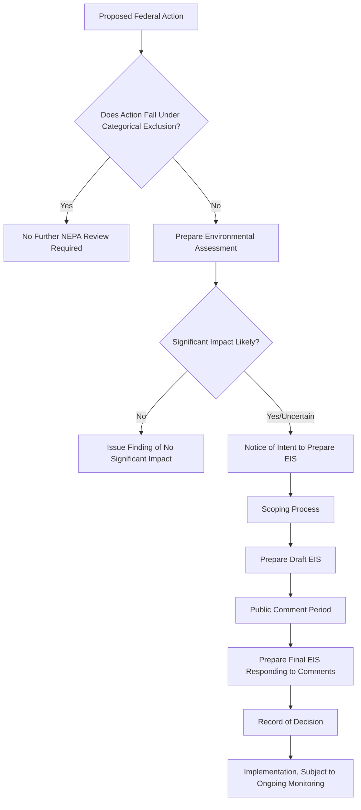
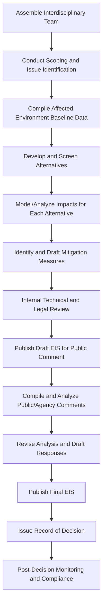

## Writing Environmental Impact Statements

### Conceptual Foundations

#### Defining the Environmental Impact Statement

An Environmental Impact Statement (EIS) is a formal document required under environmental law that discloses and analyzes the likely environmental consequences of a proposed major action before a decision is made, and identifies reasonable alternatives, including the option of taking no action. In the United States, the EIS requirement originates from the National Environmental Policy Act (NEPA) of 1970, which established the requirement that federal agencies prepare a "detailed statement" for proposals significantly affecting the quality of the human environment. Many other jurisdictions maintain analogous frameworks (e.g., the EU's Environmental Impact Assessment Directive, various national EIA laws), though specific procedural requirements differ by jurisdiction. [Unverified — jurisdiction-specific procedural requirements outside U.S. NEPA should be verified against current national law for any specific compliance application.]

#### Purpose and Function

The EIS serves several interlocking functions:

- **Informational disclosure**: Provides decision-makers and the public with a comprehensive understanding of potential environmental consequences before an irreversible commitment of resources occurs.
- **Procedural (not substantive) mandate**: Under NEPA, the EIS process requires agencies to *consider* environmental consequences but does not mandate a specific environmentally preferable outcome — an agency may lawfully proceed with an environmentally damaging action provided the required disclosure and alternatives analysis was conducted.
- **Public participation mechanism**: Mandates structured opportunities for public comment, incorporating stakeholder concerns into the decision record.
- **Judicial review basis**: Provides a documented administrative record against which legal challenges to agency decision-making can be evaluated, typically on procedural (was the analysis adequate) rather than substantive (was the decision correct) grounds.

### NEPA Process Overview and Trigger Thresholds

#### The Three-Tiered Review Structure

- **Categorical Exclusion (CE)**: Applied to actions with no significant environmental effect based on agency experience, requiring no further NEPA analysis (e.g., routine maintenance activities).
- **Environmental Assessment (EA)**: A shorter analysis conducted to determine whether a proposed action's impacts are significant; concludes with either a Finding of No Significant Impact (FONSI) or a determination that a full EIS is required.
- **Environmental Impact Statement (EIS)**: The most comprehensive level, required when a proposed action is determined to significantly affect environmental quality, or in some cases mandated by statute for specific project types.

### Scoping Process

Scoping is the early, mandatory phase in which the lead agency identifies the significant issues to be analyzed in depth, determines the appropriate scope of alternatives, and solicits input from other agencies, tribes, and the public regarding what should be addressed. Effective scoping helps prevent the common criticism of EIS documents becoming excessively voluminous by focusing detailed analysis on genuinely significant issues rather than exhaustively documenting every conceivable, minor effect.

Key scoping activities include:

- **Notice of Intent (NOI) publication**: Formal announcement that an EIS will be prepared, typically published in an official government register, initiating the public scoping period.
- **Interagency consultation**: Coordination with agencies holding jurisdiction or special expertise over specific resources (e.g., wildlife agencies for endangered species impacts, historic preservation offices for cultural resource impacts).
- **Tribal consultation**: Government-to-government consultation with potentially affected Indigenous nations, particularly significant where proposed actions may affect treaty rights, sacred sites, or tribal lands.
- **Identification of significant issues**: Distinguishing issues requiring detailed analysis from those that can be addressed briefly or eliminated from detailed study with a stated rationale.

### Standard EIS Document Structure

#### Core Required Sections

| Section | Content Focus |
| --- | --- |
| Purpose and Need | Why the action is proposed and what problem it addresses |
| Alternatives | Reasonable alternatives including no-action, and rationale for alternatives eliminated from detailed study |
| Affected Environment | Baseline description of existing environmental conditions |
| Environmental Consequences | Analysis of direct, indirect, and cumulative impacts of each alternative |
| Mitigation Measures | Actions proposed to avoid, minimize, or compensate for adverse impacts |
| List of Preparers | Individuals and their qualifications responsible for the analysis |
| Appendices | Supporting technical data, modeling documentation, agency correspondence |

#### Purpose and Need Statement

This section establishes the underlying rationale for the proposed action and directly shapes the range of alternatives considered as "reasonable" — a narrowly drawn purpose and need statement can be legally challenged if it appears to have been crafted to artificially exclude alternatives that would otherwise merit consideration, a recurring point of litigation in NEPA challenges.

#### Alternatives Analysis

Often described as the "heart of the EIS," this section must:

- Rigorously analyze all reasonable alternatives capable of meeting the stated purpose and need.
- Include a no-action alternative as a baseline for comparison, even where no-action is not a preferred or politically viable outcome.
- Briefly discuss alternatives eliminated from detailed study, with documented rationale (e.g., technical infeasibility, failure to meet purpose and need, or prohibitive cost).
- Identify the agency's preferred alternative, where one exists, though this designation does not exempt other alternatives from full analysis.

### Types of Environmental Impacts Analyzed

#### Direct, Indirect, and Cumulative Impacts

- **Direct impacts**: Effects caused by the action occurring at the same time and place (e.g., habitat loss from direct land clearing for construction).
- **Indirect impacts**: Effects caused by the action but occurring later in time or farther removed in distance, yet still reasonably foreseeable (e.g., induced development along a new highway corridor).
- **Cumulative impacts**: The incremental impact of the action when added to other past, present, and reasonably foreseeable future actions, regardless of what agency or person undertakes those other actions — often the most analytically challenging category, since it requires assembling information about numerous independent projects and processes.

#### Resource Categories Commonly Analyzed

- **Physical/biological resources**: Air quality, water quality and hydrology, geology and soils, biological resources (vegetation, wildlife, threatened/endangered species), noise.
- **Socioeconomic resources**: Land use, transportation, population and housing, employment and economic activity, environmental justice (disproportionate impacts on low-income or minority populations).
- **Cultural resources**: Historic and archaeological sites, traditional cultural properties, tribal resources, often requiring specialized consultation under separate statutory frameworks (e.g., Section 106 of the National Historic Preservation Act in the U.S. context, addressed in coordination with, but distinct from, NEPA).
- **Hazardous materials and public health**: Contamination sites, hazardous material transport and handling, health risk assessment where applicable.

### Technical Writing Standards for EIS Documents

#### Plain Language and Accessibility Requirements

Regulatory guidance (in the U.S., implementing regulations historically issued by the Council on Environmental Quality) generally directs agencies to write EIS documents in plain language accessible to the public, avoiding excessive technical jargon without accompanying explanation, since the document must serve both technical review and genuine public understanding functions simultaneously. [Unverified — specific current regulatory language and page-length requirements have been subject to revision across different presidential administrations and should be verified against the currently applicable implementing regulations for precise compliance requirements.]

#### Objectivity and Analytical Rigor

- **Disclosure of adverse impacts**: The EIS must disclose significant adverse environmental effects that cannot be avoided, even when this information is unfavorable to the proposed action — selective omission of unfavorable findings is a common basis for successful legal challenge.
- **Scientific and analytical accuracy**: Impact predictions should be grounded in accepted scientific methodology, with assumptions, models, and data sources clearly documented and, where uncertainty exists, explicitly characterized rather than presented with false precision.
- **Incomplete or unavailable information**: Where relevant information is incomplete or unavailable, agencies are generally required to disclose this fact, explain its relevance, and summarize existing credible scientific evidence relevant to evaluating the impact, rather than omitting the topic or asserting unsupported certainty.

#### Common Structural and Stylistic Conventions

- **Impact significance criteria**: Clearly defined thresholds or criteria used to characterize impact magnitude (e.g., "significant," "less than significant," "significant but mitigable"), established early and applied consistently across resource sections.
- **Comparative alternative tables/matrices**: Side-by-side summary tables comparing impacts across alternatives by resource category are standard practice, aiding both technical reviewers and the general public in comparing options at a glance.
- **Mitigation commitment specificity**: Effective mitigation measures should be specific, enforceable, and monitored, rather than vague aspirational commitments — vague mitigation language is a frequently cited weakness in EIS adequacy litigation.

### Mitigation Hierarchy

A widely referenced framework for structuring mitigation measures, applied across many EIA systems globally:

1. **Avoidance**: Modifying the action to avoid the impact entirely (e.g., relocating infrastructure away from sensitive habitat).
2. **Minimization**: Reducing the impact's magnitude or duration where avoidance is not fully feasible (e.g., timing construction outside sensitive breeding seasons).
3. **Rectification/restoration**: Repairing or restoring the affected environment after impact occurs.
4. **Reduction over time**: Reducing impact through preservation and maintenance operations during the life of the action.
5. **Compensation/offsetting**: Compensating for unavoidable residual impact through substitute resources or environments (e.g., wetland mitigation banking, habitat conservation offsets).

### Public Participation and Comment Response Requirements

- **Draft EIS public comment period**: Formal comment period (commonly 45–60 days under U.S. practice, though this varies and should be verified for current requirements) during which any member of the public, agency, or organization may submit comments on the draft document. [Unverified — exact comment period durations are set by specific regulation and agency practice and can change]
- **Comment-response documentation**: The Final EIS must document substantive comments received and provide agency responses, which may include modifying the analysis, providing factual clarification, or explaining why no change was warranted — this comment-response record is frequently scrutinized in subsequent litigation as evidence of whether the agency took a "hard look" at public concerns.
- **Public hearings**: Often conducted during the draft comment period, particularly for controversial or high-visibility projects, providing an oral comment forum in addition to written submissions.

### Environmental Justice Analysis Requirements

Contemporary EIS practice increasingly requires explicit analysis of whether a proposed action would have disproportionately high and adverse effects on minority or low-income populations, consistent with environmental justice policy directives. This typically involves:

- **Demographic baseline characterization**: Using census and related demographic data to characterize the affected population relative to broader regional or national demographic profiles.
- **Disproportionality analysis**: Comparing projected impacts on identified environmental justice communities against impacts on the broader affected population.
- **Community engagement**: Targeted outreach to potentially affected environmental justice communities, recognizing that standard public notice procedures may not effectively reach all affected populations.

### Common Legal Vulnerabilities in EIS Documents

- **Inadequate alternatives analysis**: Failing to consider a reasonable range of alternatives, or artificially narrow purpose-and-need framing that pretextually excludes viable alternatives.
- **Segmentation ("piecemealing")**: Improperly dividing a larger connected action into smaller segments to avoid triggering full cumulative impact analysis — a frequently litigated NEPA violation.
- **Inadequate cumulative impact analysis**: Failing to meaningfully account for the combined effect of other reasonably foreseeable actions in the region.
- **Failure to respond to significant comments**: Dismissing substantive public or agency comments without adequate reasoned response.
- **New information requiring supplementation**: Significant new information or changed circumstances arising after the Final EIS is issued may trigger a legal requirement to prepare a Supplemental EIS before proceeding.

### Drafting Workflow for EIS Preparation

### Practical Drafting Guidance

- **Write for a dual audience**: Sections should be comprehensible to a lay public reader while retaining sufficient technical rigor to withstand expert and judicial scrutiny — often achieved through a plain-language executive summary paired with detailed technical appendices.
- **Maintain internal consistency**: Impact conclusions, significance determinations, and mitigation commitments must align consistently across the purpose and need, alternatives, and consequences sections; internal contradictions are a common source of legal vulnerability.
- **Use consistent terminology and defined significance thresholds**: Establishing clear, consistently applied definitions for impact significance early in the document prevents ambiguity in later resource-specific analysis.
- **Support conclusions with traceable data and methodology**: Every impact conclusion should be traceable to a stated data source, model, or analytical method, documented sufficiently for independent technical review.
- **Address uncertainty transparently**: Where data gaps or predictive uncertainty exist, state this explicitly along with the best available evidence, rather than presenting speculative projections as definitive findings.

**Related Topics**

- NEPA Litigation and Judicial Review Standards
- Cumulative Impact Assessment Methodology
- Environmental Justice Analysis in Regulatory Review
- Mitigation Banking and Habitat Offset Programs
- Comparative International Environmental Impact Assessment Systems
- Public Participation and Stakeholder Engagement in Environmental Decision-Making
- Categorical Exclusions and Environmental Assessment Procedures
- Technical Writing for Regulatory and Policy Audiences