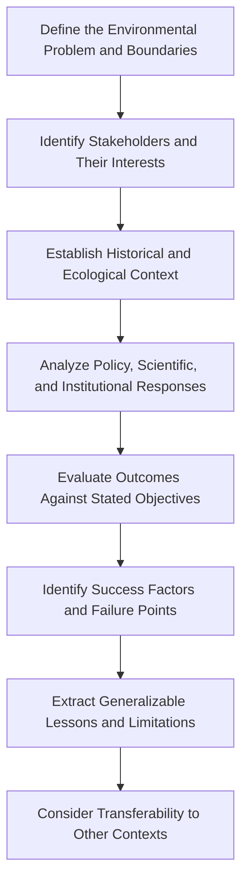

## Case Studies in Environmental Problem Solving

### Conceptual Foundations

#### Purpose of Case Study Methodology in Applied Environmental Science

Case study analysis serves as a bridge between theoretical environmental science and real-world problem-solving practice, allowing examination of how scientific findings, policy instruments, stakeholder dynamics, and implementation constraints interact in specific, bounded contexts. Unlike controlled experiments, case studies capture the full complexity of environmental problems as they unfold in actual social, political, and ecological systems, making them particularly valuable for capstone-level synthesis work that must integrate multiple disciplinary perspectives.

#### The Case Study as an Analytical Tool

Robert Yin's foundational methodological framework distinguishes case studies by their function:

- **Exploratory case studies**: Used to investigate situations where the intervention or phenomenon has no clear, single set of outcomes, generating hypotheses for further study.
- **Descriptive case studies**: Document a phenomenon and its real-world context in detail without necessarily testing a specific causal hypothesis.
- **Explanatory case studies**: Used to explain presumed causal links in interventions too complex for survey or experimental methods, examining how and why an outcome occurred.

### Standard Framework for Environmental Case Study Analysis

A structured analytical approach typically proceeds through the following stages:

#### Key Analytical Dimensions

| Dimension | Guiding Questions |
| --- | --- |
| Problem definition | How was the environmental problem framed, and by whom? Did framing shape the range of considered solutions? |
| Stakeholder analysis | Who bore the costs and benefits? Were affected communities meaningfully included in decision-making? |
| Institutional context | What legal, regulatory, and governance structures enabled or constrained action? |
| Scientific basis | What was the quality and certainty of the underlying science, and how did uncertainty affect decision-making? |
| Implementation | What resources, capacity, and political will were required, and were they present? |
| Outcome evaluation | Did the intervention achieve its stated goals? Were there significant unintended consequences? |
| Transferability | What contextual factors limit applying lessons from this case to other settings? |

### Illustrative Case Study: Montreal Protocol and Stratospheric Ozone Depletion

#### Problem Context

Scientific research in the 1970s–1980s established that chlorofluorocarbons (CFCs) and related halogenated compounds were catalytically destroying stratospheric ozone, with the discovery of the Antarctic ozone hole in 1985 providing a stark, visible manifestation of the underlying atmospheric chemistry.

#### Response and Outcome

The Montreal Protocol (1987) established binding international phase-out schedules for ozone-depleting substances and is widely regarded as one of the most successful international environmental agreements, credited with putting the ozone layer on a trajectory toward recovery over subsequent decades. Analysts commonly attribute this success to several converging factors: relatively concentrated industry (facilitating substitute development by a small number of major chemical manufacturers), clear and visually compelling scientific evidence, available technological substitutes, and a flexible protocol design allowing periodic strengthening as science and technology evolved.

**Example**: This case is frequently contrasted with international climate change negotiations to illustrate why some environmental problems prove more tractable than others — the diffuse, economy-wide nature of greenhouse gas emissions (versus CFCs' concentration in a few industrial sectors) is commonly cited as a key structural difference contributing to comparatively slower international climate policy progress. [Inference — this comparison is a common analytical framing in environmental policy literature, not a settled causal finding, since many other factors also differ between the two cases.]

### Illustrative Case Study: Love Canal and Hazardous Waste Governance

#### Problem Context

In the late 1970s, residents of the Love Canal neighborhood in Niagara Falls, New York, discovered that their community had been built atop a former industrial chemical waste disposal site, with subsequent health complaints and environmental testing revealing significant chemical contamination.

#### Response and Outcome

Grassroots organizing, led significantly by resident Lois Gibbs, combined with mounting scientific and media attention, led to federal emergency declarations, community relocation, and ultimately the passage of the Comprehensive Environmental Response, Compensation, and Liability Act (CERCLA, or "Superfund") in 1980, establishing a federal framework and liability structure for hazardous waste site remediation. This case is frequently analyzed for illustrating both the power of grassroots environmental mobilization and the significant gaps in pre-existing regulatory frameworks for legacy contamination — the disposal practices that created the site predated modern hazardous waste regulation entirely.

### Illustrative Case Study: Flint Water Crisis and Environmental Justice

#### Problem Context

Beginning in 2014, a change in Flint, Michigan's municipal water source, combined with inadequate corrosion control treatment, resulted in lead leaching from aging pipes into the public water supply, exposing residents — predominantly low-income and Black — to elevated lead levels with associated serious health risks, particularly for children.

#### Response and Outcome

The crisis is widely analyzed as an environmental justice failure at multiple institutional levels: technical decision-making that overlooked established corrosion control protocols, delayed governmental acknowledgment of resident complaints despite early warning signs, and disproportionate impact on an already economically distressed, majority-Black community. The case has become a frequently cited example in environmental justice curricula illustrating how infrastructure decisions, cost-cutting pressures, and unequal political power can combine to produce disproportionate environmental health harm, and has influenced subsequent policy attention to lead service line replacement programs nationally. [Unverified — specific current policy and legal outcomes (settlements, ongoing remediation status) continue to evolve and should be verified against current sources for up-to-date status.]

### Illustrative Case Study: Community-Based Forest Management (Multiple Contexts)

#### Problem Context

Centralized, state-controlled forest management in various developing-country contexts has in some documented cases been associated with degradation outcomes attributed partly to weak local enforcement capacity and misaligned incentives between distant government agencies and local resource users.

#### Response and Outcome

Community-based natural resource management (CBNRM) approaches — devolving management authority and use rights to local communities — have been implemented in various forms across contexts including Nepal's community forestry program and various African wildlife conservancy models. Evidence on outcomes is mixed across specific implementations: some studies document improved forest condition and community livelihood outcomes under community management, while others highlight elite capture (local power structures disproportionately benefiting from devolved authority), inadequate technical support, or insufficient tenure security undermining intended benefits. [Inference — outcomes are heterogeneous across the many actual CBNRM implementations globally, and this represents a general pattern in the comparative literature rather than a claim about any single specific program's current status, which would require case-specific verification.]

### Comparative Case Analysis Framework

When examining multiple cases for synthesis (as in capstone-level work), a structured comparative approach helps identify patterns:

- **Cross-case pattern matching**: Identifying recurring success or failure factors across superficially different cases (e.g., stakeholder inclusion emerging as a factor in both successful and unsuccessful cases, warranting closer examination of *how* inclusion was operationalized rather than merely whether it occurred).
- **Most-similar/most-different case selection**: Deliberately selecting cases that are similar in most respects but differ in a key variable of interest (or vice versa), to isolate the influence of that variable, following comparative case study logic from political science and sociology.
- **Typological classification**: Grouping cases into categories based on shared structural characteristics (e.g., point-source vs. non-point-source pollution problems; concentrated vs. diffuse responsible-party structures) to generate context-specific lessons rather than overgeneralized universal principles.

### Common Analytical Pitfalls in Case Study Work

- **Survivorship bias in case selection**: Disproportionately studying well-documented "success story" cases while under-examining failed or abandoned environmental interventions, skewing perceived best practices toward conditions that may not generalize.
- **Overgeneralization from a single case**: Extracting universal principles from a single case without adequately accounting for context-specific factors (political system, ecological conditions, economic circumstances) that may limit transferability.
- **Hindsight bias in outcome evaluation**: Judging historical decision-makers by information or scientific understanding not available at the time the decision was made.
- **Insufficient attention to counterfactuals**: Failing to consider what would likely have occurred absent the intervention, which is essential for genuinely evaluating an intervention's causal contribution to observed outcomes rather than assuming all subsequent change is attributable to it.
- **Stakeholder perspective imbalance**: Relying disproportionately on institutional or documented (often government or NGO) accounts of a case while underrepresenting perspectives of directly affected communities, particularly in environmental justice-relevant cases.

### Structuring a Capstone Case Study Analysis

A rigorous student-authored case study analysis typically includes:

1. **Executive summary**: Concise statement of the problem, approach, and key findings.
2. **Background and context**: Historical, ecological, and institutional setting necessary to understand the case.
3. **Problem statement**: Clear articulation of the environmental problem and why it warranted intervention.
4. **Stakeholder mapping**: Systematic identification of affected parties, their interests, and relative influence over outcomes.
5. **Intervention description**: Detailed account of the policy, technology, or program response implemented.
6. **Outcome analysis**: Evidence-based assessment of results against original objectives, incorporating available quantitative and qualitative data.
7. **Critical evaluation**: Honest assessment of both successes and shortcomings, avoiding one-sided advocacy framing.
8. **Lessons and transferability discussion**: Explicit discussion of which findings might generalize and under what conditions, versus which are highly context-specific.
9. **Citations and source evaluation**: Rigorous sourcing distinguishing primary data, peer-reviewed analysis, advocacy organization materials, and journalistic accounts, with appropriate weight given to each source type's reliability and potential bias.

### Case Study Selection Criteria for Capstone Projects

| Criterion | Consideration |
| --- | --- |
| Data availability | Sufficient documented information exists to support rigorous analysis |
| Analytical richness | Case involves genuine complexity (multiple stakeholders, competing values, imperfect information) rather than a straightforward technical problem |
| Relevance to learning objectives | Case illustrates concepts central to the broader curriculum (policy, justice, science communication, etc.) |
| Manageable scope | Case boundaries are defined narrowly enough for thorough treatment within project constraints |
| Access to diverse perspectives | Multiple stakeholder viewpoints are documented or accessible, avoiding single-source dependency |

**Related Topics**

- Comparative Case Study Methodology in Policy Analysis
- Environmental Justice Case Studies and Analytical Frameworks
- Stakeholder Mapping and Analysis Techniques
- Counterfactual Reasoning in Policy Evaluation
- International Environmental Agreement Case Comparisons
- Community-Based Natural Resource Management Models
- Capstone Project Structuring and Source Evaluation
- Superfund and Hazardous Waste Site Remediation Case Studies