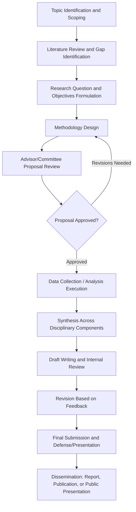

## Interdisciplinary Capstone Project Development

### Conceptual Foundations

#### Defining Interdisciplinary Capstone Work

An interdisciplinary capstone project is a culminating academic exercise requiring the integration of concepts, methods, and analytical frameworks from multiple disciplines to address a complex, real-world environmental problem that cannot be adequately understood or solved through a single disciplinary lens. Environmental problems are paradigmatic examples of "wicked problems" — issues characterized by scientific complexity, value pluralism, uncertain causality, and contested solutions — making interdisciplinary integration not merely pedagogically desirable but often analytically necessary.

#### Distinguishing Multidisciplinary, Interdisciplinary, and Transdisciplinary Work

- **Multidisciplinary approaches**: Multiple disciplines contribute to a shared problem but largely retain separate methods, frameworks, and conclusions, presented side by side without deep integration (e.g., a report with separate ecological, economic, and legal sections written independently).
- **Interdisciplinary approaches**: Genuine integration of disciplinary methods and concepts to produce analysis or conclusions that could not be reached within any single discipline alone (e.g., combining hydrological modeling with economic cost-benefit analysis and stakeholder governance analysis into a unified assessment).
- **Transdisciplinary approaches**: Extends interdisciplinary integration to include non-academic stakeholders (community members, practitioners, policymakers) as co-producers of knowledge, not merely subjects of study or downstream recipients of findings.

### Capstone Project Lifecycle

### Topic Selection and Scoping

#### Criteria for a Viable Interdisciplinary Capstone Topic

- **Genuine interdisciplinary necessity**: The problem should authentically require integration across disciplines rather than being artificially framed as interdisciplinary when a single-discipline approach would suffice.
- **Feasibility within time and resource constraints**: Ambitious interdisciplinary scope must be balanced against realistic data access, time, and skill constraints available to a student researcher; overly broad scoping is one of the most common causes of capstone project difficulty.
- **Access to necessary data and stakeholders**: Confirming in advance that required data (environmental monitoring records, interview access, institutional documents) is realistically obtainable prevents late-stage project derailment.
- **Alignment with available advisor expertise**: Since interdisciplinary work often exceeds any single advisor's full expertise, identifying committee members or secondary advisors covering the project's different disciplinary components is important early planning.

#### Common Scoping Pitfall: Disciplinary Overreach

A frequent early-stage error is attempting to conduct original, rigorous research across too many disciplines simultaneously (e.g., original ecological fieldwork, original economic modeling, and original policy analysis all within one capstone), typically exceeding feasible scope. A common corrective is to select one or two disciplinary components for primary original analysis while treating others as secondary, literature-grounded context supporting the central integrative argument.

### Research Question and Objective Formulation

#### Structuring an Interdisciplinary Research Question

Effective interdisciplinary research questions typically specify:

- The **core environmental problem or system** under investigation.
- The **specific disciplinary lenses** being integrated (e.g., ecological, economic, sociopolitical).
- The **integrative question** — what the combined analysis reveals that single-discipline analysis would not.

**Example**: Rather than a single-discipline question such as "What is the economic cost of coastal wetland loss?", an interdisciplinary framing might ask: "How do ecological wetland degradation patterns, economic valuation of ecosystem services, and local governance capacity jointly determine the feasibility of community-based wetland restoration in [a specific region]?" — a question requiring ecological assessment, economic valuation methodology, and institutional/governance analysis integrated toward a unified feasibility conclusion.

#### SMART Objective Framing

Capstone objectives are commonly structured using the SMART framework — Specific, Measurable, Achievable, Relevant, Time-bound — adapted for interdisciplinary environmental work to ensure objectives are concrete enough to guide methodology selection rather than remaining at a purely conceptual level.

### Methodological Integration Strategies

#### Sequential Integration

Disciplinary components are conducted in sequence, with findings from one informing the design of the next (e.g., ecological baseline data collection first, followed by economic valuation calibrated to the ecological findings, followed by policy analysis informed by both).

#### Parallel Integration

Disciplinary components are conducted concurrently and independently, then synthesized during interpretation (e.g., simultaneous water quality sampling and community survey administration, integrated during final analysis) — similar in structure to convergent parallel mixed-methods designs but applied across disciplinary rather than purely methodological boundaries.

#### Framework-Driven Integration

A unifying conceptual framework (e.g., the DPSIR framework — Drivers, Pressures, State, Impact, Response, widely used in environmental systems analysis; or socio-ecological systems frameworks) structures how different disciplinary inputs relate to one another within a single analytical model, providing a coherent organizing logic rather than disconnected sections.

| Framework | Origin Discipline | Common Application |
| --- | --- | --- |
| DPSIR (Drivers-Pressures-State-Impact-Response) | Environmental systems analysis | Structuring environmental problem analysis and policy response linkage |
| Socio-ecological systems (SES) framework | Institutional/commons scholarship (Ostrom) | Analyzing interactions between human governance and ecological resource systems |
| Triple bottom line | Sustainability/business | Integrating economic, social, and environmental outcome evaluation |
| Ecosystem services framework | Ecological economics | Linking ecological function to economic and social value |

### Literature Review for Interdisciplinary Work

#### Navigating Disciplinary Literature Silos

Interdisciplinary literature review requires deliberately searching across disciplinary databases and publication venues that may use different terminology for related concepts, since disciplines often develop parallel but differently labeled bodies of work addressing overlapping problems. A thorough interdisciplinary review typically involves:

- Searching both natural science databases (e.g., Web of Science, Scopus for ecological/technical literature) and social science/policy databases (e.g., JSTOR, policy-specific repositories).
- Explicitly noting where disciplines use different terms for related concepts, to avoid missing relevant work due to terminology mismatch.
- Identifying genuinely interdisciplinary journals (e.g., *Ecology and Society*, *Global Environmental Change*) that may already model the type of integration the capstone aims to achieve.

#### Synthesizing Across Disciplinary Epistemologies

A distinct challenge in interdisciplinary literature synthesis is reconciling different disciplinary standards of evidence (e.g., statistical significance thresholds in ecology versus qualitative saturation standards in ethnographic social science) — the capstone writer should explicitly acknowledge these differing epistemological standards rather than uncritically treating all cited evidence as methodologically equivalent.

### Stakeholder and Advisory Engagement

#### Committee Structure for Interdisciplinary Projects

Interdisciplinary capstones often benefit from a committee or advisory structure spanning the relevant disciplines, with a primary advisor providing overall project coordination and secondary readers providing discipline-specific technical review. Establishing clear expectations early regarding each advisor's role and the frequency of check-ins helps prevent conflicting disciplinary guidance from derailing project coherence.

#### External Stakeholder Engagement (Where Applicable)

Capstone projects addressing applied, community-relevant environmental problems often benefit from engaging external stakeholders (community organizations, agency staff, affected residents) both to ground the research in real-world relevance and to support eventual practical application of findings — though this requires appropriate ethical review where human subjects research protocols apply, and realistic time budgeting given that stakeholder engagement often takes longer than anticipated due to scheduling and relationship-building demands.

### Data Management Across Disciplines

Interdisciplinary projects frequently combine heterogeneous data types requiring different management and integration approaches:

- **Quantitative environmental data**: Sensor readings, laboratory results, remote sensing data — often requiring GIS or statistical software for integration and analysis.
- **Qualitative social data**: Interview transcripts, survey responses, document analysis — often requiring qualitative coding software (e.g., NVivo, Atlas.ti) or manual thematic coding frameworks.
- **Policy and institutional documents**: Legislative text, regulatory filings, meeting minutes — requiring document analysis or content analysis methods.
- **Integration challenge**: A common technical challenge is aligning data collected at different spatial or temporal scales or resolutions (e.g., household-level survey data versus watershed-level hydrological data), requiring explicit methodological decisions about aggregation or disaggregation before integrated analysis is possible.

### Writing and Structuring the Interdisciplinary Capstone Document

#### Common Structural Approaches

- **Integrated narrative structure**: The document is organized around the central research question, with disciplinary methods and findings woven together within thematic or analytical sections rather than segregated into separate discipline-specific chapters.
- **Modular-then-synthesis structure**: Separate chapters or sections address each disciplinary component in depth, followed by a dedicated integrative synthesis chapter explicitly connecting the components — often more feasible for capstone-level work given time constraints, provided the synthesis chapter is substantive rather than a superficial summary.

#### Essential Structural Elements

1. **Introduction and problem statement**: Establishes the environmental problem's significance and the rationale for interdisciplinary approach specifically.
2. **Literature review**: Synthesizes relevant work across all integrated disciplines, explicitly identifying the gap the capstone addresses.
3. **Conceptual/theoretical framework**: Articulates the framework used to integrate disciplinary components (see framework table above).
4. **Methodology**: Details data collection and analysis methods for each disciplinary component, including justification for method selection.
5. **Findings/results**: Presents findings, often organized by disciplinary component before or alongside integrated interpretation.
6. **Discussion/synthesis**: The analytical core of an interdisciplinary capstone — explicitly connects findings across disciplines to answer the integrative research question.
7. **Limitations**: Honest acknowledgment of methodological constraints, scope limitations, and generalizability boundaries.
8. **Conclusions and recommendations**: Practical or policy-relevant conclusions flowing from the integrated analysis, calibrated to the actual strength of evidence produced.

### Common Pitfalls in Interdisciplinary Capstone Projects

- **Superficial integration ("stapled disciplines")**: Presenting disciplinary components as separate sections without genuine analytical synthesis connecting them — the most frequently cited weakness in interdisciplinary student work.
- **Scope creep**: Gradually expanding project scope during execution as new interesting questions arise, jeopardizing feasibility within available time.
- **Uneven disciplinary depth**: One disciplinary component receiving substantially more rigorous treatment than others, undermining the credibility of claimed interdisciplinary integration.
- **Terminology inconsistency**: Using the same term with different meanings across disciplinary sections (e.g., "resilience" carries distinct technical meanings in ecology versus social systems theory) without acknowledging or reconciling the difference.
- **Delayed synthesis planning**: Treating synthesis as a final writing-stage task rather than planning for integration from the project's outset, often resulting in components that are difficult to meaningfully connect after independent execution.
- **Insufficient methodological justification**: Failing to explain why specific methods were chosen from each discipline's toolkit, particularly important when the student's home discipline expertise is stronger in some integrated areas than others.

### Evaluation Criteria Typically Applied to Interdisciplinary Capstones

| Criterion | What Evaluators Look For |
| --- | --- |
| Integration quality | Genuine synthesis versus disconnected disciplinary sections |
| Methodological rigor | Appropriate, well-justified methods within each disciplinary component |
| Research question clarity | A question that authentically requires interdisciplinary approach |
| Evidence-conclusion alignment | Conclusions appropriately calibrated to the strength of underlying evidence |
| Critical self-awareness | Explicit acknowledgment of limitations, including in cross-disciplinary translation |
| Practical/scholarly contribution | Clear articulation of what the work contributes beyond existing single-discipline analysis |
| Communication clarity | Accessibility to readers from varied disciplinary backgrounds |

### Timeline Management Considerations

Interdisciplinary capstones typically require more front-loaded planning time than single-discipline projects, since methodology design must account for how components will eventually integrate. A common practical recommendation is allocating explicit calendar time for synthesis work as a distinct phase (rather than assuming it will happen automatically during final writing), given that integration is consistently identified as the most time-intensive and conceptually demanding stage of interdisciplinary capstone work.

**Related Topics**

- Wicked Problems Framework in Environmental Policy
- DPSIR and Socio-Ecological Systems Frameworks
- Mixed-Methods Research Design in Socio-Environmental Systems
- Literature Review Strategies Across Disciplinary Databases
- Stakeholder Engagement Ethics in Applied Research
- Capstone Proposal Writing and Committee Structuring
- Environmental Research Design
- Case Studies in Environmental Problem Solving