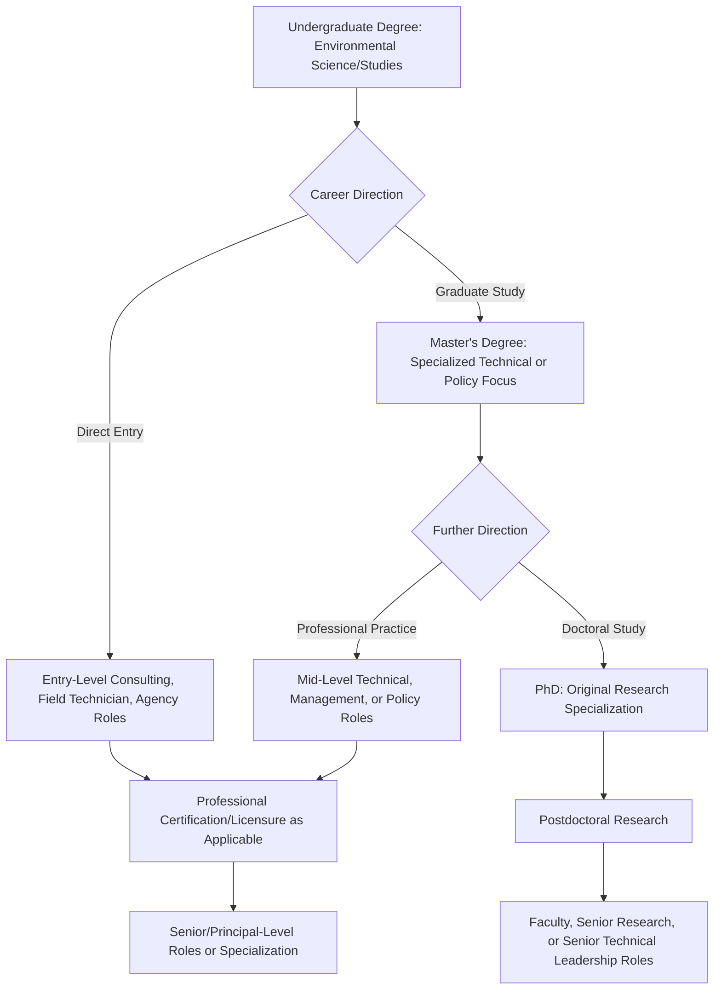

## Careers and Professional Pathways in Environmental Science

### Conceptual Foundations

#### Scope of the Environmental Science Career Landscape

Environmental science professional pathways span an unusually broad range of sectors, reflecting the field's interdisciplinary nature — spanning government regulatory agencies, private consulting, nonprofit advocacy, academic research, corporate sustainability functions, and technical/engineering roles. Career trajectories are shaped substantially by the specific disciplinary emphasis pursued during education (ecology, chemistry, policy, engineering, data science) as well as the sector in which a professional chooses to apply that training.

### Major Employment Sectors

#### Government and Regulatory Agencies

- **Federal/national agencies**: Roles in environmental regulatory enforcement, permitting, monitoring, and policy development (e.g., agencies analogous to the U.S. EPA, national park services, geological surveys, and fish and wildlife agencies).
- **State/provincial and local agencies**: Often provide more direct, hands-on regulatory and monitoring work, including water quality permitting, air quality compliance inspection, and local land-use planning review.
- **International and multilateral organizations**: Roles within bodies such as the United Nations Environment Programme, World Bank environmental safeguards units, or regional environmental commissions, often requiring specialized expertise in international policy, development economics, or global environmental governance.

#### Private Sector Consulting and Industry

- **Environmental consulting firms**: Conduct environmental impact assessments, contaminated site remediation planning, regulatory compliance auditing, and permitting support for private and public sector clients — one of the largest employers of early-career environmental science graduates.
- **Corporate sustainability and ESG roles**: In-house positions managing corporate environmental compliance, sustainability reporting, supply chain environmental risk assessment, and increasingly, climate risk disclosure functions driven by growing regulatory and investor expectations.
- **Engineering firms**: Environmental engineering roles focused on technical system design (water treatment, waste management, pollution control technology), typically requiring more specialized engineering credentials alongside environmental science training.
- **Renewable energy and cleantech sector**: Project development, environmental permitting, and impact assessment roles supporting solar, wind, and other renewable energy infrastructure development.

#### Nonprofit and Advocacy Organizations

- **Conservation organizations**: Roles spanning field-based conservation biology, land trust management, policy advocacy, and donor/grant management at organizations ranging from large international NGOs to local land trusts.
- **Environmental justice and community organizations**: Roles combining community organizing, policy advocacy, and technical environmental analysis in service of communities disproportionately affected by environmental harm.
- **Research and policy think tanks**: Positions producing policy analysis, technical reports, and advocacy-oriented research intended to influence legislative and regulatory processes.

#### Academic and Research Institutions

- **University faculty and research positions**: Typically require doctoral-level training and involve original research, grant-writing, teaching, and graduate student mentorship.
- **Government and independent research laboratories**: Research scientist positions at national laboratories or independent research institutes, often focused on specific technical domains (climate modeling, ecological research, environmental chemistry).
- **Postdoctoral research positions**: Common intermediate step between doctoral training and permanent academic or research positions, providing specialized research experience under a senior investigator.

### Career Pathway Diagram by Educational Stage

### Educational Pathways and Credentialing

#### Degree-Level Considerations

| Degree Level | Typical Career Access | Common Focus |
| --- | --- | --- |
| Bachelor's | Entry-level field, technical, consulting, and agency roles | Broad foundational training across environmental disciplines |
| Master's | Mid-level technical specialist, policy analyst, project management roles | Specialized technical depth (e.g., hydrology, environmental policy, GIS) |
| Doctorate (PhD) | Research faculty, senior research scientist, specialized technical leadership | Original research contribution within a narrow specialization |
| Professional/applied master's (e.g., MEM, MPA/MPP with environmental focus) | Management, policy, and leadership-track roles | Applied management, policy analysis, and leadership skill development alongside technical grounding |

#### Professional Certifications

Various professional certifications can enhance career progression depending on specialization, including credentials in environmental health and safety, hazardous waste management, GIS proficiency (e.g., GISP certification), and professional engineering licensure (P.E.) for environmental engineering roles requiring the ability to seal and submit official engineering documents. Specific certification requirements and their value vary substantially by country, state/province, and specialization, and should be researched for the specific jurisdiction and career track of interest. [Unverified — certification landscapes and requirements vary by region and change over time; current, jurisdiction-specific sources should be consulted for precise requirements.]

### Core Competencies Valued Across the Field

#### Technical Skills

- **Data analysis and statistics**: Proficiency in statistical software (R, Python, or specialized statistical packages) is increasingly expected across research, consulting, and policy analysis roles.
- **Geographic Information Systems (GIS)**: Widely applicable across conservation, consulting, urban planning, and regulatory roles for spatial data analysis and mapping.
- **Environmental sampling and laboratory methods**: Foundational for field-based technical and regulatory compliance roles.
- **Regulatory knowledge**: Familiarity with relevant environmental statutes and regulatory frameworks is essential for compliance-oriented consulting and agency roles.
- **Environmental modeling**: Skills in specific modeling domains (hydrological modeling, air dispersion modeling, climate modeling) command specialized, often higher-compensated roles.

#### Transferable Professional Skills

- **Technical writing and communication**: The ability to translate complex technical findings for varied audiences (regulators, the public, corporate leadership) is consistently cited as a differentiating skill across environmental career paths.
- **Project management**: Particularly valued in consulting contexts, where professionals often manage client relationships, budgets, and interdisciplinary technical teams simultaneously.
- **Stakeholder engagement and facilitation**: Increasingly important as environmental problem-solving requires navigating diverse, sometimes conflicting stakeholder interests.
- **Grant writing**: Essential for nonprofit, academic, and research-sector roles dependent on external funding.

### Sector Comparison: Trade-offs and Considerations

| Sector | Common Advantages | Common Trade-offs |
| --- | --- | --- |
| Government/regulatory | Job stability, defined career ladders, direct public impact | Bureaucratic processes, potentially slower advancement, budget-dependent staffing |
| Private consulting | Diverse project exposure, generally competitive compensation, client-driven variety | Billable-hour pressure, client deadline demands, potential conflicts between client interests and environmental outcomes |
| Nonprofit/advocacy | Mission alignment, direct engagement with communities and policy change | Often lower compensation, funding-dependent job security |
| Academia/research | Intellectual autonomy, deep specialization, mentorship opportunities | Long training timelines, competitive job market for permanent faculty positions, grant-funding pressure |
| Corporate sustainability | Growing sector demand, ability to influence large-scale organizational practice | Effectiveness can depend heavily on organizational commitment level versus symbolic positioning |

Compensation, job market conditions, and relative growth across these sectors vary by region, economic conditions, and specific specialization, and change over time; current labor market data (e.g., national labor statistics agencies, professional association salary surveys) should be consulted for up-to-date, location-specific information. [Unverified — labor market conditions are time- and region-sensitive and should be verified against current sources for specific career planning purposes.]

### Emerging and Growing Specialization Areas

- **Climate risk analysis and adaptation planning**: Growing demand across insurance, finance, real estate, and government sectors for professionals able to assess and plan for physical climate risk.
- **ESG and sustainable finance**: Expanding corporate and financial sector demand for professionals bridging environmental science and financial/investment analysis.
- **Environmental data science**: Increasing integration of machine learning and large-scale data analysis into environmental monitoring, remote sensing interpretation, and predictive modeling roles.
- **Environmental justice specialists**: Growing institutionalization of environmental justice analysis within government agencies and consulting firms, driven by expanding regulatory attention to disproportionate impact analysis.
- **Renewable energy siting and permitting**: Expanding specialization area tied to the buildout of renewable energy infrastructure, requiring hybrid technical/regulatory expertise.

### Building Professional Experience During Education

- **Internships**: Widely regarded as one of the most effective pathways to entry-level employment, providing both practical skill development and professional network access; many government and consulting employers preferentially hire from their own internship pipelines.
- **Undergraduate/graduate research assistantships**: Provide research methodology experience valuable both for graduate school applications and technical roles requiring research skills.
- **Volunteer field experience**: Conservation organizations, citizen science programs, and local environmental groups often provide accessible entry points for building field experience, particularly valuable for students pursuing ecology or field-based specializations.
- **Professional association involvement**: Student chapters of professional societies (specific to specialization, e.g., ecological, hydrological, or planning associations) provide networking opportunities and often job/internship postings targeted at students.

### Networking and Professional Development Strategies

- **Informational interviews**: Direct outreach to professionals in target career paths for candid conversation about day-to-day work realities, commonly recommended as a low-commitment way to clarify career direction before committing to a specialized graduate program or job search focus.
- **Professional conferences**: Attendance provides networking opportunities, exposure to current research and industry trends, and potential job market intelligence, though cost can be a barrier for early-career professionals without institutional funding support.
- **Professional association membership**: Beyond networking, associations often provide job boards, continuing education resources, and industry-specific credentialing pathways.

### Common Career Planning Considerations

- **Specialization versus generalist positioning**: Early-career decisions about specialization depth (e.g., becoming a wetland delineation specialist versus a generalist environmental scientist) involve trade-offs between deeper technical marketability within a niche versus broader flexibility across roles.
- **Geographic mobility considerations**: Certain specializations and sectors (e.g., federal agency roles, academic positions) may require greater geographic flexibility than others, an important practical consideration in career planning.
- **Work-life balance variation by sector and role**: Fieldwork-intensive roles, consulting deadline cycles, and academic tenure-track pressures each carry distinct time and lifestyle demands that vary considerably by specific position and organization.
- **Values alignment**: Given the field's overlap between technical work and normative environmental and social values, many professionals report job satisfaction is closely tied to alignment between organizational mission and personal values, particularly relevant when weighing corporate versus nonprofit or advocacy-oriented roles.

**Related Topics**

- Environmental Consulting Industry Overview
- Graduate School Selection and Application Strategy for Environmental Science
- Professional Certification Pathways (GISP, P.E., CHMM, and Others)
- ESG and Sustainable Finance Career Tracks
- Environmental Justice Institutionalization in Government and Industry
- Networking and Informational Interview Strategies
- Interdisciplinary Capstone Project Development
- Environmental Data Science and Emerging Technical Skills