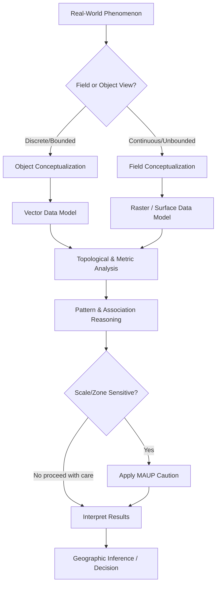

## Spatial Concepts and Geographic Reasoning

### Overview

Spatial concepts and geographic reasoning form the cognitive and formal foundation of geospatial science. They describe how location, arrangement, and relationships among phenomena on or near the Earth's surface are conceptualized, represented, and analyzed. This foundation precedes any specific tool, data model, or software system (GIS, remote sensing platform, or spatial database) and determines how those tools are correctly applied.

**Key Points**

- Geographic reasoning concerns *where* things are, *why* they are there, and *how* their location relates to other phenomena.
- Spatial concepts provide the vocabulary (location, distance, direction, adjacency, connectivity) that geospatial systems formalize into data structures and operations.
- Reasoning at this level is largely representation-independent — the same spatial relationship (e.g., containment) can be encoded in vector, raster, or graph form.

---

### The Nature of Spatial Thinking

Spatial thinking is the cognitive capacity to understand, reason about, and communicate the positions, shapes, sizes, and relationships of objects and phenomena in space. In geography and GIScience, this is formalized into three interacting components:

1. **Concepts of space** — the primitives used to describe "where" (location, distance, direction).
2. **Tools of representation** — maps, coordinate systems, diagrams, and digital data models that externalize spatial concepts.
3. **Processes of reasoning** — the operations performed on those representations (comparison, overlay, pattern detection, inference).

[Inference] Cognitive science research (e.g., the National Research Council's *Learning to Think Spatially*, 2006) treats spatial thinking as a "habit of mind" applicable beyond geography, but its formalized, systematic application to the Earth's surface is what constitutes *geographic* reasoning specifically.

---

### Absolute vs. Relative Space

Two philosophical models underlie all spatial representation:

- **Absolute space**: Space exists independently of the objects within it, as a fixed container with its own coordinate structure (Newtonian view). A location is defined by fixed coordinates (e.g., latitude/longitude) regardless of what occupies it.
- **Relative space**: Space is defined by the relationships between objects — location is meaningful only in reference to other entities (Leibnizian view). "Near the river," "between two cities," and network distance are relative-space expressions.

Most GIS coordinate systems operationalize absolute space, while many analytical operations (nearest-neighbor, network distance, topological adjacency) operationalize relative space. Real-world geographic reasoning typically shifts fluidly between both.

---

### Core Spatial Primitives

#### Location

The most fundamental spatial concept — a position on the Earth's surface, expressible as:

- **Absolute location**: coordinates in a defined reference system, e.g., $(\phi, \lambda)$ for latitude/longitude, or $(x, y)$ in a projected coordinate reference system (CRS).
- **Relative location**: description with respect to other features (e.g., "3 km northeast of the city center").

#### Distance

A measure of spatial separation. Distance is not a single concept but a family of measures:

| Distance Type | Definition | Typical Use |
| --- | --- | --- |
| Euclidean | Straight-line distance in a plane | Local-scale planar analysis |
| Geodesic (great-circle) | Shortest path along Earth's ellipsoidal/spherical surface | Long-range/global distance |
| Manhattan (taxicab) | Sum of orthogonal (grid-aligned) distances | Urban grid movement, raster analysis |
| Network distance | Shortest path along a constrained network (roads, rivers) | Routing, accessibility |
| Cost distance | Distance weighted by traversal difficulty (e.g., slope, land cover) | Least-cost path modeling |

Euclidean distance in a plane:

$$d = \sqrt{(x_2 - x_1)^2 + (y_2 - y_1)^2}$$

Geodesic distance (spherical approximation, haversine formula):

$$d = 2r \cdot \arcsin\left(\sqrt{\sin^2\left(\frac{\phi_2 - \phi_1}{2}\right) + \cos(\phi_1)\cos(\phi_2)\sin^2\left(\frac{\lambda_2 - \lambda_1}{2}\right)}\right)$$

where $r$ is Earth's radius, $\phi$ is latitude, and $\lambda$ is longitude.

#### Direction

Orientation between two locations, typically expressed as:

- **Cardinal/ordinal direction** (N, NE, E, SE, etc.)
- **Bearing/azimuth**: angle measured clockwise from north, $0°$ to $360°$
- **Relative direction**: egocentric terms (left, right, ahead) versus allocentric terms (north, south) — a key distinction in cognitive geography.

#### Scale

The relationship between distance on a representation (map) and corresponding distance on the Earth. Scale operates in two senses:

- **Cartographic scale**: the representative fraction (e.g., 1:24,000).
- **Geographic/analytical scale**: the spatial extent and resolution at which a phenomenon is studied — critically, patterns and relationships can change qualitatively across scales (see **Modifiable Areal Unit Problem** below).

---

### Spatial Relationships

Geographic reasoning depends heavily on formalized relationship types between spatial entities.

#### Topological Relationships

Properties preserved under continuous deformation (stretching, bending) but not tearing — these describe qualitative connectivity rather than metric distance. The **Dimensionally Extended 9-Intersection Model (DE-9IM)**, formalized in the OGC Simple Features standard, is the canonical framework used by spatial databases (PostGIS, Shapely, JTS) to compute these relationships.

Common topological predicates:

- **Equals** — geometries are spatially identical
- **Disjoint** — no shared points
- **Intersects** — share at least one point
- **Touches** — share a boundary point but interiors do not overlap
- **Contains / Within** — one geometry's interior fully encloses another
- **Overlaps** — partial spatial overlap, same dimensionality
- **Crosses** — geometries of different dimension intersecting partially

#### Directional and Metric Relationships

Beyond topology, reasoning also considers:

- **Directional relations**: north of, adjacent to, opposite
- **Metric relations**: within 5 km, farther than, closer to

#### Hierarchical and Set-Based Relationships

- **Containment/nesting**: administrative hierarchies (country → province → municipality)
- **Partonomy (part-whole)**: watershed and sub-watershed, continent and country

---

### Geographic Reasoning Processes

#### Pattern Recognition

Identifying spatial arrangements such as clustering, dispersion, and randomness. Formal measures include:

- **Nearest Neighbor Index (NNI)**: ratio of observed mean nearest-neighbor distance to expected distance under complete spatial randomness.

$$NNI = \frac{\bar{D}_{observed}}{\bar{D}_{expected}}$$

An NNI < 1 suggests clustering; NNI > 1 suggests dispersion; NNI ≈ 1 suggests randomness.

- **Moran's I**: global measure of spatial autocorrelation.

$$I = \frac{n}{\sum_i \sum_j w_{ij}} \cdot \frac{\sum_i \sum_j w_{ij}(x_i - \bar{x})(x_j - \bar{x})}{\sum_i (x_i - \bar{x})^2}$$

where $w_{ij}$ is a spatial weight between locations $i$ and $j$.

#### Spatial Association and Correlation

Reasoning about whether two or more phenomena co-vary across space (e.g., disease incidence and pollution levels), distinct from temporal or purely statistical correlation because spatial proximity itself can induce correlation (spatial autocorrelation), violating the independence assumption of classical statistics. This underlies **Tobler's First Law of Geography**: "everything is related to everything else, but near things are more related than distant things." [Unverified as a strict law — widely cited as a heuristic principle rather than an empirically falsifiable law, and exceptions are well documented, e.g., abrupt boundaries such as national borders or fault lines.]

#### Regionalization

The process of partitioning space into meaningful, often internally homogeneous, regions based on selected criteria (formal regions by shared attribute, functional regions by interaction, or perceptual regions by cognitive boundary).

#### Spatial Inference and Prediction

Estimating values or classifications at unsampled locations based on known spatial relationships — the conceptual basis for interpolation methods such as **Inverse Distance Weighting (IDW)** and **Kriging**, covered in depth in geostatistics.

---

### The Modifiable Areal Unit Problem (MAUP)

A critical epistemological caution in geographic reasoning: statistical results derived from spatially aggregated data can vary substantially depending on:

- **Scale effect**: how coarse or fine the aggregation units are (e.g., census tract vs. county).
- **Zoning effect**: how boundaries are drawn at a given scale, even with the same number of units.

MAUP means that geographic reasoning must always be scale- and zone-aware; a spatial pattern or correlation is not an absolute property of the underlying phenomenon but is partly an artifact of the areal units chosen for analysis.

---

### Ecological Fallacy

Closely related to MAUP: the error of inferring individual-level relationships from aggregate (group-level) spatial data. For example, observing that regions with higher average income have lower average disease rates does not permit the conclusion that wealthier *individuals* have lower disease risk — the aggregate relationship may not hold, or may even reverse, at the individual level.

---

### Frames of Reference in Spatial Cognition

Human and computational geographic reasoning both operate within reference frames:

- **Egocentric frame**: spatial relationships defined relative to the observer (left/right, in front/behind).
- **Allocentric frame**: spatial relationships defined independent of the observer, using external coordinates (north/south, absolute coordinates).
- **Geocentric/Earth-based frame**: reference systems fixed to the Earth itself (geographic coordinate systems, projected coordinate systems) — the frame used by virtually all GIS software.

Digital geospatial systems formalize allocentric/geocentric reasoning via **Coordinate Reference Systems (CRS)**, but user-facing applications (navigation systems, mobile mapping) frequently must translate between egocentric human cognition and geocentric machine representation.

---

### Conceptualizing Geographic Space: Field vs. Object Views

A foundational representational choice in geospatial science, directly downstream of spatial reasoning:

- **Object (discrete) view**: the world is composed of discrete, bounded entities with identity (a building, a road, a country) — naturally modeled as **vector data** (points, lines, polygons).
- **Field (continuous) view**: the world is composed of continuously varying phenomena without natural boundaries (elevation, temperature, precipitation) — naturally modeled as **raster/continuous surfaces**.

Many real-world phenomena are ambiguous between the two (e.g., a forest can be treated as a discrete object or as a continuous canopy-density field), and the choice of conceptualization determines the entire downstream data model, storage structure, and analytical toolkit.

---

### Diagram: Spatial Concepts Hierarchy (svg_diagram)

<svg xmlns="http://www.w3.org/2000/svg" viewBox="0 0 800 460" font-family="Helvetica, Arial, sans-serif">
<text x="400" y="30" font-size="18" font-weight="bold" text-anchor="middle">Spatial Concepts and Geographic Reasoning (svg_diagram)</text>
<rect x="300" y="50" width="200" height="40" rx="6" fill="#dbeafe" stroke="#1e3a8a" stroke-width="1.5" />
<text x="400" y="75" font-size="13" text-anchor="middle">Geographic Reasoning</text>
<line x1="400" y1="90" x2="150" y2="140" stroke="#334155" stroke-width="1.5" />
<line x1="400" y1="90" x2="400" y2="140" stroke="#334155" stroke-width="1.5" />
<line x1="400" y1="90" x2="650" y2="140" stroke="#334155" stroke-width="1.5" />
<rect x="60" y="140" width="180" height="40" rx="6" fill="#fef3c7" stroke="#92400e" stroke-width="1.5" />
<text x="150" y="165" font-size="13" text-anchor="middle">Spatial Primitives</text>
<rect x="310" y="140" width="180" height="40" rx="6" fill="#fef3c7" stroke="#92400e" stroke-width="1.5" />
<text x="400" y="165" font-size="13" text-anchor="middle">Spatial Relationships</text>
<rect x="560" y="140" width="180" height="40" rx="6" fill="#fef3c7" stroke="#92400e" stroke-width="1.5" />
<text x="650" y="165" font-size="13" text-anchor="middle">Reasoning Processes</text>

<line x1="150" y1="180" x2="80" y2="230" stroke="#334155" stroke-width="1" />
<line x1="150" y1="180" x2="150" y2="230" stroke="#334155" stroke-width="1" />
<line x1="150" y1="180" x2="220" y2="230" stroke="#334155" stroke-width="1" />
<rect x="30" y="230" width="100" height="34" rx="5" fill="#dcfce7" stroke="#166534" />
<text x="80" y="251" font-size="11" text-anchor="middle">Location</text>
<rect x="100" y="270" width="100" height="34" rx="5" fill="#dcfce7" stroke="#166534" />
<text x="150" y="291" font-size="11" text-anchor="middle">Distance</text>
<rect x="170" y="230" width="100" height="34" rx="5" fill="#dcfce7" stroke="#166534" />
<text x="220" y="251" font-size="11" text-anchor="middle">Direction / Scale</text>

<line x1="400" y1="180" x2="330" y2="230" stroke="#334155" stroke-width="1" />
<line x1="400" y1="180" x2="400" y2="230" stroke="#334155" stroke-width="1" />
<line x1="400" y1="180" x2="470" y2="230" stroke="#334155" stroke-width="1" />
<rect x="280" y="230" width="100" height="34" rx="5" fill="#dcfce7" stroke="#166534" />
<text x="330" y="251" font-size="11" text-anchor="middle">Topological</text>
<rect x="350" y="270" width="100" height="34" rx="5" fill="#dcfce7" stroke="#166534" />
<text x="400" y="291" font-size="11" text-anchor="middle">Directional/Metric</text>
<rect x="420" y="230" width="110" height="34" rx="5" fill="#dcfce7" stroke="#166534" />
<text x="475" y="251" font-size="11" text-anchor="middle">Hierarchical</text>

<line x1="650" y1="180" x2="580" y2="230" stroke="#334155" stroke-width="1" />
<line x1="650" y1="180" x2="650" y2="230" stroke="#334155" stroke-width="1" />
<line x1="650" y1="180" x2="730" y2="230" stroke="#334155" stroke-width="1" />
<rect x="530" y="230" width="100" height="34" rx="5" fill="#dcfce7" stroke="#166534" />
<text x="580" y="251" font-size="11" text-anchor="middle">Pattern Detect.</text>
<rect x="600" y="270" width="100" height="34" rx="5" fill="#dcfce7" stroke="#166534" />
<text x="650" y="291" font-size="11" text-anchor="middle">Association</text>
<rect x="670" y="230" width="110" height="34" rx="5" fill="#dcfce7" stroke="#166534" />
<text x="725" y="251" font-size="11" text-anchor="middle">Regionalization</text>
<rect x="150" y="360" width="500" height="70" rx="8" fill="#fee2e2" stroke="#991b1b" stroke-width="1.5" />
<text x="400" y="385" font-size="13" font-weight="bold" text-anchor="middle">Caution Layer</text>
<text x="400" y="408" font-size="12" text-anchor="middle">MAUP · Ecological Fallacy · Scale Dependence</text>
<line x1="400" y1="304" x2="400" y2="360" stroke="#7f1d1d" stroke-width="1.5" stroke-dasharray="4,3" />
</svg>

---

### Worked Example: Comparing Distance Measures

Consider two hospitals in a city, at approximate coordinates (in a local projected CRS, meters): Hospital A at $(1000, 2000)$ and Hospital B at $(4000, 6000)$.

**Euclidean distance:**

$$d = \sqrt{(4000-1000)^2 + (6000-2000)^2} = \sqrt{3000^2 + 4000^2} = \sqrt{9{,}000{,}000 + 16{,}000{,}000} = 5000 \text{ m}$$

**Manhattan distance:**

$$d = |4000-1000| + |6000-2000| = 3000 + 4000 = 7000 \text{ m}$$

**Reasoning implication:** if the city street grid is orthogonal, Manhattan distance more realistically models actual travel distance than Euclidean distance, and network distance (accounting for actual road curvature, one-way streets, and blocked segments) would likely differ from both. This illustrates why selecting the correct distance concept is itself a geographic reasoning task, not merely a computational one — the "correct" answer depends on the phenomenon being modeled (as-the-crow-flies exposure vs. ambulance response time).

---

### Conceptual Workflow Diagram

---

### Common Pitfalls in Geographic Reasoning

- **Conflating correlation in space with causation**: spatial co-occurrence does not establish causal mechanism.
- **Ignoring scale dependence**: a relationship significant at one areal unit scale may disappear or invert at another (MAUP).
- **Committing the ecological fallacy**: applying aggregate-level findings to individuals.
- **Assuming isotropy**: assuming spatial processes behave identically in all directions when many real processes (wind-driven pollution, river-based contamination) are anisotropic.
- **Treating boundaries as natural**: administrative or analytical boundaries are often arbitrary with respect to the underlying phenomenon (edge effects).

---

**Related Topics**

- Coordinate Reference Systems and Map Projections
- Vector vs. Raster Data Models
- Topology and the DE-9IM / OGC Simple Features Standard
- Spatial Autocorrelation and Moran's I
- The Modifiable Areal Unit Problem (in-depth treatment)
- Tobler's First Law of Geography and Spatial Dependence
- Cartographic Generalization and Scale
- Geostatistics: Kriging and Spatial Interpolation
- Spatial Data Quality, Uncertainty, and Error Propagation
- Cognitive Maps and Wayfinding in GIScience