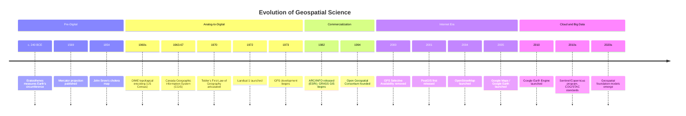

## History and Evolution of Geospatial Science

### Overview

Geospatial science did not emerge as a unified discipline but rather converged from several independent traditions — cartography, surveying, photogrammetry, geodesy, statistics, and computer science — that progressively merged over the twentieth century into what is now recognized as Geographic Information Science (GIScience). Understanding this evolution clarifies why the modern field carries theoretical and methodological baggage from each of its parent disciplines, and why terminology (GIS, remote sensing, geomatics, geoinformatics) can overlap or diverge depending on historical and institutional context.

**Key Points**

- Geospatial science is a convergence of cartography, geodesy, photogrammetry/remote sensing, spatial statistics, and computer science.
- The transition from analog to digital methods (roughly 1960s–1990s) is the central pivot point of the field's modern history.
- Contemporary geospatial science is shaped by three parallel revolutions: the *computational* (GIS software), the *observational* (satellite remote sensing), and the *participatory/data* (crowdsourcing, big geospatial data, cloud computing).

---

### Pre-Digital Foundations (Antiquity – 19th Century)

#### Early Cartography and Geodesy

- **Eratosthenes** (c. 240 BCE) calculated Earth's circumference using shadow-angle measurements at two locations — an early exercise in geodesy and geographic reasoning about scale and curvature.
- **Ptolemy's *Geographia*** (2nd century CE) systematized coordinate-based mapping, introducing latitude/longitude as an organizing framework — a direct conceptual ancestor of the modern CRS.
- **Gerardus Mercator** (1569) introduced the Mercator projection, addressing the practical navigational need for constant-bearing (rhumb line) straight lines — illustrating how projection design has always been driven by specific use-case trade-offs rather than universal "accuracy."

#### Thematic and Statistical Cartography

- **John Snow's cholera map** (1854, London) is widely cited as a foundational case of spatial epidemiology and geographic reasoning — plotting cholera deaths against water pump locations to infer a causal spatial association. [Unverified as literally "the first" spatial analysis — it is a commonly cited pedagogical example rather than a rigorously documented historical "first," but its methodological significance for spatial reasoning is well established.]
- 19th-century statistical/thematic cartography (choropleth maps, isolines) established the visual-analytical conventions still used in modern GIS symbology.

#### Surveying and National Mapping Programs

Systematic national topographic surveys (e.g., the UK Ordnance Survey, founded 1791; the US Coast and Geodetic Survey, founded 1807) established standardized geodetic control networks and mapping conventions that underpin modern coordinate reference systems.

---

### The Analog-to-Digital Transition (1950s–1970s)

#### Photogrammetry and Early Remote Sensing

Aerial photography, developed extensively during World Wars I and II for reconnaissance, matured into **photogrammetry** — the science of extracting metric measurements from photographs — establishing techniques (stereo-pair analysis, orthorectification) that remain foundational to remote sensing.

#### The Birth of Digital GIS

- **Roger Tomlinson** developed the **Canada Geographic Information System (CGIS)** in the mid-1960s, widely credited as the first true digital GIS, designed to inventory and manage Canada's land resources. Tomlinson is frequently called the "father of GIS" for this work and for coining the term "geographic information system."
- Concurrently, the **Harvard Laboratory for Computer Graphics and Spatial Analysis** (founded 1965) developed early software (SYMAP, then later ODYSSEY) that pioneered vector-based spatial data structures and significantly influenced subsequent commercial GIS design.
- The **US Census Bureau's DIME (Dual Independent Map Encoding)** format (1960s–1970s) introduced topological data structures for encoding street networks — a direct conceptual precursor to the topological vector data models used in modern GIS software.

#### Formalization of Spatial Statistics

Concurrent with computational developments, spatial statistics matured as a distinct field:

- **Waldo Tobler** articulated the informal "First Law of Geography" (1970), later foundational to spatial autocorrelation theory.
- **Georges Matheron** developed the mathematical theory of **regionalized variables**, the theoretical basis of **kriging** (named after mining engineer D.G. Krige), establishing modern geostatistics.

---

### Commercialization and Standardization (1980s–1990s)

#### Rise of Commercial GIS Software

- **ESRI**, founded in 1969 as a land-use consulting firm, released **ARC/INFO** in 1982 — the first commercially successful GIS combining a vector "ARC" component (spatial geometry) with an "INFO" relational database component for attributes, establishing the geometry-attribute separation pattern still standard in GIS architecture today.
- Competing systems (Intergraph, MapInfo, GRASS GIS — originally developed by the US Army Corps of Engineers starting 1982 as an open-source alternative) diversified the software ecosystem.

#### Satellite Remote Sensing Matures

- **Landsat 1** (launched 1972, originally ERTS-1) inaugurated the era of systematic, repeat, multispectral Earth observation from space, establishing the longest continuous satellite land-imaging record still active today (Landsat 8/9).
- The **Global Positioning System (GPS)**, developed by the US military starting in 1973 and opened to civilian use with degraded accuracy ("Selective Availability") until this restriction was removed in 2000, transformed field data collection and enabled direct, low-cost georeferencing.

#### Standardization Efforts

The **Open Geospatial Consortium (OGC)**, founded in 1994, began developing interoperability standards (Simple Features, WMS, WFS, and later GeoTIFF-adjacent and GML standards) to counter vendor lock-in and enable cross-platform data exchange — a standardization effort directly responsible for the interoperable spatial database ecosystem (PostGIS, Shapely, GDAL/OGR) used throughout modern geospatial software.

---

### The Internet and Open-Data Era (2000s)

#### Web Mapping and Consumer GIS

- **Google Maps** (2005) and the concurrent **Google Earth** (acquired from Keyhole, Inc. in 2004) mainstreamed interactive digital mapping for a general audience, dramatically expanding public spatial literacy and demand for location-based services.
- **OpenStreetMap (OSM)**, launched in 2004, pioneered a large-scale volunteered geographic information (VGI) model — crowdsourced, collaboratively edited global mapping data under an open license, establishing a data-commons alternative to proprietary map providers.

#### Free and Open-Source Geospatial Software (FOSS4G)

Maturation of open-source tools — **GDAL/OGR** (data format translation), **PostGIS** (spatial database extension for PostgreSQL, first released 2001), **QGIS** (originally Quantum GIS, first released 2002) — established a viable non-proprietary alternative stack, now foundational to research, government, and industry geospatial workflows.

#### Volunteered Geographic Information (VGI)

Coined by Michael Goodchild (2007), VGI describes the phenomenon of citizens acting as voluntary sensors, generating geographic data through platforms like OSM, geotagged social media, and citizen-science applications — introducing new epistemological questions about data quality, bias, and provenance that remain active research areas.

---

### The Big Data and Cloud Era (2010s–Present)

#### Cloud-Native Geospatial

The explosion of satellite constellations (Planet Labs, Sentinel program under Copernicus, commercial VHR providers) generated data volumes exceeding the practical limits of desktop GIS, driving a shift toward cloud-native architectures:

- **Google Earth Engine** (launched 2010) pioneered petabyte-scale, server-side geospatial analysis without requiring local data download.
- **Cloud-Optimized GeoTIFF (COG)** and the **SpatioTemporal Asset Catalog (STAC)** specification emerged as standards enabling efficient, partial, cloud-hosted raster access.
- Major cloud providers (AWS, Google Cloud, Microsoft's Planetary Computer) established public satellite data repositories, further shifting the field toward cloud-first workflows.

[Inference] This period is sometimes referred to informally as the "geospatial big data" or "cloud-native geospatial" era, reflecting the shift from data scarcity to data abundance as the field's primary technical constraint.

#### Machine Learning Integration

Deep learning (convolutional neural networks for image classification/segmentation, and more recently geospatial foundation models) has been increasingly integrated into remote sensing workflows for tasks such as land cover classification, object detection, and change detection, representing an ongoing convergence between geospatial science and the broader machine learning field. [Speculation] The long-term methodological impact of large pretrained geospatial foundation models on the field's traditional statistical/geostatistical toolkit remains an open and actively evolving question rather than a settled matter.

---

### Timeline Diagram

---

### Convergent Disciplinary Streams (svg_diagram)

<svg xmlns="http://www.w3.org/2000/svg" viewBox="0 0 800 380" font-family="Helvetica, Arial, sans-serif">
<text x="400" y="28" font-size="17" font-weight="bold" text-anchor="middle">Disciplinary Convergence into GIScience (svg_diagram)</text>
<rect x="20" y="60" width="150" height="40" rx="6" fill="#dbeafe" stroke="#1e3a8a" />
<text x="95" y="85" font-size="11" text-anchor="middle">Cartography</text>
<rect x="20" y="120" width="150" height="40" rx="6" fill="#dbeafe" stroke="#1e3a8a" />
<text x="95" y="145" font-size="11" text-anchor="middle">Geodesy &amp; Surveying</text>
<rect x="20" y="180" width="150" height="40" rx="6" fill="#dbeafe" stroke="#1e3a8a" />
<text x="95" y="205" font-size="11" text-anchor="middle">Photogrammetry / Remote Sensing</text>
<rect x="20" y="240" width="150" height="40" rx="6" fill="#dbeafe" stroke="#1e3a8a" />
<text x="95" y="265" font-size="11" text-anchor="middle">Spatial Statistics</text>
<rect x="20" y="300" width="150" height="40" rx="6" fill="#dbeafe" stroke="#1e3a8a" />
<text x="95" y="325" font-size="11" text-anchor="middle">Computer Science</text>
<line x1="170" y1="80" x2="320" y2="190" stroke="#334155" stroke-width="1.2" />
<line x1="170" y1="140" x2="320" y2="195" stroke="#334155" stroke-width="1.2" />
<line x1="170" y1="200" x2="320" y2="200" stroke="#334155" stroke-width="1.2" />
<line x1="170" y1="260" x2="320" y2="205" stroke="#334155" stroke-width="1.2" />
<line x1="170" y1="320" x2="320" y2="210" stroke="#334155" stroke-width="1.2" />
<rect x="320" y="160" width="180" height="80" rx="10" fill="#fef3c7" stroke="#92400e" stroke-width="2" />
<text x="410" y="195" font-size="14" font-weight="bold" text-anchor="middle">GIScience</text>
<text x="410" y="215" font-size="10.5" text-anchor="middle">(convergence, 1960s-present)</text>
<line x1="500" y1="200" x2="600" y2="200" stroke="#334155" stroke-width="1.5" marker-end="url(#arrow2)" />
<rect x="600" y="90" width="180" height="40" rx="6" fill="#dcfce7" stroke="#166534" />
<text x="690" y="115" font-size="11" text-anchor="middle">Commercial &amp; FOSS GIS</text>
<rect x="600" y="150" width="180" height="40" rx="6" fill="#dcfce7" stroke="#166534" />
<text x="690" y="175" font-size="11" text-anchor="middle">Web &amp; VGI Mapping</text>
<rect x="600" y="210" width="180" height="40" rx="6" fill="#dcfce7" stroke="#166534" />
<text x="690" y="235" font-size="11" text-anchor="middle">Cloud-Native Geospatial</text>
<rect x="600" y="270" width="180" height="40" rx="6" fill="#dcfce7" stroke="#166534" />
<text x="690" y="295" font-size="11" text-anchor="middle">ML / Geo-Foundation Models</text>
</svg>

---

### Terminology Evolution

The naming of the field itself reflects its layered history and varies by regional/institutional convention:

| Term | Emphasis | Common Regional Usage |
| --- | --- | --- |
| **GIS (Geographic Information Systems)** | Software/tools for managing spatial data | Global, especially North America |
| **GIScience (Geographic Information Science)** | Theoretical/scientific study underlying GIS | Academic, research-oriented |
| **Geomatics** | Integration of surveying, geodesy, and mapping technologies | Canada, France, parts of Europe |
| **Geoinformatics** | Computational/informatics-centered framing | Europe, parts of Asia |
| **Remote Sensing** | Specifically, data acquisition via sensors (satellite/airborne) | Global, treated as a subfield or sibling field |
| **Geospatial Science** | Umbrella term encompassing all of the above | Increasingly common, especially industry/interdisciplinary contexts |

[Unverified] — the boundaries between these terms are not rigidly standardized and usage varies by institution, country, and era; the table above reflects general common-usage tendencies rather than a formally ratified taxonomy.

---

### Key Historical Lessons for Practitioners

- **Data models carry disciplinary history**: the vector/raster divide and the geometry-attribute separation (ARC/INFO's legacy) are not arbitrary software design choices but direct descendants of specific historical systems.
- **Standardization was a deliberate correction, not an accident**: OGC standards emerged specifically to solve real vendor-lock-in and interoperability failures experienced in the 1980s–1990s.
- **Open data and open source significantly lowered barriers to entry**: the shift from expensive proprietary systems (early ARC/INFO, Intergraph) to free tools (QGIS, GDAL, OSM data) has substantially reshaped who can participate in geospatial work globally.
- **The field's pace of change is accelerating**: the interval between major paradigm shifts (mainframe GIS → desktop GIS → web GIS → cloud-native GIS) has shortened considerably, a pattern likely to continue as sensor and compute costs continue to fall.

---

**Related Topics**

- Coordinate Reference Systems and Map Projections (historical development)
- Vector vs. Raster Data Models: Origins and Trade-offs
- Volunteered Geographic Information and Crowdsourced Mapping
- Cloud-Native Geospatial Formats (COG, STAC, Zarr)
- Open Geospatial Consortium (OGC) Standards
- Geostatistics and the Origins of Kriging
- Remote Sensing Platforms: From Landsat to Modern Constellations
- Geospatial Foundation Models and Deep Learning in Earth Observation