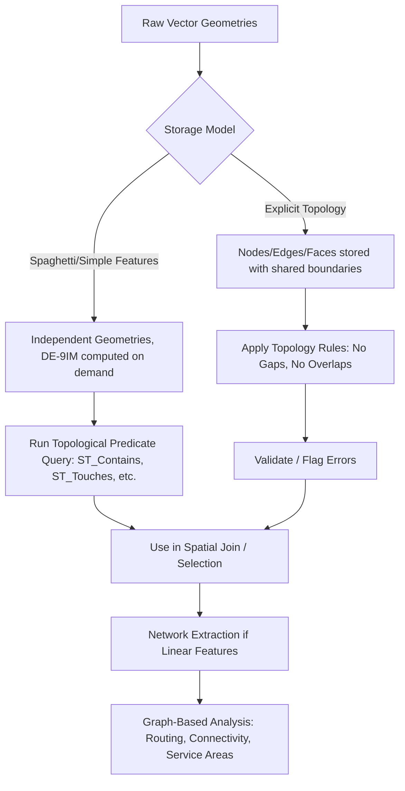

## Spatial Relationships and Topology


### Overview

Topology, in the geospatial context, is the mathematical study of spatial properties that are preserved under continuous deformation — stretching, rotating, or bending — but not under tearing or gluing. Unlike geometric properties (distance, area, shape), topological properties (connectivity, adjacency, containment) do not change if a map is distorted, making topology the foundation for spatial relationship queries, data integrity validation, and network analysis independent of exact coordinate precision.

**Key Points**

- Topology describes *qualitative* spatial relationships (connected, adjacent, contained) as opposed to *quantitative/metric* properties (distance, area).
- The **DE-9IM (Dimensionally Extended 9-Intersection Model)** is the formal mathematical basis for computing topological predicates in modern spatial software.
- Topological data structures enable both **data integrity enforcement** (no gaps/overlaps in parcel data) and **network analysis** (routing, connectivity).

---

### Geometric vs. Topological Properties

| Property Type | Examples | Preserved Under Deformation? |
| --- | --- | --- |
| Geometric (metric) | Distance, area, angle, shape | No — changes with stretching/scaling |
| Topological | Adjacency, containment, connectivity, order | Yes — invariant under continuous deformation |

A classic illustration: a subway map is topologically accurate (station order and line connectivity are preserved) but geometrically distorted (distances and directions are not to scale) — a deliberate design trade-off that prioritizes topological clarity over metric fidelity for the specific task of navigation.

---

### The Nine-Intersection Model and DE-9IM

#### Conceptual Basis

Any two-dimensional geometry can be decomposed into three parts:

- **Interior** ($I$)
- **Boundary** ($\partial$)
- **Exterior** ($E$)

The **9-Intersection Model (9IM)**, developed by Max Egenhofer (1990s), formalizes the topological relationship between two geometries $A$ and $B$ by examining the intersection pattern of all combinations of these three parts:

$$M(A,B) = \begin{pmatrix}
I(A) \cap I(B) & I(A) \cap \partial(B) & I(A) \cap E(B) \\
\partial(A) \cap I(B) & \partial(A) \cap \partial(B) & \partial(A) \cap E(B) \\
E(A) \cap I(B) & E(A) \cap \partial(B) & E(A) \cap E(B)
\end{pmatrix}$$

Each cell is evaluated as either empty (0) or non-empty (1) in the basic model.

#### DE-9IM Extension

The **Dimensionally Extended 9-Intersection Model (DE-9IM)**, adopted by the **OGC Simple Features Specification** and implemented in virtually all modern spatial libraries (JTS, GEOS, Shapely, PostGIS), extends this by recording the *dimension* of each intersection (−1 for empty, 0 for point, 1 for line, 2 for area) rather than a simple boolean, enabling much finer-grained relationship classification. The result is typically expressed as a compact 9-character string, e.g., `212101212`, which can be tested against a pattern matrix to determine named relationships.

---

### Standard Topological Predicates

The following predicates, defined via DE-9IM patterns, are the standard vocabulary implemented across spatial databases and libraries (PostGIS `ST_*` functions, Shapely methods, ArcGIS/QGIS spatial relationship tools):

| Predicate | Definition | Symmetric? |
| --- | --- | --- |
| **Equals** | Geometries occupy exactly the same space | Yes |
| **Disjoint** | No shared points at all (interiors, boundaries, or otherwise) | Yes |
| **Intersects** | Share at least one point (logical negation of Disjoint) | Yes |
| **Touches** | Share only boundary points; interiors do not intersect | Yes |
| **Crosses** | Geometries of different dimension intersect, sharing some but not all interior points | No |
| **Within** | $A$ lies entirely inside $B$ (interior of $A$ is subset of interior of $B$) | No (inverse of Contains) |
| **Contains** | $B$ lies entirely inside $A$ | No (inverse of Within) |
| **Overlaps** | Geometries of the same dimension partially overlap, neither containing the other | Yes |
| **Covers / Covered By** | Like Contains/Within but allows boundary touching | No |

**Note on symmetry**: `A.Contains(B)` is equivalent to `B.Within(A)` — these are inverse relationships, not independent predicates, a distinction important when reasoning about directional query construction in spatial SQL.

---

### Practical Example: DE-9IM in PostGIS

```sql
-- Test whether polygon A contains polygon B
SELECT ST_Contains(a.geom, b.geom)
FROM parcels a, buildings b
WHERE a.parcel_id = 101;

-- Retrieve the raw DE-9IM matrix string for inspection
SELECT ST_Relate(a.geom, b.geom)
FROM parcels a, buildings b
WHERE a.parcel_id = 101;
-- Example output: '212FF1FF2' (interpreted per the DE-9IM matrix)

-- Test a custom topological pattern directly
SELECT ST_Relate(a.geom, b.geom, '212FF1FF2')
FROM parcels a, buildings b;
```

`ST_Relate` exposes the underlying DE-9IM string directly, which is useful when a needed relationship does not correspond to one of the named convenience predicates (Contains, Touches, etc.) and must instead be tested via a custom intersection pattern.

---

### Topological Data Models vs. Spaghetti (Non-Topological) Data Models

#### Spaghetti Model

Early and simplified vector data models store each feature (point, line, polygon) as an independent geometric object with no explicit knowledge of shared boundaries with neighboring features. Two adjacent polygons sharing a boundary each store their own separate copy of that boundary's coordinates.

**Consequences of the spaghetti model:**

- Storage redundancy (shared boundaries duplicated).
- No inherent guarantee of geometric consistency — gaps or overlaps ("slivers") can occur between features that should share an exact boundary.
- No built-in support for adjacency or connectivity queries; these must be computed via geometric comparison at query time.

#### Topological Data Model

Explicitly stores the relationships between geometric primitives — typically decomposing geography into **nodes** (0-dimensional), **edges/arcs** (1-dimensional), and **faces/polygons** (2-dimensional), with each higher-dimensional object referencing the lower-dimensional objects that bound it.

**Advantages:**

- Shared boundaries are stored once and referenced by all adjacent features, guaranteeing consistency (no gaps/slivers by construction).
- Adjacency and connectivity are directly queryable from the stored structure rather than requiring geometric recomputation.
- Enables efficient network analysis (which edges connect at a given node).

**Historical implementations**: ESRI's coverage format (pre-geodatabase ARC/INFO) and the ArcGIS **Geodatabase Topology** rules system implement explicit topological data models; the OGC Simple Features standard used by PostGIS/Shapely is technically a spaghetti-style geometry model at the storage level, but topological *predicates* are computed on demand via DE-9IM rather than stored explicitly.

[Inference] This distinction — stored topology vs. computed-on-demand topology — is a common point of confusion, since modern spatial databases fully support topological *queries* (Touches, Contains) without maintaining an explicit topological *data structure* internally; explicit topology (nodes/edges/faces with integrity rules) is typically layered on top only when strict data-integrity enforcement (e.g., parcel fabric management) is required.

---

### Planar Enforcement and Topology Rules

Geodatabase-style topology systems (e.g., Esri Geodatabase Topology, PostGIS `topology` extension) allow explicit **topology rules** to enforce data integrity during editing:

| Rule | Meaning | Typical Use Case |
| --- | --- | --- |
| Must Not Overlap | Features of a layer cannot spatially overlap | Land parcels, administrative zones |
| Must Not Have Gaps | Polygons must fully tile the study area with no gaps | Soil maps, land cover classification |
| Must Not Self-Overlap | A single feature's boundary cannot intersect itself | Any polygon layer |
| Must Be Covered By | Features must lie within another layer's features | Buildings must be within parcels |
| Endpoint Must Be Covered By | Line endpoints must coincide with point features | Road network nodes, utility network junctions |

These rules are validated during a topology-build/validation step and flag violations for correction — a critical quality-control mechanism in authoritative datasets such as cadastral (property parcel) systems.

---

### Network Topology

A specialized application of topological principles to linear features (roads, rivers, utility lines, pipelines), modeled as a **graph**: a set of **nodes** (junctions, intersections) connected by **edges** (segments).

#### Graph-Theoretic Representation

$$G = (V, E)$$

where $V$ is the set of nodes and $E$ is the set of edges connecting them, often with associated weights $w(e)$ representing cost, distance, or travel time.

**Key network topology concepts:**

- **Connectivity**: whether a path exists between two nodes.
- **Degree**: the number of edges incident to a node (e.g., a 4-way intersection has degree 4).
- **Planarity**: whether the network can be drawn without edge crossings (most road networks are near-planar except for grade-separated interchanges/overpasses, which are a common source of topological modeling error if not handled explicitly with z-level or "not connected here" attributes).

This graph structure is the foundation for **network analysis** operations: shortest-path routing (Dijkstra's algorithm, A*), service-area/isochrone delineation, and connectivity/flow analysis — all of which depend on correct topological connectivity rather than on precise coordinate geometry.

---

### Diagram: DE-9IM Predicate Relationships (svg_diagram)

<svg xmlns="http://www.w3.org/2000/svg" viewBox="0 0 800 480" font-family="Helvetica, Arial, sans-serif">
<text x="400" y="28" font-size="17" font-weight="bold" text-anchor="middle">Common Topological Predicates (svg_diagram)</text>

<g>
<circle cx="100" cy="90" r="30" fill="#dbeafe" stroke="#1e3a8a" stroke-width="2" />
<circle cx="170" cy="90" r="30" fill="#fecaca" stroke="#991b1b" stroke-width="2" />
<text x="135" y="150" font-size="12" text-anchor="middle">Disjoint</text>
</g>

<g>
<circle cx="330" cy="90" r="30" fill="#dbeafe" stroke="#1e3a8a" stroke-width="2" />
<circle cx="390" cy="90" r="30" fill="#fecaca" stroke="#991b1b" stroke-width="2" />
<text x="360" y="150" font-size="12" text-anchor="middle">Touches</text>
</g>

<g>
<circle cx="560" cy="90" r="30" fill="#dbeafe" fill-opacity="0.6" stroke="#1e3a8a" stroke-width="2" />
<circle cx="600" cy="90" r="30" fill="#fecaca" fill-opacity="0.6" stroke="#991b1b" stroke-width="2" />
<text x="580" y="150" font-size="12" text-anchor="middle">Overlaps</text>
</g>

<g>
<circle cx="720" cy="90" r="38" fill="#dbeafe" stroke="#1e3a8a" stroke-width="2" />
<circle cx="720" cy="90" r="16" fill="#fecaca" stroke="#991b1b" stroke-width="2" />
<text x="720" y="150" font-size="12" text-anchor="middle">Within / Contains</text>
</g>

<g>
<rect x="80" y="230" width="120" height="70" fill="#dbeafe" stroke="#1e3a8a" stroke-width="2" />
<line x1="60" y1="240" x2="220" y2="290" stroke="#991b1b" stroke-width="3" />
<text x="140" y="330" font-size="12" text-anchor="middle">Crosses</text>
</g>

<g>
<rect x="300" y="230" width="120" height="70" fill="#dbeafe" stroke="#1e3a8a" stroke-width="3" />
<rect x="300" y="230" width="120" height="70" fill="none" stroke="#991b1b" stroke-width="1.5" stroke-dasharray="6,4" />
<text x="360" y="330" font-size="12" text-anchor="middle">Equals</text>
</g>

<g>
<rect x="500" y="230" width="130" height="70" fill="#dbeafe" stroke="#1e3a8a" stroke-width="2" />
<rect x="500" y="230" width="65" height="70" fill="#fecaca" stroke="#991b1b" stroke-width="2" />
<text x="565" y="330" font-size="12" text-anchor="middle">Covers (shares boundary)</text>
</g>

<text x="400" y="400" font-size="11" fill="`#475569`" text-anchor="middle">Blue = Geometry A, Red = Geometry B — relationships defined by Interior/Boundary/Exterior intersection patterns</text>

<text x="400" y="425" font-size="11" fill="`#475569`" text-anchor="middle">Formalized via the DE-9IM 3x3 intersection matrix per the OGC Simple Features standard</text>

</svg>

---

### Network Graph Illustration (svg_diagram)

<svg xmlns="http://www.w3.org/2000/svg" viewBox="0 0 700 320" font-family="Helvetica, Arial, sans-serif">
<text x="350" y="28" font-size="16" font-weight="bold" text-anchor="middle">Network Topology as a Graph (svg_diagram)</text>
<line x1="100" y1="150" x2="250" y2="80" stroke="#334155" stroke-width="2" />
<line x1="100" y1="150" x2="250" y2="220" stroke="#334155" stroke-width="2" />
<line x1="250" y1="80" x2="420" y2="150" stroke="#334155" stroke-width="2" />
<line x1="250" y1="220" x2="420" y2="150" stroke="#334155" stroke-width="2" />
<line x1="420" y1="150" x2="580" y2="150" stroke="#334155" stroke-width="2" />
<line x1="250" y1="80" x2="250" y2="220" stroke="#334155" stroke-width="2" stroke-dasharray="5,4" />
<circle cx="100" cy="150" r="12" fill="#3b82f6" stroke="#1e3a8a" stroke-width="2" />
<text x="100" y="180" font-size="11" text-anchor="middle">Node A</text>
<circle cx="250" cy="80" r="12" fill="#3b82f6" stroke="#1e3a8a" stroke-width="2" />
<text x="250" y="60" font-size="11" text-anchor="middle">Node B</text>
<circle cx="250" cy="220" r="12" fill="#3b82f6" stroke="#1e3a8a" stroke-width="2" />
<text x="250" y="250" font-size="11" text-anchor="middle">Node C</text>
<circle cx="420" cy="150" r="12" fill="#f59e0b" stroke="#92400e" stroke-width="2" />
<text x="420" y="180" font-size="11" text-anchor="middle">Node D (deg. 3)</text>
<circle cx="580" cy="150" r="12" fill="#3b82f6" stroke="#1e3a8a" stroke-width="2" />
<text x="580" y="180" font-size="11" text-anchor="middle">Node E</text>

<text x="350" y="290" font-size="11" fill="`#475569`" text-anchor="middle">Edges = road segments (weighted by length/travel time); Nodes = intersections/junctions</text>

</svg>

---

### Reasoning Workflow: From Geometry to Topological Query



---

### Common Pitfalls

- **Confusing topological with metric relationships**: "Touches" is a topological predicate independent of distance; two features can be metrically very close (a few centimeters apart) yet still be classified as `Disjoint`, not `Touches`, if they do not share an exact boundary point.
- **Ignoring floating-point precision in topology validation**: due to finite floating-point precision, geometries intended to share an exact boundary may be computed as having a tiny gap or overlap, producing spurious `Disjoint` or `Overlaps` results — a well-documented practical issue requiring snapping/tolerance handling in real-world data pipelines. [Inference] This is why most spatial database and topology-validation systems expose configurable tolerance/snapping parameters rather than relying purely on exact floating-point comparison.
- **Treating overpasses/underpasses as connected**: without explicit z-level or grade-separation attributes, a naive planar network topology will incorrectly treat a highway overpass as intersecting (and therefore connected to) the road beneath it.
- **Assuming Simple Features geometry storage implies no topology support**: modern spatial databases fully support topological querying via DE-9IM even without maintaining an explicit topological data structure.

---

**Related Topics**

- OGC Simple Features Specification and Spatial SQL
- Vector Data Models: Coverage, Shapefile, Geodatabase, and Topology Rules
- Network Analysis: Shortest Path, Service Areas, and Accessibility
- Geodatabase Topology Rules and Data Quality Assurance
- Graph Theory Foundations for Spatial Networks
- Coordinate Precision, Snapping, and Floating-Point Tolerance Issues
- PostGIS and GEOS: Implementation of Topological Predicates