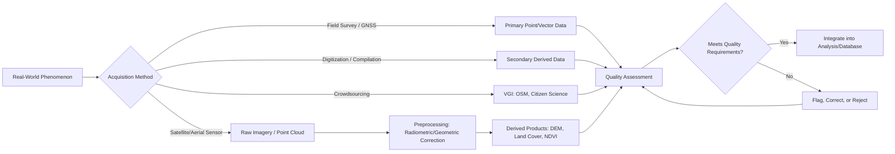

## Types and Sources of Geospatial Data

### Overview

Geospatial data is distinguished from generic data by the presence of an explicit or implicit locational component tying each observation to a position on or near the Earth's surface. Understanding the taxonomy of geospatial data types (by structure, by source, and by temporal characteristics) is essential before any acquisition, storage, or analysis decision, since each type carries distinct assumptions, file formats, and appropriate analytical methods.

**Key Points**

- Geospatial data is classified along three largely independent axes: **data model** (vector/raster/other), **acquisition source** (primary/secondary), and **temporal character** (static/dynamic).
- No single data type is universally superior — the appropriate type depends on the phenomenon being represented (discrete objects vs. continuous fields) and the analytical task.
- Metadata (lineage, accuracy, currency) is as critical to data usability as the geometric/attribute content itself.

---

### Classification by Data Model

#### Vector Data

Represents discrete geographic features using geometric primitives with explicit coordinates:

| Geometry Type | Represents | Example |
| --- | --- | --- |
| Point | Zero-dimensional location | Well location, city center, sensor station |
| Line (Polyline) | One-dimensional linear feature | Road, river, pipeline |
| Polygon | Two-dimensional bounded area | Country boundary, lake, land parcel |

Vector data stores attribute information in an associated table, linked to each geometry by a unique identifier — the geometry-attribute separation pattern historically established by ARC/INFO (see prior topic on history).

**Common vector formats:**

- **Shapefile (.shp + .shx + .dbf)**: legacy but still widely used; limited by field-name length (10 characters), 2 GB file size cap, and lack of native null/Unicode support in older implementations.
- **GeoJSON**: text-based, human-readable, widely used in web mapping and APIs; less efficient for very large datasets due to verbosity.
- **GeoPackage (.gpkg)**: SQLite-based, OGC standard, supports vector and raster in a single file, increasingly recommended as a modern shapefile replacement.
- **File Geodatabase (.gdb)**: Esri proprietary format supporting topology rules, domains, and relationship classes.

#### Raster Data

Represents continuous or discretized surfaces as a regular grid of cells (pixels), each holding a value:

- **Continuous rasters**: elevation, temperature, NDVI (Normalized Difference Vegetation Index) — values vary smoothly across space.
- **Discrete/categorical rasters**: land cover classification, soil type — each cell holds a class label.

**Key raster properties:**

- **Resolution (cell size)**: the ground dimension represented by one pixel (e.g., 30 m × 30 m for Landsat).
- **Extent**: the bounding coordinates of the raster grid.
- **Number of bands**: single-band (e.g., elevation) vs. multi-band (e.g., multispectral satellite imagery with red, green, blue, near-infrared bands).
- **Data type**: integer (classified data) vs. floating-point (continuous measurements).

**Common raster formats:**

- **GeoTIFF (.tif)**: the de facto standard, embedding georeferencing metadata directly in the TIFF file.
- **Cloud-Optimized GeoTIFF (COG)**: a GeoTIFF variant internally organized (tiled, with overviews) to support efficient partial HTTP range-request access without downloading the full file — foundational to modern cloud-native geospatial workflows.
- **NetCDF / HDF5**: multidimensional array formats (space + time + additional dimensions) common in climate, oceanographic, and atmospheric science.
- **Zarr**: a newer cloud-native, chunked array format gaining adoption for large-scale, parallelized access to multidimensional geospatial arrays.

#### Other Data Models

- **TIN (Triangulated Irregular Network)**: represents continuous surfaces (typically elevation) as a mesh of non-overlapping triangles with vertices at irregularly spaced sample points, offering variable resolution (dense triangles in high-relief areas, sparse in flat areas) as an alternative to uniform-grid rasters.
- **Point Clouds**: unstructured sets of 3D points, each often carrying additional attributes (intensity, classification, RGB), produced primarily by LiDAR and photogrammetric processing; typically stored in **LAS/LAZ** format (LAZ being a compressed variant).
- **Graphs/Networks**: nodes and edges representing connectivity (road networks, utility networks) — see prior topic on topology.

---

### Classification by Acquisition Source

#### Primary Data (Direct Observation/Measurement)

| Source | Method | Typical Output |
| --- | --- | --- |
| **Field GPS/GNSS survey** | Direct positional measurement using satellite signals | Point coordinates, tracks |
| **Total station / traditional survey** | Ground-based angle/distance measurement | High-precision point coordinates |
| **Satellite remote sensing** | Passive (reflected sunlight) or active (radar, lidar) sensors on orbiting platforms | Multispectral/SAR imagery |
| **Aerial photography / drone (UAV) imagery** | Airborne camera or sensor platforms | High-resolution orthophotos, photogrammetric point clouds |
| **LiDAR (Light Detection and Ranging)** | Active laser ranging from airborne, terrestrial, or satellite platforms | Dense 3D point clouds, derived DEMs/DSMs |
| **In-situ sensors** | Fixed or mobile ground sensors (weather stations, water gauges, IoT sensors) | Time-series point measurements |

#### Secondary Data (Derived or Compiled)

- **Digitization of paper maps**: converting scanned historical maps into vector data through manual or semi-automated tracing.
- **Census and administrative records**: geocoded socioeconomic, demographic, or administrative boundary data.
- **Derived products**: elevation-derived slope/aspect, classified land cover from raw imagery, interpolated surfaces from point samples — all secondary in that they are computed from other primary data rather than directly observed.

#### Crowdsourced / Volunteered Geographic Information (VGI)

- **OpenStreetMap (OSM)**: collaboratively edited vector data covering roads, buildings, land use, and points of interest globally, under the Open Database License (ODbL).
- **Citizen science platforms**: e.g., eBird (species observation points), iNaturalist (biodiversity observations) — valuable for spatial and temporal density but requiring careful data-quality assessment given variable contributor expertise and uneven spatial sampling effort.
- [Inference] VGI data quality varies substantially by region and feature type — well-documented in the GIScience literature as being generally higher in urban, high-population-density areas due to greater contributor density, and comparatively sparser in rural or economically underserved regions.

---

### Major Institutional and Open Data Sources

| Source | Provider | Data Type | Notes |
| --- | --- | --- | --- |
| **Landsat Program** | USGS/NASA | Multispectral satellite imagery, 30 m, since 1972 | Longest continuous Earth observation record; free and open |
| **Copernicus / Sentinel** | European Space Agency (ESA) | Multispectral (Sentinel-2), SAR (Sentinel-1), atmospheric (Sentinel-5P) | Free and open; 10 m resolution for Sentinel-2 |
| **SRTM (Shuttle Radar Topography Mission)** | NASA/NGA | Near-global digital elevation model, ~30 m | Widely used baseline DEM |
| **MODIS** | NASA | Daily global multispectral, 250 m–1 km | Long time series, coarser resolution, strong for large-scale/temporal monitoring |
| **OpenStreetMap** | OSM Foundation/community | Vector: roads, buildings, POIs, land use | Crowdsourced, globally variable completeness |
| **Natural Earth** | Volunteer cartographers | Small-scale vector basemap data (countries, coastlines) | Public domain, designed for cartographic use at global/regional scale |
| **National mapping agencies** | e.g., USGS, national Ordnance Surveys | Topographic, cadastral, hydrographic data | Authoritative, but licensing and openness vary by country |
| **GBIF (Global Biodiversity Information Facility)** | International consortium | Species occurrence records | Aggregates museum, survey, and citizen-science biodiversity data |

---

### Classification by Temporal Character

- **Static data**: assumed fixed over the analysis timeframe (administrative boundaries, geology).
- **Time-series/dynamic data**: repeated observations at the same locations over time (weather station records, satellite image time series) — foundational to change detection and trend analysis.
- **Event data**: data tied to discrete occurrences with a specific time and place (earthquake catalogs, crime incident reports, disease case reports).
- **Trajectory data**: sequences of time-stamped locations tracing movement (GPS tracks of vehicles, animal movement telemetry) — a specialized data type requiring dedicated trajectory analysis methods (stop/move segmentation, speed/heading derivation).

---

### Data Quality Dimensions

Regardless of type or source, geospatial data should be evaluated along standard quality dimensions, often formalized in ISO 19157 (Geographic Information — Data Quality):

| Dimension | Description |
| --- | --- |
| **Positional accuracy** | How closely recorded coordinates match true ground location |
| **Attribute accuracy** | Correctness of non-spatial attribute values |
| **Completeness** | Presence of all expected features/records (errors of omission/commission) |
| **Logical consistency** | Adherence to topological rules, valid attribute domains, format specifications |
| **Temporal accuracy** | Correctness and currency of time-related information |
| **Lineage** | Documented history of data sources and processing steps applied |

[Inference] Because VGI and citizen-science sources typically lack the rigorous, standardized quality-control pipelines of authoritative government sources, they generally require explicit quality assessment (completeness checks, cross-validation against reference data) before use in analyses where positional or attribute accuracy is critical.

---

### Diagram: Geospatial Data Taxonomy (svg_diagram)

<svg xmlns="http://www.w3.org/2000/svg" viewBox="0 0 820 460" font-family="Helvetica, Arial, sans-serif">
<text x="410" y="28" font-size="17" font-weight="bold" text-anchor="middle">Types and Sources of Geospatial Data (svg_diagram)</text>
<rect x="320" y="50" width="180" height="40" rx="6" fill="#fef3c7" stroke="#92400e" stroke-width="1.5" />
<text x="410" y="75" font-size="12" text-anchor="middle">Geospatial Data</text>
<line x1="410" y1="90" x2="140" y2="140" stroke="#334155" stroke-width="1.3" />
<line x1="410" y1="90" x2="410" y2="140" stroke="#334155" stroke-width="1.3" />
<line x1="410" y1="90" x2="680" y2="140" stroke="#334155" stroke-width="1.3" />
<rect x="40" y="140" width="200" height="36" rx="5" fill="#dbeafe" stroke="#1e3a8a" />
<text x="140" y="163" font-size="11" text-anchor="middle">By Data Model</text>
<rect x="310" y="140" width="200" height="36" rx="5" fill="#dbeafe" stroke="#1e3a8a" />
<text x="410" y="163" font-size="11" text-anchor="middle">By Source</text>
<rect x="580" y="140" width="200" height="36" rx="5" fill="#dbeafe" stroke="#1e3a8a" />
<text x="680" y="163" font-size="11" text-anchor="middle">By Temporal Character</text>

<rect x="20" y="200" width="90" height="34" rx="4" fill="#dcfce7" stroke="#166534" />
<text x="65" y="221" font-size="10" text-anchor="middle">Vector</text>
<rect x="120" y="200" width="90" height="34" rx="4" fill="#dcfce7" stroke="#166534" />
<text x="165" y="221" font-size="10" text-anchor="middle">Raster</text>
<rect x="220" y="200" width="90" height="34" rx="4" fill="#dcfce7" stroke="#166534" />
<text x="265" y="221" font-size="10" text-anchor="middle">TIN / Point Cloud</text>
<line x1="140" y1="176" x2="65" y2="200" stroke="#334155" stroke-width="1" />
<line x1="140" y1="176" x2="165" y2="200" stroke="#334155" stroke-width="1" />
<line x1="140" y1="176" x2="265" y2="200" stroke="#334155" stroke-width="1" />

<rect x="300" y="200" width="90" height="34" rx="4" fill="#dcfce7" stroke="#166534" />
<text x="345" y="221" font-size="10" text-anchor="middle">Primary</text>
<rect x="400" y="200" width="90" height="34" rx="4" fill="#dcfce7" stroke="#166534" />
<text x="445" y="221" font-size="10" text-anchor="middle">Secondary</text>
<rect x="500" y="200" width="90" height="34" rx="4" fill="#dcfce7" stroke="#166534" />
<text x="545" y="221" font-size="10" text-anchor="middle">VGI/Crowdsourced</text>
<line x1="410" y1="176" x2="345" y2="200" stroke="#334155" stroke-width="1" />
<line x1="410" y1="176" x2="445" y2="200" stroke="#334155" stroke-width="1" />
<line x1="410" y1="176" x2="545" y2="200" stroke="#334155" stroke-width="1" />

<rect x="580" y="200" width="80" height="34" rx="4" fill="#dcfce7" stroke="#166534" />
<text x="620" y="221" font-size="10" text-anchor="middle">Static</text>
<rect x="670" y="200" width="90" height="34" rx="4" fill="#dcfce7" stroke="#166534" />
<text x="715" y="221" font-size="10" text-anchor="middle">Time-Series</text>
<rect x="770" y="200" width="40" height="34" rx="4" fill="#dcfce7" stroke="#166534" opacity="0" />
<line x1="680" y1="176" x2="620" y2="200" stroke="#334155" stroke-width="1" />
<line x1="680" y1="176" x2="715" y2="200" stroke="#334155" stroke-width="1" />
<rect x="150" y="280" width="520" height="120" rx="8" fill="#fee2e2" stroke="#991b1b" stroke-width="1.5" />
<text x="410" y="305" font-size="12" font-weight="bold" text-anchor="middle">Cross-Cutting: Data Quality Dimensions</text>
<text x="410" y="328" font-size="10.5" text-anchor="middle">Positional Accuracy · Attribute Accuracy · Completeness</text>
<text x="410" y="348" font-size="10.5" text-anchor="middle">Logical Consistency · Temporal Accuracy · Lineage</text>
<text x="410" y="375" font-size="10" fill="#7f1d1d" text-anchor="middle">Applies regardless of data model, source, or temporal type</text>
<line x1="140" y1="234" x2="300" y2="280" stroke="#7f1d1d" stroke-width="1" stroke-dasharray="4,3" />
<line x1="410" y1="234" x2="410" y2="280" stroke="#7f1d1d" stroke-width="1" stroke-dasharray="4,3" />
<line x1="680" y1="234" x2="520" y2="280" stroke="#7f1d1d" stroke-width="1" stroke-dasharray="4,3" />
</svg>

---

### Data Acquisition and Processing Pipeline

---

### Practical Selection Guidance

- **Discrete, bounded, identity-bearing features** (buildings, parcels, roads) → vector data.
- **Continuous phenomena varying smoothly across space** (temperature, elevation, vegetation index) → raster data.
- **3D structural detail or surface modeling** (canopy structure, terrain micro-relief, building footprints in 3D) → point cloud or TIN.
- **Global, repeat, standardized coverage at moderate resolution** → satellite programs (Landsat, Sentinel) preferred over commercial VHR for cost/scale reasons.
- **Fine-grained local detail, on-demand timing** → UAV/drone imagery preferred over satellite when legal/regulatory conditions permit.
- **Rapidly evolving, community-attribute-rich features** (POIs, local road network changes) → OSM/VGI, with quality caveats, often outperforms static authoritative sources on currency.

---

**Related Topics**

- Vector Data Models: Shapefile, GeoPackage, and Topology
- Raster Data Fundamentals: Resolution, Bands, and Cloud-Optimized Formats
- Remote Sensing Platforms and Sensor Characteristics
- LiDAR and Point Cloud Processing
- Data Quality Assessment and ISO 19157
- Volunteered Geographic Information and Crowdsourced Data Quality
- Metadata Standards for Geospatial Data (ISO 19115, FGDC)
- Geocoding and Address-to-Coordinate Conversion