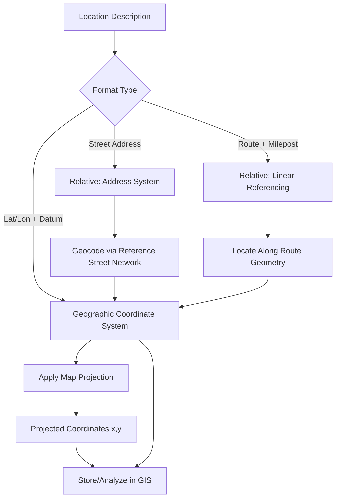

## Absolute and Relative Location Systems


### Overview

Every geospatial observation must be tied to a location, but "location" can be expressed in fundamentally different ways. **Absolute location systems** fix a position using an independent, universally referenced coordinate framework, while **relative location systems** define position with reference to other known features or objects. This distinction is not merely notational — it governs how transferable, comparable, and computationally tractable location information is across datasets, disciplines, and time.

**Key Points**

- Absolute location is expressed via a fixed, external coordinate reference frame (geographic or projected coordinates); relative location is expressed via reference to other entities (distance/direction from a landmark, address relative to a street).
- Absolute systems enable cross-dataset interoperability and precise computation; relative systems often align better with human cognition and natural language description.
- Most real-world geospatial workflows convert between the two (e.g., geocoding transforms a relative address into absolute coordinates).

---

### Absolute Location Systems

#### Geographic Coordinate System (GCS)

The most fundamental absolute system, locating any point on Earth's surface using two angular measurements relative to reference planes:

- **Latitude ($\phi$)**: angular distance north or south of the equator, ranging from $-90°$ (South Pole) to $+90°$ (North Pole).
- **Longitude ($\lambda$)**: angular distance east or west of the Prime Meridian (passing through Greenwich, UK, by international convention since 1884), ranging from $-180°$ to $+180°$.

A location is thus expressed as an ordered pair $(\phi, \lambda)$, e.g., $(40.7128°\text{N}, -74.0060°\text{W})$ for New York City.

**Critical property**: geographic coordinates are angular, not linear — the ground distance represented by one degree of longitude shrinks toward the poles (proportional to $\cos\phi$), while one degree of latitude remains nearly constant (~111 km). This is why Euclidean distance formulas cannot be applied directly to raw latitude/longitude pairs without accounting for this convergence, and why the haversine or Vincenty formulas (using spherical/ellipsoidal trigonometry) are used instead for geodesic distance.

#### Geodetic Datums

A geographic coordinate is only meaningful relative to a specified **datum** — a mathematical model (reference ellipsoid plus origin/orientation) approximating Earth's shape and defining the surface from which latitude/longitude/elevation are measured.

- **WGS84 (World Geodetic System 1984)**: the global standard datum underlying GPS and most modern web mapping (Google Maps, OSM).
- **NAD83 (North American Datum 1983)**: regional datum used in North American surveying and many US state/local systems.
- **Local/historical datums**: e.g., NAD27, ED50 — legacy regional datums still encountered in older data, differing from WGS84 by tens to hundreds of meters at a given location if not properly transformed.

[Inference] Failing to account for datum differences is a common and consequential error in geospatial workflows — combining data referenced to different datums without transformation produces silent positional offsets that can range from negligible to hundreds of meters depending on the datum pair and location, without any error being raised by the software.

#### Projected Coordinate Systems (PCS)

Because geographic (angular) coordinates are inconvenient for distance/area calculations and cannot be directly plotted on a flat plane without distortion, **map projections** transform the curved Earth's surface (or a datum's reference ellipsoid) onto a flat plane, yielding linear $(x, y)$ coordinates typically in meters or feet.

- **UTM (Universal Transverse Mercator)**: divides the world into 60 north-south zones, each 6° of longitude wide, using a transverse Mercator projection within each zone to minimize distortion — a widely used absolute system for regional/national-scale metric analysis.
- **State Plane Coordinate System (US)**: zone-based projected systems designed for high accuracy within individual US states.
- **Web Mercator (EPSG:3857)**: the projection used by virtually all web map tiles (Google Maps, OSM, Mapbox) for computational and tiling convenience, despite significant area distortion at high latitudes — a deliberate trade-off of geometric accuracy for rendering performance and simplicity. [Unverified as literally "the standard" in all contexts] — Web Mercator dominates web *display*, but many rigorous spatial analyses still use locally appropriate equal-area or conformal projections rather than Web Mercator.

Every projected coordinate system inevitably distorts at least one of: shape (conformality), area (equivalence), distance (equidistance), or direction — no flat projection can preserve all four simultaneously, a mathematical consequence of Gauss's Theorema Egregium regarding the non-developability of curved surfaces onto a plane.

#### Global Navigation Satellite Systems (GNSS)

Absolute positioning obtained through satellite ranging:

- **GPS (United States)**, **GLONASS (Russia)**, **Galileo (European Union)**, **BeiDou (China)** — constellations of satellites broadcasting timed signals; a receiver computes its absolute position via **trilateration** using signal travel time from at least four satellites (three for spatial position, one to resolve receiver clock error).

$$d_i = c \cdot (t_{received} - t_{transmitted,i})$$

where $d_i$ is the computed distance to satellite $i$ and $c$ is the speed of light. The receiver's position is the point that simultaneously satisfies the distance equations from all visible satellites.

#### Other Absolute Reference Systems

- **Military Grid Reference System (MGRS)**: an alphanumeric grid-based absolute location system built on UTM, widely used in military and emergency response contexts.
- **What3Words**: a proprietary system dividing the world into 3m×3m grid cells, each assigned a unique three-word combination — an absolute system designed for human memorability rather than mathematical convenience. [Unverified regarding interoperability] — as a proprietary, non-open algorithm, cross-verification and open interoperability with standard GIS coordinate transformation pipelines is more limited than with open standards like UTM or MGRS.

---

### Relative Location Systems

#### Descriptive/Vernacular Relative Location

Location expressed via qualitative reference to other known features:

- "Two blocks north of the train station"
- "Between the pharmacy and the bank"
- "Upstream from the dam"

This form aligns closely with human spatial cognition (see prior topic on egocentric/allocentric reasoning) but is not directly computable without translation into a formal system.

#### Address-Based Systems

Postal/civic addresses represent a structured but still fundamentally relative system, since they locate a point via a hierarchy of relative containment (country → region → street → number) rather than direct coordinates. **Geocoding** is the process of converting an address (relative system) into geographic coordinates (absolute system), typically using a reference street network with interpolated address ranges.

$$\text{position along segment} = \frac{\text{address number} - \text{range start}}{\text{range end} - \text{range start}}$$

This linear interpolation approach means geocoded positions are estimates, not surveyed points, with accuracy depending on the completeness and currency of the underlying reference address range data.

#### Linear Referencing Systems (LRS)

A specialized relative system common in transportation and utility management, locating a feature by a **distance measure along a linear route** rather than by $(x,y)$ coordinates — e.g., "Milepost 42.3 on Highway 101," or "150 meters downstream from Manhole 12 along Pipe Segment 7."

**Key LRS components:**

- A defined **route** (the reference linear feature).
- A **measure** (distance from a defined route origin, e.g., mile markers, kilometer posts).
- **Events**: point or linear features located by route + measure rather than direct coordinates (e.g., a pothole at Route 5, Mile 12.4; a pavement condition segment from Mile 10 to Mile 15).

LRS is the standard model in transportation asset management (pavement condition, traffic incidents) and pipeline/utility management, because assets are naturally referenced along the linear infrastructure rather than by independent absolute coordinates.

#### Network-Relative and Topological Location

Location expressed purely by position within a network graph — "three intersections downstream," "the second exit past the bridge" — a topological rather than metric relative system (connecting back to the topology concepts in the prior chapter item).

#### Relative Location via Nearest-Feature Reference

GIS operations such as `ST_ClosestPoint` or nearest-neighbor joins effectively compute a relative locational description (nearest hospital, nearest fault line) from underlying absolute coordinate data — illustrating that relative descriptions can be derived computationally from an absolute base, not only supplied a priori.

---

### Converting Between Absolute and Relative Systems

| Conversion | Process | Example Tool/Method |
| --- | --- | --- |
| Address → Coordinates | Geocoding | Reference street network + interpolation, or point-based address databases |
| Coordinates → Address | Reverse geocoding | Nearest-address lookup against a reference dataset |
| Route + Measure → Coordinates | LRS "event to point/line" transformation | Route measure interpolation along the reference route geometry |
| Coordinates → Route + Measure | LRS "point/line to event" transformation (map matching) | Nearest-point-on-route calculation, often combined with route topology snapping |
| Datum A → Datum B (absolute → absolute) | Datum transformation | Helmert transformation, grid-shift files (e.g., NADCON, NTv2) |
| Geographic → Projected (absolute → absolute) | Map projection | PROJ library, EPSG-coded transformation pipelines |

---

### Practical Example: Geocoding and Linear Referencing in Practice

```sql
-- PostGIS: Reverse geocode a coordinate to nearest address (conceptual pattern)
SELECT address, ST_Distance(geom, ST_SetSRID(ST_MakePoint(-74.0060, 40.7128), 4326)) AS dist
FROM address_points
ORDER BY dist ASC
LIMIT 1;

-- PostGIS with LRS extension: locate a point at a given route measure
SELECT ST_LocateAlong(route_geom, 42.3) AS located_point
FROM highway_routes
WHERE route_id = '101';
```

`ST_LocateAlong` exemplifies the relative-to-absolute conversion central to linear referencing: given a route geometry and a relative measure (distance along the route), it returns the corresponding absolute point coordinate.

---

### Diagram: Absolute vs. Relative Location Systems (svg_diagram)

<svg xmlns="http://www.w3.org/2000/svg" viewBox="0 0 820 440" font-family="Helvetica, Arial, sans-serif">
<text x="410" y="28" font-size="17" font-weight="bold" text-anchor="middle">Absolute and Relative Location Systems (svg_diagram)</text>
<rect x="60" y="60" width="320" height="300" rx="8" fill="#eff6ff" stroke="#1e3a8a" stroke-width="1.5" />
<text x="220" y="85" font-size="13" font-weight="bold" text-anchor="middle">Absolute Systems</text>
<rect x="80" y="100" width="280" height="34" rx="5" fill="#dbeafe" stroke="#1e3a8a" />
<text x="220" y="121" font-size="11" text-anchor="middle">Geographic Coord. (Lat/Lon + Datum)</text>
<rect x="80" y="144" width="280" height="34" rx="5" fill="#dbeafe" stroke="#1e3a8a" />
<text x="220" y="165" font-size="11" text-anchor="middle">Projected Coord. (UTM, State Plane)</text>
<rect x="80" y="188" width="280" height="34" rx="5" fill="#dbeafe" stroke="#1e3a8a" />
<text x="220" y="209" font-size="11" text-anchor="middle">GNSS (GPS, GLONASS, Galileo)</text>
<rect x="80" y="232" width="280" height="34" rx="5" fill="#dbeafe" stroke="#1e3a8a" />
<text x="220" y="253" font-size="11" text-anchor="middle">MGRS / What3Words</text>
<text x="220" y="300" font-size="10.5" fill="#1e3a8a" text-anchor="middle">Fixed, external reference frame</text>
<text x="220" y="318" font-size="10.5" fill="#1e3a8a" text-anchor="middle">Precise, interoperable, computable</text>
<rect x="440" y="60" width="320" height="300" rx="8" fill="#fef2f2" stroke="#991b1b" stroke-width="1.5" />
<text x="600" y="85" font-size="13" font-weight="bold" text-anchor="middle">Relative Systems</text>
<rect x="460" y="100" width="280" height="34" rx="5" fill="#fee2e2" stroke="#991b1b" />
<text x="600" y="121" font-size="11" text-anchor="middle">Postal / Civic Address</text>
<rect x="460" y="144" width="280" height="34" rx="5" fill="#fee2e2" stroke="#991b1b" />
<text x="600" y="165" font-size="11" text-anchor="middle">Linear Referencing (Route + Measure)</text>
<rect x="460" y="188" width="280" height="34" rx="5" fill="#fee2e2" stroke="#991b1b" />
<text x="600" y="209" font-size="11" text-anchor="middle">Descriptive / Vernacular</text>
<rect x="460" y="232" width="280" height="34" rx="5" fill="#fee2e2" stroke="#991b1b" />
<text x="600" y="253" font-size="11" text-anchor="middle">Network-Relative / Topological</text>
<text x="600" y="300" font-size="10.5" fill="#991b1b" text-anchor="middle">Reference-dependent, human-aligned</text>
<text x="600" y="318" font-size="10.5" fill="#991b1b" text-anchor="middle">Requires translation for computation</text>
<line x1="380" y1="150" x2="440" y2="150" stroke="#334155" stroke-width="2" marker-end="url(#arrR)" />
<line x1="440" y1="200" x2="380" y2="200" stroke="#334155" stroke-width="2" marker-end="url(#arrL)" />
<text x="410" y="140" font-size="9.5" text-anchor="middle">Reverse Geocode</text>
<text x="410" y="222" font-size="9.5" text-anchor="middle">Geocode</text>
</svg>

---

### Conversion Workflow



---

### Common Pitfalls

- **Mixing datums without transformation**: combining WGS84 GPS data with a legacy NAD27 basemap without reprojection introduces a silent, uncorrected positional offset.
- **Applying planar (Euclidean) formulas to unprojected geographic coordinates**: computing "distance" directly from raw latitude/longitude differences without accounting for meridian convergence produces significant errors, especially at higher latitudes or over long distances.
- **Treating geocoded addresses as survey-grade**: interpolated address-range geocoding can introduce errors of tens of meters, which matters for parcel-level or safety-critical applications.
- **Ignoring LRS route versioning**: when the underlying route geometry (e.g., a highway alignment) is edited or recalibrated, previously stored route+measure "events" can become misaligned unless the LRS system explicitly manages event recalibration.

---

**Related Topics**

- Geodetic Datums and Datum Transformations (Helmert, NADCON, NTv2)
- Map Projections: Conformal, Equal-Area, and Equidistant Trade-offs
- UTM and MGRS Grid Systems in Detail
- Geocoding Algorithms and Address Interpolation Accuracy
- Linear Referencing Systems in Transportation and Utility GIS
- GNSS Positioning: Trilateration, Error Sources, and Differential Correction
- Coordinate Reference Systems (CRS) and the EPSG Registry