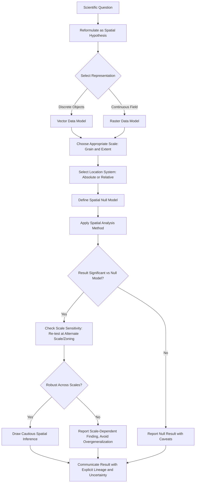

## Spatial Thinking in Scientific Problem Solving

### Overview

Spatial thinking, as applied to scientific problem solving, is the deliberate use of spatial concepts, representations, and reasoning to formulate hypotheses, structure investigations, and interpret evidence in domains where location, distribution, and spatial interaction are causally or descriptively relevant. This closes the foundational chapter by synthesizing the earlier concepts (spatial primitives, scale, topology, location systems) into a coherent methodological framework for how geospatial reasoning is actually deployed in scientific inquiry.

**Key Points**

- Spatial thinking transforms scientific questions from "what and how much" into "where, why there, and how does location matter."
- A formal scientific workflow — spatial hypothesis formulation, spatial data representation, spatial analysis, and spatial inference — parallels but extends the general scientific method.
- Spatial thinking is domain-general: the same structural approach applies across epidemiology, ecology, geology, urban planning, and climate science.

---

### Why Space Matters in Scientific Reasoning

Many scientific phenomena are not merely located in space but are causally structured by spatial relationships — proximity, connectivity, direction, and scale actively shape the processes under study rather than being incidental to them. Three foundational reasons space matters:

1. **Spatial dependence**: nearby observations tend to be more similar than distant ones (Tobler's First Law), meaning spatial position itself carries statistical information.
2. **Spatial heterogeneity**: relationships between variables can vary systematically across space (non-stationarity) — a relationship strong in one region may be weak or reversed elsewhere.
3. **Spatial interaction and flow**: many processes (disease spread, species migration, pollutant dispersion, economic exchange) are fundamentally about movement and interaction *between* locations, not static properties *at* locations.

Ignoring these three properties and treating spatial data as if observations were independent and identically distributed (the standard assumption of classical statistics) risks invalid inference — a central methodological caution running throughout this foundational chapter (MAUP, ecological fallacy, scale dependence).

---

### A Framework for Spatial Scientific Reasoning

#### Step 1: Spatial Hypothesis Formulation

Scientific questions are recast in explicitly spatial terms:

- Non-spatial: "Does pollutant X cause disease Y?"
- Spatial: "Do disease Y case locations cluster significantly near pollutant X emission sources, beyond what would be expected under spatial randomness?"

This reformulation forces explicit consideration of spatial scale, the appropriate null model (complete spatial randomness vs. a more realistic baseline), and the specific spatial relationship being tested (proximity, direction, network connectivity).

#### Step 2: Spatial Representation Choice

Selecting the data model (vector/raster/network), scale (grain/extent), and location system (absolute/relative) appropriate to the phenomenon and question — directly drawing on the taxonomy developed in the prior topics of this chapter. This step is not a neutral technical detail but an analytical decision that constrains which patterns can even be detected (recall the fragmentation example under Scale, where grain choice determined the visible pattern).

#### Step 3: Spatial Analysis

Applying formal spatial-statistical or spatial-computational methods appropriate to the representation and hypothesis, such as:

- Point pattern analysis (clustering/dispersion testing)
- Spatial autocorrelation measures (global and local)
- Spatial regression (accounting for non-independence of observations)
- Network/flow analysis (for interaction-based questions)
- Overlay and proximity analysis (for co-location and exposure questions)

#### Step 4: Spatial Inference and Validation

Drawing conclusions while explicitly accounting for the scale- and zone-dependence of results (MAUP), the risk of ecological/atomistic fallacies when crossing levels of analysis, and the limitations of the underlying data's positional/attribute accuracy — synthesizing the quality and reasoning caveats established throughout this chapter.

---

### Domain Applications

#### Epidemiology (Spatial Epidemiology)

The John Snow cholera map (introduced in the History topic) remains the canonical illustration: mapping case locations relative to a suspected source (the Broad Street pump) to test a spatial hypothesis about disease origin. Modern spatial epidemiology extends this with formal cluster-detection statistics (e.g., spatial scan statistics) and spatial regression controlling for confounding covariates measured at matched spatial scales.

#### Ecology and Biogeography

Species distribution modeling relates species occurrence (point/presence data) to environmental raster covariates (climate, elevation, land cover) to predict habitat suitability across a landscape — requiring careful attention to the scale-matching between occurrence data resolution and environmental covariate resolution (a direct application of the grain/extent concepts from the Scale topic).

#### Geology and Geomorphology

Structural and stratigraphic reasoning is inherently spatial: fault mapping, cross-section construction, and resource exploration modeling depend on 3D spatial relationships (containment, adjacency, cross-cutting relationships) that are topological in nature even when expressed through geometric map symbols.

#### Urban Planning and Transportation

Accessibility analysis, land-use suitability modeling, and transportation network optimization directly apply the linear referencing, network topology, and multi-criteria overlay concepts from earlier in this chapter to real decision-making contexts (site selection, service-area delineation).

#### Climate Science

Analysis of climate patterns spans extreme scale ranges (local microclimate to global circulation), making explicit scale selection and multi-scale analysis (from the Scale and Levels topic) a first-order methodological concern rather than an afterthought.

---

### Spatial Hypothesis Testing: The Role of Null Models

A distinguishing feature of spatially-aware scientific reasoning is the necessity of an explicit **spatial null model** — a baseline expectation against which observed patterns are compared, since naive statistical tests assume independence that spatial data typically violates.

**Common spatial null models:**

| Null Model | Assumption | Used For |
| --- | --- | --- |
| Complete Spatial Randomness (CSR) | Points are independently and uniformly distributed | Point pattern clustering tests |
| Spatial permutation/randomization | Attribute values are randomly reassigned to fixed locations | Testing observed spatial autocorrelation (e.g., Moran's I significance) |
| Conditional autoregressive (CAR) baseline | Expected value depends on neighboring values | Disease mapping, spatial smoothing |

**Example — testing spatial autocorrelation significance via permutation:**

For an observed Moran's I value $I_{obs}$, a common approach is to randomly permute attribute values across fixed locations many times (e.g., 999 permutations), computing $I$ for each permutation to build an empirical null distribution, then evaluating:

$$p = \frac{\text{number of permuted } I \geq I_{obs}}{\text{number of permutations} + 1}$$

This permutation-based approach avoids relying on potentially unmet parametric assumptions about the distribution of $I$ under spatial randomness.

---

### Worked Example: Spatial Reasoning Applied to a Disease Cluster Investigation

**Non-spatial framing**: "Is the disease rate in this town higher than the national average?"

**Spatial reframing**: "Are cases clustered near a specific location within the town, and is that clustering statistically distinguishable from what random chance would produce at this population density and areal scale?"

**Applying the four-step framework:**

1. **Hypothesis**: Case locations exhibit significant local clustering near Site X, beyond CSR expectation.
2. **Representation**: Point data for case residences (not aggregated to zip code, to avoid MAUP/ecological fallacy at this stage); raster or vector proximity buffer around Site X.
3. **Analysis**: Compute nearest-neighbor index and/or a spatial scan statistic (e.g., Kulldorff's scan statistic) to identify statistically significant spatial clusters; compare against population-at-risk denominator data at matching resolution.
4. **Inference**: Report cluster significance with explicit caveats — sensitivity to the chosen spatial scale/window size, the population denominator's own spatial accuracy, and the important caution that spatial clustering alone does not establish causation (a spatial association, per the earlier Spatial Concepts topic, requires additional evidence — temporal sequence, dose-response gradient, biological plausibility — before a causal claim is justified).

[Inference] This is why formal spatial cluster-detection methods (e.g., spatial scan statistics) are standard practice in public health surveillance rather than simple visual map inspection — visual clustering can be strongly influenced by population density variation and map symbology choices (a specific manifestation of the general cartographic/scale caution developed throughout this chapter).

---

### Diagram: Spatial Scientific Reasoning Cycle (svg_diagram)

<svg xmlns="http://www.w3.org/2000/svg" viewBox="0 0 700 480" font-family="Helvetica, Arial, sans-serif">
<text x="350" y="28" font-size="16" font-weight="bold" text-anchor="middle">Spatial Scientific Reasoning Cycle (svg_diagram)</text>
<circle cx="350" cy="250" r="160" fill="none" stroke="#94a3b8" stroke-width="1" stroke-dasharray="3,3" />
<rect x="280" y="60" width="160" height="50" rx="8" fill="#dbeafe" stroke="#1e3a8a" stroke-width="1.5" />
<text x="360" y="82" font-size="11" text-anchor="middle">1. Spatial Hypothesis</text>
<text x="360" y="98" font-size="10" text-anchor="middle">Formulation</text>
<rect x="500" y="200" width="160" height="50" rx="8" fill="#dcfce7" stroke="#166534" stroke-width="1.5" />
<text x="580" y="222" font-size="11" text-anchor="middle">2. Spatial</text>
<text x="580" y="238" font-size="10" text-anchor="middle">Representation Choice</text>
<rect x="280" y="390" width="160" height="50" rx="8" fill="#fef3c7" stroke="#92400e" stroke-width="1.5" />
<text x="360" y="412" font-size="11" text-anchor="middle">3. Spatial</text>
<text x="360" y="428" font-size="10" text-anchor="middle">Analysis</text>
<rect x="40" y="200" width="160" height="50" rx="8" fill="#fee2e2" stroke="#991b1b" stroke-width="1.5" />
<text x="120" y="222" font-size="11" text-anchor="middle">4. Spatial Inference</text>
<text x="120" y="238" font-size="10" text-anchor="middle">&amp; Validation</text>
<path d="M 420 105 Q 500 130 555 195" stroke="#334155" stroke-width="1.5" fill="none" marker-end="url(#a1)" />
<path d="M 555 255 Q 500 340 420 390" stroke="#334155" stroke-width="1.5" fill="none" marker-end="url(#a1)" />
<path d="M 300 405 Q 200 350 145 255" stroke="#334155" stroke-width="1.5" fill="none" marker-end="url(#a1)" />
<path d="M 145 200 Q 200 130 285 100" stroke="#334155" stroke-width="1.5" fill="none" marker-end="url(#a1)" />
<text x="350" y="255" font-size="10.5" fill="`#475569`" text-anchor="middle">Continuous refinement:</text>

<text x="350" y="272" font-size="10.5" fill="`#475569`" text-anchor="middle">MAUP, scale, and topology</text>

<text x="350" y="289" font-size="10.5" fill="`#475569`" text-anchor="middle">checks apply at every stage</text>

</svg>

---

### Synthesis Workflow: Applying the Full Chapter

---

### Common Pitfalls in Applying Spatial Thinking to Science

- **Spatial pattern mistaken for spatial process**: observing clustering does not by itself reveal the generating mechanism (e.g., disease clustering could reflect a point-source exposure, a shared population susceptibility, or a reporting/surveillance artifact).
- **Ignoring non-stationarity**: applying a single global model when the true relationship varies spatially (addressed methodologically by local/geographically weighted approaches introduced in the Scale topic).
- **Scale-shopping**: unintentionally or selectively choosing the areal unit or resolution that produces the desired significant result, rather than pre-specifying scale or explicitly testing robustness across scales.
- **Conflating spatial correlation with causation**: as emphasized throughout this chapter, spatial co-occurrence is necessary but never sufficient evidence for a causal claim.

---

### Chapter Synthesis

This topic closes the "Foundations of Geospatial Thinking" chapter by integrating its preceding components into an applied reasoning framework:

- **Spatial Concepts and Geographic Reasoning** supplied the primitive vocabulary (location, distance, direction, topology).
- **Scale and Levels of Spatial Analysis** established that all spatial reasoning is conditional on grain, extent, and aggregation level.
- **History and Evolution of Geospatial Science** contextualized why current tools and standards take their present form.
- **Spatial Relationships and Topology** formalized qualitative spatial relationships independent of exact geometry.
- **Types and Sources of Geospatial Data** catalogued the raw material available for analysis and its quality considerations.
- **Absolute and Relative Location Systems** established how "where" is formally encoded and converted between systems.

Together, these establish the conceptual and methodological floor on which all subsequent, more technical chapters (data models, coordinate systems, spatial statistics, remote sensing, GIS operations) are built.

---

**Related Topics**

- Spatial Statistics: Point Pattern Analysis and Cluster Detection Methods
- Spatial Regression and Geographically Weighted Regression (GWR)
- Species Distribution Modeling and Environmental Niche Theory
- Spatial Epidemiology and Disease Cluster Detection (Scan Statistics)
- Non-Stationarity and Spatial Heterogeneity in Statistical Models
- Causal Inference Challenges in Observational Spatial Data
- Multi-Scale and Cross-Scale Analysis Techniques