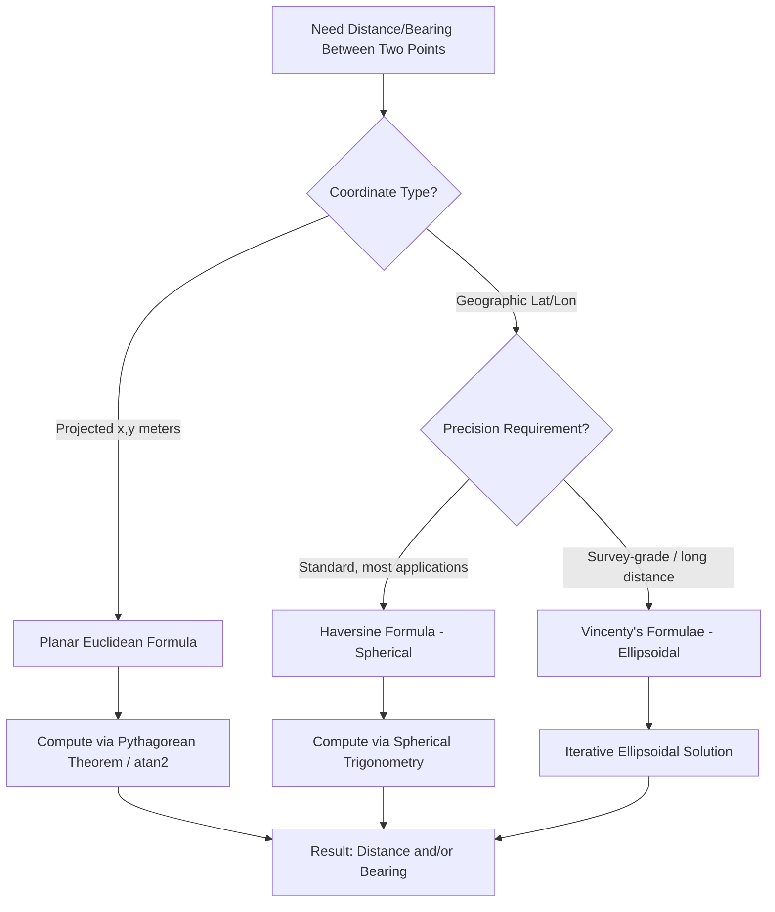

## Trigonometry and Vector Mathematics

### Overview

Trigonometry and vector mathematics constitute the computational bedrock beneath nearly every geospatial operation — coordinate transformations, distance and bearing calculations, map projections, surface normal computation for terrain analysis, and geometric operations in vector GIS all reduce, at some level, to trigonometric identities and vector algebra. This topic establishes the mathematical toolkit that subsequent chapters (coordinate systems, projections, spatial statistics, 3D analysis) will build upon directly.

**Key Points**

- Trigonometric functions relate angles to coordinate positions and are the basis for bearing, distance, and rotation calculations on both planar and spherical/ellipsoidal surfaces.
- Vectors provide a coordinate-based representation of direction and magnitude, enabling operations (dot product, cross product) that underlie GIS functions from area computation to surface normal derivation.
- Geospatial mathematics operates across three geometric contexts — planar (Euclidean), spherical, and ellipsoidal — each requiring different trigonometric formulations for accurate results.

---

### Trigonometric Foundations

#### Basic Definitions

For a right triangle with angle $\theta$, hypotenuse $h$, opposite side $o$, and adjacent side $a$:

$$\sin\theta = \frac{o}{h}, \quad \cos\theta = \frac{a}{h}, \quad \tan\theta = \frac{o}{a} = \frac{\sin\theta}{\cos\theta}$$

Their reciprocals — cosecant ($\csc\theta = 1/\sin\theta$), secant ($\sec\theta = 1/\cos\theta$), cotangent ($\cot\theta = 1/\tan\theta$) — appear less frequently in GIS contexts but arise in some projection formulas.

#### The Unit Circle and Radians

Geospatial computation libraries (PROJ, GDAL, most programming languages' math libraries) operate in **radians**, not degrees, requiring explicit conversion:

$$\text{radians} = \text{degrees} \times \frac{\pi}{180}, \qquad \text{degrees} = \text{radians} \times \frac{180}{\pi}$$

[Inference] Forgetting this conversion is one of the most common practical bugs in custom geospatial calculations — passing raw degree values into trigonometric functions that expect radians produces silently wrong (not error-raising) results, since the functions still return valid numeric output.

#### Inverse Trigonometric Functions and the Atan2 Function

Computing an angle from a ratio requires inverse functions ($\arcsin$, $\arccos$, $\arctan$), but standard $\arctan$ is ambiguous over a full $360°$ range since it cannot distinguish quadrants from a single ratio. The **two-argument arctangent, `atan2(y, x)`**, resolves this by using the signs of both $y$ and $x$ to return the correct angle across the full $-180°$ to $180°$ (or $0°$ to $360°$) range — making it the standard function for bearing and azimuth calculations in GIS code.

$$\theta = \text{atan2}(y, x)$$

---

### Trigonometry in Planar (Euclidean) Geospatial Calculations

#### Bearing/Azimuth Between Two Points

For two points in a projected (planar) coordinate system, $(x_1, y_1)$ and $(x_2, y_2)$, the bearing $\theta$ (measured clockwise from north) is:

$$\theta = \text{atan2}(x_2 - x_1, \; y_2 - y_1)$$

Note the argument order: unlike standard mathematical convention (angle from the positive x-axis, counterclockwise), geographic bearing is conventionally measured clockwise from north (the positive y-axis), requiring the arguments to `atan2` to be swapped relative to typical mathematical usage — a frequent source of implementation error.

#### Rotation of Coordinates

Rotating a point $(x, y)$ by angle $\theta$ about the origin:

$$x' = x\cos\theta - y\sin\theta$$

$$y' = x\sin\theta + y\cos\theta$$

This is directly used in coordinate system transformations involving rotation (e.g., correcting for grid convergence, aligning local survey grids to true north).

---

### Spherical Trigonometry: Distances and Bearings on a Curved Earth

Because geographic coordinates (latitude/longitude) are angular positions on a sphere or ellipsoid, planar trigonometry cannot be applied directly without introducing significant error, especially over longer distances. Spherical trigonometry provides the correct formulations.

#### The Haversine Formula (Great-Circle Distance)

For two points at $(\phi_1, \lambda_1)$ and $(\phi_2, \lambda_2)$ (latitude, longitude in radians):

$$a = \sin^2\left(\frac{\Delta\phi}{2}\right) + \cos\phi_1 \cos\phi_2 \sin^2\left(\frac{\Delta\lambda}{2}\right)$$

$$c = 2 \cdot \text{atan2}\left(\sqrt{a}, \sqrt{1-a}\right)$$

$$d = R \cdot c$$

where $R$ is Earth's mean radius (approximately 6,371 km) and $d$ is the great-circle (shortest-path-on-a-sphere) distance. The haversine formula is numerically well-conditioned for small distances, which is why it is preferred over the older spherical law of cosines formula in most modern implementations.

#### Initial Bearing (Great-Circle Navigation)

The initial compass bearing $\theta$ from point 1 to point 2 along a great circle:

$$\theta = \text{atan2}\left(\sin\Delta\lambda \cdot \cos\phi_2, \; \cos\phi_1 \sin\phi_2 - \sin\phi_1 \cos\phi_2 \cos\Delta\lambda\right)$$

Critically, this bearing is only the *initial* bearing — along a great circle (except along the equator or a meridian), the bearing continuously changes as one travels, unlike a rhumb line (constant-bearing) path, which is longer but easier to navigate.

#### The Spherical Law of Cosines

An alternative, more direct but numerically less stable (for small distances) formulation:

$$\cos(d/R) = \sin\phi_1 \sin\phi_2 + \cos\phi_1 \cos\phi_2 \cos\Delta\lambda$$

[Inference] This formula is more prone to floating-point precision loss for very small distances because it involves taking the arccosine of a value very close to 1, where small numerical errors are amplified — this is the primary practical reason the haversine formula is generally preferred in production geospatial code.

#### Ellipsoidal Corrections: Vincenty's Formulae

Because Earth is more accurately modeled as an oblate ellipsoid (slightly flattened at the poles) rather than a perfect sphere, high-precision distance calculations use **Vincenty's formulae** (1975), an iterative method accounting for ellipsoidal flattening, achieving sub-millimeter accuracy for most practical distances at the cost of greater computational complexity and, in rare edge cases (nearly antipodal points), convergence difficulty. [Unverified regarding universal superiority] — for very short distances, the added complexity of Vincenty's method over the simpler haversine formula yields accuracy improvements that are often negligible relative to underlying GPS/data positional error, so the appropriate method depends on the required precision and distance scale of the specific application.

---

### Vector Mathematics Fundamentals

#### Vector Representation

A vector represents both magnitude and direction, expressed in component form:

$$\vec{v} = (v_x, v_y)$$ in 2D, or $$\vec{v} = (v_x, v_y, v_z)$$ in 3D

**Magnitude (length):**

$$|\vec{v}| = \sqrt{v_x^2 + v_y^2 + v_z^2}$$

**Unit vector (normalization):**

$$\hat{v} = \frac{\vec{v}}{|\vec{v}|}$$

#### Vector Addition and Scalar Multiplication

$$\vec{u} + \vec{v} = (u_x + v_x, \; u_y + v_y)$$

$$k\vec{v} = (kv_x, \; kv_y)$$

Vector addition underlies **displacement chaining** in surveying (traversing a series of measured bearing/distance legs to compute a final position) and GPS track processing.

#### Dot Product

$$\vec{u} \cdot \vec{v} = u_x v_x + u_y v_y + u_z v_z = |\vec{u}||\vec{v}|\cos\theta$$

The dot product yields the cosine of the angle between two vectors, making it the standard tool for:

- Computing the angle between line segments (e.g., road intersection angles, network topology validation).
- Determining whether a point lies in front of or behind a directional plane (used in visibility and viewshed algorithms).
- Projecting one vector onto another (used in coordinate transformation and least-squares adjustment).

#### Cross Product

For 3D vectors:

$$\vec{u} \times \vec{v} = (u_y v_z - u_z v_y, \; u_z v_x - u_x v_z, \; u_x v_y - u_y v_x)$$

The cross product yields a vector perpendicular to both inputs, with magnitude $|\vec{u}||\vec{v}|\sin\theta$. In geospatial applications:

- **Surface normal computation**: given two edge vectors of a terrain triangle (TIN facet), the cross product yields the normal vector used for slope/aspect calculation and hillshade rendering.
- **Signed area (2D case)**: the 2D "cross product" (a scalar, technically the z-component of the 3D cross product with $z=0$) is used in the **Shoelace formula** for polygon area:

$$A = \frac{1}{2}\left|\sum_{i=1}^{n} (x_i y_{i+1} - x_{i+1} y_i)\right|$$

This formula is the standard method used internally by GIS software (GEOS, Shapely, ArcGIS) to compute polygon area directly from vertex coordinates, and its sign (before taking the absolute value) also indicates vertex winding order (clockwise vs. counterclockwise) — a property used internally for polygon validity and orientation checks.

#### Vector Interpolation

Linear interpolation between two vectors/points:

$$\vec{p}(t) = \vec{p_0} + t(\vec{p_1} - \vec{p_0}), \quad t \in [0, 1]$$

This underlies segment densification, linear referencing point-along-route calculations (see the Location Systems topic), and simple animation/track interpolation.

---

### Practical Example: Slope and Aspect from a Digital Elevation Model

Terrain analysis is a canonical application combining vector mathematics directly:

For a raster DEM cell, the surface gradient is estimated (commonly via Horn's method, using a 3×3 neighborhood) as two partial derivatives:

$$\frac{\partial z}{\partial x} \approx \frac{(z_{c+1} - z_{c-1})}{2 \cdot \text{cellsize}}, \qquad \frac{\partial z}{\partial y} \approx \frac{(z_{r+1} - z_{r-1})}{2 \cdot \text{cellsize}}$$

**Slope** (in degrees):

$$\text{slope} = \arctan\left(\sqrt{\left(\frac{\partial z}{\partial x}\right)^2 + \left(\frac{\partial z}{\partial y}\right)^2}\right) \times \frac{180}{\pi}$$

**Aspect** (compass direction of steepest descent), using `atan2` for correct quadrant resolution:

$$\text{aspect} = \text{atan2}\left(\frac{\partial z}{\partial y}, \; -\frac{\partial z}{\partial x}\right) \times \frac{180}{\pi}$$

This directly demonstrates the chapter's throughline: the surface gradient is a vector (the direction and magnitude of steepest elevation change), and both its magnitude (slope) and direction (aspect) are extracted using trigonometric functions applied to that vector's components.

---

### Diagram: Trigonometric and Vector Operations in Geospatial Context (svg_diagram)

<svg xmlns="http://www.w3.org/2000/svg" viewBox="0 0 800 460" font-family="Helvetica, Arial, sans-serif">
<text x="400" y="28" font-size="17" font-weight="bold" text-anchor="middle">Trigonometry and Vector Math in Geospatial Operations (svg_diagram)</text>

<g>
<line x1="120" y1="220" x2="120" y2="100" stroke="#94a3b8" stroke-width="1" stroke-dasharray="3,3" />
<text x="120" y="90" font-size="10" text-anchor="middle">N</text>
<line x1="120" y1="220" x2="220" y2="130" stroke="#1e3a8a" stroke-width="2.5" marker-end="url(#arrb)" />
<circle cx="120" cy="220" r="4" fill="#1e3a8a" />
<path d="M 120 190 A 30 30 0 0 1 148 200" fill="none" stroke="#991b1b" stroke-width="1.5" />
<text x="160" y="195" font-size="10" fill="#991b1b">θ (bearing)</text>
<text x="140" y="260" font-size="11" text-anchor="middle">Bearing via atan2</text>
</g>

<g>
<circle cx="400" cy="170" r="70" fill="none" stroke="#334155" stroke-width="1.5" />
<ellipse cx="400" cy="170" rx="70" ry="20" fill="none" stroke="#94a3b8" stroke-width="1" stroke-dasharray="3,3" />
<path d="M 340 150 Q 400 90 460 150" fill="none" stroke="#166534" stroke-width="2.5" />
<circle cx="340" cy="150" r="4" fill="#166534" />
<circle cx="460" cy="150" r="4" fill="#166534" />
<text x="400" y="270" font-size="11" text-anchor="middle">Great-Circle Distance (Haversine)</text>
</g>

<g>
<polygon points="600,220 700,220 660,140" fill="#dbeafe" stroke="#1e3a8a" stroke-width="1.5" />
<line x1="640" y1="193" x2="640" y2="120" stroke="#991b1b" stroke-width="2.5" marker-end="url(#arrb)" />
<text x="655" y="115" font-size="10" fill="#991b1b">normal (u × v)</text>
<text x="650" y="260" font-size="11" text-anchor="middle">Surface Normal via Cross Product</text>
</g>
<rect x="150" y="330" width="500" height="90" rx="8" fill="#fef3c7" stroke="#92400e" stroke-width="1.5" />
<text x="400" y="355" font-size="12" font-weight="bold" text-anchor="middle">Three Geometric Contexts</text>
<text x="400" y="378" font-size="10.5" text-anchor="middle">Planar (Euclidean) — Spherical (Great-Circle) — Ellipsoidal (Vincenty)</text>
<text x="400" y="398" font-size="10" fill="#78350f" text-anchor="middle">Same trigonometric principles, different correction terms for Earth's curvature</text>
</svg>

---

### Formula Selection Workflow

---

### Common Pitfalls

- **Degree/radian mismatch**: passing degree values into functions expecting radians (or vice versa), producing silently incorrect but plausible-looking numeric results.
- **Applying planar formulas to geographic coordinates**: using the Pythagorean/Euclidean distance formula directly on raw latitude/longitude values ignores Earth's curvature and meridian convergence, producing significant errors at scale (worsening with distance and latitude).
- **Confusing initial bearing with constant bearing**: assuming a great-circle initial bearing remains valid throughout a long-distance route, when in fact the true bearing continuously changes along a great-circle path (except along the equator or a meridian).
- **`atan2` argument order errors**: conflating standard mathematical `atan2(y, x)` (angle from positive x-axis, counterclockwise) with geographic bearing convention (angle from north, clockwise), leading to systematically incorrect bearings if arguments are not properly reordered/adjusted.
- **Ignoring ellipsoidal flattening in high-precision contexts**: using spherical (haversine) formulas where survey-grade or legal/cadastral precision is required, where the sphere-vs-ellipsoid approximation error becomes significant.

---

**Related Topics**

- Coordinate Reference Systems and Map Projection Mathematics
- Datum Transformations and Ellipsoidal Geometry
- Digital Elevation Models: Slope, Aspect, and Curvature Derivation
- Linear Algebra for Spatial Transformations (Affine and Homogeneous Coordinates)
- Great-Circle vs. Rhumb Line Navigation
- Surveying Traverse Computation and Coordinate Geometry (COGO)
- Numerical Precision and Floating-Point Considerations in Geospatial Computation