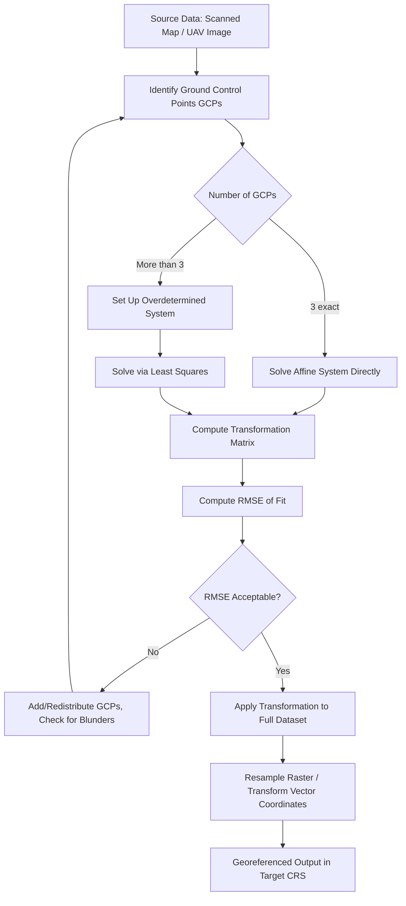

## Linear Algebra for Spatial Transformations

### Overview

Linear algebra provides the formal machinery for transforming spatial coordinates between reference systems, scales, and orientations — operations that occur constantly and often invisibly beneath geospatial software: reprojecting a dataset, georeferencing a scanned map, registering a drone photo mosaic, or rotating a 3D point cloud. This topic develops matrix and vector representations of spatial transformations, building directly on the vector mathematics established in the previous topic.

**Key Points**

- Spatial transformations (translation, rotation, scaling, shearing) can be unified under a single **affine transformation** framework using matrix operations.
- **Homogeneous coordinates** allow translation — which is not a linear operation in standard Cartesian coordinates — to be represented as matrix multiplication alongside rotation and scaling.
- Real-world georeferencing and coordinate transformation problems are typically solved as **least-squares** parameter estimation from control points, not from theoretically exact formulas alone.

---

### Affine Transformations

An **affine transformation** maps coordinates from one 2D (or 3D) space to another while preserving points, straight lines, and parallelism (though not necessarily angles or distances). The general 2D affine transformation is:

$$x' = a \cdot x + b \cdot y + c$$

$$y' = d \cdot x + e \cdot y + f$$

In matrix form:

$$\begin{pmatrix} x' \\ y' \end{pmatrix} = \begin{pmatrix} a & b \\ d & e \end{pmatrix} \begin{pmatrix} x \\ y \end{pmatrix} + \begin{pmatrix} c \\ f \end{pmatrix}$$

This single six-parameter model ($a, b, c, d, e, f$) can represent — individually or in combination — translation, rotation, uniform and non-uniform scaling, and shearing, making it the standard transformation model for **georeferencing** raster imagery (the "world file" / GeoTransform parameters used in GeoTIFF and similar formats encode exactly these six coefficients).

---

### Homogeneous Coordinates

The affine formula above mixes matrix multiplication (for rotation/scale/shear) with vector addition (for translation) — an inconvenient asymmetry when chaining multiple transformations. **Homogeneous coordinates** resolve this by appending an extra coordinate (typically 1) to each point, allowing translation to be folded into the matrix itself:

$$\begin{pmatrix} x' \\ y' \\ 1 \end{pmatrix} = \begin{pmatrix} a & b & c \\ d & e & f \\ 0 & 0 & 1 \end{pmatrix} \begin{pmatrix} x \\ y \\ 1 \end{pmatrix}$$

With this representation, any sequence of transformations reduces to a single matrix multiplication chain, since consecutive transformations $T_1, T_2, T_3$ applied to a point compose as:

$$\vec{p}' = T_3 \cdot T_2 \cdot T_1 \cdot \vec{p}$$

This composability is precisely why homogeneous coordinates are the standard internal representation in computer graphics, photogrammetry, and GIS transformation pipelines (e.g., GDAL's geotransform chaining, computer vision camera models).

---

### Elementary Transformation Matrices

#### Translation

$$T = \begin{pmatrix} 1 & 0 & t_x \\ 0 & 1 & t_y \\ 0 & 0 & 1 \end{pmatrix}$$

#### Scaling (about the origin)

$$S = \begin{pmatrix} s_x & 0 & 0 \\ 0 & s_y & 0 \\ 0 & 0 & 1 \end{pmatrix}$$

Uniform scaling sets $s_x = s_y$; non-uniform scaling ($s_x \neq s_y$) is used, for example, when correcting for anisotropic pixel spacing in some sensor imagery.

#### Rotation (about the origin, angle $\theta$ counterclockwise)

$$R = \begin{pmatrix} \cos\theta & -\sin\theta & 0 \\ \sin\theta & \cos\theta & 0 \\ 0 & 0 & 1 \end{pmatrix}$$

This is the matrix form of the rotation formulas introduced in the prior trigonometry topic, now expressed compositionally.

#### Shear

$$Sh = \begin{pmatrix} 1 & sh_x & 0 \\ sh_y & 1 & 0 \\ 0 & 0 & 1 \end{pmatrix}$$

Shear rarely arises from deliberate cartographic intent but frequently arises as a byproduct of imperfect sensor geometry or scanning distortion in raster georeferencing, which the six-parameter affine model is specifically capable of correcting for.

**Important note on composition order**: matrix multiplication is not commutative ($AB \neq BA$ in general), so the order in which transformations are chained matters — rotating then translating produces a different result than translating then rotating, a frequent source of subtle bugs when composing custom transformation pipelines.

---

### Rigid, Similarity, and Affine Transformations: A Hierarchy

Geospatial transformations are often classified by how many degrees of freedom (and which geometric properties) they preserve:

| Transformation Type | Parameters | Preserves | Typical Use |
| --- | --- | --- | --- |
| **Rigid (Euclidean)** | Rotation + translation (3 params in 2D) | Distance, angle, area | Simple reorientation without distortion |
| **Similarity (Helmert)** | Rigid + uniform scale (4 params in 2D) | Angles, shape (not size) | Datum shift approximations, simple georeferencing |
| **Affine** | 6 params in 2D | Parallelism, straight lines (not angles/lengths) | Raster georeferencing, correcting scanner/sensor distortion |
| **Projective (Homography)** | 8 params in 2D | Straight lines only (not parallelism) | Correcting perspective distortion (oblique aerial photos) |

This hierarchy is directly relevant to choosing the correct transformation model: using a simple 4-parameter similarity transform when the true distortion is affine (non-uniform scale/shear present) will leave systematic residual errors, while using an unnecessarily complex 8-parameter projective transform on well-behaved orthophoto data risks overfitting to control point noise.

---

### The Helmert (Similarity) Transformation in Geodesy

The **Helmert transformation** (also called a seven-parameter transformation in 3D) is the standard model for **datum transformations** (converting coordinates between geodetic datums, e.g., NAD27 to WGS84 — see the Location Systems topic):

$$\begin{pmatrix} X' \\ Y' \\ Z' \end{pmatrix} = (1+s) \begin{pmatrix} 1 & -r_z & r_y \\ r_z & 1 & -r_x \\ -r_y & r_x & 1 \end{pmatrix} \begin{pmatrix} X \\ Y \\ Z \end{pmatrix} + \begin{pmatrix} t_x \\ t_y \\ t_z \end{pmatrix}$$

where $s$ is a scale factor, $(r_x, r_y, r_z)$ are small-angle rotation parameters, and $(t_x, t_y, t_z)$ are translation offsets — seven parameters total, estimated empirically from a network of points with known coordinates in both source and target datums. This is precisely the mathematical machinery underlying tools like NADCON/NTv2 grid-shift files referenced in the earlier Location Systems topic, though modern implementations often use denser empirical grid-shift corrections rather than a single global seven-parameter Helmert solution, for improved local accuracy.

---

### Estimating Transformation Parameters: Least-Squares Georeferencing

In practice, transformation parameters are rarely known exactly in advance — they are **estimated** from a set of **ground control points (GCPs)**: locations with known coordinates in both the source (e.g., pixel coordinates of a scanned map) and target (e.g., real-world geographic coordinates) systems.

For $n$ control points and an affine model with 6 unknown parameters, each control point contributes two equations (one for $x'$, one for $y'$):

$$x_i' = a x_i + b y_i + c, \qquad y_i' = d x_i + e y_i + f$$

With $n \geq 3$ control points (minimum required to solve 6 unknowns), the system is set up as an **overdetermined linear system** $A\mathbf{p} = \mathbf{b}$ when $n > 3$, solved via **least-squares** to minimize the sum of squared residuals:

$$\mathbf{p} = (A^T A)^{-1} A^T \mathbf{b}$$

**Root Mean Square Error (RMSE)** of the fit is then reported as a standard quality metric:

$$\text{RMSE} = \sqrt{\frac{1}{n}\sum_{i=1}^{n} \left[(x_i' - \hat{x}_i')^2 + (y_i' - \hat{y}_i')^2\right]}$$

This RMSE value is the standard "georeferencing residual error" reported by GIS software (ArcGIS Georeferencing toolbar, QGIS Georeferencer) after fitting a transformation, and is the primary quality indicator used to judge whether additional or better-distributed control points are needed. [Inference] A low overall RMSE can still mask a poor local fit if control points are unevenly distributed (e.g., clustered in one corner of the image), since least-squares minimizes the *aggregate* squared error rather than guaranteeing uniform accuracy across the entire extent — this is a commonly cited practical caveat in georeferencing workflow guidance.

---

### Worked Example: Solving a Simple Affine Fit

Suppose three control points relate scanned image pixel coordinates $(x, y)$ to real-world coordinates $(x', y')$:

| Point | Image (x, y) | Real-World (x', y') |
| --- | --- | --- |
| 1 | (0, 0) | (500000, 4000000) |
| 2 | (100, 0) | (500100, 4000000) |
| 3 | (0, 100) | (500000, 3999900) |

From points 1 and 2 (same $y$, $y'$ unchanged): $a = \frac{500100 - 500000}{100 - 0} = 1$, and since $y$ doesn't change $x'$ here, $b = 0$.

From points 1 and 3 (same $x$): $y'$ decreases by 100 as $y$ increases by 100 → $e = -1$, $d = 0$ (since $x'$ is unaffected by $y$ change here).

Translation: $c = 500000$ (from point 1), $f = 4000000$ (from point 1).

Resulting transform: $x' = x + 500000$, $y' = -y + 4000000$ — a pure translation combined with a y-axis flip (common when converting between image coordinates, which increase downward, and geographic coordinates, which increase upward). This illustrates why the y-flip is such a common and expected component of raster georeferencing transforms, rather than an anomaly.

---

### Diagram: Transformation Hierarchy and Composition (svg_diagram)

<svg xmlns="http://www.w3.org/2000/svg" viewBox="0 0 820 460" font-family="Helvetica, Arial, sans-serif">
<text x="410" y="28" font-size="17" font-weight="bold" text-anchor="middle">Hierarchy of Spatial Transformations (svg_diagram)</text>
<rect x="40" y="60" width="160" height="60" rx="8" fill="#dbeafe" stroke="#1e3a8a" stroke-width="1.5" />
<text x="120" y="85" font-size="11" font-weight="bold" text-anchor="middle">Rigid</text>
<text x="120" y="102" font-size="9.5" text-anchor="middle">rotation + translation</text>
<rect x="240" y="60" width="160" height="60" rx="8" fill="#dcfce7" stroke="#166534" stroke-width="1.5" />
<text x="320" y="85" font-size="11" font-weight="bold" text-anchor="middle">Similarity</text>
<text x="320" y="102" font-size="9.5" text-anchor="middle">+ uniform scale</text>
<rect x="440" y="60" width="160" height="60" rx="8" fill="#fef3c7" stroke="#92400e" stroke-width="1.5" />
<text x="520" y="85" font-size="11" font-weight="bold" text-anchor="middle">Affine</text>
<text x="520" y="102" font-size="9.5" text-anchor="middle">+ non-uniform scale, shear</text>
<rect x="640" y="60" width="150" height="60" rx="8" fill="#fee2e2" stroke="#991b1b" stroke-width="1.5" />
<text x="715" y="85" font-size="11" font-weight="bold" text-anchor="middle">Projective</text>
<text x="715" y="102" font-size="9.5" text-anchor="middle">+ perspective</text>
<line x1="200" y1="90" x2="240" y2="90" stroke="#334155" stroke-width="2" marker-end="url(#ar)" />
<line x1="400" y1="90" x2="440" y2="90" stroke="#334155" stroke-width="2" marker-end="url(#ar)" />
<line x1="600" y1="90" x2="640" y2="90" stroke="#334155" stroke-width="2" marker-end="url(#ar)" />

<text x="410" y="145" font-size="11" fill="`#475569`" text-anchor="middle">Increasing degrees of freedom, decreasing preserved geometric properties →</text>

<rect x="150" y="190" width="520" height="230" rx="8" fill="#f8fafc" stroke="#334155" stroke-width="1.5" />
<text x="410" y="215" font-size="12" font-weight="bold" text-anchor="middle">Homogeneous Coordinate Composition</text>
<rect x="180" y="240" width="100" height="40" rx="5" fill="#dbeafe" stroke="#1e3a8a" />
<text x="230" y="264" font-size="10" text-anchor="middle">Point p</text>

<text x="320" y="264" font-size="16" text-anchor="middle">→</text>

<rect x="360" y="240" width="100" height="40" rx="5" fill="#dcfce7" stroke="#166534" />
<text x="410" y="264" font-size="10" text-anchor="middle">T · p</text>

<text x="500" y="264" font-size="16" text-anchor="middle">→</text>

<rect x="540" y="240" width="100" height="40" rx="5" fill="#fef3c7" stroke="#92400e" />
<text x="590" y="264" font-size="10" text-anchor="middle">R · (T · p)</text>

<text x="410" y="320" font-size="10.5" text-anchor="middle" fill="`#475569`">Each transform = single 3×3 matrix; chained via multiplication</text>

<text x="410" y="345" font-size="10.5" text-anchor="middle" fill="`#475569`">Order matters: R·T·p ≠ T·R·p in general</text>

<text x="410" y="390" font-size="10.5" text-anchor="middle" fill="`#7f1d1d`">Real-world parameters estimated via least-squares from GCPs</text>

</svg>

---

### Georeferencing Workflow

---

### Common Pitfalls

- **Choosing an overly complex transformation model for the available control points**: fitting a projective (8-parameter) model with only 4 control points leaves no redundancy for error checking and risks perfectly fitting noise rather than the true underlying distortion.
- **Poor GCP spatial distribution**: clustering all control points in one region of the image while leaving other areas unconstrained produces a deceptively low overall RMSE alongside large local errors elsewhere.
- **Ignoring transformation order in chained operations**: applying rotation before translation (or vice versa) when the pipeline requires the opposite order, since matrix multiplication is non-commutative.
- **Applying an affine model to data with genuine perspective distortion**: oblique aerial photography exhibits projective, not merely affine, distortion; using a 6-parameter affine fit on such imagery leaves systematic residual error that a projective (homography) model would correct.
- **Conflating similarity and affine transforms in datum work**: applying a low-parameter similarity/Helmert transform where local systematic distortion actually requires an affine or higher-order polynomial correction.

---

**Related Topics**

- Coordinate Reference Systems and Datum Transformations (Helmert, Grid-Shift Methods)
- Raster Georeferencing and Image-to-World Registration
- Photogrammetry: Camera Models and Projective Geometry
- Least-Squares Adjustment in Surveying and Geodesy
- Map Projection Mathematics and Distortion Analysis
- 3D Point Cloud Registration and Rigid-Body Transformations
- Numerical Methods for Solving Overdetermined Linear Systems