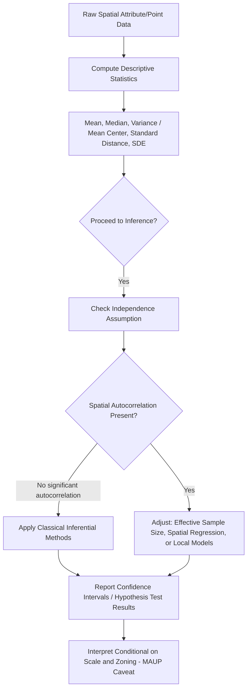

## Descriptive and Inferential Statistics

### Overview

Statistics provides the second core mathematical pillar of geospatial science, complementing the geometric/trigonometric foundation of the previous topics. **Descriptive statistics** summarize and characterize spatial datasets, while **inferential statistics** allow conclusions to be drawn about a broader population or process from a sample — but both must be adapted when applied to spatial data, because spatial observations routinely violate the independence assumption underlying classical (non-spatial) statistical theory, a tension introduced conceptually in the earlier "Spatial Thinking in Scientific Problem Solving" topic and formalized here.

**Key Points**

- Descriptive statistics (central tendency, dispersion, distribution shape) apply to geospatial attribute data much as in general statistics, but spatial data adds location-specific descriptive measures (mean center, standard distance, directional statistics).
- Inferential statistics (hypothesis testing, confidence intervals, regression) require modified assumptions and often modified formulas when spatial autocorrelation is present.
- The classical statistical assumption of independent, identically distributed (i.i.d.) observations is frequently violated by spatial data, motivating specialized spatial statistical methods covered in later chapters.

---

### Descriptive Statistics: General Foundations

#### Measures of Central Tendency

$$\bar{x} = \frac{1}{n}\sum_{i=1}^{n} x_i \quad \text{(mean)}$$

- **Median**: the middle value of ordered data — more robust to outliers than the mean, often preferred for skewed attribute distributions (e.g., income, pollutant concentration).
- **Mode**: the most frequent value — the only valid central-tendency measure for nominal (categorical) data such as land-use class.

#### Measures of Dispersion

$$\sigma^2 = \frac{1}{n}\sum_{i=1}^{n}(x_i - \bar{x})^2 \quad \text{(population variance)}, \qquad s^2 = \frac{1}{n-1}\sum_{i=1}^{n}(x_i - \bar{x})^2 \quad \text{(sample variance)}$$

The $n-1$ divisor in the sample variance formula (Bessel's correction) corrects the downward bias that would otherwise result from using the sample mean, rather than the unknown true population mean, in the sum of squared deviations. Standard deviation $\sigma$ (or $s$) is the square root of variance, restoring the original units.

- **Coefficient of variation (CV)**: $CV = \sigma / \bar{x}$, useful for comparing relative dispersion across variables with different units or magnitudes (e.g., comparing variability of rainfall in mm vs. temperature in °C is not meaningful directly, but their CVs are comparable).

#### Distribution Shape

- **Skewness**: asymmetry of the distribution — many environmental variables (rainfall, pollutant concentration, income) are right-skewed, motivating log-transformation before applying methods that assume normality.
- **Kurtosis**: "tailedness" of the distribution relative to a normal distribution.

---

### Descriptive Statistics for Spatial Data

Spatial data supports a set of descriptive measures with no direct analog in non-spatial statistics, because they summarize the *locational* distribution of a point set rather than an attribute's numeric distribution.

#### Mean Center

The spatial analog of the arithmetic mean — the average $x$ and average $y$ coordinate of a set of point features:

$$\bar{X} = \frac{1}{n}\sum_{i=1}^{n} x_i, \qquad \bar{Y} = \frac{1}{n}\sum_{i=1}^{n} y_i$$

Used, for example, to track the shifting centroid of population distribution over successive census periods, or the central tendency of a disease case cluster.

#### Standard Distance

The spatial analog of standard deviation — a single value summarizing the dispersion of points around the mean center:

$$SD = \sqrt{\frac{\sum_{i=1}^{n}(x_i - \bar{X})^2 + \sum_{i=1}^{n}(y_i - \bar{Y})^2}{n}}$$

Plotting a circle of radius $SD$ around the mean center gives a simple visual summary of point dispersion, analogous to a one-standard-deviation interval in univariate statistics.

#### Standard Deviational Ellipse (SDE)

An extension of standard distance that captures **directional bias** in point dispersion — since spatial point patterns are frequently elongated along a dominant axis (e.g., crime along a transportation corridor, settlement along a river), a single circular standard distance can obscure this directionality. The SDE computes separate standard deviations along the major and minor axes (derived from the eigenvectors of the point coordinate covariance matrix) plus a rotation angle, producing an ellipse that visually communicates both the extent and orientation of the spatial distribution.

#### Directional Statistics (Circular Statistics)

Standard descriptive statistics (arithmetic mean, standard deviation) are invalid for **directional/angular data** (wind direction, aspect, flow direction) because angles wrap around (359° and 1° are numerically far apart but directionally adjacent). Circular statistics instead compute a **mean resultant vector**:

$$\bar{x} = \frac{1}{n}\sum \cos\theta_i, \qquad \bar{y} = \frac{1}{n}\sum \sin\theta_i$$

$$\bar{\theta} = \text{atan2}(\bar{y}, \bar{x}), \qquad R = \sqrt{\bar{x}^2 + \bar{y}^2}$$

where $\bar{\theta}$ is the mean direction and $R$ (ranging 0 to 1) is the **mean resultant length**, indicating concentration around the mean direction (R near 1 = tightly clustered directions; R near 0 = highly dispersed/uniform directions). This directly reuses the trigonometric `atan2` machinery established in the earlier Trigonometry topic.

---

### Inferential Statistics: General Foundations

#### Sampling Distributions and the Central Limit Theorem

The Central Limit Theorem (CLT) establishes that the sampling distribution of the mean approaches normality as sample size increases, regardless of the underlying population distribution's shape, provided observations are independent — a condition, as emphasized throughout, frequently violated by spatially autocorrelated data, with direct consequences for the validity of standard confidence intervals and hypothesis tests applied naively to spatial samples.

#### Confidence Intervals

$$CI = \bar{x} \pm z_{\alpha/2} \cdot \frac{\sigma}{\sqrt{n}}$$

for known population standard deviation (or using the $t$-distribution with $s$ when $\sigma$ is unknown, appropriate for smaller samples).

#### Hypothesis Testing Framework

1. State null ($H_0$) and alternative ($H_1$) hypotheses.
2. Choose a significance level $\alpha$ (commonly 0.05).
3. Compute a test statistic from the sample data.
4. Compare against a critical value or compute a $p$-value.
5. Reject or fail to reject $H_0$.

**Type I error** ($\alpha$): incorrectly rejecting a true null hypothesis. **Type II error** ($\beta$): incorrectly failing to reject a false null hypothesis. **Statistical power** ($1-\beta$): the probability of correctly rejecting a false null hypothesis.

---

### Why Spatial Data Complicates Classical Inference

#### Violation of Independence

Classical inferential formulas (standard error of the mean, standard regression $t$-tests) assume observations are drawn independently. Spatially autocorrelated data (per Tobler's First Law, introduced earlier) means nearby observations carry redundant, not fully independent, information — the **effective sample size** is smaller than the nominal count $n$, meaning naive confidence intervals are too narrow and naive hypothesis tests are too liberal (inflated Type I error rate).

$$n_{eff} < n \quad \text{when positive spatial autocorrelation is present}$$

[Inference] This is why specialized spatial statistics (covered in a later chapter — spatial autocorrelation measures, spatial regression models) exist specifically to correct standard errors and test statistics for this redundancy, rather than simply applying classical formulas to spatially referenced data.

#### Non-Stationarity

Classical inference typically assumes a single global relationship or parameter value holds throughout the study area. Many geospatial relationships are **non-stationary** — the strength or even direction of a relationship varies by location (already introduced in the Spatial Thinking topic) — motivating local/geographically-varying extensions to standard global inferential models.

#### The Modifiable Areal Unit Problem, Revisited

As established in the Foundations chapter, both descriptive statistics (means, variances computed on aggregated areal data) and inferential test results can shift substantially depending on the zoning/scale of aggregation — meaning spatial statistical inference must always be interpreted as conditional on the specific spatial unit of analysis, not as a scale-free population parameter.

---

### Regression as a Bridge Between Descriptive and Inferential Statistics

Ordinary Least Squares (OLS) regression estimates a linear relationship between a dependent variable $y$ and predictors $X$:

$$y = X\beta + \varepsilon$$

$$\hat{\beta} = (X^T X)^{-1} X^T y$$

directly reusing the least-squares matrix machinery introduced in the prior Linear Algebra topic. OLS regression's standard errors, confidence intervals, and significance tests all rest on the classical assumption of independent, homoscedastic residuals — an assumption spatial data frequently violates through **spatial autocorrelation in the residuals**, which (if undiagnosed) leads to underestimated standard errors and spuriously significant predictors. Diagnostic testing of OLS residuals for spatial autocorrelation (e.g., via Moran's I applied to residuals) is accordingly standard practice before accepting an OLS model's inferential conclusions in a spatial context — a preview of the spatial regression methods developed in later chapters.

---

### Worked Example: Mean Center and Standard Distance

Given three sample point locations (in a projected CRS, meters): $(100, 200)$, $(300, 250)$, $(200, 400)$.

**Mean Center:**

$$\bar{X} = \frac{100+300+200}{3} = 200, \qquad \bar{Y} = \frac{200+250+400}{3} = 283.3$$

**Standard Distance:**

Deviations from mean: $(-100, -83.3)$, $(100, -33.3)$, $(0, 116.7)$

$$\sum(x_i-\bar{X})^2 = 10000+10000+0 = 20000$$

$$\sum(y_i-\bar{Y})^2 = 6939+1109+13617 \approx 21665$$

$$SD = \sqrt{\frac{20000+21665}{3}} = \sqrt{13888} \approx 117.8 \text{ m}$$

**Interpretation**: the three points are centered near $(200, 283.3)$, with a typical spread of about 118 m from that center — a simple, single-number dispersion summary directly analogous to univariate standard deviation, but expressed spatially.

---

### Diagram: Descriptive Spatial Statistics (svg_diagram)

<svg xmlns="http://www.w3.org/2000/svg" viewBox="0 0 700 420" font-family="Helvetica, Arial, sans-serif">
<text x="350" y="28" font-size="16" font-weight="bold" text-anchor="middle">Mean Center, Standard Distance, and SDE (svg_diagram)</text>
<circle cx="200" cy="150" r="5" fill="#1e3a8a" />
<circle cx="320" cy="180" r="5" fill="#1e3a8a" />
<circle cx="260" cy="90" r="5" fill="#1e3a8a" />
<circle cx="240" cy="220" r="5" fill="#1e3a8a" />
<circle cx="300" cy="130" r="5" fill="#1e3a8a" />
<circle cx="264" cy="154" r="6" fill="#991b1b" />
<text x="264" y="140" font-size="10" fill="#991b1b" text-anchor="middle">Mean Center</text>
<circle cx="264" cy="154" r="70" fill="none" stroke="#166534" stroke-width="1.5" stroke-dasharray="5,4" />
<text x="264" y="235" font-size="10" fill="#166534" text-anchor="middle">Standard Distance (circle)</text>
<ellipse cx="264" cy="154" rx="95" ry="45" fill="none" stroke="#92400e" stroke-width="2" transform="rotate(-20 264 154)" />
<text x="450" y="260" font-size="10" fill="#92400e" text-anchor="middle">Standard Deviational Ellipse (directional)</text>
<rect x="60" y="300" width="580" height="90" rx="8" fill="#fef2f2" stroke="#991b1b" stroke-width="1.5" />
<text x="350" y="325" font-size="12" font-weight="bold" text-anchor="middle">Key Contrast</text>
<text x="350" y="348" font-size="10.5" text-anchor="middle">Standard Distance: isotropic (same in all directions) dispersion measure</text>
<text x="350" y="368" font-size="10.5" text-anchor="middle">SDE: captures directional bias/elongation via covariance eigenvectors</text>
</svg>

---

### Descriptive-to-Inferential Reasoning Flow

---

### Common Pitfalls

- **Applying arithmetic mean/standard deviation to circular (directional) data**: producing meaningless results near the 0°/360° wraparound boundary; circular statistics must be used instead.
- **Ignoring spatial autocorrelation in regression residuals**: accepting OLS significance tests at face value when residuals are spatially clustered, resulting in overstated confidence in predictor significance.
- **Treating standard distance as sufficient when the pattern is directional**: a circular standard distance measure can obscure a strongly elongated, directionally biased point distribution that the standard deviational ellipse would reveal.
- **Confusing population and sample variance formulas**: using the $n$ divisor instead of $n-1$ (or vice versa) inappropriately for the analysis context, introducing a small but systematic bias.
- **Assuming nominal $n$ equals effective sample size**: applying standard confidence interval formulas without adjustment when spatial data are known to be positively autocorrelated, understating true uncertainty.

---

**Related Topics**

- Spatial Autocorrelation: Moran's I, Geary's C, and Local Indicators (LISA)
- Ordinary Least Squares and Spatial Regression Models
- Point Pattern Analysis and Complete Spatial Randomness
- Circular/Directional Statistics in Environmental Applications (Wind, Aspect, Flow)
- The Modifiable Areal Unit Problem: Statistical Formalization
- Geographically Weighted Regression and Local Statistical Models
- Kriging and Geostatistical Inference