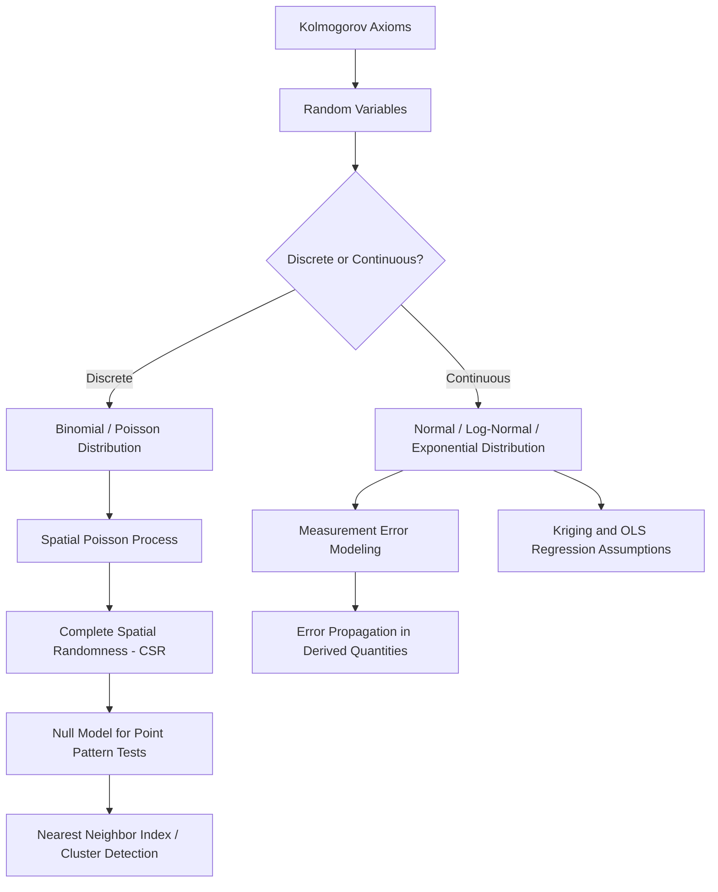

## Probability Theory Fundamentals

### Overview

Probability theory formalizes reasoning under uncertainty and underlies nearly every quantitative geospatial method covered in later chapters — from the significance testing introduced in the previous topic, to interpolation and geostatistics (kriging is explicitly a probabilistic prediction framework), to spatial point process models, error propagation in GNSS positioning, and machine learning classification of remotely sensed imagery. This topic establishes the axiomatic and distributional foundations that these later, more applied methods draw upon.

**Key Points**

- Probability provides the formal language for quantifying uncertainty in both attribute values (measurement error) and spatial patterns (randomness vs. structure).
- Key probability distributions (normal, Poisson, binomial) recur throughout geospatial applications, each suited to specific data types and processes.
- **Complete Spatial Randomness (CSR)**, built on the Poisson process, is the standard probabilistic null model against which observed spatial point patterns are compared — directly connecting probability theory to the inferential spatial statistics previewed in the prior topic.

---

### Axiomatic Foundations

#### Sample Space and Events

A **sample space** $\Omega$ is the set of all possible outcomes of a random process; an **event** $A$ is a subset of $\Omega$. Probability is a function $P(\cdot)$ satisfying Kolmogorov's axioms:

$$P(A) \geq 0 \quad \text{for all } A$$

$$P(\Omega) = 1$$

$$P(A \cup B) = P(A) + P(B) \quad \text{if } A \cap B = \emptyset \text{ (mutually exclusive events)}$$

#### Conditional Probability and Independence

$$P(A \mid B) = \frac{P(A \cap B)}{P(B)}, \quad P(B) > 0$$

Two events are **independent** if and only if:

$$P(A \cap B) = P(A) \cdot P(B) \quad \Leftrightarrow \quad P(A \mid B) = P(A)$$

This formal definition of independence is precisely the condition that spatial autocorrelation violates (as established in the prior Descriptive and Inferential Statistics topic) — when nearby spatial observations are dependent, $P(A \mid B) \neq P(A)$ for spatially proximate events $A$ and $B$, which is the root mathematical reason classical inferential formulas require adjustment for spatial data.

#### Bayes' Theorem

$$P(A \mid B) = \frac{P(B \mid A) \cdot P(A)}{P(B)}$$

Bayes' theorem is the foundation of **Bayesian spatial statistics** and Bayesian classification approaches in remote sensing (e.g., maximum likelihood classifiers can be framed in a Bayesian decision-theoretic context, choosing the class that maximizes posterior probability given observed spectral values), and underlies Bayesian kriging and spatial data fusion methods encountered in later geostatistics chapters.

---

### Random Variables and Distributions

A **random variable** $X$ maps outcomes in a sample space to numerical values, characterized by either a **probability mass function (PMF)** for discrete variables or a **probability density function (PDF)** for continuous variables.

#### Discrete Distributions

**Binomial Distribution**: models the number of successes in $n$ independent trials with success probability $p$:

$$P(X = k) = \binom{n}{k} p^k (1-p)^{n-k}$$

Applicable to, for example, the number of sampled locations exceeding a contamination threshold out of $n$ sampled sites, under an assumption of independent sampling.

**Poisson Distribution**: models the number of events occurring in a fixed interval of space or time, given a constant average rate $\lambda$, assuming events occur independently:

$$P(X = k) = \frac{\lambda^k e^{-\lambda}}{k!}$$

The Poisson distribution is the probabilistic core of **Complete Spatial Randomness (CSR)** in point pattern analysis: under CSR, the number of points falling in any subregion of area $a$ follows a Poisson distribution with mean $\lambda a$, where $\lambda$ is the overall point density (intensity) — directly connecting this topic to the point-pattern methods introduced conceptually in earlier chapters and formalized statistically here.

#### Continuous Distributions

**Normal (Gaussian) Distribution**: the most important continuous distribution in geospatial statistics, characterized by mean $\mu$ and standard deviation $\sigma$:

$$f(x) = \frac{1}{\sigma\sqrt{2\pi}} e^{-\frac{(x-\mu)^2}{2\sigma^2}}$$

Many environmental measurement errors, and (after appropriate transformation) many environmental attribute distributions, are modeled as approximately normal — a foundational assumption underlying kriging's standard formulation and classical OLS regression's error assumptions (both introduced in the previous topic and developed further in later chapters).

**Log-Normal Distribution**: arises when the logarithm of a variable, rather than the variable itself, is normally distributed:

$$X \sim \text{LogNormal} \iff \ln(X) \sim \text{Normal}$$

Frequently used for right-skewed environmental variables (rainfall intensity, pollutant concentration, particle size distributions) that cannot be negative and exhibit long right tails — recall the skewness discussion in the prior topic; log-transformation is the standard remedy precisely because it converts such variables toward normality.

**Exponential Distribution**: models the distance or time between events in a Poisson process, with rate parameter $\lambda$:

$$f(x) = \lambda e^{-\lambda x}, \quad x \geq 0$$

Directly relevant to nearest-neighbor distance modeling under CSR: for a 2D Poisson process, expected nearest-neighbor distances follow a known distribution derived from this exponential/Poisson relationship, forming the theoretical baseline for the **Nearest Neighbor Index** introduced earlier in the Spatial Concepts topic.

---

### Expectation and Variance

$$E[X] = \sum_i x_i P(X=x_i) \quad \text{(discrete)}, \qquad E[X] = \int_{-\infty}^{\infty} x f(x)\,dx \quad \text{(continuous)}$$

$$\text{Var}(X) = E[(X-E[X])^2] = E[X^2] - (E[X])^2$$

**Linearity of expectation** holds regardless of dependence between variables:

$$E[aX + bY] = aE[X] + bE[Y]$$

but **variance of a sum** requires an explicit covariance term when variables are not independent:

$$\text{Var}(X+Y) = \text{Var}(X) + \text{Var}(Y) + 2\text{Cov}(X,Y)$$

This covariance term is precisely why spatially autocorrelated data (positive covariance between nearby observations) produces different — generally larger — variance for spatial sums/averages than the naive independent-case formula would predict, formally justifying the "effective sample size" reduction introduced descriptively in the prior topic.

---

### Poisson Processes and Complete Spatial Randomness

A **spatial Poisson process** with intensity $\lambda$ (points per unit area) satisfies two defining properties:

1. The number of points in any region of area $a$ follows a Poisson distribution with mean $\lambda a$.
2. The counts in disjoint (non-overlapping) regions are statistically independent.

This formalizes **Complete Spatial Randomness (CSR)**: a pattern with no spatial dependence or trend, serving as the canonical statistical null hypothesis against which observed point patterns (disease cases, tree locations, crime incidents) are tested for clustering or dispersion — directly operationalizing the "spatial null model" concept introduced in the Spatial Thinking in Scientific Problem Solving topic.

**Expected nearest-neighbor distance under CSR** (used in the Nearest Neighbor Index, first introduced conceptually in the Spatial Concepts topic):

$$E[\bar{D}] = \frac{1}{2\sqrt{\lambda}}$$

where $\lambda = n/A$ (number of points $n$ divided by study area $A$). This formula gives the formal probabilistic derivation behind the NNI's "expected" denominator.

---

### Error Propagation

When a derived quantity is computed from measured quantities with known uncertainty (e.g., computing area from measured boundary coordinates, or elevation difference from two GNSS-measured heights), **error propagation** formulas describe how input uncertainties combine, applying a first-order Taylor expansion:

$$\sigma_f^2 \approx \sum_i \left(\frac{\partial f}{\partial x_i}\right)^2 \sigma_{x_i}^2 + 2\sum_{i<j} \frac{\partial f}{\partial x_i}\frac{\partial f}{\partial x_j}\text{Cov}(x_i, x_j)$$

For the simple case of a sum or difference of two independent measurements ($f = x_1 \pm x_2$):

$$\sigma_f^2 = \sigma_{x_1}^2 + \sigma_{x_2}^2$$

This is the standard formula used to propagate GNSS positional uncertainty through derived quantities (e.g., computing the uncertainty of a distance or area calculation from individually uncertain point coordinates), and directly extends the covariance concept above into a practical geospatial measurement context.

---

### Worked Example: Applying the Poisson Process to a Point Pattern Test

Suppose 40 tree locations are observed within a 10,000 m² study plot. Under CSR:

$$\lambda = \frac{n}{A} = \frac{40}{10000} = 0.004 \text{ points/m}^2$$

**Expected mean nearest-neighbor distance:**

$$E[\bar{D}] = \frac{1}{2\sqrt{0.004}} = \frac{1}{2 \times 0.0632} \approx 7.91 \text{ m}$$

If the *observed* mean nearest-neighbor distance from the actual tree locations is, say, 5.2 m, the Nearest Neighbor Index would be:

$$NNI = \frac{5.2}{7.91} \approx 0.66$$

An NNI below 1 suggests clustering relative to the CSR/Poisson-process expectation — directly connecting the probabilistic machinery of this topic back to the pattern-recognition concept introduced qualitatively in the very first topic of this course (Spatial Concepts and Geographic Reasoning), now given a rigorous probabilistic foundation.

---

### Diagram: Probability Distributions in Geospatial Applications (svg_diagram)

<svg xmlns="http://www.w3.org/2000/svg" viewBox="0 0 800 420" font-family="Helvetica, Arial, sans-serif">
<text x="400" y="28" font-size="17" font-weight="bold" text-anchor="middle">Probability Distributions and Geospatial Applications (svg_diagram)</text>

<g>
<path d="M 60 200 Q 130 60 200 200 T 340 200" fill="none" stroke="#1e3a8a" stroke-width="2.5" />
<line x1="60" y1="200" x2="340" y2="200" stroke="#94a3b8" stroke-width="1" />
<text x="200" y="230" font-size="11" text-anchor="middle">Normal — measurement error, kriging</text>
</g>

<g>
<rect x="420" y="180" width="20" height="20" fill="#166534" />
<rect x="450" y="140" width="20" height="60" fill="#166534" />
<rect x="480" y="110" width="20" height="90" fill="#166534" />
<rect x="510" y="130" width="20" height="70" fill="#166534" />
<rect x="540" y="165" width="20" height="35" fill="#166534" />
<rect x="570" y="190" width="20" height="10" fill="#166534" />
<line x1="415" y1="200" x2="600" y2="200" stroke="#94a3b8" stroke-width="1" />
<text x="500" y="230" font-size="11" text-anchor="middle">Poisson — CSR, event counts per area</text>
</g>

<g>
<path d="M 650 110 Q 680 190 780 198" fill="none" stroke="#92400e" stroke-width="2.5" />
<line x1="650" y1="200" x2="780" y2="200" stroke="#94a3b8" stroke-width="1" />
<text x="715" y="230" font-size="11" text-anchor="middle">Exponential — NN distances</text>
</g>
<rect x="120" y="280" width="560" height="110" rx="8" fill="#fef3c7" stroke="#92400e" stroke-width="1.5" />
<text x="400" y="305" font-size="12" font-weight="bold" text-anchor="middle">Connecting Thread</text>
<text x="400" y="328" font-size="10.5" text-anchor="middle">Poisson process → defines Complete Spatial Randomness (CSR)</text>
<text x="400" y="348" font-size="10.5" text-anchor="middle">CSR → provides the null-model baseline for Nearest Neighbor Index and cluster tests</text>
<text x="400" y="368" font-size="10.5" text-anchor="middle">Normal distribution → underlies kriging, OLS regression, and error propagation</text>
</svg>

---

### From Probability Axioms to Spatial Application

---

### Common Pitfalls

- **Assuming independence when spatial dependence is present**: applying the simple additive variance formula ($\text{Var}(X+Y) = \text{Var}(X)+\text{Var}(Y)$) to spatially correlated observations, ignoring the covariance term and understating true uncertainty.
- **Applying CSR/Poisson assumptions to inherently clustered processes**: many real point processes (e.g., disease spread via person-to-person contact) violate the independent-events assumption underlying the Poisson process by construction, requiring alternative process models (e.g., Neyman-Scott cluster processes) rather than a simple CSR null.
- **Treating skewed environmental data as normal without transformation**: applying normal-theory confidence intervals or significance tests directly to strongly right-skewed raw data (e.g., untransformed pollutant concentrations) rather than log-transforming first.
- **Confusing probability density with probability**: for continuous distributions, $f(x)$ is a density, not a probability — probabilities are obtained only by integrating $f(x)$ over an interval, a common conceptual error when interpreting PDF plots.
- **Neglecting covariance in error propagation**: applying the independent-error propagation formula to quantities derived from correlated measurements (e.g., two coordinates from the same GNSS observation session, which typically share correlated error sources).

---

**Related Topics**

- Spatial Point Process Models: CSR, Cluster Processes, and Inhibition Processes
- Kriging and Geostatistical Prediction Under Uncertainty
- Bayesian Spatial Statistics and Bayesian Kriging
- Maximum Likelihood Classification in Remote Sensing
- GNSS Error Sources and Positional Uncertainty Propagation
- Spatial Autocorrelation: Formal Probabilistic Treatment (Moran's I Under the Null)
- Monte Carlo Simulation Methods in Spatial Analysis