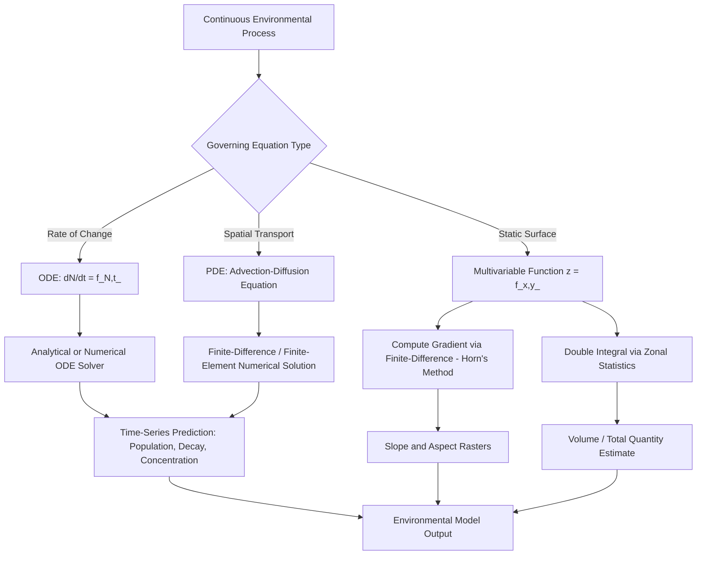

## Calculus Concepts for Environmental Modeling

### Overview

Calculus provides the mathematical language for describing how quantities change continuously over space and time — the central concern of environmental modeling, where phenomena such as pollutant dispersion, groundwater flow, population growth, and heat transfer are governed by rates of change and accumulation rather than static snapshots. This topic closes the "Mathematical and Statistical Foundations" chapter by connecting differential and integral calculus to the geometric (trigonometry, vector algebra), statistical, and probabilistic tools established in the preceding topics.

**Key Points**

- Derivatives quantify instantaneous rates of change and underlie gradient-based terrain analysis, flux calculations, and growth-rate modeling.
- Integrals quantify accumulation and underlie volume/mass balance calculations, probability computations (recall the PDF-to-probability relationship from the previous topic), and total quantity estimation from continuous fields.
- **Partial differential equations (PDEs)**, especially the diffusion/advection-diffusion equation, are the standard mathematical framework for modeling transport processes (pollutant dispersion, heat flow, groundwater contaminant migration) in environmental science.

---

### Derivatives and Rates of Change

#### Basic Definition

The derivative of a function $f(x)$ represents its instantaneous rate of change:

$$f'(x) = \lim_{h \to 0} \frac{f(x+h) - f(x)}{h}$$

In environmental modeling, derivatives quantify rates such as population growth rate, pollutant decay rate, or the rate of temperature change over time.

#### Partial Derivatives and Gradients

For a multivariable function $z = f(x, y)$ (e.g., elevation as a function of horizontal position), **partial derivatives** describe the rate of change with respect to one variable while holding others fixed:

$$\frac{\partial z}{\partial x}, \qquad \frac{\partial z}{\partial y}$$

The **gradient vector** combines these into a single vector pointing in the direction of steepest increase:

$$\nabla z = \left(\frac{\partial z}{\partial x}, \frac{\partial z}{\partial y}\right)$$

This is precisely the mathematical object underlying the **slope and aspect** calculations introduced in the earlier Trigonometry and Vector Mathematics topic — slope is the magnitude of $\nabla z$, and aspect is its direction, now expressed in proper calculus notation rather than the finite-difference approximation used there. In practice, raster DEM analysis computes $\nabla z$ via finite-difference approximation (Horn's method) precisely because the true continuous partial derivatives are not directly measurable from discrete grid data.

#### The Chain Rule in Environmental Context

$$\frac{d}{dt}f(g(t)) = f'(g(t)) \cdot g'(t)$$

Relevant whenever an environmental quantity depends on an intermediate variable that itself changes over time — for example, evapotranspiration rate depending on temperature, which itself varies with time of day, requiring the chain rule to compute the net rate of change of evapotranspiration with respect to time.

---

### Integrals and Accumulation

#### Definite Integrals

$$\int_a^b f(x)\,dx$$

represents the accumulated total (area under the curve) of $f(x)$ between $a$ and $b$. In environmental modeling, this computes quantities such as:

- Total rainfall accumulated over a time period, given a rainfall-rate function.
- Total mass of a pollutant within a plume, given a concentration function over space.
- Total probability over an interval, given a PDF — directly connecting to the probability density function concept introduced in the previous topic, where probabilities were explicitly defined as integrals of $f(x)$ rather than direct function values.

#### Double and Triple Integrals for Spatial Accumulation

For a continuous surface $f(x,y)$ (e.g., pollutant concentration or rainfall depth over a 2D area), the total accumulated quantity over a region $R$ is:

$$\text{Total} = \iint_R f(x,y)\,dA$$

This is the continuous, exact counterpart of the discrete raster **zonal statistics** operation (summing/averaging raster cell values within a defined boundary) that GIS software performs computationally — the raster-based sum is a Riemann-sum approximation of this continuous double integral, with the raster cell size determining the approximation's grain (directly recalling the resolution/grain concept from the Scale and Levels of Spatial Analysis topic).

#### Volume Calculations

For terrain and hydrology applications, volume (e.g., reservoir storage capacity, cut/fill earthwork volume) is computed as:

$$V = \iint_R h(x,y)\,dA$$

where $h(x,y)$ is a height/depth function over the region — again computed in practice via discrete summation over DEM raster cells (cell area × height value, summed across all cells in the region), a direct numerical-integration application of this calculus concept.

---

### Differential Equations in Environmental Modeling

#### Ordinary Differential Equations (ODEs): Exponential Growth and Decay

Many environmental processes follow first-order rate laws:

$$\frac{dN}{dt} = kN$$

with solution $N(t) = N_0 e^{kt}$. For $k>0$, this models exponential growth (unconstrained population growth); for $k<0$, exponential decay (radioactive decay, first-order pollutant degradation).

**Logistic growth**, a more realistic population/resource model incorporating a carrying capacity $K$:

$$\frac{dN}{dt} = rN\left(1 - \frac{N}{K}\right)$$

This differential equation underlies species population modeling in landscape ecology and is directly relevant to habitat carrying-capacity analysis performed atop species distribution models (previewed in the earlier Spatial Thinking in Scientific Problem Solving topic).

#### Partial Differential Equations: The Diffusion Equation

The **diffusion equation** (also called the heat equation in its original physical context) is the canonical PDE for modeling the spread of a substance (heat, pollutant, groundwater contaminant) through a medium over space and time:

$$\frac{\partial C}{\partial t} = D\left(\frac{\partial^2 C}{\partial x^2} + \frac{\partial^2 C}{\partial y^2}\right) = D\nabla^2 C$$

where $C(x,y,t)$ is concentration, $t$ is time, and $D$ is the diffusion coefficient. The term $\nabla^2 C$ (the **Laplacian**, the divergence of the gradient) measures the local curvature of the concentration field — diffusion acts to smooth out sharp concentration gradients over time, flowing from high to low concentration.

#### The Advection-Diffusion Equation

Real environmental transport typically combines diffusion (spreading) with **advection** (transport by bulk fluid motion, e.g., wind or river flow):

$$\frac{\partial C}{\partial t} + \vec{u} \cdot \nabla C = D\nabla^2 C$$

where $\vec{u}$ is the velocity vector field (wind velocity, river current). This equation is the standard mathematical foundation for:

- Air pollutant plume dispersion modeling (e.g., Gaussian plume models are a specific analytical solution of a simplified advection-diffusion equation under steady-state, constant-wind assumptions).
- Groundwater contaminant transport modeling.
- River/estuary pollutant mixing models.

[Inference] Because closed-form analytical solutions to the advection-diffusion equation exist only under simplified, idealized conditions (constant wind, uniform diffusion coefficient, simple boundary geometry), most operational environmental modeling software (air quality models, groundwater flow models) solves these equations numerically via finite-difference or finite-element methods rather than analytically, particularly over realistic, spatially heterogeneous terrain and boundary conditions.

---

### Numerical Differentiation and Integration in GIS

Since GIS data is inherently discrete (raster grids, vector vertices) rather than continuous functions, calculus operations are implemented via numerical approximation:

**Finite-difference approximation of a derivative** (already encountered as Horn's method in the Trigonometry topic):

$$f'(x) \approx \frac{f(x+h) - f(x-h)}{2h}$$

**Numerical integration (Riemann sum / trapezoidal rule)** for zonal statistics or volume calculation:

$$\int_a^b f(x)\,dx \approx \sum_{i} f(x_i) \cdot \Delta x$$

extended to 2D raster summation as: $\text{Total} \approx \sum_{i,j} f(x_i, y_j) \cdot (\text{cell size})^2$

This is precisely what a GIS "zonal statistics" or "surface volume" tool computes internally, making explicit the continuous mathematical operation that the discrete GIS tool approximates.

---

### Worked Example: Estimating Total Rainfall Volume Over a Watershed

Given a raster rainfall-depth surface $h(x,y)$ (mm) over a watershed boundary, with cell size $30\text{ m} \times 30\text{ m} = 900 \text{ m}^2$ per cell, and $N$ cells within the watershed boundary with rainfall depths $h_1, h_2, \ldots, h_N$:

$$V_{water} \approx \sum_{i=1}^{N} h_i \times 900 \text{ m}^2$$

converting $h_i$ from mm to m (dividing by 1000) gives volume in cubic meters. This discrete sum is the numerical-integration approximation of the continuous double integral $\iint_R h(x,y)\,dA$ introduced above — the same underlying calculus concept, applied via the standard raster "sum" zonal statistic.

**Reasoning connection**: this exemplifies how a seemingly simple GIS button-click operation ("zonal sum") is, mathematically, evaluating a definite double integral by Riemann-sum approximation — the finer the raster resolution (smaller cell size, recalling the grain concept from the Scale topic), the more accurate this approximation becomes, at the cost of increased computation.

---

### Diagram: Calculus Concepts Mapped to Environmental Applications (svg_diagram)

<svg xmlns="http://www.w3.org/2000/svg" viewBox="0 0 820 460" font-family="Helvetica, Arial, sans-serif">
<text x="410" y="28" font-size="17" font-weight="bold" text-anchor="middle">Calculus in Environmental Modeling (svg_diagram)</text>
<rect x="40" y="60" width="340" height="160" rx="8" fill="#eff6ff" stroke="#1e3a8a" stroke-width="1.5" />
<text x="210" y="85" font-size="13" font-weight="bold" text-anchor="middle">Differential Calculus</text>
<rect x="60" y="100" width="300" height="30" rx="4" fill="#dbeafe" stroke="#1e3a8a" />
<text x="210" y="120" font-size="10.5" text-anchor="middle">Gradient (∇z) → Slope / Aspect</text>
<rect x="60" y="138" width="300" height="30" rx="4" fill="#dbeafe" stroke="#1e3a8a" />
<text x="210" y="158" font-size="10.5" text-anchor="middle">dN/dt → Growth/Decay Models</text>
<rect x="60" y="176" width="300" height="30" rx="4" fill="#dbeafe" stroke="#1e3a8a" />
<text x="210" y="196" font-size="10.5" text-anchor="middle">Laplacian (∇²C) → Diffusion</text>
<rect x="440" y="60" width="340" height="160" rx="8" fill="#f0fdf4" stroke="#166534" stroke-width="1.5" />
<text x="610" y="85" font-size="13" font-weight="bold" text-anchor="middle">Integral Calculus</text>
<rect x="460" y="100" width="300" height="30" rx="4" fill="#dcfce7" stroke="#166534" />
<text x="610" y="120" font-size="10.5" text-anchor="middle">∬ f(x,y) dA → Zonal Sum/Volume</text>
<rect x="460" y="138" width="300" height="30" rx="4" fill="#dcfce7" stroke="#166534" />
<text x="610" y="158" font-size="10.5" text-anchor="middle">∫ f(x) dx → Total Rainfall/Mass</text>
<rect x="460" y="176" width="300" height="30" rx="4" fill="#dcfce7" stroke="#166534" />
<text x="610" y="196" font-size="10.5" text-anchor="middle">∫ PDF → Probability (prior topic)</text>
<rect x="150" y="260" width="520" height="160" rx="8" fill="#fef3c7" stroke="#92400e" stroke-width="1.5" />
<text x="410" y="285" font-size="13" font-weight="bold" text-anchor="middle">Advection-Diffusion Equation</text>
<text x="410" y="315" font-size="13" text-anchor="middle" font-style="italic">∂C/∂t + u·∇C = D∇²C</text>
<text x="410" y="345" font-size="10.5" text-anchor="middle">Advection (transport by flow) + Diffusion (spreading)</text>
<text x="410" y="365" font-size="10.5" text-anchor="middle">Foundation for air pollution, groundwater, and river mixing models</text>
<text x="410" y="390" font-size="10" fill="#78350f" text-anchor="middle">Solved numerically (finite-difference/finite-element) in operational software</text>
<line x1="210" y1="220" x2="330" y2="260" stroke="#334155" stroke-width="1" stroke-dasharray="4,3" />
<line x1="610" y1="220" x2="490" y2="260" stroke="#334155" stroke-width="1" stroke-dasharray="4,3" />
</svg>

---

### Modeling Workflow: From Continuous Theory to Discrete GIS Computation

---

### Common Pitfalls

- **Confusing average rate of change with instantaneous rate**: using a coarse finite-difference approximation over too large an interval $h$, obscuring genuine local variation in the true derivative (directly analogous to the grain/resolution trade-off from the Scale topic).
- **Applying linear (exponential) growth models beyond their valid range**: assuming unconstrained exponential growth when a carrying-capacity-limited logistic model is more appropriate for real populations with finite resources.
- **Ignoring advection when only modeling diffusion**: applying a pure diffusion equation to a system with significant bulk fluid transport (wind, river flow) omits a first-order term and can produce qualitatively incorrect predictions of plume location and shape.
- **Treating raster zonal statistics as exact rather than approximate**: forgetting that discrete raster summation is a Riemann-sum approximation of a continuous integral, with accuracy dependent on cell size — coarse-resolution rasters can meaningfully bias volume/total-quantity estimates.
- **Neglecting boundary conditions in PDE-based transport models**: the diffusion/advection-diffusion equation requires appropriate boundary conditions (e.g., no-flux at an impermeable boundary) to produce physically meaningful solutions; omitting these can yield mathematically valid but physically nonsensical results.

---

### Chapter Synthesis

This topic closes the "Mathematical and Statistical Foundations" chapter by integrating calculus with the preceding topics:

- **Trigonometry and Vector Mathematics** supplied the geometric vocabulary (gradients, vectors) now formalized via partial derivatives.
- **Linear Algebra for Spatial Transformations** supplied the matrix/least-squares machinery reused in numerical PDE solution methods.
- **Descriptive and Inferential Statistics** and **Probability Theory Fundamentals** supplied the uncertainty-quantification framework that environmental model outputs (themselves derived from calculus-based governing equations) must ultimately be evaluated against.

Together, these four topics establish the complete mathematical toolkit — geometric, algebraic, statistical, and differential/integral — that subsequent applied chapters (coordinate systems, geostatistics, remote sensing, hydrological and atmospheric modeling) will draw upon directly.

---

**Related Topics**

- Numerical Methods for Solving PDEs: Finite-Difference and Finite-Element Approaches
- Gaussian Plume Models for Air Pollution Dispersion
- Groundwater Flow and Contaminant Transport Modeling
- Population Ecology Models: Logistic Growth and Carrying Capacity
- Digital Elevation Models: Gradient, Curvature, and Hydrological Flow Direction
- Zonal Statistics and Surface Volume Computation in GIS
- Systems Dynamics Modeling in Environmental Science