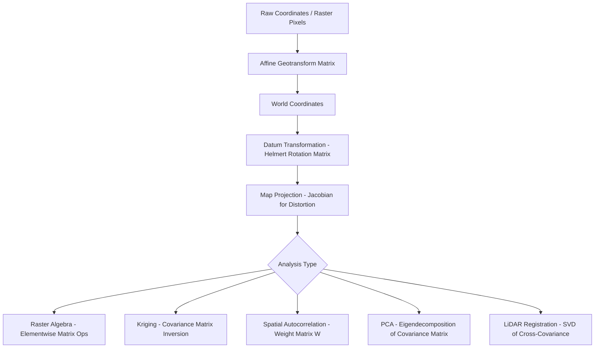

## Matrix Operations in Geospatial Computing

### Overview

Matrix operations form the computational backbone of geospatial science, underlying coordinate transformations, map projections, spatial interpolation, image processing, and geostatistical modeling. Nearly every operation that moves data between coordinate reference systems (CRS), resamples raster grids, or fits a spatial model relies on linear algebra primitives: matrix multiplication, inversion, decomposition, and eigenanalysis.

### Core Matrix Concepts in Geospatial Context

#### Coordinate Vectors and Transformation Matrices

A point in space is represented as a vector, and transformations (translation, rotation, scaling, shearing) are represented as matrices that act on that vector.

$$\mathbf{p}' = \mathbf{T} \mathbf{p}$$

For 2D affine transformations, homogeneous coordinates extend a point $(x, y)$ to $(x, y, 1)$ so translation can be folded into matrix multiplication:

$$\begin{bmatrix} x' \\ y' \\ 1 \end{bmatrix} =
\begin{bmatrix} a & b & t_x \\ c & d & t_y \\ 0 & 0 & 1 \end{bmatrix}
\begin{bmatrix} x \\ y \\ 1 \end{bmatrix}$$

Here, $a, b, c, d$ encode rotation/scale/shear, and $t_x, t_y$ encode translation. This 3x3 affine matrix is exactly what underlies the GDAL/rasterio "geotransform."

#### The Geotransform Matrix

Every georeferenced raster stores a 6-parameter affine geotransform mapping pixel (row, col) indices to world coordinates:

$$\begin{bmatrix} x_{geo} \\ y_{geo} \end{bmatrix} =
\begin{bmatrix} c \\ f \end{bmatrix} +
\begin{bmatrix} a & b \\ d & e \end{bmatrix}
\begin{bmatrix} col \\ row \end{bmatrix}$$

where $a$ = pixel width, $e$ = pixel height (typically negative), $b, d$ = rotation terms (usually 0 for north-up rasters), and $c, f$ = the coordinates of the upper-left corner.

### Affine Transformations for CRS and Raster Alignment

#### Composing Transformations

Multiple transformations compose through matrix multiplication, applied right-to-left:

$$\mathbf{T}_{combined} = \mathbf{T}_{translate} \cdot \mathbf{T}_{rotate} \cdot \mathbf{T}_{scale}$$

This is how a raster resampling pipeline chains scaling (resolution change), rotation (grid reorientation), and translation (origin shift) into a single matrix, applied once per pixel rather than sequentially — a major performance consideration for large rasters.

#### Practical Example: Python with `affine` and `rasterio`

```python
from affine import Affine
import numpy as np

# Construct a geotransform: 30m pixels, north-up, origin at (500000, 4649000)
transform = Affine(30.0, 0.0, 500000.0,
                    0.0, -30.0, 4649000.0)

# Convert pixel (col, row) to world coordinates
col, row = 10, 5
x, y = transform * (col, row)
print(x, y)  # 500300.0 4648850.0

# Inverse transform: world coordinates to pixel indices
inv_transform = ~transform
col_back, row_back = inv_transform * (x, y)
```

Internally, `Affine` represents the transform as a 3x3 matrix and overloads `*` to perform matrix-vector multiplication and `~` to compute the matrix inverse.

### Map Projection Mathematics

#### Rotation Matrices for Datum and Projection Adjustments

Converting between reference frames (e.g., during 7-parameter Helmert/Bursa-Wolf datum transformations) uses a rotation matrix $\mathbf{R}$ composed of three axis rotations:

$$\mathbf{R} = \mathbf{R}_z(\gamma) \mathbf{R}_y(\beta) \mathbf{R}_x(\alpha)$$


$$\mathbf{R}_x(\alpha) =
\begin{bmatrix}
1 & 0 & 0 \\
0 & \cos\alpha & -\sin\alpha \\
0 & \sin\alpha & \cos\alpha
\end{bmatrix}$$

The full Helmert transformation between 3D Cartesian geocentric systems is:

$$\mathbf{X}_{target} = t + (1+s)\,\mathbf{R}\,\mathbf{X}_{source}$$

where $t$ is a translation vector and $s$ is a scale factor. This is exactly what PROJ and EPSG-based CRS libraries execute under the hood for datum shifts (e.g., NAD27 to NAD83).

#### Jacobian Matrices in Projection Distortion

Every map projection is a nonlinear function $\phi(\lambda, \phi) \to (x, y)$. Its local distortion is captured by the Jacobian matrix of partial derivatives:

$$\mathbf{J} =
\begin{bmatrix}
\dfrac{\partial x}{\partial \lambda} & \dfrac{\partial x}{\partial \phi} \\[6pt]
\dfrac{\partial y}{\partial \lambda} & \dfrac{\partial y}{\partial \phi}
\end{bmatrix}$$

The singular values of $\mathbf{J}$ give the scale distortion along principal directions at a point — this is the mathematical basis of Tissot's indicatrix, used to visualize and quantify projection distortion (area, angle, distance).

### Raster and Grid Operations as Matrix Algebra

#### Rasters as Matrices

A single-band raster is literally a 2D matrix of pixel values; a multiband raster is a 3D array (stack of matrices). Standard `numpy` matrix operations directly implement common raster analysis tasks.

**Example — Band math (NDVI) as elementwise matrix operations:**

```python
import numpy as np
import rasterio

with rasterio.open("nir_band.tif") as src:
    nir = src.read(1).astype(float)
with rasterio.open("red_band.tif") as src:
    red = src.read(1).astype(float)

ndvi = (nir - red) / (nir + red + 1e-10)  # elementwise matrix arithmetic
```

**Example — Convolution/kernel filtering (matrix-based neighborhood operations):**

```python
from scipy.ndimage import convolve

# 3x3 mean smoothing kernel
kernel = np.ones((3, 3)) / 9.0
smoothed = convolve(elevation_matrix, kernel, mode="nearest")

# Sobel edge-detection kernels for slope/aspect proxies
sobel_x = np.array([[-1, 0, 1], [-2, 0, 2], [-1, 0, 1]])
sobel_y = np.array([[-1, -2, -1], [0, 0, 0], [1, 2, 1]])
gx = convolve(elevation_matrix, sobel_x)
gy = convolve(elevation_matrix, sobel_y)
slope_magnitude = np.sqrt(gx**2 + gy**2)
```

Convolution itself is a linear operation expressible as matrix multiplication against a (sparse, banded) Toeplitz matrix, though libraries implement it via sliding-window operations for efficiency rather than forming the explicit matrix.

#### Terrain Derivatives (Slope, Aspect, Curvature)

Slope and aspect from a Digital Elevation Model (DEM) are computed from the gradient, which is derived using finite-difference matrices (typically Horn's or Zevenbergen-Thorne 3x3 kernels):

$$\text{slope} = \arctan\left(\sqrt{\left(\frac{\partial z}{\partial x}\right)^2 + \left(\frac{\partial z}{\partial y}\right)^2}\right)$$

### Spatial Interpolation and Geostatistics

#### Kriging and the Covariance Matrix

Ordinary Kriging solves a linear system involving the covariance (or variogram) matrix $\mathbf{C}$ between sample points:

# $$ \begin{bmatrix} \mathbf{C} & \mathbf{1} \ \mathbf{1}^T & 0 \end{bmatrix} \begin{bmatrix} \boldsymbol{\lambda} \ \mu \end{bmatrix}

\begin{bmatrix} \mathbf{c}_0 \ 1 \end{bmatrix}

$$

Here $\mathbf{C}_{ij} = \text{Cov}(z_i, z_j)$ from the fitted variogram model, $\mathbf{c}_0$ is the covariance vector between the sample points and the prediction location, $\boldsymbol{\lambda}$ are the kriging weights, and $\mu$ is a Lagrange multiplier enforcing unbiasedness. Solving requires matrix inversion:

$$\boldsymbol{\lambda} = \mathbf{C}^{-1} \mathbf{c}_0$$

In practice, this inversion is performed via Cholesky decomposition rather than direct inversion for numerical stability, since $\mathbf{C}$ is symmetric positive-definite.

**Practical example (PyKrige):**

```python
from pykrige.ok import OrdinaryKriging
import numpy as np

x = np.array([0, 5, 10, 15])
y = np.array([0, 10, 0, 10])
z = np.array([1.2, 3.4, 2.1, 4.8])

ok = OrdinaryKriging(x, y, z, variogram_model="spherical")
z_pred, ss = ok.execute("grid", np.arange(0, 16, 1), np.arange(0, 16, 1))
```

Internally, `pykrige` assembles the variogram-derived covariance matrix and solves the linear system per prediction point (or batched via matrix operations for grids).

#### Spatial Weight Matrices

Spatial autocorrelation statistics (Moran's I, Geary's C) and spatial regression models depend on a spatial weights matrix $\mathbf{W}$, where $W_{ij}$ encodes the spatial relationship (contiguity, distance-based, or k-nearest-neighbor) between features $i$ and $j$.

$$I = \frac{n}{\sum_i \sum_j W_{ij}} \cdot \frac{\sum_i \sum_j W_{ij}(x_i - \bar{x})(x_j - \bar{x})}{\sum_i (x_i - \bar{x})^2}$$

```python
from libpysal.weights import Queen
import geopandas as gpd

gdf = gpd.read_file("districts.shp")
w = Queen.from_dataframe(gdf)  # builds sparse contiguity weight matrix
w.transform = "r"  # row-standardize
```

`libpysal` stores $\mathbf{W}$ as a sparse matrix (typically `scipy.sparse`) since most spatial weight matrices are highly sparse — each feature is only "connected" to a small number of neighbors.

### Point Cloud and 3D Transformation Matrices (LiDAR)

LiDAR point cloud registration and georeferencing rely heavily on 4x4 homogeneous transformation matrices combining rotation and translation:

$$\mathbf{T} =
\begin{bmatrix}
\mathbf{R}_{3\times3} & \mathbf{t}_{3\times1} \\
\mathbf{0}_{1\times3} & 1
\end{bmatrix}$$

Algorithms like Iterative Closest Point (ICP), used to align overlapping LiDAR scans, iteratively solve for the optimal $\mathbf{R}$ and $\mathbf{t}$ that minimize point-to-point distance, typically via Singular Value Decomposition (SVD) of a cross-covariance matrix:

$$\mathbf{H} = \sum_i (\mathbf{p}_i - \bar{\mathbf{p}})(\mathbf{q}_i - \bar{\mathbf{q}})^T, \quad \mathbf{H} = \mathbf{U}\Sigma\mathbf{V}^T, \quad \mathbf{R} = \mathbf{V}\mathbf{U}^T$$

### Principal Component Analysis (PCA) for Remote Sensing

PCA is used extensively for multispectral/hyperspectral dimensionality reduction. It relies on eigendecomposition of the band covariance matrix:

$$\mathbf{C} = \frac{1}{n-1}\mathbf{X}^T\mathbf{X}, \qquad \mathbf{C}\mathbf{v}_i = \lambda_i \mathbf{v}_i$$

```python
from sklearn.decomposition import PCA
import numpy as np

# stack bands into (n_pixels, n_bands) matrix
X = np.stack([band1.ravel(), band2.ravel(), band3.ravel(), band4.ravel()], axis=1)

pca = PCA(n_components=3)
pcs = pca.fit_transform(X)  # eigenvectors of the band covariance matrix
```

The eigenvalues indicate variance explained per component, and the eigenvectors (loadings) indicate each band's contribution — the mathematical basis of tools like ENVI's/QGIS's PCA raster transformation.

### Diagram: Matrix Operations Pipeline in a Typical Geospatial Workflow



### Performance and Numerical Considerations

- **Matrix inversion cost**: Direct inversion is $O(n^3)$; for large Kriging systems or spatial regression, iterative solvers (conjugate gradient) or decomposition-based approaches (Cholesky, LU) are preferred for stability and speed.
- **Sparse matrices**: Spatial weight matrices and large finite-element/finite-difference grids are typically sparse; using dense matrix representations for these is a common performance mistake in large-scale geospatial code. [Inference] The specific speedup from switching to sparse representations depends on matrix density and problem size, and can vary substantially across datasets.
- **Numerical stability in projections**: Near-singular Jacobians occur close to projection singularities (e.g., poles in certain conic/cylindrical projections), which can cause instability in inverse-projection calculations.
- **GPU acceleration**: Libraries such as CuPy or PyTorch can accelerate large-scale raster matrix operations (band math, convolution, PCA) by offloading to GPU, which matters for high-resolution or hyperspectral datasets. [Inference] Actual speedup is hardware- and workload-dependent.

### Key Libraries Summary

| Library | Matrix Operation Role |
| --- | --- |
| `numpy` / `scipy` | General matrix algebra, sparse matrices, linear solvers |
| `affine` | 2D affine transform composition and inversion |
| `rasterio` / `GDAL` | Geotransform application, raster resampling |
| `pyproj` | CRS transformation via projection/datum matrices |
| `pykrige` / `gstat` (R) | Kriging covariance matrix construction and inversion |
| `libpysal` | Sparse spatial weight matrices |
| `scikit-learn` | PCA eigendecomposition for spectral bands |
| `open3d` / `PDAL` | 4x4 transformation matrices, ICP/SVD for point clouds |

### Related Topics

- Coordinate Reference Systems and Datum Transformations
- Eigenvalues, Eigenvectors, and PCA in Remote Sensing
- Variogram Modeling and Geostatistical Interpolation
- Sparse Matrix Representations for Spatial Weight Matrices
- Singular Value Decomposition in Point Cloud Registration
- Finite Difference Methods for Terrain Analysis
- Tissot's Indicatrix and Projection Distortion Analysis
- Linear Regression and Spatial Autoregressive Models (SAR, CAR)