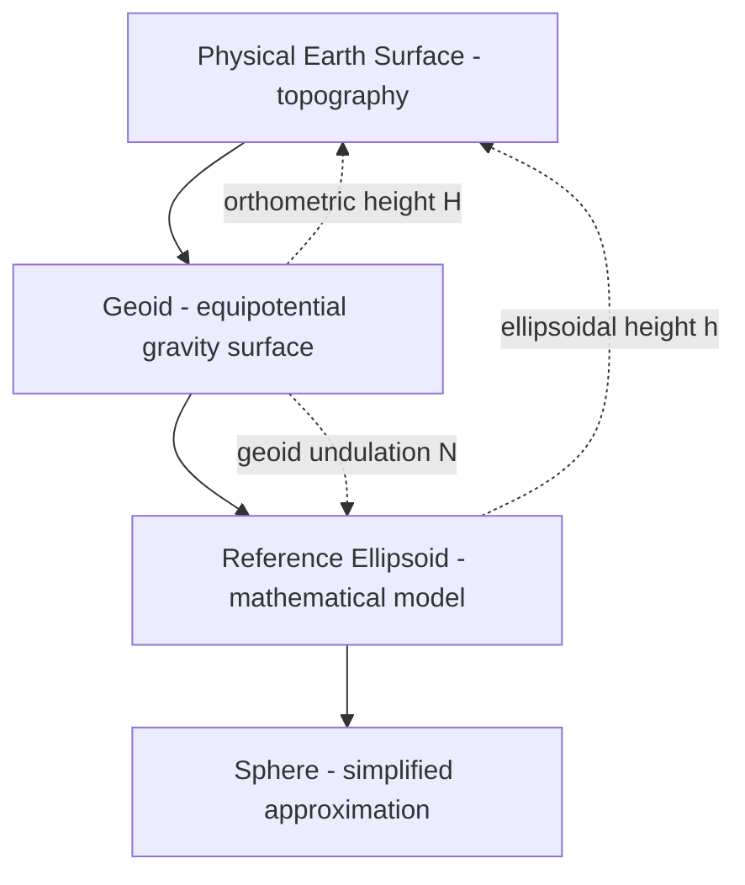

## Shape and Size of the Earth


### Overview

The Earth's shape is not a perfect sphere but an oblate spheroid, slightly flattened at the poles and bulging at the equator due to rotational forces. Accurately modeling this shape is foundational to geodesy, surveying, GPS/GNSS positioning, and every map projection or coordinate transformation used in GIS. Three progressively more accurate models are used depending on application precision: the sphere, the ellipsoid, and the geoid.

### The Three Earth Models

#### 1. The Sphere

The simplest approximation, used for small-scale mapping, global visualizations, and applications where sub-kilometer accuracy is unnecessary.

- Mean radius: $R \approx 6{,}371.0$ km
- Used in: web mapping (Web Mercator/EPSG:3857 uses a spherical approximation despite representing an ellipsoidal Earth), global-scale thematic maps, basic distance estimation via the haversine formula

**Haversine formula (great-circle distance on a sphere):**

$$a = \sin^2\left(\frac{\Delta\phi}{2}\right) + \cos\phi_1 \cos\phi_2 \sin^2\left(\frac{\Delta\lambda}{2}\right)$$


$$d = 2R \cdot \arcsin(\sqrt{a})$$

```python
import math

def haversine(lat1, lon1, lat2, lon2, R=6371.0):
    phi1, phi2 = math.radians(lat1), math.radians(lat2)
    dphi = math.radians(lat2 - lat1)
    dlambda = math.radians(lon2 - lon1)
    a = math.sin(dphi/2)**2 + math.cos(phi1)*math.cos(phi2)*math.sin(dlambda/2)**2
    return 2 * R * math.asin(math.sqrt(a))

print(haversine(14.5995, 120.9842, 40.7128, -74.0060))  # Manila to NYC, km
```

#### 2. The Ellipsoid (Reference Ellipsoid / Spheroid)

A mathematically defined oblate spheroid that approximates mean sea level, used as the geometric reference surface for coordinate systems (latitude/longitude) and most geodetic computations.

**Defining parameters:**

- Semi-major axis ($a$): equatorial radius
- Semi-minor axis ($b$): polar radius
- Flattening: $f = \dfrac{a - b}{a}$
- Eccentricity: $e^2 = \dfrac{a^2 - b^2}{a^2} = 2f - f^2$

**Common reference ellipsoids:**

| Ellipsoid | Semi-major axis $a$ (m) | Flattening $1/f$ | Common Use |
| --- | --- | --- | --- |
| WGS84 | 6,378,137.0 | 298.257223563 | GPS, global GIS, EPSG:4326 |
| GRS80 | 6,378,137.0 | 298.257222101 | NAD83, most modern national datums |
| Clarke 1866 | 6,378,206.4 | 294.978698 | NAD27 (legacy US) |
| International 1924 (Hayford) | 6,378,388.0 | 297.0 | Older European datums |
| Bessel 1841 | 6,377,397.155 | 299.1528128 | Legacy datums (Japan, Indonesia) |

The difference between $a$ and $b$ for WGS84 is roughly 21 km — small relative to Earth's size (~0.3% flattening) but critical for centimeter- to meter-level positioning accuracy.

**Ellipsoid equation (cross-section):**

$$\frac{x^2}{a^2} + \frac{z^2}{b^2} = 1$$

#### 3. The Geoid

The geoid is the equipotential surface of Earth's gravity field that best approximates mean sea level, accounting for uneven mass distribution (mountains, ocean trenches, mantle density variations). It is irregular and cannot be expressed by a simple mathematical formula — it is modeled empirically from gravimetric and satellite data (e.g., EGM2008, EGM96 geoid models).

**Relationship between ellipsoidal height, orthometric height, and geoid undulation:**

$$h = H + N$$

where:

- $h$ = ellipsoidal height (what GPS measures directly)
- $H$ = orthometric height (height above mean sea level — what's used in most elevation datasets, contour maps)
- $N$ = geoid undulation (geoid height above/below the ellipsoid, typically ranging ±100 m globally)

This is why raw GPS elevation readings often disagree with topographic map elevations — GPS gives $h$, but maps typically show $H$, and the two differ by $N$.

### Diagram: Sphere vs. Ellipsoid vs. Geoid Relationship



### Geometric Relationships and Curvature

#### Radii of Curvature

Because the ellipsoid is not uniformly curved, two distinct radii of curvature are used depending on direction:

**Meridian radius of curvature (north-south direction):**

$$M(\phi) = \frac{a(1-e^2)}{(1 - e^2\sin^2\phi)^{3/2}}$$

**Prime vertical radius of curvature (east-west direction):**

$$N(\phi) = \frac{a}{\sqrt{1 - e^2\sin^2\phi}}$$

These are used in geodetic-to-Cartesian coordinate conversions and in computing precise distances along meridians/parallels.

#### Geodetic to Geocentric (ECEF) Coordinate Conversion

Converting latitude/longitude/height $(\phi, \lambda, h)$ to Earth-Centered, Earth-Fixed (ECEF) Cartesian coordinates $(X, Y, Z)$:

$$X = (N(\phi) + h)\cos\phi\cos\lambda$$


$$Y = (N(\phi) + h)\cos\phi\sin\lambda$$


$$Z = \left(N(\phi)(1-e^2) + h\right)\sin\phi$$

```python
import math

def geodetic_to_ecef(lat_deg, lon_deg, h, a=6378137.0, f=1/298.257223563):
    e2 = 2*f - f**2
    phi = math.radians(lat_deg)
    lam = math.radians(lon_deg)
    N = a / math.sqrt(1 - e2 * math.sin(phi)**2)
    X = (N + h) * math.cos(phi) * math.cos(lam)
    Y = (N + h) * math.cos(phi) * math.sin(lam)
    Z = (N * (1 - e2) + h) * math.sin(phi)
    return X, Y, Z

print(geodetic_to_ecef(14.5995, 120.9842, 10))  # Manila, ~10m elevation
```

This conversion underlies satellite positioning, 3D GIS, and datum transformation pipelines (e.g., PROJ's internal pipeline steps).

### Why Earth's Shape Matters for GIS and Geospatial Computing

- **Distance and area calculations**: Using a spherical model for high-precision surveying introduces errors of up to several kilometers over long distances; ellipsoidal (geodesic) calculations (e.g., Vincenty's or Karney's formulas) are required for sub-meter accuracy.
- **Datum choice affects coordinates**: The same physical location has different lat/lon values under NAD27 (Clarke 1866) versus NAD83/WGS84 (GRS80) because they use different reference ellipsoids and origins — a common source of "coordinate shift" errors when integrating legacy and modern data.
- **Elevation data interpretation**: DEMs and GPS elevations may reference either the ellipsoid or the geoid; mixing them without applying $N$ correction causes systematic vertical errors, commonly tens of meters.
- **Map projections depend on the ellipsoid**: All projections (UTM, State Plane, Lambert Conformal Conic, etc.) are mathematically defined relative to a specific reference ellipsoid; using the wrong ellipsoid parameter in projection software introduces positional distortion.

### Practical Example: Ellipsoidal Distance (Vincenty's Formula, via `pyproj`)

```python
from pyproj import Geod

geod = Geod(ellps="WGS84")
lon1, lat1 = 120.9842, 14.5995   # Manila
lon2, lat2 = -74.0060, 40.7128   # New York

azimuth_fwd, azimuth_back, distance_m = geod.inv(lon1, lat1, lon2, lat2)
print(f"Distance: {distance_m/1000:.2f} km")
```

`pyproj`'s `Geod` class performs geodesic calculations directly on the WGS84 ellipsoid (using Karney's algorithm), which is more accurate over long distances than the spherical haversine approximation, particularly at high latitudes or over intercontinental distances.

### Historical Determination of Earth's Shape and Size

- **Eratosthenes (c. 240 BCE)**: Estimated Earth's circumference using shadow angles at Syene and Alexandria, arriving at a value within roughly 15% of the modern figure — historically significant as the first quantitative geodetic measurement, though exact accuracy figures vary depending on the ancient unit conversion assumed. [Unverified]
- **Newton and Huygens (17th century)**: Predicted Earth's oblateness (equatorial bulge) from rotational physics, contradicting the purely spherical assumption.
- **French Geodetic Missions (18th century)**: Arc measurements in Peru and Lapland confirmed the oblate shape and helped define the meter as a fraction of Earth's meridian circumference.
- **20th–21st century satellite geodesy**: Satellite laser ranging, GNSS, and gravity missions (GRACE, GOCE) enabled precise determination of both the ellipsoid parameters and the detailed geoid shape used in modern reference systems (WGS84, ITRF).

### Key Numerical Facts

| Parameter | Approximate Value |
| --- | --- |
| Equatorial circumference | ~40,075 km |
| Polar circumference | ~40,008 km |
| Equatorial radius (WGS84) | 6,378.137 km |
| Polar radius (WGS84) | 6,356.752 km |
| Flattening | ~1/298.257 (~0.335%) |
| Mean radius (sphere approximation) | ~6,371.0 km |
| Geoid undulation range | approximately -107 m to +85 m globally |

### Related Topics

- Geodetic Datums (WGS84, NAD83, ITRF) and Datum Transformations
- Geoid Models (EGM96, EGM2008) and Vertical Datums
- Map Projections and Distortion (Conformal, Equal-Area, Equidistant)
- Coordinate Reference Systems: Geographic vs. Projected vs. Geocentric
- Geodesic vs. Great-Circle Distance Calculations
- Ellipsoidal Height vs. Orthometric Height Conversion
- Satellite Geodesy and GNSS Positioning Fundamentals