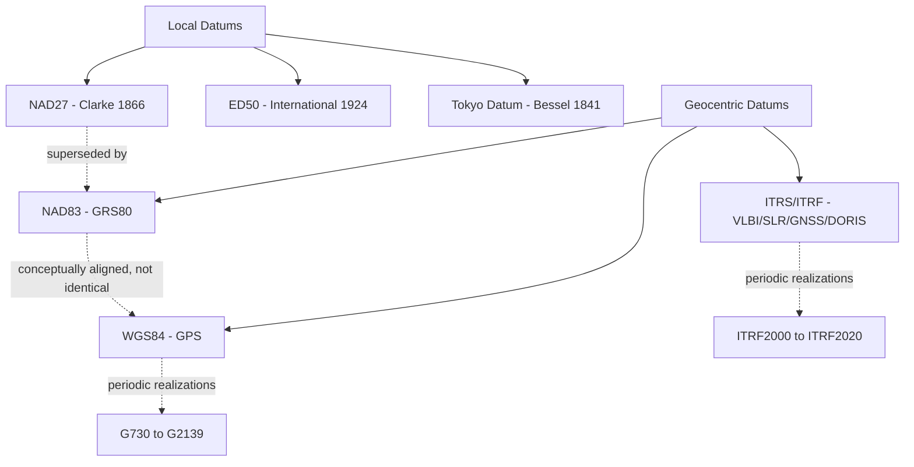

## Geodetic Datums and Reference Frames

### Overview

A geodetic datum defines the position, orientation, and scale of a coordinate system relative to the Earth, linking abstract latitude/longitude/height values to physical locations on the ground. Reference frames are the practical realization of datums through networks of physically monumented or satellite-tracked control points. Understanding datums is essential because identical coordinate values under different datums can represent locations tens to hundreds of meters apart.

### Datum vs. Reference Frame vs. Reference Ellipsoid

These three terms are related but distinct:

- **Reference ellipsoid**: The mathematical surface (defined by $a$, $f$) approximating Earth's shape — purely geometric, no positioning information.
- **Geodetic datum**: A reference ellipsoid plus a defined origin, orientation, and scale relative to the physical Earth (historically anchored to a single ground point; modern datums anchor to Earth's center of mass).
- **Reference frame (realization)**: The physical/observational implementation of a datum at a specific epoch, expressed as coordinates of a set of control stations (e.g., continuously operating GNSS reference stations) whose positions are periodically re-measured and refined.

A single datum (e.g., ITRS) can have multiple realizations over time (ITRF2000, ITRF2008, ITRF2014, ITRF2020), each incorporating updated observational data and refined station coordinates.

### Classification of Datums

#### Local (Classical) Datums

Local datums fit a reference ellipsoid to match the geoid closely over a specific region, anchored at a single ground origin point where the ellipsoid and geoid are forced to coincide.

- **NAD27** (North American Datum 1927): Based on the Clarke 1866 ellipsoid, origin at Meades Ranch, Kansas. Optimized for North America but diverges significantly from the geocentric reference elsewhere.
- **Tokyo Datum**: Based on the Bessel 1841 ellipsoid, historically used across Japan and parts of East Asia.
- **ED50** (European Datum 1950): Based on the International 1924 (Hayford) ellipsoid.

**Characteristic limitation**: Local datums are non-geocentric (their ellipsoid center is offset from Earth's actual center of mass by tens to hundreds of meters) and are only accurate within their region of definition — they degrade rapidly outside their fitted area.

#### Geocentric (Global) Datums

Geocentric datums are anchored to Earth's center of mass, making them consistent worldwide and compatible with satellite positioning.

- **WGS84** (World Geodetic System 1984): The datum underlying GPS; uses the WGS84 ellipsoid ($a = 6{,}378{,}137.0$ m, $f = 1/298.257223563$); realized and refined periodically (WGS84 (G730), (G873), (G1150), (G1674), (G2139), etc.) as GPS tracking data improves.
- **ITRF** (International Terrestrial Reference Frame): The most precise global reference frame, maintained by the IERS (International Earth Rotation and Reference Systems Service); realizes the ITRS (International Terrestrial Reference System) using VLBI, SLR, GNSS, and DORIS observations from globally distributed stations.
- **NAD83** (North American Datum 1983): Geocentric datum using the GRS80 ellipsoid, designed to replace NAD27; conceptually aligned with (but not identical to) WGS84 due to independent realizations and tectonic plate motion corrections.

### Diagram: Datum Relationships and Evolution



### Why Datums Matter: The Coordinate Shift Problem

Because different datums use different ellipsoids and origins, the same physical point yields different latitude/longitude values under each datum. In the continental US, the NAD27-to-NAD83 shift can be on the order of tens to over a hundred meters depending on location, while NAD83-to-WGS84 differences are typically under a meter in North America but can be larger in regions with significant tectonic motion since the datum's reference epoch.

**Practical failure mode**: Overlaying a NAD27 shapefile directly onto a WGS84 basemap without reprojection causes visible positional offset — a very common GIS error, especially with legacy survey and cadastral data.

### Datum Transformation Methods

#### 1. Molodensky Transformation (Direct Geodetic)

Approximates the shift between two datums using differences in ellipsoid parameters and a 3-parameter translation, applied directly to geodetic coordinates without converting to Cartesian:

$$\Delta\phi \approx f(\Delta a, \Delta f, \Delta X, \Delta Y, \Delta Z, \phi, \lambda, h)$$

Computationally efficient but less accurate than Helmert-based approaches, especially over larger areas.

#### 2. Helmert (7-Parameter / Bursa-Wolf) Transformation

Converts between geocentric Cartesian (ECEF) coordinate systems using 3 translations, 3 rotations, and 1 scale factor:

$$\mathbf{X}_{target} = \mathbf{T} + (1+s)\,\mathbf{R}\,\mathbf{X}_{source}$$

This is the standard method for high-accuracy datum transformations (e.g., older NAD27-to-NAD83 conversions, international datum shifts) and was covered in matrix form under Matrix Operations in Geospatial Computing.

#### 3. Grid-Based (NADCON, NTv2, HARN) Transformations

Instead of a single formula, these use dense interpolation grids of empirically observed shifts across a region, offering much higher local accuracy than parametric (Helmert/Molodensky) methods because they capture non-uniform, survey-based distortions.

- **NADCON/NADCON5**: Official US grid-based transformation between NAD27, NAD83, and its various realizations (HARN, CORS96, etc.), maintained by NOAA's National Geodetic Survey.
- **NTv2**: A grid-shift format used internationally (Canada, Australia, Germany) for high-precision datum transformations.

**Practical example — datum transformation with `pyproj`:**

```python
from pyproj import Transformer

# NAD27 to WGS84
transformer = Transformer.from_crs("EPSG:4267", "EPSG:4326", always_xy=True)
lon_wgs84, lat_wgs84 = transformer.transform(-122.4194, 37.7749)  # NAD27 coords
print(lon_wgs84, lat_wgs84)
```

`pyproj` (via PROJ) automatically selects the best available transformation pipeline — grid-based when shift grids are installed, falling back to Helmert/Molodensky parameters otherwise.

### Datum Epochs and Time-Dependent Coordinates

Because tectonic plates move continuously (several cm/year in many regions), geocentric reference frames like ITRF include a **reference epoch** — coordinates are only exactly valid at that epoch, and require velocity models to project to other dates.

$$\mathbf{X}(t) = \mathbf{X}(t_0) + \mathbf{V} \cdot (t - t_0)$$

where $\mathbf{V}$ is the station velocity vector (typically from plate motion models like NNR-NUVEL1A or regional models such as HTDP for North America).

This is why modern high-precision geodesy increasingly reports coordinates as "ITRF2014 at epoch 2020.5" rather than as a single static value — critical for applications like crustal deformation monitoring, precise agriculture, and infrastructure monitoring in tectonically active regions.

### Vertical Datums

Distinct from horizontal datums, vertical datums define the reference surface for elevation measurements:

- **NAVD88** (North American Vertical Datum 1988): Orthometric height system for North America, referenced to a single tidal benchmark.
- **NGVD29** (National Geodetic Vertical Datum 1929): Older US vertical datum, largely superseded by NAVD88.
- **Geoid-based systems** (e.g., using EGM2008 or region-specific geoid models like GEOID18): Increasingly used to relate ellipsoidal GPS heights directly to orthometric heights without a fixed tidal benchmark.

Mixing horizontal and vertical datums incorrectly (a common error when combining GPS-derived elevation with legacy elevation datasets) produces systematic vertical errors, as covered under Shape and Size of the Earth ($h = H + N$).

### Regional and National Datum Examples

| Region | Common Datum | Reference Ellipsoid |
| --- | --- | --- |
| United States (modern) | NAD83 (2011) | GRS80 |
| United States (legacy) | NAD27 | Clarke 1866 |
| Global / GPS | WGS84 | WGS84 |
| Europe (modern) | ETRS89 | GRS80 |
| Philippines | PRS92 (Philippine Reference System 1992) | Clarke 1866 (historically), now WGS84-aligned |
| Australia | GDA2020 / GDA94 | GRS80 |
| Japan | JGD2011 | GRS80 |

[Unverified] Exact current adoption status and transition timelines for national datums vary by country and are periodically updated by national mapping agencies; consult the relevant national geodetic authority for current legal/official datum status.

### Practical Implications for GIS Workflows

- **Always verify the EPSG code / CRS metadata** of incoming datasets before spatial overlay — datum mismatches are a leading cause of silent, hard-to-detect positional errors.
- **Reprojection is not the same as datum transformation**: changing map projection alone does not correct for datum differences; both may be needed simultaneously (a "reprojection + datum shift" pipeline).
- **Precision-critical applications** (cadastral surveying, engineering, deformation monitoring) should use grid-based transformations (NADCON/NTv2) rather than simplified 3- or 7-parameter approximations wherever available.
- **Time-series geospatial data** spanning years to decades in tectonically active regions should account for datum epoch differences, not just spatial reprojection.

### Related Topics

- Shape and Size of the Earth (Sphere, Ellipsoid, Geoid)
- Matrix Operations in Geospatial Computing (Helmert Transformation)
- Map Projections and Coordinate Reference Systems (EPSG Registry)
- GNSS Positioning and Precise Point Positioning (PPP)
- Plate Tectonics and Crustal Deformation Monitoring
- Vertical Datum Modeling and Geoid Undulation Grids
- CRS Metadata Standards (WKT, PROJ strings, EPSG codes)