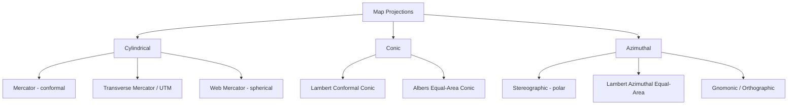

## Geographic and Projected Coordinate Systems

### Overview

Coordinate systems provide the mathematical framework for locating positions on or near Earth's surface. Geographic Coordinate Systems (GCS) express location using angular units on a curved reference surface, while Projected Coordinate Systems (PCS) transform those angular coordinates onto a flat plane using linear (Cartesian) units. Understanding both is essential for spatial analysis, distance/area calculation, and interoperability across GIS software.

### Geographic Coordinate Systems (GCS)

#### Definition and Components

A GCS defines location using latitude ($\phi$) and longitude ($\lambda$) on a three-dimensional reference surface (typically an ellipsoid). A complete GCS definition requires:

1. **Angular unit** (typically decimal degrees)
2. **Prime meridian** (typically Greenwich, 0°)
3. **Datum** (which implies a reference ellipsoid — see Geodetic Datums and Reference Frames)

$$-90° \le \phi \le 90°, \qquad -180° \le \lambda \le 180°$$

**Common GCS examples:**

| GCS | Datum | EPSG Code |
| --- | --- | --- |
| WGS84 | WGS84 | EPSG:4326 |
| NAD83 | NAD83 | EPSG:4269 |
| NAD27 | NAD27 | EPSG:4267 |
| ETRS89 | ETRS89 | EPSG:4258 |
| GDA2020 | GDA2020 | EPSG:7844 |

#### Key Characteristic: Angular, Not Linear

Because GCS coordinates are angular, the physical ground distance represented by one degree of longitude varies with latitude:

$$\text{distance per degree longitude} \approx \frac{\pi}{180} \cdot a \cdot \cos\phi$$

At the equator, one degree of longitude ≈ 111.32 km; at 60° latitude, it shrinks to roughly half that. This is why measuring distance or area directly in decimal degrees (e.g., naive Euclidean distance on raw lat/lon) produces significant, latitude-dependent errors — a very common beginner GIS mistake.

```python
import math

def deg_lon_to_km(lat_deg, a=6378.137):
    return (math.pi / 180) * a * math.cos(math.radians(lat_deg))

print(deg_lon_to_km(0))    # ~111.32 km at equator
print(deg_lon_to_km(60))   # ~55.66 km at 60° latitude
```

### Projected Coordinate Systems (PCS)

#### Definition and Purpose

A PCS applies a mathematical transformation (a map projection) to convert the curved GCS surface into planar $(x, y)$ Cartesian coordinates, typically in meters or feet. This enables:

- Accurate linear distance and area measurement (within the projection's design tolerances)
- Compatibility with raster grids, planar geometry algorithms, and most spatial analysis operations
- Consistent scale within a limited zone of coverage

A PCS definition requires: an underlying GCS, a projection method (e.g., Transverse Mercator, Lambert Conformal Conic), projection parameters (central meridian, standard parallels, false easting/northing, scale factor), and linear units.

#### The Fundamental Trade-off: No Flat Map Is Perfect

Because a curved surface cannot be flattened without distortion (a consequence of Gauss's *Theorema Egregium*), every projection must sacrifice at least one of the following properties:

- **Conformality** (shape/angle preservation)
- **Equal-area** (area preservation)
- **Equidistance** (distance preservation, and only along specific lines)
- **True direction** (azimuth preservation from a central point)

No projection preserves all four simultaneously — projection choice is a matter of prioritizing which distortion type is acceptable for the intended use.

### Major Projection Families

#### Cylindrical Projections

Project the ellipsoid onto a cylinder, then unroll it.

- **Mercator**: Conformal; extreme area distortion at high latitudes (Greenland appears far larger than its true size relative to Africa); historically used for nautical navigation due to straight-line rhumb lines.
- **Transverse Mercator**: Cylinder oriented along a meridian instead of the equator; basis for UTM and many national grid systems; minimizes distortion in narrow north-south zones.
- **Web Mercator (EPSG:3857)**: A spherical (not ellipsoidal) variant of Mercator used by virtually all web mapping platforms (Google Maps, OpenStreetMap tiles) for computational simplicity and consistent north-up tile rendering, at the cost of not being a legally/scientifically rigorous CRS for precise measurement.

#### Conic Projections

Project onto a cone, typically secant at two standard parallels — well-suited for mid-latitude regions with greater east-west than north-south extent.

- **Lambert Conformal Conic (LCC)**: Conformal; widely used for aeronautical charts and regional/national grids (e.g., many US State Plane zones, French Lambert-93).
- **Albers Equal-Area Conic**: Preserves area; commonly used for thematic mapping of countries with east-west extent (e.g., US Census Bureau national maps).

#### Azimuthal (Planar) Projections

Project onto a plane tangent (or secant) to the globe at a single point — best suited for polar regions or when direction from a central point matters.

- **Stereographic**: Conformal; used in polar mapping (e.g., Universal Polar Stereographic, UPS) and some national grids at high latitudes.
- **Lambert Azimuthal Equal-Area**: Preserves area; used in some continental and hemispheric thematic maps.
- **Orthographic/Gnomonic**: Used for visualization (globe-like appearance) or great-circle navigation (Gnomonic renders great circles as straight lines).

### Diagram: Projection Family Classification



### The Universal Transverse Mercator (UTM) System

UTM is the most widely used global projected coordinate system for medium-to-large scale mapping, dividing the world into 60 north-south zones, each 6° of longitude wide, using Transverse Mercator projection centered on each zone's central meridian.

**Key parameters per zone:**

- Central meridian scale factor: 0.9996 (slightly less than 1, to balance distortion across the zone width)
- False easting: 500,000 m (ensures no negative easting values within a zone)
- False northing: 0 m (Northern Hemisphere) or 10,000,000 m (Southern Hemisphere, to avoid negative northing)

```python
from pyproj import CRS, Transformer

# WGS84 geographic to UTM Zone 51N (covers the Philippines)
crs_geo = CRS.from_epsg(4326)
crs_utm = CRS.from_epsg(32651)  # WGS84 / UTM zone 51N

transformer = Transformer.from_crs(crs_geo, crs_utm, always_xy=True)
easting, northing = transformer.transform(120.9842, 14.5995)  # Manila
print(easting, northing)
```

**Limitation**: UTM zone boundaries create discontinuities — features spanning two zones require special handling (either accepting distortion by extending one zone's projection, or splitting/reprojecting per zone).

### National and Regional Grid Systems

Many countries define local Transverse Mercator or Lambert-based grids optimized for their territory:

- **State Plane Coordinate System (US)**: Zone-based system (often Transverse Mercator or Lambert Conformal Conic depending on state shape) designed to keep distortion below 1:10,000 within each zone — used extensively in US surveying and engineering.
- **British National Grid (OSGB36)**: Single Transverse Mercator projection covering all of Great Britain.
- **Philippine Transverse Mercator (PTM) / PRS92 zones**: Zone-based Transverse Mercator system used in Philippine cadastral and engineering surveys.

### Choosing a Coordinate System: Practical Guidance

| Use Case | Recommended CRS Type |
| --- | --- |
| Web map display / basemap tiles | Web Mercator (EPSG:3857) |
| Global data storage / interchange | Geographic WGS84 (EPSG:4326) |
| Area calculation (country/regional scale) | Equal-area projection (Albers, Lambert Azimuthal EA) |
| Distance/engineering measurement (local scale) | UTM or national grid (e.g., State Plane) |
| Navigation / bearing-based routing | Conformal projection (Mercator, LCC, Stereographic) |
| Polar region mapping | Polar Stereographic / UPS |

**Critical practice**: Never perform area or distance calculations directly on geographic (lat/lon) coordinates using planar geometry formulas — always reproject to an appropriate equal-area or equidistant PCS first, or use geodesic (ellipsoidal) calculation functions (e.g., `pyproj.Geod`) that operate correctly on the ellipsoid.

```python
import geopandas as gpd

gdf = gpd.read_file("parcels.shp")  # assume EPSG:4326
gdf_projected = gdf.to_crs(epsg=32651)  # reproject to UTM zone 51N before area calc
gdf["area_m2"] = gdf_projected.geometry.area
```

### CRS Identification and Metadata Standards

- **EPSG codes**: Numeric identifiers (maintained by the International Association of Oil & Gas Producers' Geomatics Committee) uniquely identifying a specific CRS definition (e.g., EPSG:4326, EPSG:32651).
- **WKT (Well-Known Text)**: Human-readable text representation fully describing a CRS's datum, ellipsoid, projection, and parameters.
- **PROJ strings**: Compact key-value format (e.g., `+proj=utm +zone=51 +datum=WGS84`) used internally by the PROJ library for transformation pipelines.

```python
from pyproj import CRS

crs = CRS.from_epsg(32651)
print(crs.to_wkt(pretty=True))
print(crs.to_proj4())
```

### Related Topics

- Geodetic Datums and Reference Frames
- Shape and Size of the Earth (Sphere, Ellipsoid, Geoid)
- Matrix Operations in Geospatial Computing (Affine Transformations, Jacobians)
- Map Projection Distortion Analysis (Tissot's Indicatrix)
- CRS Transformation Pipelines and the PROJ Library
- Equal-Area vs. Conformal Projection Selection for Thematic Mapping
- Vector and Raster Reprojection Workflows in GIS Software