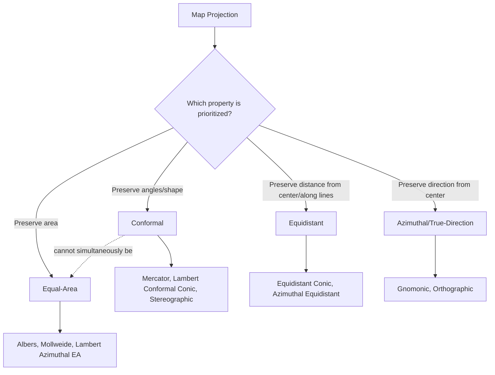

## Map Projections and Distortion Properties

### Overview

Every map projection transforms the curved surface of the Earth onto a flat plane, and this transformation inevitably introduces distortion. Understanding the mathematical nature of this distortion — and how to quantify, visualize, and select projections to minimize it for a given purpose — is central to cartographic and geospatial analysis competency.

### Why Distortion Is Unavoidable

Gauss's *Theorema Egregium* (1827) proves that the Gaussian curvature of a surface is an intrinsic property preserved only under isometric (distance-preserving) mappings. Since a sphere/ellipsoid has non-zero constant curvature and a plane has zero curvature, no mapping between them can preserve all geometric properties simultaneously. Every projection must distort at least one of: shape, area, distance, or direction.

### The Four Distortion Properties

#### 1. Conformality (Shape/Angle Preservation)

A **conformal** projection preserves local angles and shapes at any given point (though shapes can still be distorted at large scale due to varying scale across the map). Meridians and parallels intersect at right angles, matching their relationship on the globe.

- Local shape accuracy is preserved infinitesimally, but this comes at the cost of area distortion, often severe at extremes (e.g., Mercator's exaggeration of high-latitude landmasses).
- Used for: navigation charts, topographic mapping at moderate scale, meteorological charts.
- Examples: Mercator, Transverse Mercator, Lambert Conformal Conic, Stereographic.

#### 2. Equal-Area (Equivalence)

An **equal-area** (equivalent) projection preserves the relative area of features, meaning any region's area on the map is proportional to its true area on Earth, regardless of location. This necessarily distorts shape, especially toward the map's edges or poles.

- Used for: thematic mapping (population density, land use, resource distribution), statistical/choropleth mapping where area comparison matters.
- Examples: Albers Equal-Area Conic, Lambert Azimuthal Equal-Area, Mollweide, Gall-Peters.

#### 3. Equidistance

An **equidistant** projection preserves true distance, but only along specific lines (typically from the center point or along meridians) — no projection can preserve all distances everywhere, since that would require preserving both angle and area (a contradiction).

- Used for: distance-radius maps from a specific point (e.g., airline route maps from a hub city), some seismic/radio propagation mapping.
- Examples: Equidistant Conic, Azimuthal Equidistant (famously used in the UN emblem, centered on the North Pole).

#### 4. True Direction (Azimuthality)

An **azimuthal** (or true-direction) projection preserves accurate directional bearings from one or more specified points, typically the center of the projection.

- Used for: navigation and aviation route planning, radio/seismic direction-finding.
- Examples: Gnomonic (great circles render as straight lines — used for great-circle route planning), certain azimuthal equidistant configurations.

**Important overlap**: These categories are not mutually exclusive across projection families, but a single projection instance cannot be simultaneously conformal and equal-area (except in the trivial case of an infinitesimally small area, where all projections are approximately correct).

### Diagram: Distortion Property Trade-offs



### Quantifying Distortion: Tissot's Indicatrix

Tissot's Indicatrix is the primary mathematical and visual tool for analyzing projection distortion at any point on a map. A small circle of fixed size on the globe is projected onto the map; the resulting shape (generally an ellipse) reveals the local distortion characteristics.

**Interpretation:**

- **Circle unchanged (same size, still circular)**: no distortion at that point (occurs at "standard lines" — points/lines of true scale).
- **Ellipse with equal area to the original circle**: equal-area projection at that point (area preserved, but shape/angle distorted).
- **Circle stays circular but changes size**: conformal projection at that point (shape preserved locally, but area distorted).
- **Ellipse elongated and area-changed**: neither property preserved (compromise projections).

**Mathematical basis** (linking to the Jacobian matrix from Matrix Operations in Geospatial Computing):

The principal scale factors $h$ (along meridians) and $k$ (along parallels) are the singular values of the projection's Jacobian matrix at a point. Area scale factor:

$$S = h \cdot k \cdot \sin\theta'$$

where $\theta'$ is the angle between the projected meridian and parallel. For a conformal projection, $h = k$ and $\theta' = 90°$ everywhere; for an equal-area projection, $S = 1$ everywhere regardless of $h, k$ individually.

### Compromise Projections

Compromise projections intentionally sacrifice all four properties partially to minimize overall visual distortion, particularly useful for general-reference world maps where no single property needs to be exact.

- **Robinson projection**: Widely used for 20th-century world atlases and National Geographic maps; balances area and shape distortion without being true to either.
- **Winkel Tripel**: Adopted by National Geographic Society in 1998 as their standard world map projection; minimizes combined distortion in area, direction, and distance.
- **Natural Earth projection**: Modern compromise projection designed specifically for aesthetically pleasing small-scale world maps.

### Practical Example: Comparing Distortion Numerically

```python
from pyproj import Geod, Transformer, CRS
import numpy as np

def area_distortion_factor(lon, lat, target_epsg, delta=0.01):
    """Approximate local area scale factor for a projection at a point."""
    geod = Geod(ellps="WGS84")
    crs_geo = CRS.from_epsg(4326)
    crs_proj = CRS.from_epsg(target_epsg)
    transformer = Transformer.from_crs(crs_geo, crs_proj, always_xy=True)

    # True geodesic area of a small quadrilateral on the ellipsoid
    lons = [lon-delta, lon+delta, lon+delta, lon-delta]
    lats = [lat-delta, lat-delta, lat+delta, lat+delta]
    true_area, _ = geod.polygon_area_perimeter(lons, lats)

    # Projected (planar) area of the same quadrilateral
    xs, ys = transformer.transform(lons, lats)
    proj_area = 0.5 * abs(sum(xs[i]*ys[(i+1) % 4] - xs[(i+1) % 4]*ys[i] for i in range(4)))

    return abs(proj_area) / abs(true_area)

# Compare distortion at equator vs. high latitude under Web Mercator (EPSG:3857)
print(area_distortion_factor(0, 10, 3857))    # near 1 (low distortion)
print(area_distortion_factor(0, 70, 3857))    # significantly > 1 (high distortion)
```

This kind of empirical comparison demonstrates why Web Mercator (EPSG:3857) is inappropriate for area-based analysis despite its ubiquity in web mapping — area distortion increases dramatically with latitude, approaching infinity at the poles.

### Distortion Behavior by Projection Family

| Projection | Type | Distortion Behavior |
| --- | --- | --- |
| Mercator | Cylindrical, Conformal | Extreme area inflation at high latitudes; poles cannot be shown |
| Transverse Mercator / UTM | Cylindrical, Conformal | Low distortion near central meridian, increases toward zone edges |
| Albers Equal-Area Conic | Conic, Equal-Area | Shape distortion increases away from standard parallels; area always preserved |
| Lambert Conformal Conic | Conic, Conformal | Low distortion between standard parallels; shape preserved locally everywhere |
| Robinson | Pseudocylindrical, Compromise | Moderate distortion of both shape and area throughout, worst near poles |
| Gnomonic | Azimuthal, Neither conformal nor equal-area | Extreme distortion away from center point; only usable for small regions or great-circle visualization |
| Mollweide | Pseudocylindrical, Equal-Area | Significant shape distortion near poles/edges; area always correct |

### Selecting Standard Parallels/Lines to Minimize Distortion

For conic and cylindrical projections, distortion is minimized along "standard lines" (standard parallels for conics, central meridian for transverse cylindrical). Choosing standard parallels appropriately for the region being mapped is a key practical skill:

- **Rule of thumb for Albers/Lambert conic projections**: place standard parallels at approximately 1/6 and 5/6 of the total latitudinal range being mapped, which approximately minimizes overall scale distortion across the mapped extent.
- For UTM/Transverse Mercator, zone width (6° of longitude) is chosen so that maximum scale distortion at zone edges stays within an acceptable bound (~0.04% for standard UTM parameters, though this varies by grid system implementation). [Inference] The precise distortion bound depends on the specific scale factor and zone width chosen by a given grid system, and is not identical across all Transverse Mercator implementations.

### Visualizing Distortion in GIS Software

Most desktop GIS platforms (QGIS, ArcGIS Pro) and libraries can render Tissot indicatrices programmatically for a chosen projection, providing an immediate visual diagnostic of where and how severely a given projection distorts a mapped area — a standard exercise when selecting a projection for a new cartographic product or spatial analysis workflow.

### Related Topics

- Geographic and Projected Coordinate Systems
- Matrix Operations in Geospatial Computing (Jacobian Matrices, Scale Factors)
- Geodetic Datums and Reference Frames
- Choosing Appropriate CRS for Thematic and Statistical Mapping
- Spherical vs. Ellipsoidal Projection Formulas
- Cartographic Generalization and Scale-Dependent Mapping
- Web Mapping Tile Systems and Web Mercator Limitations