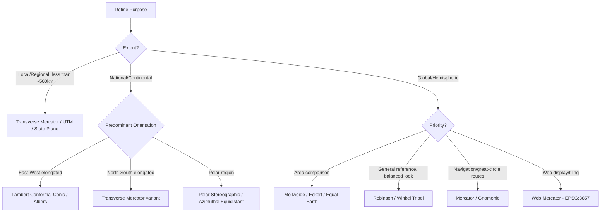

## Selecting Appropriate Projections

### Overview

Choosing the right map projection is a practical decision-making process that balances the geometric properties described under Map Projections and Distortion Properties against the specific requirements of a mapping or analysis task: geographic extent, latitude, purpose (navigation, analysis, visualization), and required precision. A poorly chosen projection can silently corrupt analytical results even when the map "looks fine" visually.

### Core Decision Framework

Projection selection generally proceeds through four sequential questions:

1. **What is the primary purpose?** (navigation, area comparison, distance measurement, general reference, web display)
2. **What is the geographic extent and shape of the area?** (small local area, country, continent, hemisphere, global)
3. **What is the predominant orientation of the area?** (east-west elongated, north-south elongated, roughly circular/compact, polar)
4. **What distortion property is least tolerable for this specific use case?**

### Diagram: Projection Selection Decision Flow



### Selection by Geographic Extent

#### Local and Regional Scale (City, County, Small Country)

At local scales, distortion from any reasonable projection is negligible, so selection is typically driven by existing standards and interoperability rather than distortion minimization.

- **UTM** (appropriate zone): Standard choice for engineering, cadastral, and general local GIS work; provides accurate distance/area in meters within a single zone.
- **National/State grids** (State Plane, British National Grid, PRS92/PTM zones): Preferred when working within an established legal or administrative survey framework, since they align with cadastral records and local regulations.
- **Local Transverse Mercator (custom central meridian)**: Sometimes defined for a specific project area to minimize scale distortion below standard UTM's 0.04% when tighter tolerance is required (e.g., large infrastructure projects).

#### National and Continental Scale

At this scale, the shape of the region and its orientation determine the optimal projection family:

- **East-west elongated countries/continents** (e.g., Russia, the continental US, most of Europe): Conic projections (Lambert Conformal Conic for conformality, Albers Equal-Area Conic for area accuracy) perform best because standard parallels can be placed to bracket the region's latitudinal extent.
- **North-south elongated countries** (e.g., Chile, Norway, the Philippines): Transverse Mercator-based projections (or a national TM variant) perform better, since the projection's low-distortion axis runs north-south along the central meridian.
- **Roughly square/compact regions**: Either conic or transverse cylindrical projections work reasonably well; national mapping agencies typically have an established standard.

#### Global and Hemispheric Scale

At global scale, no single projection is "correct" — selection depends entirely on which distortion is least acceptable for the map's purpose:

- **Thematic/statistical world maps** (population, GDP, climate data by area): Equal-area projections are mandatory when visually comparing quantities by region — Mollweide, Eckert IV, or the modern **Equal Earth projection** (designed in 2018 specifically to address Mollweide/Gall-Peters shape distortion complaints while preserving area accuracy).
- **General reference/atlas maps**: Compromise projections (Robinson, Winkel Tripel) that balance overall visual distortion without being analytically precise in any single property.
- **Navigation charts**: Mercator remains standard for marine navigation due to its rhumb-line (constant bearing) property, despite severe high-latitude area distortion.
- **Polar-focused global maps**: Azimuthal Equidistant or Polar Stereographic, since cylindrical and conic projections handle polar regions poorly (Mercator cannot even display the poles).

### Selection by Analytical Task

#### When Performing Area-Based Analysis

Always use an equal-area projection appropriate to the study region's extent, never geographic (lat/lon) coordinates or a conformal projection:

- Regional analysis: Albers Equal-Area Conic (parameterized with standard parallels bracketing the study area)
- National analysis: national equal-area standard (e.g., USA Contiguous Albers Equal Area Conic, EPSG:5070, for the continental US)
- Global analysis: Equal Earth, Mollweide, or a Cylindrical Equal-Area variant

```python
import geopandas as gpd

# Example: reproject to an appropriate equal-area CRS before area calculation
gdf = gpd.read_file("provinces.shp")  # assume EPSG:4326
gdf_ea = gdf.to_crs("ESRI:102028")  # Asia North Albers Equal Area Conic, illustrative
gdf["area_km2"] = gdf_ea.geometry.area / 1e6
```

#### When Performing Distance-Based Analysis

Use a projection appropriate to the study area's shape and extent, or use geodesic (ellipsoid-based) distance functions directly rather than relying on a projection's planar distances:

- Small-to-regional extent: UTM or a local Transverse Mercator (distances accurate to within the zone's designed tolerance)
- Large or irregular extent: `pyproj.Geod` geodesic calculations directly on the ellipsoid, bypassing projection distortion entirely (as demonstrated under Shape and Size of the Earth)

#### When Building a Web Map or Tile Service

Web Mercator (EPSG:3857) is the practical default due to universal compatibility with tile-serving infrastructure (Leaflet, Mapbox GL, Google Maps, OpenStreetMap), even though it is not appropriate for measurement — a deliberate trade-off between interoperability/performance and geometric accuracy.

**Best practice**: Store and analyze data in an appropriate CRS (geographic WGS84 for interchange, an equal-area or UTM projection for analysis), and reproject to Web Mercator only at the final display/rendering step.

### Common Projection Selection Mistakes

- **Using Web Mercator for area or distance analysis**: A frequent error since it is the default CRS in many web mapping libraries; area distortion can exceed several hundred percent at high latitudes.
- **Applying a single UTM zone across a region spanning multiple zones**: Causes increasing distortion and even coordinate ambiguity near zone boundaries; requires either a custom central meridian or splitting analysis by zone.
- **Ignoring datum differences when selecting a "matching" projection**: Two datasets can use the same projection type (e.g., both Transverse Mercator) but different underlying datums, causing misalignment — projection and datum must both be verified (see Geodetic Datums and Reference Frames).
- **Choosing a projection based on visual appeal alone for analytical (not cartographic display) work**: Compromise projections like Robinson are excellent for atlases but unsuitable for any quantitative spatial analysis.

### Reference Table: Quick Selection Guide

| Scenario | Recommended Projection |
| --- | --- |
| Local engineering/survey project | UTM (correct zone) or local grid system |
| Country-level topographic mapping (E-W elongated) | Lambert Conformal Conic |
| Country-level topographic mapping (N-S elongated) | Transverse Mercator (national variant) |
| Country/continent thematic mapping (area-sensitive) | Albers Equal-Area Conic |
| World map for statistical/choropleth comparison | Equal Earth or Mollweide |
| World map for general reference/atlas | Robinson or Winkel Tripel |
| Marine/aeronautical navigation | Mercator (or Lambert Conformal Conic for aviation charts) |
| Great-circle route visualization | Gnomonic |
| Polar region mapping (Arctic/Antarctic) | Polar Stereographic or Azimuthal Equidistant |
| Web map tile display | Web Mercator (EPSG:3857) |
| Data storage/interchange | Geographic WGS84 (EPSG:4326) |

### Practical Workflow Example: Selecting and Validating a Projection in Python

```python
from pyproj import CRS
import geopandas as gpd

gdf = gpd.read_file("study_area.shp")

# Determine appropriate UTM zone automatically from data extent
utm_crs = gdf.estimate_utm_crs()
print(utm_crs)  # e.g., "WGS 84 / UTM zone 51N"

gdf_utm = gdf.to_crs(utm_crs)
gdf["area_m2"] = gdf_utm.geometry.area
gdf["perimeter_m"] = gdf_utm.geometry.length
```

Modern geospatial libraries (`geopandas`, `pyproj`) include automatic UTM zone estimation utilities, reducing manual selection error for local-to-regional analysis, though equal-area or national-standard projections still require deliberate selection based on the criteria above.

### Related Topics

- Map Projections and Distortion Properties
- Geographic and Projected Coordinate Systems
- Geodetic Datums and Reference Frames
- Automated CRS Selection Tools in GIS Libraries
- Cartographic Design Principles for Thematic Mapping
- Web Mapping Architecture and Tile Pyramid Systems
- Custom Projection Parameterization (Standard Parallels, Central Meridian)