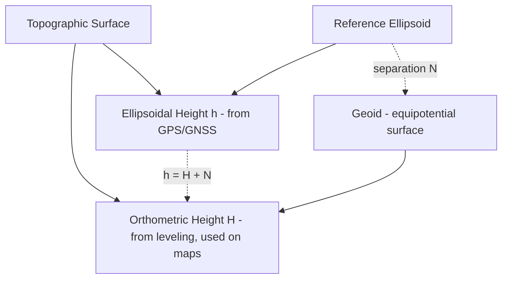

## Vertical Datums and Elevation Reference Systems

### Overview

While horizontal datums define position on Earth's surface (latitude/longitude), vertical datums define the reference surface from which elevation (height) is measured. Vertical referencing is a frequent source of error in geospatial workflows because multiple incompatible height systems are in common use simultaneously, and mixing them without proper conversion introduces systematic errors that can reach tens of meters.

### The Three Height Types

As introduced under Shape and Size of the Earth, three related but distinct height quantities exist:

$$h = H + N$$

- **Ellipsoidal height ($h$)**: Height measured perpendicular to the reference ellipsoid surface; this is what GPS/GNSS receivers measure directly and natively output.
- **Orthometric height ($H$)**: Height measured along the plumb line above the geoid (approximately mean sea level); this is the height used in traditional leveling surveys, topographic maps, and most engineering elevation datasets.
- **Geoid undulation ($N$)**: The separation between the geoid and the ellipsoid at a given location, obtained from a geoid model.

### Diagram: Height System Relationships



### Types of Vertical Datums

#### Tidal (Mean Sea Level) Datums

Historically, vertical datums were established by averaging sea level observations at one or more coastal tide gauges over a defined epoch, then extending that reference inland via spirit-leveling networks.

- **NGVD29** (National Geodetic Vertical Datum of 1929, US): Based on mean sea level observations at 26 tide gauges in the US and Canada; largely superseded due to accumulated leveling errors and the fact that "mean sea level" is not actually a single equipotential surface (it varies regionally due to ocean currents, salinity, and temperature).
- **NAVD88** (North American Vertical Datum of 1988): Referenced to a single fixed benchmark (Father Point/Rimouski, Quebec) rather than multiple tide gauges, using a more rigorous least-squares adjustment of the leveling network; the current official vertical datum for the US and Canada.

**Key limitation of tidal datums**: They are geopotential in nature (based on physical leveling and gravity) but historically not directly compatible with satellite-derived ellipsoidal heights without a geoid model bridging the two.

#### Geoid-Based (Gravimetric) Vertical Datums

Modern vertical referencing increasingly relies on gravimetric geoid models computed from satellite gravity missions, terrestrial gravity data, and altimetry, rather than tide-gauge networks.

- **EGM96 / EGM2008** (Earth Gravitational Model): Global geoid models widely used to convert between ellipsoidal (GPS) heights and approximate orthometric heights anywhere on Earth, without requiring local leveling data.
- **GEOID12B / GEOID18** (US NGS regional geoid models): Higher-resolution, regionally refined geoid models for the US, used to compute NAVD88 orthometric heights from GPS-derived ellipsoidal heights with much greater accuracy than global models alone.
- **Next-generation US datum (NAPGD2022 / NATRF2022)**: A modernization effort by NOAA's National Geodetic Survey to replace NAVD88 with a fully GNSS/gravimetric-based vertical datum, eliminating dependence on the aging leveling network. [Unverified] Exact implementation timeline and final naming/parameters should be confirmed against current NGS publications, as datum modernization projects are periodically revised.

#### Local and National Vertical Datums

Most countries maintain their own vertical datum, typically tied to a local mean sea level reference:

| Country/Region | Vertical Datum |
| --- | --- |
| United States | NAVD88 (transitioning toward NAPGD2022) |
| Philippines | Philippine Reference Level / Manila Bay-based leveling network |
| United Kingdom | Ordnance Datum Newlyn (ODN) |
| Australia | Australian Height Datum (AHD) |
| Global gravimetric standard | EGM2008 geoid |

[Unverified] Specific national vertical datum names, reference epochs, and current adoption status vary by country and are subject to periodic revision by national geodetic authorities; verify against the relevant national mapping/geodetic agency for authoritative current status.

### Practical Conversion: Ellipsoidal to Orthometric Height

```python
from pyproj import Transformer

# Convert WGS84 ellipsoidal height to NAVD88 orthometric height using a geoid grid
# (requires an appropriate geoid grid file, e.g., from PROJ's data resources)
transformer = Transformer.from_crs(
    "EPSG:4979",   # WGS84 3D geographic (lat, lon, ellipsoidal height)
    "EPSG:5703",   # NAVD88 height
    always_xy=True
)

lon, lat, h_ellipsoidal = -122.4194, 37.7749, 45.2  # example GPS reading
result = transformer.transform(lon, lat, h_ellipsoidal)
print(result)  # orthometric height output
```

`pyproj`/PROJ performs this conversion using installed geoid grid files (e.g., `us_noaa_g2018u0.tif` for GEOID18); without the correct grid installed, PROJ either fails the transformation or falls back to a less accurate global model, so grid availability should always be verified for precision work.

### Sources of Vertical Reference Error

- **Datum confusion in DEM data**: Public DEM products (SRTM, ASTER GDEM, Copernicus DEM) reference heights to specific geoid models (e.g., SRTM uses EGM96), which may differ from a project's chosen vertical datum by meters; mixing DEM sources without harmonizing their vertical reference introduces artificial elevation discontinuities.
- **GPS elevation vs. map elevation mismatch**: A GPS device displaying "raw" ellipsoidal height instead of geoid-corrected orthometric height will disagree with printed topographic map elevations by an amount equal to the local geoid undulation $N$ (which can be significant depending on region).
- **Datum epoch drift**: Vertical land motion (subsidence, uplift, glacial isostatic adjustment) means that a fixed benchmark's orthometric height can change over years to decades, particularly relevant in areas of significant groundwater extraction, tectonic activity, or post-glacial rebound.
- **Confusing "sea level" as a universal zero**: Mean sea level is not a single global equipotential surface — it varies regionally by up to roughly 1–2 meters due to currents, temperature, and salinity, which is precisely why modern geoid-based datums (rather than local tide-gauge datums) are preferred for global consistency.

### Vertical Datum Considerations in Common Geospatial Workflows

- **DEM/DTM processing and hydrological modeling**: Flow direction and watershed delineation algorithms are sensitive to vertical datum consistency across merged elevation tiles; mismatched vertical references can create false sinks or incorrect flow paths at tile boundaries.
- **LiDAR point cloud georeferencing**: LiDAR systems typically capture ellipsoidal heights directly from onboard GNSS/IMU; converting to a project's required orthometric datum requires an explicit geoid model step, often handled within LiDAR processing software (e.g., during strip alignment and ground classification).
- **Sea level rise and coastal vulnerability modeling**: Requires careful reconciliation between tidal datums (used for storm surge and flood mapping, often referenced to Mean Higher High Water or similar tidal epochs) and orthometric/geoid-based elevation datasets, since these can differ meaningfully in low-relief coastal zones where small vertical errors have large spatial consequences.
- **Building Information Modeling (BIM) and infrastructure design**: Typically require decimeter-to-centimeter vertical accuracy tied to the local orthometric datum, making geoid model selection and grid resolution a critical design decision, distinct from horizontal CRS choice.

### CRS Codes for Vertical Reference in Practice

Modern CRS registries (EPSG) define **compound CRS** combining a horizontal and vertical component explicitly, avoiding ambiguity:

```python
from pyproj import CRS

# Compound CRS: NAD83 horizontal + NAVD88 vertical
compound = CRS.from_user_input("EPSG:6318+5703")
print(compound.name)
```

Explicitly specifying a compound CRS (rather than assuming a default vertical reference) is considered best practice for any dataset where elevation values will be used quantitatively, particularly when integrating data from multiple sources or agencies.

### Related Topics

- Shape and Size of the Earth (Ellipsoidal Height vs. Orthometric Height)
- Geodetic Datums and Reference Frames
- Geoid Models and Gravimetric Geodesy (EGM2008, Regional Geoid Grids)
- DEM/DTM Processing and Hydrological Terrain Analysis
- LiDAR Point Cloud Georeferencing Pipelines
- Sea Level Rise Modeling and Tidal Datum Reconciliation
- Compound and 3D Coordinate Reference Systems