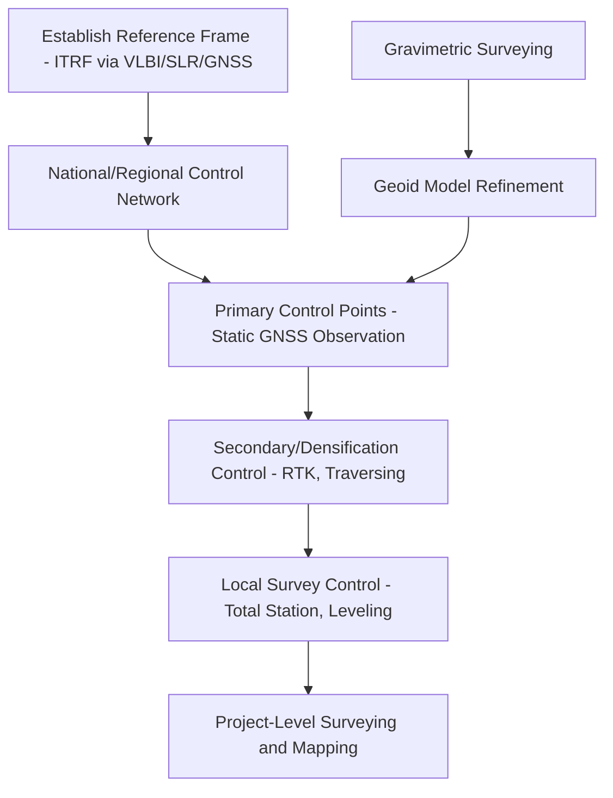

## Geodetic Surveying Fundamentals


### Overview

Geodetic surveying is the practice of precisely measuring positions, distances, angles, and elevations on Earth's surface while explicitly accounting for the Earth's curvature and gravity field — distinguishing it from plane surveying, which assumes a flat Earth and is only valid over limited distances (typically under 10–15 km before curvature effects become significant for high-precision work). Geodetic surveying underpins the establishment and maintenance of control networks, datums, and reference frames covered in earlier chapter items.

### Plane Surveying vs. Geodetic Surveying

| Aspect | Plane Surveying | Geodetic Surveying |
| --- | --- | --- |
| Earth model assumption | Flat plane | Curved ellipsoid/geoid |
| Valid extent | Small areas (local sites, typically <10-15 km) | Regional to global |
| Coordinate system | Local/arbitrary Cartesian | Geodetic (lat/lon/height) or projected |
| Curvature correction | Ignored | Explicitly modeled |
| Typical applications | Construction layout, small parcel surveys | Control networks, national mapping, tectonic monitoring |
| Accuracy requirement | Often centimeter-level over short baselines | Millimeter-to-centimeter over long baselines |

### Core Geodetic Measurement Techniques

#### Triangulation

Historically the primary method for establishing horizontal control networks before electronic distance measurement and satellite positioning became widespread. A network of triangles is measured by observing angles at each vertex (using theodolites), with at least one baseline distance measured directly to fix the network's scale.

$$\frac{a}{\sin A} = \frac{b}{\sin B} = \frac{c}{\sin C}$$

Triangulation networks were adjusted using least-squares methods to distribute measurement error across the entire network, forming the basis of many historical national geodetic networks (including the original triangulation chains used to define datums like NAD27).

#### Trilateration

Similar to triangulation but measures distances (rather than angles) between network points directly, typically using Electronic Distance Measurement (EDM) instruments that measure phase shift or time-of-flight of a modulated light or microwave signal.

$$d = \frac{c \cdot \Delta t}{2}$$

where $c$ is the speed of light (or signal propagation speed) and $\Delta t$ is the round-trip travel time.

#### Traversing

A sequential method of establishing control by measuring a connected series of distances and angles between successive points, typically closing back to a known point or line to allow error detection and adjustment (closure check).

$$\sum \Delta x = 0, \qquad \sum \Delta y = 0 \quad \text{(for a closed traverse, ideally)}$$

Any non-zero closure error is distributed across the traverse points using an adjustment method (e.g., compass rule, least-squares) proportional to each leg's contribution to total traverse length.

#### Leveling (Spirit Leveling)

The classical method for establishing precise vertical control, using a leveling instrument and calibrated rods to measure height differences between points through a series of setups (backsight/foresight readings).

$$H_B = H_A + (BS - FS)$$

Precise/geodetic-grade leveling accounts for systematic effects including rod calibration error, refraction, Earth curvature (relevant even over moderate distances at leveling precision), and **orthometric correction** (accounting for the fact that level surfaces are not exactly parallel due to gravity variations with latitude and elevation).

### Modern Geodetic Techniques

#### GNSS (Global Navigation Satellite System) Surveying

The dominant modern method for establishing both horizontal and vertical control, using signals from GPS, GLONASS, Galileo, BeiDou, and other constellations.

- **Static GNSS**: Long observation sessions (hours) at fixed points, post-processed against reference stations for millimeter-to-centimeter accuracy — used for primary geodetic control networks.
- **RTK (Real-Time Kinematic)**: Corrections broadcast in real time from a base station (or network of reference stations, "Network RTK") to a rover receiver, achieving centimeter-level accuracy instantly in the field.
- **PPP (Precise Point Positioning)**: Uses precise satellite orbit and clock corrections (rather than a local base station) to achieve high accuracy from a single receiver, useful in remote areas without nearby reference infrastructure.

#### VLBI (Very Long Baseline Interferometry)

Measures the difference in arrival time of radio signals from distant quasars at widely separated radio telescopes, providing extremely precise baseline length measurements over intercontinental distances. VLBI is one of the primary techniques used to realize and maintain the ITRF (International Terrestrial Reference Frame), and contributes to monitoring Earth orientation parameters (polar motion, length of day).

#### Satellite Laser Ranging (SLR)

Measures precise round-trip travel time of laser pulses reflected off retroreflector-equipped satellites, contributing to precise orbit determination and geocenter (Earth's center of mass) monitoring — another key input to ITRF realization.

#### Gravimetric Surveying

Measures local variations in Earth's gravitational field using gravimeters (absolute or relative), essential for:

- Refining geoid models (linking ellipsoidal and orthometric heights, as covered under Vertical Datums and Elevation Reference Systems)
- Detecting subsurface density anomalies (resource exploration, geological studies)
- Monitoring mass changes (groundwater depletion, ice sheet mass balance) via satellite gravimetry missions (GRACE, GRACE-FO)

### Diagram: Geodetic Control Network Establishment Workflow



### Geodetic Network Hierarchy

Geodetic control is typically organized hierarchically by accuracy order, with higher-order (more precise) networks providing the framework within which lower-order, denser networks are established and adjusted:

- **First-order (primary) networks**: Highest precision, sparse, continental/national scale (e.g., CORS — Continuously Operating Reference Stations)
- **Second-order networks**: Regional densification, tied rigidly to first-order control
- **Third-order and below**: Local project-level control, often established by RTK GNSS or total station traversing tied back to higher-order points

### Least-Squares Adjustment in Geodetic Networks

Because all measurements contain random error, and geodetic networks are typically overdetermined (more measurements than strictly needed to fix positions), least-squares adjustment is used to find the most probable set of coordinates consistent with all observations simultaneously.

$$\mathbf{v} = \mathbf{A}\mathbf{x} - \mathbf{l}, \qquad \hat{\mathbf{x}} = (\mathbf{A}^T\mathbf{P}\mathbf{A})^{-1}\mathbf{A}^T\mathbf{P}\mathbf{l}$$

where $\mathbf{A}$ is the design (Jacobian) matrix relating observations to unknown parameters, $\mathbf{P}$ is the weight matrix (inverse of the observation covariance matrix), $\mathbf{l}$ is the observation vector, and $\mathbf{v}$ is the residual vector. This directly connects to the matrix algebra concepts covered under Matrix Operations in Geospatial Computing — geodetic network adjustment is one of the classic applications of weighted least squares in geospatial computing.

### Sources of Error in Geodetic Surveying

- **Atmospheric effects**: Tropospheric and ionospheric delay affect both EDM and GNSS signal propagation, requiring correction models or dual-frequency observation to mitigate.
- **Instrumental error**: Calibration drift in EDM instruments, leveling rods, or GNSS antenna phase center variations.
- **Earth tides and loading effects**: Solid Earth tides, ocean loading, and atmospheric pressure loading cause small (centimeter-level or smaller) periodic deformations that matter for the highest-precision geodetic work (VLBI, SLR, precise GNSS).
- **Multipath and signal obstruction**: GNSS-specific error from signal reflection off nearby surfaces, mitigated through antenna design, site selection, and processing techniques.
- **Network adjustment blunders**: Gross errors (misidentified points, transcription errors) that must be detected through statistical testing (e.g., data snooping, Baarda's test) during least-squares adjustment.

### Practical Example: Simple GNSS Baseline Adjustment Concept

```python
import numpy as np

# Simplified illustrative example: weighted least squares position adjustment
# A: design matrix, l: observation vector, P: weight matrix (diagonal, from observation variances)
A = np.array([[1, 0], [0, 1], [1, 1]])  # simplified observation equations
l = np.array([10.02, 5.01, 15.00])       # observed values
P = np.diag([1/0.01**2, 1/0.01**2, 1/0.02**2])  # weights = 1/variance

ATP = A.T @ P
x_hat = np.linalg.inv(ATP @ A) @ ATP @ l  # least-squares adjusted parameters
print(x_hat)
```

This mirrors (in simplified form) the core computational step performed by professional geodetic network adjustment software (e.g., NGS's ADJUST, or modern GNSS processing suites), which handle much larger and more complex observation sets with rigorous covariance propagation.

### Applications of Geodetic Surveying

- Establishing and maintaining national/global control networks (CORS, ITRF stations)
- Monitoring tectonic plate motion, crustal deformation, and volcanic/seismic hazard zones
- Precise engineering surveys for large infrastructure (dams, bridges, tunnels) requiring millimeter-level deformation monitoring
- Boundary and cadastral surveying requiring legal-grade positional accuracy
- Supporting geoid model refinement through gravimetric and GNSS/leveling combination surveys
- Providing ground truth control for photogrammetry, LiDAR, and satellite remote sensing georeferencing

### Related Topics

- Matrix Operations in Geospatial Computing (Least-Squares Adjustment)
- Geodetic Datums and Reference Frames (ITRF Realization via VLBI/SLR/GNSS)
- Vertical Datums and Elevation Reference Systems (Leveling and Orthometric Correction)
- GNSS Positioning Techniques (Static, RTK, PPP)
- Geoid Model Refinement through Gravimetric Surveying
- Error Propagation and Statistical Testing in Survey Networks
- Photogrammetric and LiDAR Ground Control Point Establishment