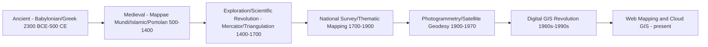

## History and Evolution of Cartography

### Overview

Cartography — the art, science, and technology of making maps — has evolved from rudimentary clay tablets and hand-drawn portolan charts to satellite-derived, algorithmically generated digital maps rendered in real time. This evolution reflects parallel advances in geodesy, mathematics, printing technology, and computing, and provides essential context for understanding why modern GIS and map design conventions exist in their current form.

### Ancient and Classical Cartography (c. 2300 BCE – 500 CE)

#### Earliest Known Maps

- **Babylonian clay tablets** (c. 2300 BCE): Among the earliest known maps, depicting local land plots and, later, the famous *Imago Mundi* (c. 600 BCE) — a schematic world map showing Babylon at the center surrounded by a circular ocean.
- **Egyptian cadastral surveying**: Practical land-measurement techniques developed for re-establishing field boundaries after the annual Nile flooding, an early precursor to surveying-based mapping.

#### Greek Contributions: The Mathematical Foundation

Greek scholars established the mathematical and geodetic principles that underlie cartography to this day.

- **Anaximander** (6th century BCE): Credited with creating one of the first Greek world maps.
- **Eratosthenes** (c. 276–194 BCE): Calculated Earth's circumference using shadow-angle measurements (covered under Shape and Size of the Earth); also coined the term "geography."
- **Hipparchus** (2nd century BCE): Proposed a systematic grid of latitude and longitude for locating places, and applied spherical trigonometry to cartographic problems.
- **Claudius Ptolemy** (c. 100–170 CE): Authored *Geographia*, compiling coordinates for thousands of locations and proposing early map projections (including a conic projection); his work remained the foundational cartographic reference in the Western world for over 1,300 years, though many of his coordinate estimates contained significant errors due to limited and unreliable distance data of the era.

### Medieval Cartography (500–1400 CE)

#### European Mappae Mundi

Medieval European maps, known as *mappae mundi*, were often more symbolic and theological than geographically accurate, typically organized in a "T-O" format with Jerusalem at the center and reflecting religious cosmology rather than precise spatial measurement.

#### Islamic Golden Age Cartography

Scholars in the Islamic world preserved, translated, and significantly advanced Ptolemaic geography during a period when much of this knowledge was less actively developed in Europe.

- **Al-Khwarizmi** (9th century): Revised and corrected many of Ptolemy's geographic coordinates.
- **Al-Idrisi** (12th century): Produced the *Tabula Rogeriana*, an extensively detailed world map and geographic compendium commissioned by King Roger II of Sicily, notable for its relative accuracy for the period.

#### Portolan Charts

Emerging in the 13th century, portolan charts were highly practical navigational charts marked with rhumb lines (constant compass bearing lines) radiating from compass roses, used extensively by Mediterranean sailors — representing a shift toward empirically-derived, function-driven mapping distinct from the symbolic mappae mundi tradition.

### Age of Exploration and the Scientific Revolution (1400–1700 CE)

#### The Printing Revolution

The invention of the printing press (mid-15th century) enabled mass reproduction of maps, dramatically increasing their availability, standardization, and the speed at which new geographic discoveries could be disseminated.

#### Mercator and the Rise of Mathematical Projection

- **Gerardus Mercator** (1569): Developed the Mercator projection specifically to solve a practical navigation problem — enabling sailors to plot straight-line courses of constant bearing (rhumb lines) directly on a flat chart, a innovation whose underlying conformal cylindrical mathematics remains foundational to web mapping today (as covered under Map Projections and Distortion Properties).
- **Ortelius's *Theatrum Orbis Terrarum*** (1570): Widely regarded as the first true modern atlas, standardizing map format, scale, and compilation from multiple sources into a unified reference work.

#### Triangulation and Scientific Surveying

- **Gemma Frisius** (1533): Described the method of triangulation for accurate large-area surveying, a technique that would underpin national mapping efforts for the next four centuries (as covered under Geodetic Surveying Fundamentals).
- **The Cassini family** (17th–18th century France): Conducted the first systematic triangulation-based national survey (the Carte de Cassini), establishing cartography as a state scientific enterprise rather than purely a commercial or artistic endeavor.

### National Mapping and Thematic Cartography (1700–1900 CE)

#### Establishment of National Survey Agencies

The 18th and 19th centuries saw the formal establishment of national mapping institutions (e.g., the UK's Ordnance Survey, founded 1791, originally for military purposes following the Jacobite risings), reflecting the increasing state interest in precise territorial mapping for taxation, military planning, and infrastructure development.

#### Birth of Thematic Mapping

- **Edmond Halley** (1701): Produced isogonic charts showing magnetic declination — an early example of thematic (non-topographic) mapping.
- **William Smith** (1815): Created the first nationwide geological map (of England, Wales, and part of Scotland), pioneering the systematic mapping of subsurface/scientific phenomena.
- **John Snow** (1854): Famously mapped cholera deaths in London's Soho district, visually correlating cases with a specific water pump — widely cited as a foundational example of spatial analysis and disease mapping (an early precursor to modern GIS-based epidemiology).
- **Charles Minard** (1869): Created his renowned flow map depicting Napoleon's Russian campaign losses, considered a landmark achievement in multivariate data visualization combining geography, troop numbers, temperature, and time.

### The 20th Century: Toward Digital Cartography

#### Aerial Photography and Photogrammetry

World War I and II drove rapid advances in aerial photography and photogrammetric mapping techniques, enabling far faster and more detailed topographic mapping than ground-based triangulation and leveling alone.

#### Satellite Geodesy and Remote Sensing

- **Launch of Sputnik (1957)** and subsequent satellite tracking enabled the first precise geocentric geodetic measurements, eventually leading to global datums like WGS84.
- **Landsat 1 (1972)**: The first civilian Earth observation satellite, inaugurating the era of systematic, repeatable satellite-based remote sensing for land cover and environmental mapping.
- **Development of GPS** (operational from the 1990s): Revolutionized field surveying, navigation, and the general public's access to precise positioning, directly enabling the geodetic datums and coordinate systems covered earlier in this chapter.

#### The Computer Cartography Revolution

- **1960s–1970s**: Early computer-assisted cartography systems emerged, including the Canada Geographic Information System (CGIS, 1963) — widely regarded as the first true GIS, developed by Roger Tomlinson for land-use inventory and analysis.
- **Harvard Laboratory for Computer Graphics and Spatial Analysis** (founded 1965): Developed early influential software (SYMAP, ODYSSEY) that shaped the trajectory of digital cartographic and GIS software development.
- **1980s–1990s**: Commercial GIS platforms (ESRI's ARC/INFO, founded 1982) matured, transitioning cartography from a manual drafting discipline to a database-driven, algorithmic process.

### Diagram: Timeline of Major Cartographic Eras

### The Web Mapping and Democratization Era (2000s–Present)

- **Google Maps and Google Earth (2005)**: Brought interactive, satellite-imagery-based web mapping to a mass consumer audience, popularizing the Web Mercator projection (EPSG:3857) as a de facto web standard, as discussed under Geographic and Projected Coordinate Systems.
- **OpenStreetMap (founded 2004)**: Pioneered the crowdsourced, open-data mapping model, fundamentally changing how base map data is collected, licensed, and maintained.
- **Rise of open-source GIS and geospatial data science**: Tools such as QGIS, PostGIS, GDAL, and Python/R geospatial libraries (`geopandas`, `rasterio`, `sf`) have progressively lowered the barrier to entry for advanced spatial analysis, shifting cartography from a specialized discipline toward a broadly accessible data science skill.
- **Real-time and dynamic cartography**: Modern web mapping (Mapbox GL, deck.gl, Leaflet) enables interactive, data-driven, continuously updating maps (live traffic, weather, tracking), a fundamental shift from cartography's historically static, printed nature.

### Recurring Themes Across Cartographic History

- **Accuracy vs. purpose trade-off**: From Ptolemy's coordinate compilations to modern equal-area vs. conformal projection choices, cartography has consistently balanced geometric precision against the practical needs of the map's intended use.
- **Technology-driven paradigm shifts**: Printing, triangulation, aerial photography, satellite geodesy, and digital computing have each, in turn, fundamentally restructured what maps could depict and how quickly they could be produced and disseminated.
- **From centralized/institutional to democratized production**: Mapping has progressively shifted from state/religious institutions (mappae mundi, national ordnance surveys) toward crowdsourced and individually accessible tools (OpenStreetMap, consumer GIS software).
- **Recurring reliance on foundational mathematics**: Concepts established by Hipparchus, Ptolemy, and Mercator — coordinate grids, spherical trigonometry, and conformal projection — remain directly embedded in modern digital mapping systems, illustrating strong continuity beneath rapid technological change.

### Related Topics

- Map Projections and Distortion Properties
- Geodetic Surveying Fundamentals (Triangulation, Leveling History)
- Geographic and Projected Coordinate Systems
- Thematic Mapping and Data Visualization Techniques
- History of Geodesy and Satellite Positioning Systems
- Open-Source GIS Ecosystem (QGIS, PostGIS, GDAL)
- Web Mapping Architecture and Tile Pyramid Systems