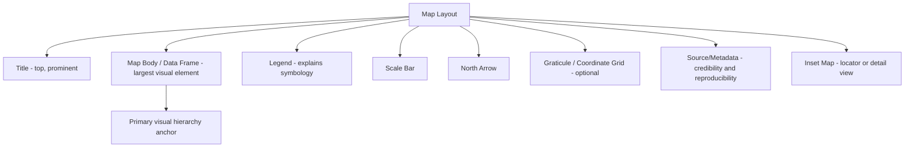

## Map Elements and Layout Design

### Overview

Effective map layout design combines essential informational elements with visual hierarchy principles to communicate spatial information clearly and accurately. A well-designed map balances completeness (providing enough context for correct interpretation) against visual clutter (overwhelming the reader with unnecessary elements), while guiding the eye naturally from the primary map content to supporting reference information.

### Essential Map Elements

#### 1. Title

States the map's subject, and often its geographic extent or time period, in language accessible to the intended audience. Should be prominent (largest text on the layout) but not overwhelming relative to the map body itself.

- **Best practice**: Answer "what, where, when" concisely — e.g., "Population Density by Province, Philippines, 2020" rather than a vague "Map of the Philippines."

#### 2. Map Body (Data Frame)

The primary visual content — the actual spatial data being communicated. Should occupy the largest and most visually dominant portion of the layout (typically 60–80% of the total page area in printed/static map design).

#### 3. Legend

Explains the meaning of symbols, colors, and patterns used in the map body. Must be complete (every distinct symbol/color used in the map appears in the legend) but not redundant (avoid listing self-evident base map elements like "ocean = blue" unless genuinely ambiguous).

- **Ordering convention**: Legend items are typically ordered logically — by value magnitude for choropleth/graduated symbols, or by category importance/frequency for qualitative data.
- **Placement**: Should not obscure important map content; commonly placed in a visually "empty" area of the map (e.g., ocean space, or outside the main data frame in a dedicated panel).

#### 4. Scale Indicator

Communicates the relationship between map distance and real-world distance, critical since virtually all maps are reduced representations of reality.

- **Representative Fraction (RF)**: A ratio (e.g., 1:50,000) meaning 1 unit on the map equals 50,000 of the same unit on the ground; unit-independent but requires the reader to perform mental calculation.
- **Verbal scale**: A stated equivalence (e.g., "1 inch equals 1 mile"); intuitive but tied to specific units.
- **Graphic (bar) scale**: A visual ruler-like element; the only scale type that remains accurate if the map is resized or reproduced at a different scale (a critical advantage for digital/printed reproduction), since RF and verbal scales become incorrect if the map image is scaled.

#### 5. North Arrow / Orientation Indicator

Indicates map orientation, particularly important when north is not aligned with the top of the page (common in some projections, oblique views, or maps oriented for specific compositional reasons).

- **Convention**: Omit or minimize prominence for well-known, standard north-up orientations (e.g., typical web maps); include prominently whenever orientation deviates from the north-up convention or when the audience cannot be assumed to know the default orientation.

#### 6. Coordinate/Graticule Reference

Grid lines or tick marks showing latitude/longitude or projected coordinate values, enabling readers to identify specific locations by coordinate reference — essential for technical, military, engineering, and navigational maps; often omitted or minimized on general-reference thematic maps to reduce visual clutter.

#### 7. Data Source and Metadata

Citation of data sources, projection/datum information, publication date, and author/agency — critical for credibility, reproducibility, and correct technical interpretation (particularly projection/datum metadata, without which quantitative reuse of the map's spatial data is unreliable).

#### 8. Inset Maps

Smaller supplementary maps showing either: (a) broader geographic context (a "locator map" showing where the main map area sits within a larger region), or (b) a zoomed-in detail view of a densely-featured sub-area that cannot be legibly shown at the main map's scale.

### Diagram: Standard Map Layout Composition



### Visual Hierarchy Principles

Visual hierarchy is the deliberate arrangement and styling of map elements so the reader's attention flows naturally from most important to least important information.

#### Establishing Hierarchy Through Design Variables

- **Size**: Larger symbols/text draw attention first; the map title and primary thematic data should have the largest visual weight.
- **Color and value (lightness/darkness)**: Higher contrast and more saturated colors draw the eye; reserve strong colors for the primary data layer, using muted tones for reference/background layers (base map, administrative boundaries).
- **Contrast and figure-ground organization**: The map's primary subject (figure) should be visually distinct from its background (ground) — achieved through contrast in value, saturation, or detail level, ensuring readers instantly distinguish the thematic content from base reference layers.
- **Placement and grouping**: Elements related in meaning or function should be spatially grouped (Gestalt proximity principle) — e.g., legend and scale bar often grouped together in a "map furniture" cluster distinct from the map body.

#### Common Hierarchy Mistakes

- **Overly prominent base map layers**: Street networks, labels, or administrative boundaries rendered with equal or greater visual weight than the thematic data, competing for attention rather than supporting it.
- **Legend/title text competing with map body**: Excessive font size or bold styling on secondary elements causing them to visually dominate the primary map content.
- **Uniform visual weight across unequal-importance features**: Failing to differentiate major vs. minor roads, primary vs. secondary cities, etc., causing the map to appear visually "flat" and undifferentiated.

### Layout Composition and Balance

#### The Visual Center and Grid-Based Layout

Human perception tends to focus slightly above and left of a page's mathematical center — the "optical center" — so primary map content is often positioned to align with this perceptual center rather than the page's true geometric center. Grid-based layout systems (dividing the page into a consistent column/row structure) help achieve balanced, professional-looking element placement across title, body, legend, and metadata blocks.

#### White Space (Negative Space)

Deliberate empty space around and between map elements improves readability and prevents visual overload; a common design flaw in beginner cartographic work is over-filling the layout with excessive elements, decorative borders, or unnecessary annotation.

#### Typography in Map Design

- **Font selection**: Serif fonts are often used for printed/traditional maps for readability in dense text (place names); sans-serif fonts are common for modern/digital and technical thematic maps for cleaner rendering at small sizes and on screens.
- **Label placement conventions**: Point features are typically labeled to the upper-right by default (avoiding overlap with the point symbol); linear features (rivers, roads) are labeled parallel to and following the feature's curvature; areal features (countries, water bodies) are labeled with text that fits within or spans the feature's extent, often spaced/curved to match the shape.
- **Type hierarchy**: Font size, weight (bold/regular), and case (all-caps for certain feature classes, e.g., water bodies in many cartographic traditions) are used systematically to distinguish feature categories (cities vs. countries vs. physical features) without needing separate legend explanation for every text style.

### Color Theory in Map Design

- **Sequential color schemes**: Ordered, single-hue or graduated palettes (light to dark) for representing ordered/quantitative data (e.g., population density, elevation) — darker/more saturated typically implies higher value.
- **Diverging color schemes**: Two-hue palettes diverging from a neutral midpoint, used for data with a meaningful zero/critical threshold (e.g., temperature anomaly, population change: positive vs. negative).
- **Qualitative color schemes**: Distinct, non-ordered hues for categorical (nominal) data (e.g., land use classification), chosen to be visually distinguishable without implying rank/order.
- **Colorblind-safe palette design**: Selecting hues distinguishable under common color vision deficiencies (deuteranopia, protanopia); tools like ColorBrewer provide pre-tested colorblind-safe palettes widely used in cartographic and GIS software.

```python
# Example: applying a ColorBrewer sequential palette in matplotlib for a choropleth
import matplotlib.pyplot as plt
import geopandas as gpd

gdf = gpd.read_file("provinces.shp")
gdf.plot(column="population_density", cmap="YlOrRd", legend=True,
          scheme="quantiles", k=5, edgecolor="black", linewidth=0.3)
plt.title("Population Density by Province")
plt.axis("off")
plt.show()
```

### Layout Design for Different Map Purposes

| Map Purpose | Layout Priority |
| --- | --- |
| Navigation/reference map | Clear road/feature hierarchy, prominent scale and north arrow |
| Thematic/choropleth map | Prominent, clear legend; muted base layers; strong data-layer contrast |
| Scientific/technical map | Full metadata, coordinate grid, projection/datum documentation |
| Story map / public communication | Simplified element set, strong title, minimal technical clutter |
| Atlas page | Consistent layout template across all pages; standardized legend/scale conventions |

### Digital and Interactive Map Layout Considerations

Web and interactive maps introduce layout considerations distinct from static printed maps:

- **Responsive layout**: Map elements (legend, scale, controls) must adapt to varying screen sizes, often collapsing into toggleable panels on mobile devices.
- **Layered information disclosure**: Interactive maps can defer secondary information (detailed legends, metadata, source citations) to on-demand popups/panels rather than permanently occupying screen space, unlike static maps which must show all necessary context simultaneously.
- **Dynamic scale bars**: Must update in real time as users zoom, since interactive maps do not have a single fixed scale like a printed map.
- **Basemap and layer toggling**: Interactive layout must accommodate user controls for switching basemaps and toggling data layers on/off, a layout element with no equivalent in static cartography.

### Related Topics

- History and Evolution of Cartography
- Choropleth and Thematic Mapping Techniques
- Color Theory and Colorblind-Safe Palette Design
- Typography and Label Placement Algorithms in GIS
- Web Map Interface and Interaction Design
- Cartographic Generalization and Scale-Dependent Symbolization
- Visual Variables and Semiotics in Map Design (Bertin's Visual Variables)