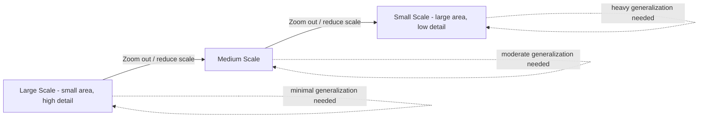
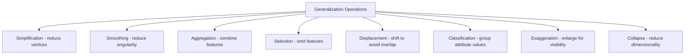

## Map Scale and Generalization

### Overview

Map scale defines the relationship between distance on a map and corresponding distance on the ground, while cartographic generalization is the systematic process of simplifying, selecting, and adjusting geographic data so it remains legible and meaningful at a given scale. These two concepts are inseparable in practice: as scale decreases (zooming out, representing larger areas in the same map space), generalization becomes increasingly necessary because full-detail data becomes illegible or computationally impractical to render.

### Understanding Map Scale

#### Scale Expression Types

- **Representative Fraction (RF)**: Expressed as a ratio or fraction (e.g., 1:24,000 or 1/24,000), meaning one unit of map distance equals 24,000 of the same unit on the ground. Unit-independent, making it usable regardless of measurement system.
- **Verbal Scale**: A stated equivalence in specific units (e.g., "1 centimeter equals 500 meters"), more intuitive for general audiences but tied to particular units.
- **Graphic (Bar) Scale**: A visual scale bar; uniquely scale-stable under image resizing/reproduction, since RF and verbal scales become inaccurate if the map graphic itself is enlarged or reduced without recalculation.

#### Large Scale vs. Small Scale (A Frequent Point of Confusion)

Counterintuitively, "large scale" refers to maps with a **large RF value relative to 1** (e.g., 1:1,000 is larger than 1:1,000,000), representing **smaller geographic areas in greater detail**. "Small scale" maps cover larger areas with less detail.

$$\text{RF} = \frac{1}{\text{denominator}}$$

A smaller denominator (e.g., 1,000) yields a larger fraction/scale value than a larger denominator (e.g., 1,000,000) — hence "1:1,000 is large scale" despite the number 1,000 being numerically smaller than 1,000,000.

| Scale Category | Typical RF Range | Coverage Example | Detail Level |
| --- | --- | --- | --- |
| Large scale | 1:1,000 to 1:25,000 | City block, small town | High detail (individual buildings) |
| Medium scale | 1:25,000 to 1:250,000 | County, region | Moderate detail (roads, settlements) |
| Small scale | 1:250,000 to 1:1,000,000+ | Country, continent, world | Low detail (major features only) |

### Diagram: Scale-Generalization Relationship



### Why Generalization Is Necessary

At smaller scales, the same real-world area is represented in far less map space, creating several unavoidable problems if data is displayed unmodified:

- **Graphic congestion**: Features too close together to render as distinct symbols at reduced scale (e.g., closely spaced buildings, dense road networks).
- **Loss of legibility**: Extremely small or thin features (narrow rivers, minor roads) become sub-pixel or sub-millimeter in size and effectively disappear or render incorrectly.
- **Semantic overload**: Displaying every available attribute/feature at small scale overwhelms the map's communicative purpose, obscuring the intended message with irrelevant detail.
- **Computational/rendering performance**: For digital/web maps, rendering full-resolution vector data at all zoom levels is computationally wasteful and slows interactive performance.

### The Core Generalization Operations

Cartographic generalization is typically decomposed into a standard set of operations, most systematically formalized in the cartographic literature (notably by McMaster and Shea):

#### 1. Simplification

Reducing the number of vertices in a line or polygon while preserving its essential shape characteristics.

- **Douglas-Peucker algorithm**: The most widely implemented line simplification algorithm; recursively identifies and removes vertices that fall within a specified perpendicular distance tolerance of a simplified line segment.

```python
from shapely.geometry import LineString

line = LineString([(0,0), (1,0.1), (2,-0.1), (3,5), (4,6), (5,7), (6,8.1), (7,9)])
simplified = line.simplify(tolerance=0.5, preserve_topology=True)
print(len(line.coords), "->", len(simplified.coords))
```

- **Visvalingam-Whyatt algorithm**: An alternative simplification method based on iteratively removing the vertex contributing the smallest triangular area to the line's shape, often producing more visually natural simplification results than Douglas-Peucker at aggressive tolerances.

#### 2. Smoothing

Reducing angularity and sharp direction changes in a line without necessarily reducing vertex count, typically applied after simplification to improve visual aesthetics (e.g., Gaussian smoothing, spline-based smoothing of coastlines or contour lines).

#### 3. Aggregation

Combining multiple nearby small features into a single representative feature when individual features cannot be meaningfully distinguished at the target scale (e.g., combining a cluster of small buildings into a single "built-up area" polygon).

#### 4. Selection (Feature Elimination)

Deciding which features to retain or omit entirely at a given scale, typically driven by a minimum size/importance threshold or a systematic selection rule (e.g., "retain all cities above 50,000 population" for a small-scale national map).

**Radical Law (Töpfer's Law)**: A classical formula estimating how many features should be retained at a reduced scale relative to the original:

$$n_f = n_a \sqrt{\frac{M_a}{M_f}}$$

where $n_f$ is the number of features to retain at the final (smaller) scale, $n_a$ is the number of features at the original (larger) scale, and $M_a$, $M_f$ are the corresponding scale denominators.

#### 5. Displacement

Shifting features slightly from their true position to avoid visual overlap or ambiguity when multiple features would otherwise coincide or collide at the target scale/symbol size (e.g., separating a road and a parallel railway that would visually merge at small scale).

#### 6. Classification (Symbolization Generalization)

Grouping continuous or many-valued attribute data into a smaller number of discrete classes for symbolization purposes (e.g., converting continuous elevation values into a fixed set of hypsometric color bands) — connects directly to classification schemes used in choropleth/thematic mapping.

#### 7. Exaggeration

Deliberately enlarging a feature beyond its true relative size to preserve its visual/functional significance at small scale (e.g., widening a narrow but strategically important river or road beyond its true-to-scale width so it remains visible and recognizable).

#### 8. Collapse (Dimensional Generalization)

Converting a feature from one geometric dimension to a simpler one as scale decreases — e.g., a city represented as a detailed polygon (building footprints) at large scale collapsing to a single point symbol at small scale, or a river represented as a double-line polygon at large scale collapsing to a single line at small scale.

### Diagram: Generalization Operations Overview



### Generalization in Modern GIS and Web Mapping

#### Multi-Representation and Scale-Dependent Rendering

Modern web mapping systems avoid manually generalizing separate datasets for every zoom level by instead applying **scale-dependent rendering rules** dynamically at render time, or by maintaining pre-generalized data at discrete zoom "levels of detail" (LOD).

```python
# Example: scale-dependent rendering logic in a web map style specification (conceptual)
# QGIS/Mapbox-style scale-based rule (pseudocode representation)
rules = [
    {"min_zoom": 0,  "max_zoom": 8,  "simplify_tolerance": 500},
    {"min_zoom": 9,  "max_zoom": 12, "simplify_tolerance": 50},
    {"min_zoom": 13, "max_zoom": 22, "simplify_tolerance": 0},  # full detail
]
```

#### Vector Tiles and Pre-Generalized Data Pyramids

Vector tile formats (e.g., Mapbox Vector Tiles) commonly pre-generalize source data into a pyramid of zoom-level-specific tile sets, applying simplification, aggregation, and feature selection programmatically (often via tools like Tippecanoe) so the client only ever renders appropriately generalized data for the current zoom level, balancing visual quality against transfer/rendering performance.

```python
# Simplification tolerance in Shapely, applied per output zoom-level dataset
import geopandas as gpd

gdf = gpd.read_file("roads_full_detail.geojson")

# Coarser tolerance for small-scale (zoomed-out) output
gdf_small_scale = gdf.copy()
gdf_small_scale["geometry"] = gdf.simplify(tolerance=0.01, preserve_topology=True)
```

#### Algorithmic and Machine Learning Approaches to Generalization

Beyond classical rule-based algorithms, contemporary research explores machine learning (including deep learning models trained on cartographer-generalized examples) to automate generalization decisions that traditionally required expert cartographic judgment — an active research area rather than a fully mature production standard as of current practice. [Inference] The maturity and production readiness of ML-based generalization approaches varies significantly by feature type and use case, and this remains an evolving area of cartographic research and tooling.

### Practical Considerations and Common Pitfalls

- **Over-simplification distorting topology**: Aggressive vertex reduction (especially without `preserve_topology=True` in tools like Shapely) can create self-intersecting polygons, gaps, or overlaps between previously adjacent features.
- **Inconsistent generalization across a dataset**: Applying different simplification tolerances inconsistently across related features (e.g., adjacent administrative boundaries) can create visible seams or mismatches at boundaries that were originally coincident.
- **Ignoring feature importance in selection**: Purely size- or area-based feature elimination (e.g., automatically removing all polygons under an area threshold) can inadvertently remove small but functionally/thematically important features (e.g., a small but strategically significant island or facility).
- **Confusing simplification with data reduction for storage**: While simplification does reduce file size, it should be scale-appropriate and purpose-driven rather than applied purely as a compression technique, since over-simplified geometry may misrepresent the data if later reused at a larger scale than intended.

### Related Topics

- Map Elements and Layout Design
- Choropleth and Thematic Mapping Classification Methods
- Vector Tile Architecture and Web Map Rendering Pipelines
- Douglas-Peucker and Visvalingam-Whyatt Algorithm Implementation Details
- Multi-Scale and Multi-Representation Database Design in GIS
- Topology Preservation in Vector Data Processing
- Cartographic Data Compression and Storage Optimization