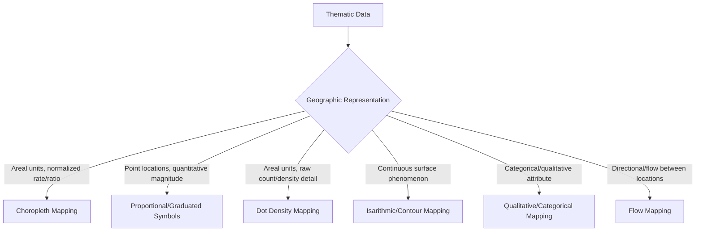

## Thematic Mapping Techniques


### Overview

Thematic mapping communicates the spatial distribution of a specific attribute or theme (population, income, temperature, land use) as opposed to general-reference mapping, which depicts multiple features (roads, boundaries, terrain) for orientation purposes. The choice of thematic mapping technique depends critically on the data's measurement level (nominal, ordinal, interval, ratio) and its geographic representation (discrete points, continuous surfaces, or bounded areas).

### Choropleth Mapping

Choropleth maps shade or pattern predefined areal units (countries, states, census tracts) according to a classified data value, making them the most common thematic mapping technique for administratively-bounded statistical data.

#### Classification Methods

Since choropleth maps require continuous data to be divided into a finite number of classes, the classification method chosen significantly affects the map's visual message.

- **Equal Interval**: Divides the data range into classes of equal width; simple to interpret but can produce poorly populated classes if data is skewed.
- **Quantile**: Places an equal number of observations in each class; ensures visually balanced class sizes but can group dissimilar values together or split similar values apart if data has natural clusters.
- **Natural Breaks (Jenks)**: Minimizes within-class variance and maximizes between-class variance by identifying natural clustering in the data distribution; often considered the most statistically defensible default for genuinely clustered data.
- **Standard Deviation**: Classes are defined relative to the mean in units of standard deviation, useful for highlighting how far individual values deviate from the average — particularly suited to diverging color schemes.

$$\text{Jenks Goodness of Variance Fit (GVF)} = \frac{SDAM - SDCM}{SDAM}$$

where $SDAM$ is the sum of squared deviations from the array mean and $SDCM$ is the sum of squared deviations from class means; higher GVF indicates a better-fitting classification.

```python
import geopandas as gpd
import mapclassify

gdf = gpd.read_file("provinces.shp")

# Natural breaks (Jenks) classification with 5 classes
classifier = mapclassify.NaturalBreaks(gdf["population_density"], k=5)
gdf["class"] = classifier.yb
print(classifier.bins)
```

#### Normalization: The Critical Choropleth Requirement

**Raw count data should almost never be choropleth-mapped directly** — larger areal units will appear to have "more" of a value simply due to their size or population, not necessarily higher intensity. Data must be normalized (converted to a rate, ratio, density, or percentage) before choropleth classification.

- **Correct**: Population *density* (people per km²), *percentage* of population in poverty, income *per capita*
- **Incorrect (common error)**: Raw population count, raw number of crimes (without normalizing by area or population), absolute counts of any kind mapped directly by administrative area

### Proportional and Graduated Symbol Mapping

Represents point-located (or point-reduced) quantitative data using symbols (typically circles) scaled in size according to data magnitude — appropriate for data tied to specific locations (cities, facilities, events) rather than areal units.

#### Symbol Scaling Methods

- **Proportional (mathematically scaled) symbols**: Symbol area is directly proportional to data value; mathematically accurate but can produce very large or very small symbols at data extremes, and human perception tends to underestimate area differences (Stevens' power law), meaning strictly proportional scaling can visually understate true differences.
- **Graduated (ranged/classed) symbols**: Data is classified into a small number of size categories (similar to choropleth classification), trading precise mathematical accuracy for improved visual distinguishability between classes.

$$r = \sqrt{\frac{V}{\pi}} \cdot k$$

where $r$ is symbol radius, $V$ is the data value, and $k$ is a scaling constant — ensuring symbol *area* (not radius) scales proportionally to the data value, since area is the perceptually relevant visual variable for magnitude comparison.

```python
import matplotlib.pyplot as plt
import geopandas as gpd
import numpy as np

gdf = gpd.read_file("cities.shp")
sizes = np.sqrt(gdf["population"]) * 0.05  # area-proportional scaling

fig, ax = plt.subplots(figsize=(8,8))
gdf.plot(ax=ax, markersize=sizes, color="steelblue", alpha=0.7, edgecolor="black")
plt.title("City Population (Proportional Symbols)")
plt.show()
```

### Dot Density Mapping

Represents quantitative data using a pattern of uniformly-sized dots distributed within areal units, where each dot represents a fixed quantity (e.g., "1 dot = 500 people") — well suited to showing internal density variation within areas that choropleth mapping (which applies a single uniform value per area) cannot depict.

**Key design parameters:**

- **Dot value**: The quantity each dot represents; too high a value produces too few dots to show pattern, too low produces visual clutter/coalescence.
- **Dot placement**: Ideally dasymetric (placed according to ancillary data like land use, avoiding uninhabitable areas such as water bodies) rather than random uniform placement within the entire areal unit, which better approximates true internal distribution.

### Isarithmic (Isoline/Contour) Mapping

Represents continuous surface phenomena (elevation, temperature, precipitation, pressure) using lines connecting points of equal value, appropriate for data that exists as a smooth, continuous field rather than discrete areal or point observations.

- **Isolines/Isopleths**: General term for lines of equal value; specific named variants include isotherms (temperature), isobars (pressure), isohyets (precipitation), and contour lines (elevation).
- **Interpolation requirement**: Since isarithmic maps typically derive from a limited set of sample point observations, spatial interpolation (as covered under Matrix Operations in Geospatial Computing — Kriging) is required to estimate the continuous surface between sample points before contours can be drawn.

```python
import numpy as np
import matplotlib.pyplot as plt
from scipy.interpolate import griddata

# Sample weather station points and interpolate to a continuous surface
points = np.array([[0,0],[10,5],[5,10],[15,15],[8,3]])
values = np.array([22.1, 24.5, 23.0, 26.8, 22.9])

grid_x, grid_y = np.mgrid[0:15:100j, 0:15:100j]
grid_z = griddata(points, values, (grid_x, grid_y), method="cubic")

plt.contour(grid_x, grid_y, grid_z, levels=10, cmap="coolwarm")
plt.colorbar(label="Temperature (°C)")
plt.title("Isotherm Map")
plt.show()
```

### Diagram: Thematic Technique Selection by Data Type



### Qualitative (Categorical) Mapping

Represents nominal (unranked category) data using distinct hues rather than a value/lightness progression — e.g., land use classification, soil type, ecoregion mapping. Unlike choropleth maps for ordered data, color choice here should avoid implying rank or order between categories.

### Flow Mapping

Depicts movement or connection between locations (migration, trade, transportation) using lines or arrows typically scaled in width according to volume/magnitude — Charles Minard's Napoleon campaign map (referenced under History and Evolution of Cartography) remains a canonical historical example combining flow mapping with multiple additional thematic variables.

### Cartogram Mapping

Distorts the geometric size or shape of areal units to be proportional to a data value (rather than their true geographic area), deliberately sacrificing geographic accuracy to make data magnitude the primary visual variable.

- **Contiguous cartograms**: Preserve topological adjacency between regions while distorting shape/size (e.g., classic population cartograms of the US where large-population, small-area states like New Jersey appear enlarged).
- **Non-contiguous cartograms**: Simpler to construct; regions are scaled independently and may no longer touch their true neighbors, trading topological accuracy for construction simplicity and often clearer size comparison.
- **Dorling cartograms**: Represent each areal unit as a separate circle (abandoning original shape entirely) sized by data value and repositioned to approximate original relative geographic arrangement.

### Visual Variable Selection (Bertin's Framework)

Jacques Bertin's foundational semiological framework identifies the core visual variables available for thematic symbolization, each suited to different data measurement levels:

| Visual Variable | Best Suited Data Type |
| --- | --- |
| Size | Quantitative (ordered, magnitude-comparable) |
| Value (lightness/darkness) | Ordinal or quantitative |
| Color hue | Nominal/qualitative (unordered categories) |
| Texture/pattern | Nominal, sometimes ordinal |
| Orientation | Nominal (limited categories) |
| Shape | Nominal |

Matching the visual variable to the data's actual measurement level is a foundational principle — using color hue (implying no order) for genuinely ordered data, or using size/value (implying order) for genuinely unordered categorical data, are both common thematic mapping design errors.

### Common Thematic Mapping Pitfalls

- **Choropleth mapping unnormalized raw counts**: The single most frequently cited thematic mapping error, misleadingly implying that larger areas have proportionally "more" of a phenomenon.
- **Excessive classification classes**: Beyond roughly 5–7 classes, most readers cannot reliably distinguish shades/colors, reducing the map's communicative effectiveness without adding real interpretive value.
- **Ecological fallacy**: Assuming that a pattern observed at the areal-unit level (e.g., a county's average income) necessarily applies uniformly to individuals within that unit — a statistical/interpretive pitfall inherent to all areally-aggregated thematic mapping, not merely a design flaw.
- **Modifiable Areal Unit Problem (MAUP)**: The same underlying data can produce visually and statistically different choropleth patterns depending on how areal units are defined or aggregated (e.g., census tract vs. county boundaries), a fundamental methodological caveat when interpreting or comparing choropleth maps.

### Related Topics

- Map Elements and Layout Design (Legend and Color Application)
- Map Scale and Generalization (Classification as a Generalization Operation)
- Matrix Operations in Geospatial Computing (Kriging/Interpolation for Isarithmic Maps)
- Choropleth Classification Statistical Methods (Jenks, Quantile, Equal Interval)
- Modifiable Areal Unit Problem (MAUP) in Spatial Statistics
- Color Theory and Colorblind-Safe Palette Design
- Cartogram Construction Algorithms