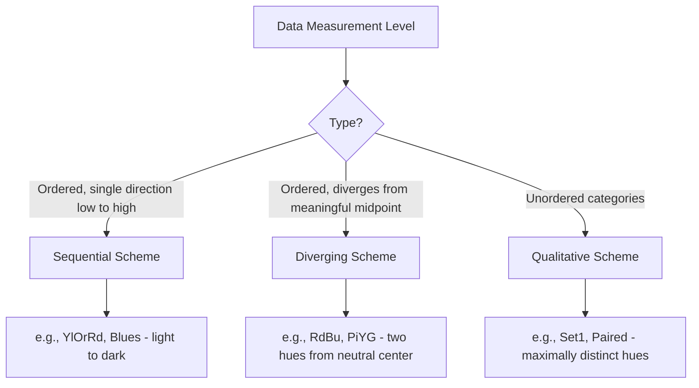

## Color Theory and Map Symbology

### Overview

Color and symbology form the visual language through which maps encode information. Effective use of color requires understanding both the physical/perceptual properties of color and the semiotic principles governing how symbols represent real-world features. Poor color and symbol choices can distort data interpretation even when the underlying spatial data and analysis are correct.

### Color Models and Color Spaces

#### RGB (Red, Green, Blue) — Additive Color

The standard color model for digital displays, where colors are created by combining red, green, and blue light; used for on-screen map rendering.

$$\text{Color} = (R, G, B), \quad 0 \le R,G,B \le 255$$

#### CMYK (Cyan, Magenta, Yellow, Key/Black) — Subtractive Color

Used for printed map production, where colors are created by subtracting light via ink absorption; digital maps designed for print output must be converted to CMYK, and colors that appear vivid on-screen (RGB) can appear duller when printed (CMYK) due to the smaller printable color gamut — a common source of unexpected print output discrepancies.

#### HSV/HSL (Hue, Saturation, Value/Lightness)

A perceptually intuitive color model separating **hue** (the color itself, e.g., red vs. blue), **saturation** (color intensity/purity), and **value/lightness** (brightness) — particularly useful in cartographic design because it allows systematic manipulation of a single visual variable (e.g., varying only lightness for a sequential choropleth scheme) while holding hue constant.

```python
import matplotlib.colors as mcolors

# Generate a sequential scheme by varying lightness while holding hue constant
base_hue = 0.55  # a blue hue in HSV space
lightness_steps = [0.9, 0.7, 0.5, 0.3, 0.1]
colors = [mcolors.hsv_to_rgb((base_hue, 0.6, l)) for l in lightness_steps]
```

### Color Schemes by Data Type

#### Sequential Schemes

Ordered progression (typically light to dark) of a single hue, representing ordered data with a clear low-to-high progression (e.g., population density, elevation, income).

- Appropriate when data has a natural minimum and maximum with intermediate ordered values.
- Darker/more saturated typically implies higher magnitude by cartographic convention.

#### Diverging Schemes

Two contrasting hues diverging from a neutral (often light or white) midpoint, appropriate for data with a meaningful critical value or zero point (e.g., temperature anomaly relative to average, population change: growth vs. decline, election results: two-party vote margin).

- The midpoint should align precisely with the data's meaningful break point (e.g., 0% change), not merely the statistical median, or the map will misrepresent the critical threshold.

#### Qualitative Schemes

Distinct, non-ordered hues for nominal/categorical data (land use type, political party, soil classification) where no implied order or magnitude relationship should exist between categories.

- Hues should be maximally distinguishable from one another; avoid varying only lightness/saturation (which implies unintended order) — vary hue instead.

### ColorBrewer and Empirically-Tested Palettes

ColorBrewer (developed by Cynthia Brewer) is the most widely referenced source of cartographically-tested color schemes, providing pre-validated sequential, diverging, and qualitative palettes optimized for map use, including variants specifically tested for colorblind accessibility and photocopy/print reproduction.

```python
import matplotlib.pyplot as plt
import geopandas as gpd

gdf = gpd.read_file("counties.shp")

# ColorBrewer sequential scheme (via matplotlib's built-in colormap support)
gdf.plot(column="median_income", cmap="YlGnBu", legend=True, scheme="natural_breaks", k=6)
plt.title("Median Household Income by County")
plt.axis("off")
plt.show()
```

### Diagram: Color Scheme Selection by Data Type



### Color Perception and Accessibility

#### Color Vision Deficiency (Colorblindness)

Approximately 8% of men and 0.5% of women of Northern European descent have some form of color vision deficiency, most commonly red-green deficiencies (deuteranopia, protanopia); map designs relying solely on red-green distinction (a very common default, e.g., red = bad/decline, green = good/growth) can become illegible or misleading for these users.

**Mitigation strategies:**

- Use ColorBrewer's colorblind-safe palette variants (explicitly tested against simulated color vision deficiencies).
- Avoid red-green as the sole distinguishing pair in diverging schemes; substitute blue-orange or blue-red, which remain distinguishable across most common deficiency types.
- Supplement color with a redundant visual variable (pattern, texture, or direct labeling) so the map remains interpretable even if color distinctions are lost.

#### Perceptual Uniformity

Not all color scales are perceived as changing "linearly" by the human eye — some popular colormaps (e.g., the historically common "jet" rainbow colormap) create perceptual artifacts where certain value ranges appear to change more dramatically than others despite equal underlying data intervals, potentially misleading readers about where significant changes occur in the data.

- **Perceptually uniform colormaps** (e.g., viridis, cividis, and ColorBrewer's tested sequential schemes) are designed so equal steps in data value correspond to visually equal steps in perceived color change, and cividis specifically is also designed to remain interpretable for the most common forms of color vision deficiency.

```python
import matplotlib.pyplot as plt
import numpy as np

data = np.random.rand(20, 20)
fig, axes = plt.subplots(1, 2, figsize=(10,5))
axes[0].imshow(data, cmap="jet")       # perceptually non-uniform, avoid for scientific mapping
axes[0].set_title("Jet (avoid)")
axes[1].imshow(data, cmap="viridis")   # perceptually uniform, colorblind-friendly
axes[1].set_title("Viridis (preferred)")
plt.show()
```

### Map Symbology: Point, Line, and Area Symbols

#### Point Symbols

Represent discrete located features (cities, facilities, incidents) using geometric shapes, pictographic icons, or proportional/graduated symbols (as covered under Thematic Mapping Techniques).

- **Geometric symbols** (circles, squares, triangles): Abstract, easily scaled, and commonly used for quantitative point data.
- **Pictographic/iconic symbols**: Representational icons (an airplane icon for airports, a tent icon for campgrounds) that leverage pre-existing reader association, reducing legend dependency.

#### Line Symbols

Represent linear features (roads, rivers, boundaries, flow lines) using variations in weight (thickness), color, pattern (solid, dashed, dotted), and casing (an outline around the line, commonly used for major roads to increase visual prominence and contrast against the base map).

- **Line weight hierarchy**: Thicker lines for higher-order features (highways vs. local streets), consistent with the visual hierarchy principles covered under Map Elements and Layout Design.
- **Standard cartographic conventions**: Dashed lines commonly indicate boundaries, intermittent features, or lower-certainty/proposed features; solid lines indicate permanent, certain features.

#### Area (Polygon) Symbols

Represent bounded regions using fill color, pattern/texture, and boundary line style — the primary symbology mechanism for choropleth and qualitative area mapping.

- **Pattern fills**: Useful for print/grayscale reproduction or when color is unavailable/restricted, though patterns can create visual moiré effects and are generally harder to distinguish in fine gradations than color.

### Symbol Design Principles

- **Iconicity vs. abstraction trade-off**: Highly iconic (pictographic) symbols are easier to interpret without a legend but may not scale well to large numbers of categories; abstract geometric symbols scale better systematically but always require legend reference.
- **Figure-ground contrast**: Symbols must maintain sufficient contrast against varying base map backgrounds (e.g., a symbol color that works well over land may be illegible over water) — symbol outlines/casings are a common solution to maintain contrast across variable backgrounds.
- **Minimum legible size**: Symbols must remain visually distinguishable at their intended output size/resolution — a common failure mode in maps designed on-screen at one scale but printed or displayed at a different (often smaller) final size.

### Cultural and Conventional Color Associations

Certain color-to-meaning associations are strongly conventionalized in cartography and should generally be followed unless deliberately subverted for specific communicative effect:

- **Blue**: Water bodies (near-universal convention)
- **Green**: Vegetation, parks, forested land, or (in a different context) positive/growth values in diverging schemes
- **Brown**: Terrain/elevation (especially in hypsometric tinting), or built-up/urban areas in some national mapping traditions
- **Red**: Danger, high values, high density, or negative/decline values in diverging schemes; also historically used for major roads/highways in many road atlas traditions

[Unverified] Specific color conventions can vary by national cartographic tradition, cultural context, and application domain; conventions described here reflect common but not universal practice, and should be verified against the target audience's expectations for context-specific work.

### Hypsometric Tinting (Elevation Color Ramps)

A specialized sequential/diverging color application for representing terrain elevation, typically progressing from greens (lowlands) through yellows/browns (mid-elevation) to white/gray (high elevation/snow line) — a long-established cartographic convention balancing perceptual ordering with landscape-intuitive color association (green = vegetated lowland, white = snow-capped peaks).

```python
import matplotlib.pyplot as plt
import matplotlib.colors as mcolors

# Simplified hypsometric-style colormap definition
elevation_colors = ["#2d6a4f", "#74c69d", "#f4e285", "#c08552", "#ffffff"]
elevation_cmap = mcolors.LinearSegmentedColormap.from_list("hypsometric", elevation_colors)
```

### Related Topics

- Map Elements and Layout Design
- Thematic Mapping Techniques (Choropleth Classification and Color Application)
- Visual Variables and Bertin's Semiological Framework
- Colorblind-Safe Palette Design and ColorBrewer Methodology
- Print vs. Digital Color Management (RGB/CMYK Workflows)
- Cartographic Conventions and Symbol Standardization (e.g., topographic map symbol libraries)
- Hypsometric Tinting and Terrain Visualization Techniques