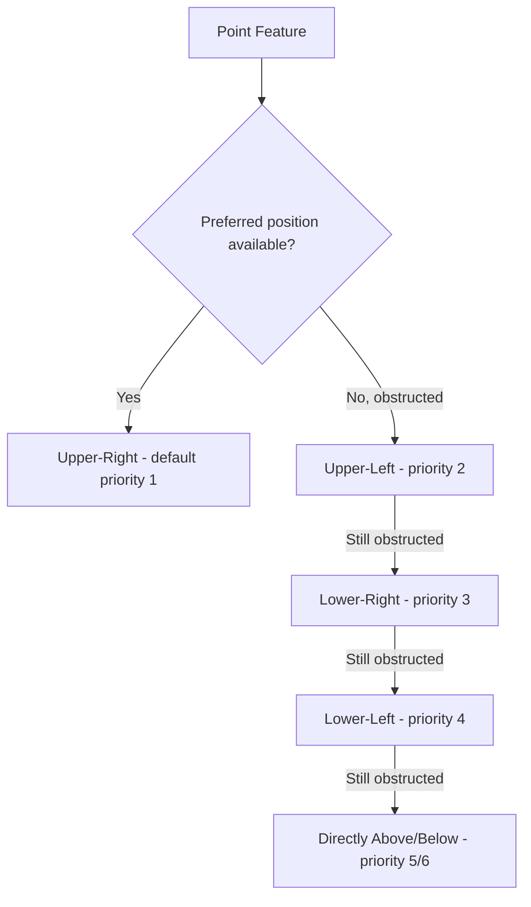

## Typography and Labeling in Cartography

### Overview

Typography and labeling translate a map's geographic features into readable text, serving as one of the most information-dense yet visually delicate components of map design. Poor label placement can render an otherwise excellent map confusing or ambiguous, while well-executed typography communicates feature hierarchy and meaning without requiring constant legend reference.

### Type Anatomy and Selection Considerations

#### Serif vs. Sans-Serif Fonts

- **Serif fonts** (fonts with small decorative strokes at letter terminals): Traditionally favored for printed reference maps and dense place-name labeling, as serifs can improve readability in continuous text at small sizes on high-resolution print media.
- **Sans-serif fonts** (no decorative strokes): Increasingly dominant in digital/web cartography, rendering more cleanly at low pixel densities and small screen sizes where serif details can appear muddy or aliased.

#### Type Style Variation as a Semantic Signal

Cartographic convention uses systematic variation in type style, weight, size, and case to distinguish feature categories without requiring separate legend entries for text labels:

- **Italic type**: Conventionally reserved for hydrographic features (rivers, lakes, oceans) in many cartographic traditions, distinguishing water labels from other feature types at a glance.
- **All-caps or letter-spaced text**: Often used for large administrative regions (countries, states/provinces) or physiographic features (mountain ranges, deserts) spanning large areas.
- **Bold weight**: Typically reserved for higher-priority or larger-population features (major cities) versus regular weight for minor features (towns, villages).
- **Size hierarchy**: Directly proportional to feature importance/population/significance, mirroring the visual hierarchy principles covered under Map Elements and Layout Design.

### Label Placement Conventions by Geometry Type

#### Point Feature Labels

- **Default placement priority**: Cartographic convention generally prefers upper-right placement relative to the point symbol (avoiding obscuring the symbol itself), with a standard fallback priority order (upper-right, upper-left, lower-right, lower-left, directly above, directly below) when the preferred position is obstructed by other features.
- **Consistent offset**: A small, consistent gap between the point symbol and its label improves visual association and avoids ambiguity about which label belongs to which point, especially in denser areas.

#### Line Feature Labels

- **Parallel placement**: Labels for linear features (rivers, roads, boundaries) are conventionally placed parallel to and following the curvature of the feature itself, often positioned directly above the line.
- **Repetition along long features**: For features extending beyond a single viewport or map extent (long rivers, highways), labels are often repeated at intervals so the feature remains identifiable regardless of which portion of the map the reader is viewing.
- **Curved/bent text**: Text characters may be individually rotated to follow a curving line's path, a labeling technique requiring more sophisticated placement algorithms than straight-line text.

#### Area Feature Labels

- **Centered/spread placement**: Labels for polygon features (countries, water bodies, regions) are typically centered within the feature's visual extent, and for very large or irregularly shaped features, letters may be spaced out (tracked) across the feature's extent to visually indicate its full spatial coverage rather than clustering all text at a single point.
- **Curved labels for elongated features**: Large water bodies or mountain ranges may use curved, letter-spaced labels that follow the feature's overall shape/orientation (e.g., text curving along the length of an ocean or gulf).

### Diagram: Label Placement Priority for Point Features



### Automated Label Placement Algorithms

Manual label placement is impractical for dense modern datasets and dynamic/interactive maps, driving development of automated labeling algorithms that must balance multiple competing constraints simultaneously.

#### The Map Labeling Problem as Combinatorial Optimization

Automated labeling is fundamentally an optimization problem: given a set of features and a set of candidate label positions for each, select one position per feature (or omit the label) to maximize readability while minimizing overlap — a problem that is NP-hard in its general form for realistic overlap-avoidance formulations, though heuristic approaches allow practical solutions within acceptable time constraints for typical map sizes. [Inference] The precise complexity classification depends on the specific formulation and constraints used, and different labeling problem variants have been studied with varying theoretical complexity results in the cartographic and computational geometry literature.

**Common heuristic and algorithmic approaches:**

- **Greedy placement with priority ordering**: Places higher-priority labels first, then fits lower-priority labels into remaining available space, potentially omitting labels that cannot be placed without unacceptable overlap.
- **Simulated annealing / genetic algorithms**: Iteratively adjust label positions across the entire label set simultaneously, allowing temporary "worse" states to escape local optima, generally producing higher-quality overall placement than pure greedy approaches at higher computational cost.
- **Force-directed / physics-based placement**: Treats labels as repelling particles that push away from overlapping features and other labels, converging toward a locally non-overlapping configuration.

#### Dynamic Labeling in Interactive Web Maps

Interactive maps introduce label placement challenges absent from static cartography, since the visible feature set and appropriate label density change continuously as users pan and zoom:

- **Label collision detection at runtime**: Rendering engines (e.g., Mapbox GL, MapLibre) must recompute label placement and visibility dynamically as the viewport changes, often prioritizing labels by a feature importance ranking (e.g., city population) so lower-priority labels are hidden first when space is constrained.
- **Label persistence/stability**: Well-designed interactive labeling avoids labels "jumping" erratically between positions during continuous pan/zoom interactions, generally preferring smooth appearance/disappearance transitions and stable positioning where possible.
- **Zoom-dependent label density**: Analogous to feature generalization (covered under Map Scale and Generalization), fewer, higher-priority labels are shown at small scale (zoomed out), progressively revealing more labels as the user zooms to larger scale.

```python
# Conceptual example: priority-based label filtering for zoom-dependent display
def get_visible_labels(features, zoom_level, max_labels_by_zoom):
    max_count = max_labels_by_zoom.get(zoom_level, len(features))
    sorted_features = sorted(features, key=lambda f: -f["importance_score"])
    return sorted_features[:max_count]
```

### Multilingual and Multi-Script Labeling

Global and international mapping applications must handle multiple writing systems, transliteration standards, and simultaneous display of local names alongside a reference language (e.g., showing both a local-script place name and its Latin-script transliteration/exonym).

- **Exonyms vs. endonyms**: An exonym is a place name used by outsiders (e.g., "Munich" in English), while an endonym is the name used by local inhabitants in their own language/script (e.g., "München"); cartographic policy must decide which to prioritize or whether to display both, depending on map audience and purpose.
- **Font support for non-Latin scripts**: Rendering pipelines must ensure appropriate font/glyph support for the full range of scripts present in the labeled dataset (Cyrillic, Arabic, Chinese, Devanagari, etc.), a technical requirement distinct from purely cartographic design decisions.
- **Bidirectional text handling**: Scripts written right-to-left (Arabic, Hebrew) require specific text-rendering and layout handling, particularly when mixed with left-to-right text (e.g., numeric labels or Latin-script place names) on the same map.

### Common Labeling Pitfalls

- **Label-feature ambiguity**: Placing labels equidistant from multiple candidate features, or without sufficient offset/leader lines, causing readers to misattribute a label to the wrong feature.
- **Overlapping labels without a resolution strategy**: Dense areas (major cities, cluttered coastlines) require either selective label omission, dynamic decluttering, or leader-line connection to a less crowded label position.
- **Inconsistent label styling across a dataset**: Failing to apply the systematic style hierarchy (case, weight, size) consistently across a full feature class, undermining the semantic signal that consistent typography is meant to convey.
- **Labels obscuring critical map content**: Placing text directly over important symbology or data patterns (a particular risk in dense thematic or choropleth maps combined with heavy point labeling).

### Related Topics

- Map Elements and Layout Design
- Color Theory and Map Symbology
- Map Scale and Generalization (Zoom-Dependent Label Density)
- Computational Geometry Approaches to Label Placement Optimization
- Web Map Rendering Engines and Dynamic Labeling Architecture (Mapbox GL, MapLibre)
- Multilingual GIS Data Management and Exonym/Endonym Standards
- Cartographic Typography Standards and Historical Conventions