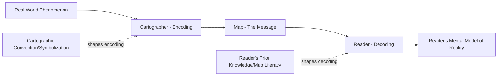
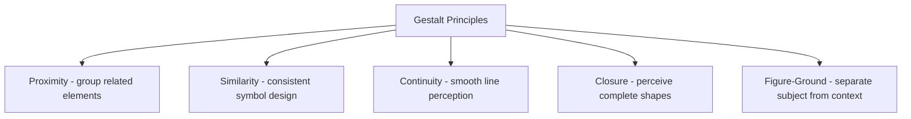

## Visual Hierarchy and Map Communication

### Overview

Visual hierarchy is the deliberate structuring of a map's visual elements so that a reader's attention flows in an intended order, from the most communicatively important information to the least. Map communication theory extends this into a broader framework for understanding how maps function as a communication channel between a cartographer (encoder) and a reader (decoder), and why that communication can succeed or fail regardless of data accuracy.

### The Cartographic Communication Model

Cartography can be modeled as a communication process analogous to general information theory, adapted specifically for spatial/visual transmission:

**Key implication**: Communication can fail at either the encoding stage (cartographer chooses ambiguous or misleading symbolization) or the decoding stage (reader lacks the map literacy or prior knowledge to correctly interpret otherwise well-designed symbolization) — effective map design must account for both.

### Establishing Visual Hierarchy Through Visual Variables

Building on Bertin's visual variables (introduced under Color Theory and Map Symbology), visual hierarchy is achieved by systematically varying these properties to signal relative importance:

#### Size

Larger elements (symbols, text, line weights) are perceived first and signal greater importance — the most immediately perceptible hierarchy-establishing variable.

#### Value (Lightness/Contrast)

Higher contrast against the background draws attention before lower-contrast elements; a common technique is rendering primary thematic data in high-saturation, high-contrast color while base/reference layers use desaturated, low-contrast tones.

#### Color

Beyond value, hue itself can establish hierarchy through psychological association (warm colors like red/orange often perceived as more visually "urgent" or foreground-oriented than cool colors like blue/gray, which recede visually) — though this interacts with cultural convention and should not be relied upon as a universal law.

#### Position and Figure-Ground Organization

Elements positioned centrally or given clear separation from surrounding content are perceived as more important; the figure-ground principle (from Gestalt psychology) describes how readers automatically segment a visual scene into a foreground "figure" (the primary subject) and background "ground" (context) — cartographic design should reinforce this natural perceptual separation rather than fight against it.

### Gestalt Principles Applied to Map Design

Gestalt psychology principles, describing how humans perceptually organize visual elements into coherent wholes, directly inform effective cartographic symbolization and layout:

- **Proximity**: Elements placed close together are perceived as related/grouped — used to visually associate a legend with its scale bar, or to group related map furniture elements.
- **Similarity**: Elements sharing visual properties (color, shape, size) are perceived as belonging to the same category — the foundation of consistent symbol design across a feature class.
- **Continuity**: The eye follows smooth, continuous paths preferentially over abrupt directional changes — relevant to how readers visually trace linear features like roads or rivers across a map.
- **Closure**: The mind perceptively "completes" incomplete shapes — relevant to how readers interpret dashed boundary lines or partially obscured symbols as complete, continuous features.
- **Figure-Ground**: As described above, distinguishing primary content from background context.

### Levels of Visual Hierarchy in a Typical Thematic Map

A well-structured map typically establishes three to four distinct visual "planes" of information, each with a consistent internal visual treatment:

1. **Primary thematic layer**: The map's core message (e.g., choropleth-shaded data); highest contrast, most visually prominent.
2. **Contextual reference layer**: Administrative boundaries, major cities, key geographic reference points; moderate visual weight, sufficient to orient the reader without competing with the primary layer.
3. **Base/background layer**: Land/water distinction, minor roads, terrain shading; lowest visual weight, providing spatial context without demanding attention.
4. **Map furniture**: Title, legend, scale, north arrow, metadata; visually distinct from the map body (often set apart in a dedicated margin or panel) but appropriately subordinate to the primary thematic content in overall visual weight.

### Ordering Principles and Reading Patterns

#### The Z-Pattern and Gutenberg Diagram

Studies of Western reading patterns (left-to-right, top-to-bottom) suggest that viewers' eyes tend to trace a Z-shaped or diagonal path across a page, moving from upper-left ("primary optical area") to lower-right ("terminal area") — informing where the most and least critical map elements should be positioned (title/primary content upper-left to center, less critical metadata lower-right).

[Unverified] The generalizability and strength of Z-pattern/Gutenberg diagram eye-tracking findings for map-reading specifically (as opposed to general page layout/advertising contexts where they originated) has been debated in the design literature, and cartography-specific eye-tracking research provides a more direct evidence base where available.

#### Progressive Disclosure in Interactive Maps

Digital and interactive maps can implement visual hierarchy dynamically rather than through fixed static design — showing only high-priority information by default and progressively revealing secondary detail through user interaction (hover, click, zoom), a hierarchy mechanism unavailable to static print cartography.

### Cognitive Load and Map Simplicity

Effective map communication requires managing the reader's cognitive load — the amount of mental processing effort required to extract the intended information.

- **Miller's Law and information chunking**: The classical finding that working memory can hold roughly 7±2 discrete items suggests that excessive simultaneous categories, legend entries, or symbol types can overwhelm a reader's capacity to process the map efficiently, though the specific numeric limit itself has been debated and refined in subsequent cognitive psychology research. [Inference] The precise applicability and numeric threshold of this finding to cartographic symbol/category counts specifically (versus its original short-term memory context) is an extrapolation, not a directly measured cartographic result.
- **The "ink-to-information ratio" principle** (echoing Edward Tufte's data-ink ratio concept from general information visualization): Every visual element on a map should serve a genuine communicative purpose; decorative elements, unnecessary borders, or redundant symbology that do not aid interpretation increase cognitive load without adding communicative value.

### Common Visual Hierarchy Failures

- **Flat visual treatment**: Applying uniform visual weight (size, color intensity, line width) across features of genuinely differing importance, making the map "everything looks equally important," which functionally means nothing stands out.
- **Competing focal points**: Multiple elements each demanding maximum visual attention (oversized legend, oversaturated base map, bold labels everywhere) rather than a single clear primary focus.
- **Base map dominance**: A frequent modern failure mode in web-mapping-derived static exports, where a richly detailed, high-contrast basemap (streets, labels, buildings) visually overwhelms an intentionally subtler thematic data layer overlaid on top of it.
- **Legend/title over-emphasis**: Secondary "map furniture" elements styled with greater visual weight than the map body itself, inverting the intended hierarchy.

### Practical Design Workflow for Establishing Hierarchy

1. Identify the map's single primary communicative purpose (what should the reader take away first).
2. Assign the highest visual contrast/prominence to the data layer(s) directly supporting that purpose.
3. Systematically reduce visual weight (via desaturation, reduced line weight, muted value) for all contextual/reference layers.
4. Group and visually subordinate map furniture (legend, scale, metadata) relative to the map body.
5. Review the completed layout by briefly looking away and back — the element that draws the eye first should be the intended primary message; if not, hierarchy adjustments are needed.

### Related Topics

- Map Elements and Layout Design
- Color Theory and Map Symbology
- Typography and Labeling in Cartography
- Thematic Mapping Techniques
- Gestalt Psychology Principles in Visual Design
- Cognitive Load Theory in Information Visualization
- Interactive Map Interface Design and Progressive Disclosure