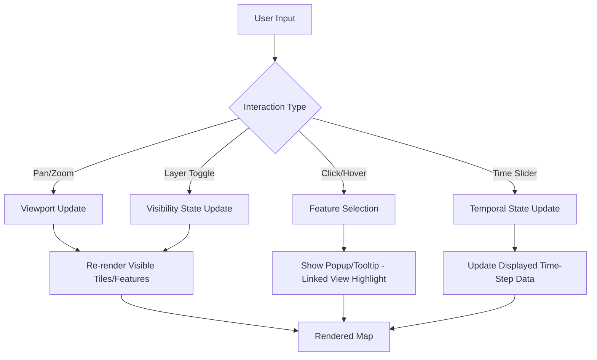

## Interactive and Animated Cartography

### Overview

Interactive and animated cartography extend static map communication into the temporal and interaction dimensions, enabling maps to represent change over time, respond to user input, and reveal information progressively. These techniques address a fundamental limitation of static cartography: a single printed or fixed-image map can only show one moment, one scale, and one set of visible layers at a time.

### Foundational Distinction: Interactivity vs. Animation

- **Interactive cartography**: The map responds to direct user input (pan, zoom, click, hover, filter selection), giving the reader agency over what is displayed and at what detail level.
- **Animated cartography**: The map changes automatically over time according to a predetermined sequence (typically representing temporal change in the underlying phenomenon), with the reader as a relatively passive observer, though animation controls (play/pause/scrub) often add an interactive layer on top.

Many modern cartographic products combine both — an interactive time-slider animation being a canonical example of the two techniques working together.

### Core Interactive Cartography Techniques

#### Pan and Zoom

The most fundamental interaction, allowing readers to navigate across a much larger geographic and scale range than any single static view could accommodate — directly connecting to the scale-dependent generalization and multi-resolution tile pyramid concepts covered under Map Scale and Generalization.

#### Layer Toggling and Filtering

Allowing readers to selectively show/hide data layers or filter features by attribute — enables a single interactive map to serve multiple distinct analytical or exploratory purposes that would otherwise require separate static maps.

```javascript
// Conceptual example: layer visibility toggle in a web map (Leaflet-style)
function toggleLayer(map, layer, visible) {
    if (visible) {
        layer.addTo(map);
    } else {
        map.removeLayer(layer);
    }
}
```

#### Linked Views and Brushing

Connecting a map to auxiliary visualizations (charts, tables) such that selecting/highlighting data in one view automatically highlights the corresponding features in the other — a powerful exploratory data analysis technique for identifying spatial patterns in conjunction with statistical patterns.

#### Tooltips and Popups

On-demand disclosure of detailed attribute information for a specific feature upon hover/click, allowing the map's primary symbology to remain visually simple while still providing access to full underlying data — directly implementing the "progressive disclosure" hierarchy principle covered under Visual Hierarchy and Map Communication.

### Diagram: Interactive Cartography Component Architecture



### Core Animated Cartography Techniques

#### Temporal Sequence Animation

Displaying a series of map states in chronological sequence (e.g., annual land cover change, disease spread over weeks, storm track progression), either as a continuously playing animation or a user-controlled time slider/scrubber.

**Key design considerations:**

- **Frame rate and pacing**: Too fast obscures pattern recognition; too slow loses the sense of continuous change — pacing should be calibrated to the phenomenon's natural rate of change and the map's communicative goal.
- **Consistent symbology across frames**: Classification breaks, color schemes, and symbol sizing must remain fixed across all time steps (rather than being independently classified per frame) so that visual change on the map genuinely reflects data change rather than artifacts of shifting classification.

#### Animated Flow and Movement Visualization

Representing movement (migration, traffic, wind/ocean currents, animal tracking) using animated particles, trails, or flow lines that move along paths over time — a technique for which static flow mapping (covered under Thematic Mapping Techniques) can only show aggregate direction/volume, not the dynamic process itself.

```javascript
// Conceptual example: animated particle system for wind visualization (WebGL-style pseudocode)
function updateParticles(particles, windField, deltaTime) {
    particles.forEach(p => {
        const [u, v] = sampleWindField(windField, p.x, p.y);
        p.x += u * deltaTime;
        p.y += v * deltaTime;
        p.age += deltaTime;
        if (p.age > p.maxAge) resetParticle(p);
    });
}
```

#### Change-Over-Time Choropleth Animation

Sequential choropleth frames showing how a classified variable (population, disease prevalence, land value) changes across defined time steps — requires careful attention to normalization and classification consistency (as covered under Thematic Mapping Techniques) to avoid misleading visual comparisons between frames.

### Web Mapping Technology Stack for Interactive Cartography

#### Client-Side Rendering Libraries

- **Leaflet**: Lightweight, widely adopted JavaScript library for interactive web maps; simple API, extensive plugin ecosystem, well-suited to standard pan/zoom/marker/popup interactivity.
- **Mapbox GL JS / MapLibre GL JS**: WebGL-based rendering engines supporting vector tiles, smooth zooming/rotation, and highly customizable, GPU-accelerated styling — MapLibre GL emerged as an open-source fork following changes to Mapbox GL JS's licensing terms.
- **OpenLayers**: A more comprehensive, feature-rich mapping library supporting a wide range of projections, data formats, and advanced GIS-style functionality beyond typical web map display needs.
- **deck.gl**: A WebGL-powered framework specifically optimized for large-scale, data-intensive visualizations (millions of points, complex 3D/temporal layers), often paired with Mapbox/MapLibre as a base map layer.

#### Data Formats for Interactive/Animated Delivery

- **GeoJSON**: Simple, widely-supported vector format; suitable for smaller datasets but inefficient for very large or frequently updated data due to verbose text-based encoding.
- **Vector Tiles (Mapbox Vector Tile format)**: Binary, tiled, pre-generalized vector data (as covered under Map Scale and Generalization) enabling efficient interactive rendering of large datasets across zoom levels.
- **Time-series specific formats**: NetCDF, Zarr, or custom tiled time-step formats for animated scientific/environmental data (e.g., climate model output, satellite imagery time series), often served through specialized geospatial data servers rather than generic web tile formats.

### Server-Side and Data Architecture Considerations

- **Dynamic tile serving vs. pre-rendering**: Pre-generated tile pyramids (covered under Map Scale and Generalization) offer fast, cacheable delivery but require regeneration when data updates; dynamic/on-the-fly rendering (e.g., via tools like TiTiler for raster data or vector tile servers like Tegola/Martin) trades some performance for real-time data currency.
- **WebSocket/streaming updates for real-time maps**: Applications requiring live data (vehicle tracking, real-time sensor networks, live weather) typically use WebSocket connections or similar push mechanisms rather than polling, to update map state with minimal latency.
- **Client-side vs. server-side filtering**: For interactive filtering, smaller datasets can be filtered entirely client-side (faster interaction, no server round-trip) while larger datasets require server-side query/filter execution with results streamed incrementally to the client.

### Design Considerations Specific to Interactive/Animated Maps

- **Loss of the "complete picture"**: Unlike a static map where all information is simultaneously visible, interactive maps risk readers missing information that exists but wasn't discovered through exploration — mitigated through clear affordances (visible controls, onboarding cues) signaling what interactions are available.
- **Performance and responsiveness**: Interaction latency directly affects usability; poorly optimized rendering (excessive DOM manipulation, unoptimized vector data, lack of tiling/clustering for dense point data) degrades the interactive experience significantly.
- **Accessibility considerations**: Interactive maps relying solely on hover/mouse interaction can be inaccessible to keyboard-only or screen-reader users; accessible interactive cartography requires keyboard navigation support and appropriately structured ARIA labeling for map controls and feature information.
- **Mobile/touch interaction adaptation**: Touch interfaces require different interaction affordances than mouse-based desktop interfaces (tap vs. hover for information disclosure, pinch-to-zoom vs. scroll-wheel), and animated/data-dense maps must remain performant on lower-powered mobile hardware.

### Common Pitfalls in Interactive and Animated Cartography

- **Animation without a clear temporal message**: Adding animation purely for visual novelty rather than because temporal change is genuinely the map's communicative purpose, adding complexity without added insight.
- **Inconsistent classification across animated frames**: Independently re-classifying choropleth breaks for each time step, causing colors to represent different underlying value ranges frame-to-frame — misleadingly suggesting change that may not reflect the true underlying data pattern.
- **Overloading interactivity**: Providing excessive simultaneous interactive controls (many togglable layers, multiple linked views, complex filtering UI) can overwhelm readers, echoing the cognitive load concerns raised under Visual Hierarchy and Map Communication.
- **Neglecting a static fallback or summary**: Purely interactive/animated maps can be difficult to cite, print, or reference in static contexts (reports, publications); providing a representative static snapshot or summary view alongside the interactive version is often good practice for broader usability.

### Related Topics

- Map Scale and Generalization (Vector Tiles and Multi-Resolution Data)
- Visual Hierarchy and Map Communication (Progressive Disclosure)
- Thematic Mapping Techniques (Flow Mapping, Choropleth Classification Consistency)
- Web Mapping Architecture and Client-Side Rendering Engines
- Real-Time Geospatial Data Streaming and Sensor Network Visualization
- Accessibility Standards for Interactive Web Map Interfaces
- 3D and Immersive Cartography (WebGL, Digital Twins)