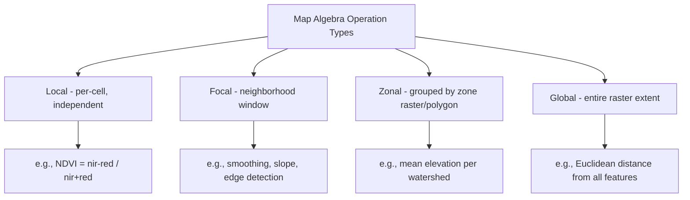

## Raster Data Model and Grid Systems

### Overview

The raster data model represents geographic space as a regular grid of cells (pixels), each holding a value representing the attribute of interest at that location — in contrast to the vector model's discrete geometric objects. Raster is the natural representation for continuous phenomena (elevation, temperature, satellite imagery reflectance) and for data collected inherently in grid form (remote sensing imagery, gridded climate model output).

### Core Raster Structure

#### Cells, Resolution, and Extent

A raster dataset is defined by:

- **Rows and columns**: The grid dimensions (e.g., 1000 rows × 1000 columns).
- **Cell size (spatial resolution)**: The ground distance represented by each cell (e.g., 30m × 30m per pixel for Landsat imagery); smaller cell size means higher spatial detail but larger file size and processing cost.
- **Extent (bounding box)**: The geographic area covered by the raster, typically defined by its upper-left corner coordinate plus the geotransform (covered under Matrix Operations in Geospatial Computing).
- **Number of bands**: Single-band rasters store one value per cell (e.g., elevation); multi-band rasters store multiple values per cell (e.g., red, green, blue, near-infrared bands in a multispectral image).

$$\text{Total cells} = \text{rows} \times \text{columns} \times \text{bands}$$

#### Cell Value Data Types

Raster cell values are stored in specific numeric data types, chosen based on the nature of the phenomenon and precision/storage trade-offs:

| Data Type | Range/Precision | Typical Use |
| --- | --- | --- |
| Byte (uint8) | 0–255 | Classified categorical data, 8-bit imagery bands |
| Int16 | -32,768 to 32,767 | Elevation (meters), temperature in tenths of degrees |
| UInt16 | 0–65,535 | Higher radiometric resolution satellite imagery (e.g., 16-bit sensors) |
| Float32 | Single-precision floating point | Continuous scientific data requiring decimal precision (e.g., NDVI, precipitation) |
| Float64 | Double-precision floating point | High-precision scientific computation, rarely needed for typical GIS storage |

### Diagram: Raster Grid Structure

```mermaid
flowchart TD
    A[Raster Dataset] --> B[Rows x Columns Grid]
    A --> C[Cell Size / Resolution]
    A --> D[Geotransform - Origin + Pixel Size]
    A --> E[Coordinate Reference System]
    A --> F[Band(s)]
    F --> F1[Single-band - e.g., elevation, classification]
    F --> F2[Multi-band - e.g., RGB, multispectral imagery]
    B --> G[Individual Cell / Pixel]
    G --> H[Cell Value - data type dependent]
```

### Georeferencing Rasters: The Geotransform

As covered in detail under Matrix Operations in Geospatial Computing, every georeferenced raster requires an affine geotransform mapping pixel (row, column) indices to real-world coordinates:

$$x_{geo} = a \cdot col + b \cdot row + c, \qquad y_{geo} = d \cdot col + e \cdot row + f$$

```python
import rasterio

with rasterio.open("elevation.tif") as src:
    print(src.transform)   # affine geotransform
    print(src.crs)         # coordinate reference system
    print(src.shape)       # (rows, cols)
    print(src.count)       # number of bands
    data = src.read(1)     # read band 1 as a numpy array
```

### Raster Data Sources and Categories

#### Discrete (Thematic/Categorical) Rasters

Cell values represent a limited set of discrete categories (land cover classification, soil type, administrative zone codes) — analogous conceptually to categorical/qualitative vector attribute data, but stored in grid form.

#### Continuous Rasters

Cell values represent a smoothly varying quantitative phenomenon (elevation, temperature, precipitation, NDVI) where intermediate values between sample points are meaningful and typically derived through interpolation (as covered under Matrix Operations in Geospatial Computing — Kriging).

#### Imagery Rasters

Multi-band rasters specifically representing captured sensor data (satellite or aerial imagery), where band values represent measured reflectance/radiance in specific wavelength ranges — the primary data type for remote sensing analysis.

### Raster File Formats

- **GeoTIFF (.tif)**: The most widely supported georeferenced raster format, embedding geotransform and CRS metadata directly in the file header; supports single or multi-band data, various data types, and internal compression.
- **Cloud Optimized GeoTIFF (COG)**: A specially structured GeoTIFF variant with internal tiling and overview (pyramid) layers, enabling efficient partial/range-based HTTP reads directly from cloud storage without downloading the entire file — increasingly the standard for cloud-native geospatial data pipelines.
- **NetCDF**: A self-describing, array-oriented format widely used in climate and oceanographic science, well-suited to multi-dimensional data (e.g., a variable varying across latitude, longitude, and time simultaneously).
- **Zarr**: A modern, cloud-native, chunked array storage format designed for efficient parallel and distributed access to very large multi-dimensional arrays, increasingly popular in cloud-based geospatial and climate data science workflows as an alternative/complement to NetCDF.
- **HDF5 (Hierarchical Data Format)**: A flexible, self-describing binary format commonly used for satellite mission data products (e.g., MODIS) capable of storing complex hierarchical multi-dataset structures within a single file.

```python
import rioxarray

# Reading a Cloud Optimized GeoTIFF directly from cloud storage (conceptual)
da = rioxarray.open_rasterio("https://example-bucket.s3.amazonaws.com/data_cog.tif")
print(da.rio.crs, da.rio.resolution())
```

### Raster Pyramids and Overviews

For efficient display and processing at varying zoom levels, raster datasets commonly store **overviews** (or "pyramids") — pre-computed, progressively downsampled (lower-resolution) copies of the full dataset, so software can quickly render an appropriately detailed version without processing the full-resolution data when displaying a zoomed-out view.

```python
from osgeo import gdal

ds = gdal.Open("large_raster.tif", gdal.GA_Update)
ds.BuildOverviews("AVERAGE", [2, 4, 8, 16])  # generate pyramid levels
```

### Raster Compression and Storage Optimization

- **Lossless compression** (LZW, DEFLATE, ZSTD): Preserves exact original pixel values, essential for categorical/classified data or scientific data where precision matters.
- **Lossy compression** (JPEG within GeoTIFF): Achieves much higher compression ratios but discards some information, generally acceptable only for visual-reference imagery where exact pixel values are not analytically critical.
- **Tiling (internal block structure)**: Storing raster data in internal tiles (e.g., 256×256 pixel blocks) rather than strip-by-strip enables efficient partial reads (only the tiles overlapping a query area need to be read), critical for performance with cloud-optimized formats and large datasets.

### Raster Analysis Operations (Map Algebra)

Raster analysis is fundamentally **map algebra** — mathematical operations applied to grid cell values, either independently per cell (local operations), across a defined neighborhood (focal operations), across an entire zone (zonal operations), or across the entire raster extent (global operations).



```python
import numpy as np
import rasterio

with rasterio.open("elevation.tif") as src:
    elevation = src.read(1)

# Local operation: reclassify elevation into discrete bands
classified = np.digitize(elevation, bins=[0, 500, 1000, 1500, 2000])

# Zonal operation: mean elevation per zone (using a zone raster)
with rasterio.open("watersheds.tif") as src:
    zones = src.read(1)

unique_zones = np.unique(zones)
zonal_means = {z: elevation[zones == z].mean() for z in unique_zones}
```

### Raster vs. Vector: Choosing the Appropriate Model

| Consideration | Favors Vector | Favors Raster |
| --- | --- | --- |
| Data nature | Discrete, well-bounded features | Continuous, smoothly varying phenomena |
| Precision requirement | Exact boundary geometry needed | Approximate, cell-resolution accuracy acceptable |
| Storage efficiency | Sparse discrete features | Dense, wall-to-wall coverage data |
| Analysis type | Network analysis, topology, attribute queries | Surface analysis, map algebra, image processing |
| Source data | Surveyed, digitized, or GPS-collected features | Remote sensing imagery, interpolated surfaces, gridded model output |
| Typical examples | Parcels, roads, administrative boundaries | Elevation (DEM), satellite imagery, climate grids |

Many real-world GIS workflows require both models simultaneously and convert between them as needed (vectorizing a classified raster into polygons, or rasterizing vector boundaries to combine with continuous raster data in map algebra) — this vector-raster interoperability is a foundational practical GIS skill distinct from the raster and vector data models covered individually here.

### Resampling Methods for Raster Resolution/Alignment Changes

When rasters are reprojected, resized, or aligned to a different grid, cell values must be resampled:

- **Nearest neighbor**: Assigns the value of the closest source cell; preserves exact original values (essential for categorical data) but can produce blocky results for continuous data.
- **Bilinear interpolation**: Weighted average of the four nearest source cells; smoother results for continuous data but inappropriate for categorical data (would produce meaningless fractional category values).
- **Cubic convolution**: Weighted average of a larger (typically 4×4) neighborhood, producing smoother results than bilinear at higher computational cost; used for continuous data requiring higher visual/analytical smoothness.
- **Majority/mode resampling**: For categorical data when downsampling (reducing resolution), assigns the most frequent category value among the source cells within each output cell.

### Related Topics

- Vector Data Model Fundamentals
- Matrix Operations in Geospatial Computing (Geotransforms, Map Algebra as Matrix Operations)
- Cloud-Native Geospatial Formats (COG, Zarr) and Cloud Processing Architectures
- Digital Elevation Models and Terrain Analysis
- Remote Sensing Imagery Processing and Band Math
- Raster-Vector Conversion (Vectorization and Rasterization)
- Multidimensional Array Data Handling (NetCDF, Zarr, xarray)