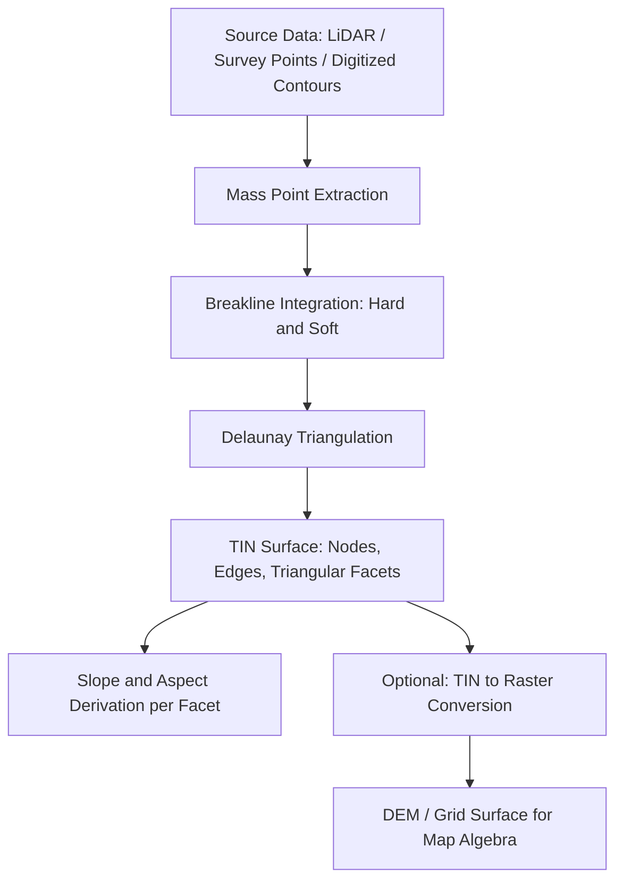

## TIN and Surface Data Models

### Overview

A Triangulated Irregular Network (TIN) is a vector-based surface data model that represents continuous terrain or other continuous phenomena using a network of non-overlapping triangles constructed from irregularly spaced sample points (mass points) with x, y, and z coordinates. TINs belong to a broader family of surface data models used in GIS to represent continuous fields such as elevation, temperature, pollutant concentration, or water depth. The two dominant surface representations in GIS are the TIN (vector-based) and the raster-based Digital Elevation Model (DEM/grid), each with distinct structural properties, storage strategies, and analytical trade-offs.

### Surface Data Models: Conceptual Foundation

**Key Points**

- A surface (or "field") is a phenomenon that has a value at every location in a study area, such as elevation, slope, or temperature.
- Surfaces are continuous, meaning there are no gaps in the represented values across the domain.
- Two principal families exist for digitally representing surfaces:
  - **Raster/lattice models** (regular grids, e.g., DEMs): sample the surface at fixed, evenly spaced intervals.
  - **Vector-based models** (TINs, contour-based): sample the surface at irregular locations chosen to best capture its shape, then interpolate between them using defined geometric rules.
- The choice of model affects storage efficiency, representation accuracy of terrain features (ridges, breaklines, peaks), and the computational methods available for analysis (slope, aspect, viewshed, watershed delineation).

### TIN Structure and Construction

#### Core Components

A TIN is built from three fundamental elements:

- **Mass points (nodes/vertices)**: irregularly distributed points with known x, y, z values, often derived from surveyed points, LiDAR-derived point clouds, photogrammetric extraction, or digitized contour vertices.
- **Edges**: straight-line segments connecting pairs of mass points, forming the sides of triangles.
- **Triangular facets (faces)**: planar triangular surfaces bounded by three edges and three nodes, each assumed to have a constant slope and aspect across its face.

Because each triangle is planar, elevation at any point within a triangle can be computed using linear interpolation across the plane defined by its three vertices.

#### Delaunay Triangulation

Most GIS software constructs TINs using **Delaunay triangulation**, an algorithm that connects points such that no other point lies inside the circumcircle of any triangle. This criterion:

- Maximizes the minimum interior angle of triangles, avoiding long, thin "sliver" triangles that distort slope and aspect calculations.
- Produces a triangulation that is as close to equiangular as possible given the point distribution.
- Has a dual relationship with **Voronoi diagrams** (Thiessen polygons): connecting the generating points of adjacent Voronoi cells produces the Delaunay triangulation, and vice versa.

$$\text{Delaunay condition: no point } p_k \text{ lies within the circumcircle of triangle } (p_i, p_j, p_l)$$

#### Breaklines and Constraint Features

TINs support **breaklines**, which are linear features that enforce specific geometric behavior along a line, ensuring triangle edges align with real-world discontinuities in slope:

- **Hard breaklines**: represent abrupt changes in surface form (e.g., streambanks, ridgelines, building footprints, road edges). Triangle edges are forced to align exactly along these lines, and elevation is not smoothed across them.
- **Soft breaklines**: preserve linear features (e.g., political boundaries used to constrain interpolation zones) without necessarily representing a slope discontinuity; they enforce edge alignment but do not imply a break in surface continuity.

Additional TIN constraint features include:

- **Clip polygons**: define the outer boundary of the triangulated surface, excluding areas outside a region of interest.
- **Erase polygons**: define interior voids (holes) in the TIN, such as lakes or excluded data gaps.
- **Replace polygons**: assign a constant elevation value to a bounded area (e.g., flat water bodies).

### TIN vs. Raster (DEM/Grid) Comparison

| Attribute | TIN | Raster/DEM |
| --- | --- | --- |
| Data structure | Vector (irregular points, triangles) | Regular grid of cells |
| Point density | Variable — dense in complex terrain, sparse in flat areas | Uniform, fixed resolution |
| Storage | Topological relationships (node-edge-face); can be more storage-efficient for variable terrain | Fixed cell size regardless of local complexity; can be storage-inefficient for flat homogeneous areas |
| Precision at breaklines | High — exact feature preservation (ridges, streams) via breaklines | Limited by cell resolution; features smaller than cell size are lost |
| Interpolation basis | Exact linear interpolation within each triangular facet | Interpolated or resampled between cell centers depending on operation |
| Common derivation source | Survey points, LiDAR point clouds, digitized contours, photogrammetric mass points | Interpolated from point/contour data, remote sensing, or resampled from TINs |
| Analytical operations | Direct slope/aspect per facet; less suited to map algebra | Well-suited to map algebra, flow routing, hydrological modeling, cost-surface analysis |
| Typical use cases | Engineering-grade terrain models, hydrologic breakline-critical surfaces, construction/earthwork volumes | Regional/continental terrain analysis, remote-sensing-based DEMs (SRTM, ASTER GDEM, LiDAR-derived DEMs), watershed and hydrological modeling |

**Key Points**

- TINs are often preferred when terrain features (streams, ridges, cliffs) must be represented with geometric precision, such as in engineering design and earthwork volume calculations.
- Rasters are generally preferred for large-area analysis, map algebra, and integration with other continuous raster datasets (e.g., precipitation, land cover) because of their uniform cell structure.
- Conversion between the two ("TIN to raster" / "raster to TIN") is a common GIS workflow, since each format has analytical strengths the other lacks. [Inference: exact conversion algorithm behavior — e.g., natural neighbor vs. linear resampling — will vary by specific GIS software implementation.]

### Attributes Derived from TIN Surfaces

Each triangular facet in a TIN inherently encodes:

- **Slope**: the rate of elevation change across the facet, calculated from the plane equation defined by the triangle's three vertices.
- **Aspect**: the compass direction the facet's slope faces, derived from the same planar geometry.
- **Elevation (z-value) at any (x, y)**: obtained by linear interpolation within the enclosing triangle.

Because slope and aspect are constant within a triangle but can change abruptly at triangle edges, a TIN's terrain surface appears as a faceted, polyhedral approximation of the true continuous surface — accuracy improves as point density and triangulation quality increase in areas of high terrain variability.

### Interpolation and TIN Generation Workflow

**Example**

A typical workflow to generate a TIN from LiDAR-derived ground points:

1. Classify a LiDAR point cloud to isolate ground-return points using a ground classification algorithm.
2. Optionally thin the point cloud (e.g., via minimum point spacing or maximum z-tolerance filtering) to reduce redundant points in flat areas while retaining points in high-relief areas.
3. Incorporate breaklines from surveyed hydrographic or infrastructure features (streambanks, road edges).
4. Run Delaunay triangulation over the combined point set and breaklines.
5. Validate the TIN visually and statistically against control points to check vertical accuracy.
6. Optionally convert the finished TIN to a raster DEM at a chosen cell resolution for downstream raster-based analysis.

### Mermaid Diagram: TIN Construction Pipeline

### SVG Illustration: TIN Triangulation Concept (svg_diagram)

<svg xmlns="http://www.w3.org/2000/svg" viewBox="0 0 640 380">
<text x="320" y="24" text-anchor="middle" font-size="16" font-weight="bold" fill="#1a1a1a">TIN Triangulation Concept (svg_diagram)</text>

<polygon points="60,320 60,80 580,80 580,320" fill="none" stroke="#999999" stroke-width="1.5" stroke-dasharray="4,3" />

<g stroke="#2b6cb0" stroke-width="1.5" fill="none">
<line x1="100" y1="280" x2="220" y2="140" />
<line x1="100" y1="280" x2="260" y2="300" />
<line x1="220" y1="140" x2="260" y2="300" />
<line x1="220" y1="140" x2="380" y2="110" />
<line x1="260" y1="300" x2="380" y2="110" />
<line x1="260" y1="300" x2="420" y2="270" />
<line x1="380" y1="110" x2="420" y2="270" />
<line x1="380" y1="110" x2="500" y2="150" />
<line x1="420" y1="270" x2="500" y2="150" />
<line x1="420" y1="270" x2="540" y2="290" />
<line x1="500" y1="150" x2="540" y2="290" />
<line x1="100" y1="280" x2="150" y2="180" />
<line x1="150" y1="180" x2="220" y2="140" />
<line x1="150" y1="180" x2="260" y2="300" />
</g>

<polyline points="150,180 260,300 420,270" fill="none" stroke="#c53030" stroke-width="3" />
<text x="230" y="330" font-size="12" fill="#c53030">Hard Breakline (e.g., stream)</text>

<g fill="#1a1a1a">
<circle cx="100" cy="280" r="4" />
<circle cx="220" cy="140" r="4" />
<circle cx="260" cy="300" r="4" />
<circle cx="380" cy="110" r="4" />
<circle cx="420" cy="270" r="4" />
<circle cx="500" cy="150" r="4" />
<circle cx="540" cy="290" r="4" />
<circle cx="150" cy="180" r="4" />
</g>

<g font-size="11" fill="#2d3748">
<text x="80" y="300">z=120m</text>
<text x="200" y="130">z=245m</text>
<text x="230" y="320">z=110m</text>
<text x="360" y="100">z=310m</text>
<text x="400" y="290">z=150m</text>
<text x="480" y="140">z=280m</text>
<text x="520" y="310">z=95m</text>
<text x="115" y="175">z=190m</text>
</g>

<text x="320" y="360" text-anchor="middle" font-size="12" fill="`#4a5568`">Each triangle is a planar facet; elevation within it is linearly interpolated from its three vertices.</text>

</svg>

### Applications in Geospatial and Environmental Science

- **Hydrological modeling**: TINs preserve stream centerlines and ridgelines precisely via breaklines, improving the accuracy of flow-direction and watershed delineation compared to coarse rasters in areas with sharp topographic transitions.
- **Earthwork and volumetric analysis**: engineering and construction projects use TIN-to-TIN surface differencing to compute cut/fill volumes.
- **Coastal and floodplain modeling**: TINs represent complex nearshore bathymetry and levee/berm features where exact elevation breaks matter for inundation modeling.
- **Environmental surface interpolation**: beyond elevation, TIN-like triangulated networks can represent other continuous environmental variables (e.g., groundwater table elevation, pollutant concentration surfaces) when sample points are irregularly distributed monitoring stations.
- **3D visualization and line-of-sight analysis**: TIN facets support realistic 3D terrain rendering and geometrically precise viewshed and line-of-sight calculations.

### Limitations and Considerations

- TIN file sizes and processing cost can grow substantially with very dense point clouds unless appropriately thinned or filtered.
- Triangle facet edges create visually and analytically abrupt slope transitions that may not reflect true smooth, continuous terrain curvature. [Inference: the degree of this visual/analytical faceting effect depends on point density and terrain complexity, and will vary by dataset.]
- Not all GIS software implements identical triangulation, breakline enforcement, or TIN-to-raster conversion algorithms; behavior for edge cases (e.g., overlapping breaklines, duplicate points) may vary by specific software implementation. [Unverified: exact behavior should be confirmed against the specific GIS platform's documentation.]
- Integrating TINs with raster-based analytical workflows (e.g., map algebra, cost-distance) typically requires conversion to a raster DEM, which introduces resampling and potential loss of exact breakline fidelity.

**Related Topics**

- Digital Elevation Models (DEM) and raster surface representation
- Delaunay Triangulation and Voronoi/Thiessen Polygons
- LiDAR Point Cloud Classification and Ground Filtering
- Contour Generation and Interpolation Methods (IDW, Kriging, Spline)
- Slope, Aspect, and Curvature Derivation from Surface Models
- Hydrological Modeling: Flow Direction, Flow Accumulation, Watershed Delineation
- 3D GIS and Terrain Visualization
- Cut/Fill Volumetric Analysis in Engineering GIS