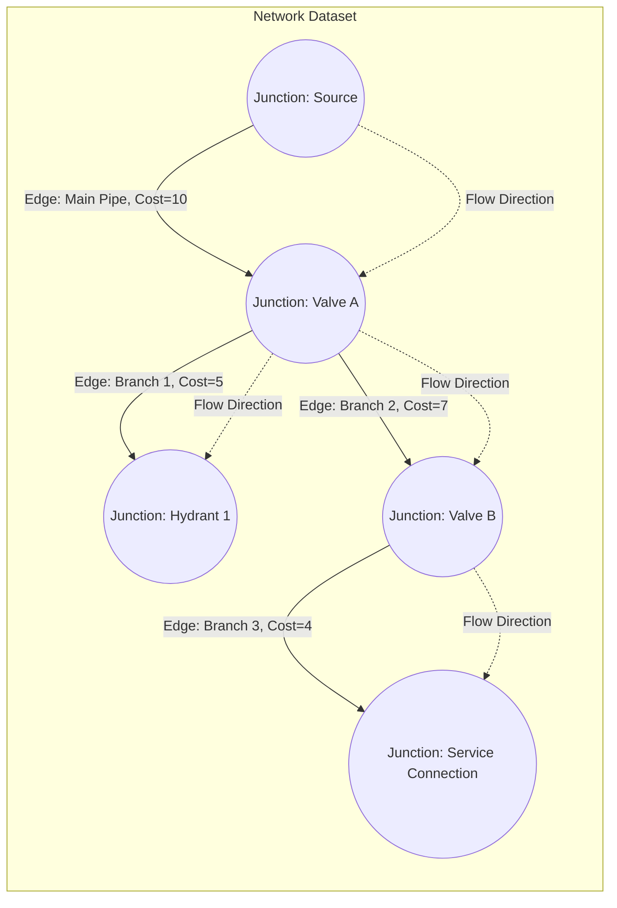

## Object-Based and Network Data Models

### Overview

Object-based and network data models represent an evolution beyond the classic simple-feature (point/line/polygon) vector model, enabling GIS to capture real-world entities with rich behavior, relationships, and topological connectivity. **Object-based models** treat geographic features as instances of classes with attributes, methods, and relationships (following object-oriented design principles), while **network data models** represent interconnected linear systems — such as roads, utility lines, or hydrological networks — as graphs of edges and junctions that support connectivity-based analysis like routing and flow tracing.

### Object-Based Data Models

#### Core Concepts

**Key Points**

- An object-based (or object-oriented) GIS data model represents geographic phenomena as **objects**, each an instance of a **class** with defined attributes (properties) and behaviors (methods), rather than as simple geometric shapes with flat attribute tables.
- Objects can encapsulate both geometry and logic, such as validation rules, default behaviors, and relationships to other objects.
- Object models support **inheritance**, allowing subclasses to inherit attributes and behaviors from parent classes (e.g., a "Fire Hydrant" class inheriting from a general "Water Infrastructure" class), and **polymorphism**, where different subclasses can respond differently to the same operation.
- Object-based models are the conceptual foundation of the **geodatabase** approach used in modern commercial and open-source GIS platforms, where feature classes, relationship classes, and behavior rules replace the flat coverage/shapefile paradigm.

#### Geodatabase Object Model Components

| Component | Description |
| --- | --- |
| Feature class | A collection of geographic features sharing the same geometry type and attribute schema (analogous to a class in OOP) |
| Object class | A table of non-spatial objects/entities related to spatial features |
| Relationship class | Defines associations between object/feature classes (one-to-one, one-to-many, many-to-many) |
| Subtype | A subset of a feature/object class sharing the same attribute schema but differing in default values, domains, or behavior |
| Domain | A rule constraining valid attribute values (e.g., coded value domains, range domains) |
| Topology rules | Constraints governing spatial relationships between features (e.g., "no gaps," "must not overlap") |
| Geometric network / Network dataset | A specialized object-based structure representing connectivity, discussed further below |

#### Rules and Validation

Object-based models support **domains** and **subtypes** to enforce data integrity:

- **Attribute domains**: restrict permissible values, e.g., a coded value domain limiting a "pipe material" field to {PVC, Steel, Cast Iron, Concrete}.
- **Range domains**: restrict numeric attributes to defined min/max bounds (e.g., pipe diameter between 2 and 48 inches).
- **Topology rules**: enforce spatial integrity, such as "polygons must not overlap" (land parcels) or "lines must not have dangles" (road centerlines).

**Example**

A water utility geodatabase might define:

- A "Pipe" feature class (subclass of a general "Water Line" class) with a subtype for "Distribution Main" vs. "Service Line," each having different default diameter domains.
- A relationship class linking "Pipe" features to "Valve" objects, enforcing that every valve object must reference an existing pipe.
- A geometric network connecting pipes and valves to support flow direction tracing.

### Network Data Models

#### Core Concepts

**Key Points**

- A network data model represents a system of interconnected linear features (**edges**) and their connection points (**junctions**) as a mathematical graph, enabling connectivity analysis beyond simple geometric adjacency.
- Two broad categories of GIS network models exist:
  - **Geometric networks**: legacy object-based network model built directly on feature classes within a geodatabase, historically used for utility and hydrological connectivity modeling.
  - **Network datasets**: a more general-purpose model supporting multimodal transportation networks, turn restrictions, one-way restrictions, and time-based impedance, commonly used for routing and logistics analysis.
- Networks are built from:
  - **Edges**: linear features representing the connective elements (e.g., road segments, pipe segments, stream reaches).
  - **Junctions**: point features representing connection nodes between edges (e.g., intersections, valves, confluence points).
  - **Impedance/cost attributes**: values assigned to edges or junctions representing the "cost" of traversal (e.g., travel time, distance, friction loss).
  - **Connectivity rules**: define which feature types are permitted to connect to which other feature types, and at what geometric coincidence.

#### Network Topology and Connectivity

Unlike planar topology (which governs geometric relationships like adjacency and containment), **network topology** governs **logical connectivity** — whether flow, traffic, or resources can move between features regardless of their exact geometric intersection. This distinction is essential because:

- Two lines can be geometrically coincident but not logically connected (e.g., a pipe crossing above another pipe in a tunnel, with no junction between them).
- Two lines can be logically connected without being geometrically coincident in simplified schematic network representations.

**Directionality and Flow**

Network models support edge directionality, essential for:

- **Utility networks**: determining flow direction in water, gas, or electrical distribution systems based on source/sink locations and pressure or head differentials.
- **Hydrological networks**: representing the direction of stream flow from upstream to downstream reaches, critical for pollutant tracing and watershed analysis.
- **Transportation networks**: enforcing one-way streets, turn restrictions, and directional impedance values (e.g., uphill vs. downhill travel time).

#### Network Analysis Operations

| Operation | Description | Typical Application |
| --- | --- | --- |
| Shortest path / routing | Finds least-cost path between two or more points given edge impedances | Vehicle routing, emergency response dispatch |
| Service area analysis | Determines the reachable area within a given cost threshold from a facility | Fire station coverage, delivery zone planning |
| Closest facility analysis | Identifies the nearest facility (from a set) to a given demand point | Assigning customers to nearest service center |
| Trace analysis (upstream/downstream) | Follows connectivity from a starting point to identify all connected upstream or downstream features | Utility outage isolation, pollutant source tracing |
| Flow direction analysis | Determines direction of flow through the network based on sources/sinks | Water/gas distribution modeling |
| Origin-destination (OD) cost matrix | Computes cost between multiple origin-destination pairs | Logistics optimization, accessibility analysis |

**Example**

A municipal water utility trace scenario:

1. A break is reported on a distribution main.
2. A **trace analysis** is run upstream from the break point to identify which valves must be closed to isolate the affected segment.
3. A **downstream trace** identifies which customer service connections will experience a service interruption.
4. The network dataset's connectivity rules ensure the trace correctly stops at closed valves (barriers) rather than propagating through the entire network.

### Comparison: Object-Based vs. Network Data Models

| Aspect | Object-Based Model | Network Data Model |
| --- | --- | --- |
| Primary focus | Representing entities with attributes, behavior, and relationships | Representing connectivity and flow/routing between linear features |
| Core structure | Classes, objects, relationship classes, domains, subtypes | Edges, junctions, impedance values, connectivity rules |
| Typical analysis | Data validation, relationship queries, behavior-driven editing | Routing, tracing, service areas, flow direction |
| Example use case | Land parcel cadastre with ownership relationship classes | Road network routing, water distribution flow tracing |
| Relationship to vector model | Extends simple features with OOP structure | Extends simple features with graph-based topology |

### Mermaid Diagram: Network Data Model Structure

### SVG Illustration: Object-Based Class Relationship Structure (svg_diagram)

<svg xmlns="http://www.w3.org/2000/svg" viewBox="0 0 640 340">
<text x="320" y="24" text-anchor="middle" font-size="16" font-weight="bold" fill="#1a1a1a">Object-Based Class Relationship Structure (svg_diagram)</text>

<rect x="230" y="50" width="180" height="60" rx="4" fill="#ebf8ff" stroke="#2b6cb0" stroke-width="1.5" />
<text x="320" y="72" text-anchor="middle" font-size="13" font-weight="bold" fill="#1a1a1a">Water Infrastructure</text>
<text x="320" y="90" text-anchor="middle" font-size="11" fill="#4a5568">(Parent Class)</text>

<line x1="320" y1="110" x2="150" y2="160" stroke="#2b6cb0" stroke-width="1.5" />
<line x1="320" y1="110" x2="320" y2="160" stroke="#2b6cb0" stroke-width="1.5" />
<line x1="320" y1="110" x2="490" y2="160" stroke="#2b6cb0" stroke-width="1.5" />

<rect x="70" y="160" width="160" height="55" rx="4" fill="#f0fff4" stroke="#2f855a" stroke-width="1.5" />
<text x="150" y="182" text-anchor="middle" font-size="12" font-weight="bold" fill="#1a1a1a">Pipe</text>
<text x="150" y="198" text-anchor="middle" font-size="10" fill="#4a5568">Subtype: Main / Service</text>
<rect x="240" y="160" width="160" height="55" rx="4" fill="#f0fff4" stroke="#2f855a" stroke-width="1.5" />
<text x="320" y="182" text-anchor="middle" font-size="12" font-weight="bold" fill="#1a1a1a">Valve</text>
<text x="320" y="198" text-anchor="middle" font-size="10" fill="#4a5568">Domain: Gate / Check</text>
<rect x="410" y="160" width="160" height="55" rx="4" fill="#f0fff4" stroke="#2f855a" stroke-width="1.5" />
<text x="490" y="182" text-anchor="middle" font-size="12" font-weight="bold" fill="#1a1a1a">Hydrant</text>
<text x="490" y="198" text-anchor="middle" font-size="10" fill="#4a5568">Domain: Flow Rate</text>

<line x1="150" y1="215" x2="320" y2="260" stroke="#c53030" stroke-width="1.5" stroke-dasharray="5,3" />
<line x1="320" y1="215" x2="320" y2="260" stroke="#c53030" stroke-width="1.5" stroke-dasharray="5,3" />
<rect x="230" y="260" width="180" height="50" rx="4" fill="#fff5f5" stroke="#c53030" stroke-width="1.5" />
<text x="320" y="282" text-anchor="middle" font-size="12" font-weight="bold" fill="#1a1a1a">Relationship Class</text>
<text x="320" y="298" text-anchor="middle" font-size="10" fill="#4a5568">Pipe — Valve (1:M)</text>

<text x="320" y="330" text-anchor="middle" font-size="11" fill="`#4a5568`">Solid lines: inheritance | Dashed lines: relationship class association</text>

</svg>

### Applications in Geospatial and Environmental Science

- **Utility infrastructure management**: water, gas, and electrical utilities rely on object-based geodatabases combined with network datasets to model asset relationships and support connectivity tracing for outage management and maintenance planning.
- **Hydrological network modeling**: stream networks modeled with directional connectivity support pollutant source tracing, flow accumulation validation, and watershed delineation consistency checks.
- **Transportation and environmental impact routing**: network datasets with environmental impedance (e.g., noise-sensitive zones, protected habitat avoidance costs) support routing analyses that minimize environmental disturbance.
- **Land administration (cadastre)**: object-based models with relationship classes represent complex ownership, easement, and parcel-subdivision relationships that simple feature models cannot adequately capture.
- **Environmental monitoring networks**: object-based models represent monitoring station objects with behavior-driven attributes (e.g., automatic flagging of sensor readings outside a domain-defined valid range).

### Limitations and Considerations

- Object-based and network models introduce additional schema complexity compared to simple feature models, requiring more careful data modeling and maintenance of rules, domains, and relationship classes.
- Network analysis accuracy depends heavily on correct connectivity rules and accurately digitized junctions; small geometric errors (e.g., undershoot/overshoot at intersections) can produce incorrect trace or routing results. [Inference: the severity of this issue scales with the positional accuracy standards used during data capture, which will vary by dataset.]
- Legacy geometric network models have been increasingly superseded by more flexible "utility network" models in some commercial platforms, though exact feature support and migration paths differ by vendor and version. [Unverified: consult current vendor documentation for platform-specific network model capabilities and migration guidance.]
- Performance of large-scale network trace and routing operations depends on network size, topology complexity, and indexing; behavior may vary across software implementations and hardware configurations.

**Related Topics**

- Geodatabase Design: Feature Classes, Domains, and Subtypes
- Topology Rules and Spatial Data Integrity
- Utility Network and Geometric Network Modeling
- Network Analysis: Routing, Service Areas, and Trace Operations
- Vector Data Models: Points, Lines, and Polygons
- Relationship Classes and Cardinality in Spatial Databases
- Hydrological Network Modeling and Flow Direction Analysis
- Object-Oriented Design Principles Applied to GIS