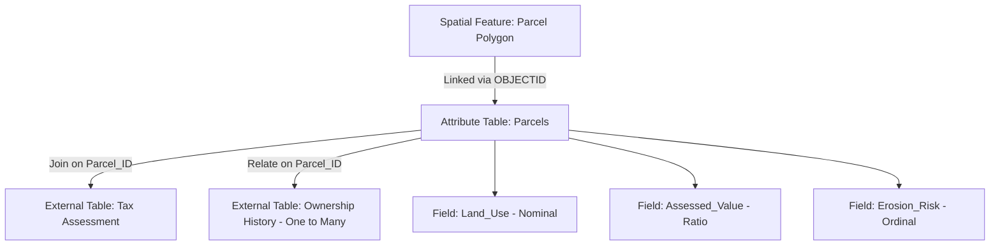

## Attribute Data and Data Tables

### Overview

Attribute data refers to the non-spatial, descriptive information associated with geographic features in a GIS, answering questions about "what" a feature is, beyond "where" it is located. Attribute data is typically organized in **data tables**, structured collections of rows (records) and columns (fields) that store characteristics linked to spatial geometry through a common identifier. The design, structure, and management of attribute tables are foundational to effective spatial analysis, querying, and cartographic representation.

### Fundamentals of Attribute Data

**Key Points**

- Every spatial feature (point, line, polygon, or raster cell) in a GIS can have one or more associated attributes describing its properties, such as name, type, population, elevation, or land use classification.
- Attribute data is conceptually separate from spatial/geometric data but is linked to it through a unique identifier, forming the basis of the GIS's ability to answer both "where" and "what" questions.
- In vector GIS, attribute tables are typically stored as relational database tables (in a geodatabase, shapefile DBF, or standalone database), with each row corresponding to one feature and each column representing one attribute field.
- In raster GIS, attribute data can be associated with individual cell values through a **Value Attribute Table (VAT)**, particularly for categorical/thematic rasters (e.g., land cover classifications).

### Structure of Attribute Tables

#### Rows and Columns

| Table Element | Description |
| --- | --- |
| Record (row) | Represents one feature instance (e.g., one parcel, one road segment, one city) |
| Field (column) | Represents one attribute/property shared across all records (e.g., "Population," "Road_Class") |
| Field name | Short identifier for the column, often constrained by naming rules (length limits, no spaces, reserved characters) |
| Field data type | Defines the kind of value stored: text (string), integer, floating-point (double/float), date, or binary |
| Primary key | A unique identifier field ensuring each record can be distinctly referenced (e.g., FeatureID, OBJECTID) |

#### Common Field Data Types

- **Text (String)**: alphanumeric values, e.g., street names, land use categories.
- **Short Integer / Long Integer**: whole numbers, e.g., population counts, number of lanes.
- **Float / Double**: decimal values, e.g., area in square kilometers, elevation in meters.
- **Date**: calendar date/time values, e.g., date of construction, survey date.
- **BLOB (Binary Large Object)**: stores binary data such as embedded images or multimedia.
- **GUID (Globally Unique Identifier)**: system-generated unique string used for record identification across distributed systems.

### The Link Between Geometry and Attributes

**Key Points**

- In most vector GIS formats (shapefiles, geodatabases), each geometric feature is automatically assigned a system-managed unique identifier (e.g., `FID` in shapefiles, `OBJECTID` in geodatabases) that links the geometry to its corresponding attribute row.
- This identifier is distinct from user-defined attribute fields and should generally not be edited directly, as it is used internally to maintain the geometry-attribute relationship.
- Attribute joins and relates allow attribute tables from external sources (e.g., a census CSV file) to be linked to spatial features using a common key field (not necessarily the internal FID/OBJECTID), enabling attribute enrichment without altering the feature geometry.

**Example**

A parcel feature class might have:

- Internal `OBJECTID`: 4521 (system-managed, links to geometry)
- User attribute `Parcel_ID`: "045-112-009" (business key used for joins with tax assessment tables)
- User attribute `Owner_Name`: "Santos, M."
- User attribute `Land_Use`: "Residential"
- User attribute `Assessed_Value`: 1250000.00

A separate tax records table (joined via `Parcel_ID`) could add fields like `Tax_Year` and `Amount_Due` without modifying the parcel geometry itself.

### Joins and Relates

| Operation | Description | Effect on Data |
| --- | --- | --- |
| Join | Combines fields from a second table into the target attribute table based on a matching key field, typically one-to-one or many-to-one | Appends columns to the existing table (often virtually, not permanently, depending on software) |
| Relate | Establishes a relationship between two tables without merging their fields, preserving a one-to-many or many-to-many relationship | Allows navigation between related records without altering the primary table's schema |
| Relationship class (geodatabase) | A persistent, schema-level definition of a join/relate relationship, with optional cardinality and behavior rules | Enforced at the database level, supporting cascading edits/deletes depending on configuration |

**Key Points**

- Joins are best suited for one-to-one or many-to-one relationships (e.g., joining a single demographic record to each census tract polygon).
- Relates are preferred when the relationship is one-to-many or many-to-many (e.g., relating a single parcel to multiple historical ownership records), since a join would either duplicate rows or lose information.

### Attribute Data Types by Measurement Scale

Attribute data can be classified according to Stevens' levels of measurement, which determine what statistical and cartographic operations are valid:

| Measurement Scale | Description | Example | Valid Operations |
| --- | --- | --- | --- |
| Nominal | Categories with no inherent order | Land use type, soil classification | Count, mode, equality comparison |
| Ordinal | Categories with a meaningful rank order but unequal intervals | Soil erosion severity (low/medium/high) | Median, rank comparison |
| Interval | Numeric values with meaningful differences but no true zero | Temperature in Celsius, year | Addition, subtraction, mean |
| Ratio | Numeric values with a true zero, allowing meaningful ratios | Population, elevation (above sea level), area | All arithmetic operations, ratios |

**Key Points**

- Selecting an inappropriate measurement scale for classification or symbolization (e.g., applying a graduated color ramp to nominal data) produces cartographically and statistically misleading maps.
- Understanding the measurement scale of an attribute is essential before performing spatial statistics, choropleth mapping, or attribute-based classification.

### Attribute Queries and Data Table Operations

**Example**

Common attribute table operations in GIS software:

- **Select by Attribute**: uses SQL-like expressions to select a subset of features, e.g.:

```sql
  SELECT * FROM parcels WHERE Land_Use = 'Residential' AND Assessed_Value > 1000000
```

- **Field Calculator**: computes or updates field values using expressions or scripts, e.g., calculating area in hectares from a geometry's shape area field.
- **Summary Statistics**: aggregates attribute values (sum, mean, min, max, standard deviation) grouped by a categorical field, e.g., total population by municipality.
- **Sort and Filter**: reorders or restricts visible records in the attribute table interface without altering underlying data.

### Value Attribute Tables (VAT) for Raster Data

**Key Points**

- Rasters representing continuous, unclassified data (e.g., a DEM) typically do not have an associated attribute table, since each cell value is itself the measured quantity.
- Rasters representing discrete, categorical, or thematic data (e.g., classified land cover) can have a **Value Attribute Table (VAT)**, where each unique cell value corresponds to one record describing that class.
- A VAT commonly includes fields such as `Value` (the raster cell integer value), `Count` (number of cells with that value), and user-added descriptive fields (e.g., `Class_Name`, `Land_Cover_Type`).

**Example**

| Value | Count | Class_Name |
| --- | --- | --- |
| 1 | 154302 | Forest |
| 2 | 88451 | Cropland |
| 3 | 23109 | Urban/Built-up |
| 4 | 41207 | Water |

### Mermaid Diagram: Attribute Table Relationship Structure



### SVG Illustration: Geometry-Attribute Link (svg_diagram)

<svg xmlns="http://www.w3.org/2000/svg" viewBox="0 0 640 300">
<text x="320" y="24" text-anchor="middle" font-size="16" font-weight="bold" fill="#1a1a1a">Geometry-Attribute Link (svg_diagram)</text>

<rect x="40" y="60" width="220" height="180" fill="#ebf8ff" stroke="#2b6cb0" stroke-width="1.5" rx="4" />
<text x="150" y="82" text-anchor="middle" font-size="12" font-weight="bold" fill="#1a1a1a">Spatial Geometry</text>
<polygon points="70,110 160,100 190,150 130,210 70,180" fill="#bee3f8" stroke="#2b6cb0" stroke-width="1.5" />
<text x="130" y="155" text-anchor="middle" font-size="11" fill="#1a1a1a">OBJECTID: 4521</text>

<line x1="260" y1="150" x2="340" y2="150" stroke="#4a5568" stroke-width="2" marker-end="url(#arrow)" />
<rect x="350" y="60" width="250" height="180" fill="#f0fff4" stroke="#2f855a" stroke-width="1.5" rx="4" />
<text x="475" y="82" text-anchor="middle" font-size="12" font-weight="bold" fill="#1a1a1a">Attribute Table</text>
<line x1="360" y1="95" x2="590" y2="95" stroke="#2f855a" stroke-width="1" />
<text x="370" y="112" font-size="10" fill="#1a1a1a">OBJECTID</text>
<text x="440" y="112" font-size="10" fill="#1a1a1a">Owner_Name</text>
<text x="530" y="112" font-size="10" fill="#1a1a1a">Land_Use</text>
<line x1="360" y1="120" x2="590" y2="120" stroke="#2f855a" stroke-width="1" />
<rect x="360" y="125" width="230" height="22" fill="#c6f6d5" />
<text x="370" y="140" font-size="10" fill="#1a1a1a">4521</text>
<text x="440" y="140" font-size="10" fill="#1a1a1a">Santos, M.</text>
<text x="530" y="140" font-size="10" fill="#1a1a1a">Residential</text>

<text x="475" y="170" font-size="10" fill="`#4a5568`">4522</text>

<text x="475" y="190" font-size="10" fill="`#4a5568`">4523</text>

<text x="320" y="270" text-anchor="middle" font-size="12" fill="`#4a5568`">The system-managed OBJECTID links each geometric feature to exactly one attribute row.</text>

</svg>

### Applications in Geospatial and Environmental Science

- **Environmental monitoring**: attribute tables store time-series sensor readings (e.g., water quality parameters) linked to fixed monitoring station point features.
- **Land use and land cover analysis**: VATs on classified raster land cover datasets enable area summary statistics and change detection reporting by class.
- **Cadastral and land administration**: attribute tables store ownership, valuation, and zoning information joined or related to parcel geometries.
- **Species and biodiversity databases**: attribute tables linked to occurrence point features store taxonomic, observation date, and habitat condition data for ecological analysis.
- **Infrastructure asset management**: attribute fields on utility network features store material, installation date, and condition-rating data used for maintenance prioritization.

### Limitations and Considerations

- Attribute table performance can degrade with very large record counts or unindexed join/relate operations; indexing key fields is generally recommended for large datasets. [Inference: the specific performance impact will depend on the underlying database engine and hardware.]
- Field name length and character restrictions vary by data format (e.g., legacy shapefile DBF format limits field names to 10 characters), which can cause truncation or renaming issues during data conversion. [Unverified: exact character limits and behavior should be confirmed against the specific file format and software version in use.]
- Careless use of joins on tables with duplicate key values can silently produce many-to-many row multiplication, leading to inflated summary statistics if not properly validated.
- Attribute domains and data type constraints, where supported, help prevent invalid data entry, but enforcement behavior may vary depending on whether editing occurs through the GIS software's editing environment or through direct database access.

**Related Topics**

- Relational Database Concepts Applied to GIS
- Data Joins vs. Relates vs. Relationship Classes
- SQL Query Construction for Spatial Attribute Selection
- Levels of Measurement and Choropleth Map Classification
- Geodatabase Schema Design: Domains and Subtypes
- Raster Value Attribute Tables and Thematic Classification
- Metadata Standards for Attribute Field Documentation
- Data Normalization and Table Design Principles