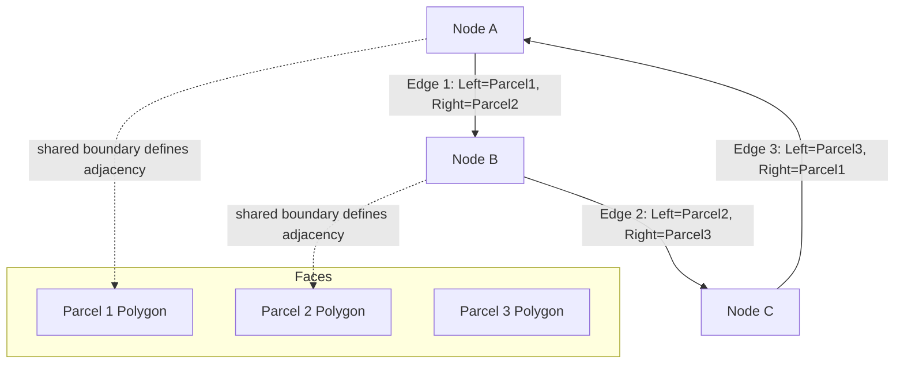

## Topology and Spatial Relationships in GIS


### Overview

Topology in GIS refers to the mathematical framework for defining and enforcing spatial relationships between geographic features — specifically adjacency, connectivity, and containment — independent of their exact coordinate geometry. Rather than treating each feature as an isolated set of coordinates, topological data models explicitly encode how features relate to one another, enabling GIS to answer relational questions (e.g., "which parcels share a boundary," "which road segments connect at this junction") and to enforce data integrity rules that prevent common digitizing errors.

### Foundational Concepts of Topology

**Key Points**

- Topology is concerned with properties of spatial objects that remain invariant under continuous deformation (stretching, bending) but not under tearing or gluing — properties such as adjacency, connectivity, and containment, as opposed to exact shape or distance.
- The three core topological relationships modeled in GIS are:
  - **Adjacency**: whether two polygons share a common boundary (e.g., two neighboring countries).
  - **Connectivity**: whether two line features share a common endpoint/node (e.g., two road segments meeting at an intersection).
  - **Containment**: whether one feature lies entirely within another (e.g., a well point located within a land parcel polygon).
- Topological data structures explicitly store these relationships (e.g., which polygons share which edges) rather than deriving them anew from raw coordinates for every query, which historically improved both analytical capability and data integrity in vector GIS.

### Topological Primitives

| Primitive | Description |
| --- | --- |
| Node | A zero-dimensional topological primitive representing an endpoint or intersection of edges (distinct from a simple vertex, which has no topological significance) |
| Edge (Arc) | A one-dimensional primitive representing a line segment between two nodes, with an explicit left and right polygon reference in a full topological structure |
| Face (Polygon) | A two-dimensional primitive bounded by a closed sequence of edges |

**Key Points**

- In a fully topological vector structure (historically implemented in the ESRI "coverage" model and formalized in the OGC/ISO simple feature and topology standards), each edge stores references to its start node, end node, and the polygon face on its left and right side.
- This edge-based encoding allows adjacency between polygons to be determined directly (two polygons sharing an edge are adjacent) without needing to compare polygon boundary coordinates geometrically.

### Topology Rules

Modern geodatabase-based topology (as opposed to legacy coverage topology) is implemented through a set of **validation rules** applied to one or more feature classes within a defined topology dataset. Common rule categories include:

| Rule Category | Example Rule | Purpose |
| --- | --- | --- |
| Area rules | "Must Not Overlap," "Must Not Have Gaps," "Must Be Covered By" | Ensure polygon features like parcels or administrative boundaries do not overlap or leave unintended gaps |
| Line rules | "Must Not Overlap," "Must Not Self-Intersect," "Must Not Have Dangles" | Ensure line networks like roads or streams form clean, connected topology without dangling endpoints |
| Point rules | "Must Be Properly Inside," "Must Be Covered By Endpoint Of" | Ensure point features like valves are correctly located relative to line or polygon features |
| Line-to-point rules | "Must Have Endpoint Covered By" | Ensure line endpoints coincide with required point features (e.g., pipe endpoints must connect to a valve or hydrant) |

**Example**

A cadastral topology dataset might enforce:

- Parcel polygons: "Must Not Overlap" and "Must Not Have Gaps" — ensuring complete, non-overlapping land coverage.
- Parcel boundaries as lines: "Must Not Have Dangles" — ensuring boundary lines form closed, valid polygon rings.
- Survey monument points: "Must Be Properly Inside" parcel polygons — ensuring monuments are correctly positioned.

When topology validation is run, features violating these rules are flagged as **topology errors**, which can be reviewed, corrected, or explicitly marked as accepted exceptions if the violation is a legitimate real-world condition.

### Common Digitizing Errors Addressed by Topology

| Error Type | Description | Topological Fix |
| --- | --- | --- |
| Undershoot | A line segment stops short of the node it should connect to, leaving a small gap | "Must Not Have Dangles" rule flags the unconnected endpoint |
| Overshoot | A line segment extends past the intersection point it should stop at | "Must Not Have Dangles" rule flags the dangling overextension |
| Sliver polygon | A thin, unintended polygon formed by slightly misaligned shared boundaries between adjacent features | "Must Not Overlap" / "Must Not Have Gaps" rules flag sliver areas |
| Overlapping polygons | Two polygons that should share a boundary instead overlap due to digitizing imprecision | "Must Not Overlap" rule flags overlapping areas |

### Spatial Relationships and the Dimensionally Extended 9-Intersection Model (DE-9IM)

**Key Points**

- Beyond stored topological structure, GIS software computes spatial relationships between features dynamically using standardized spatial predicates, most formally defined by the **Dimensionally Extended 9-Intersection Model (DE-9IM)**, part of the OGC Simple Feature Access specification.
- The DE-9IM evaluates the intersection patterns between the interior, boundary, and exterior of two geometries to classify their relationship.
- Common named spatial predicates derived from DE-9IM include:

| Predicate | Description |
| --- | --- |
| Equals | Geometries are spatially identical |
| Disjoint | Geometries share no points in common |
| Intersects | Geometries share at least one point (opposite of disjoint) |
| Touches | Geometries share only boundary points, with no interior overlap |
| Crosses | Geometries intersect at a set of points with a different dimension than the geometries themselves (e.g., a line crossing a polygon boundary) |
| Within | One geometry lies entirely inside another, sharing no exterior points |
| Contains | Inverse of "Within" — one geometry entirely encloses another |
| Overlaps | Geometries share some but not all interior points, with each having independent interior area not shared with the other |

These predicates power **spatial queries** and **spatial joins**, allowing analysts to select or join features based on their geometric relationship rather than shared attribute keys.

**Example**

```sql
-- Conceptual spatial query: select all wells within flood-hazard polygons
SELECT wells.* FROM wells, flood_zones
WHERE ST_Within(wells.geom, flood_zones.geom)
```

### Topology in Raster Data

**Key Points**

- Raster data models do not use explicit topological structures in the same sense as vector data; instead, spatial relationships are implicit in the fixed grid arrangement of cells (a cell's neighbors are inherently known by its row/column position).
- Adjacency in raster analysis is typically computed using **neighborhood analysis** (e.g., 4-connected or 8-connected neighbor rules) rather than stored topological references, relevant for operations like region-grouping, flow direction, and proximity analysis.

### Mermaid Diagram: Topological Relationships Between Features



### SVG Illustration: Topology Rule Violations (svg_diagram)

<svg xmlns="http://www.w3.org/2000/svg" viewBox="0 0 640 340">
<text x="320" y="24" text-anchor="middle" font-size="16" font-weight="bold" fill="#1a1a1a">Topology Rule Violations (svg_diagram)</text>


<text x="120" y="60" text-anchor="middle" font-size="12" font-weight="bold" fill="`#1a1a1a`">Undershoot</text>

<line x1="60" y1="100" x2="180" y2="100" stroke="`#2b6cb0`" stroke-width="2" />

<line x1="120" y1="80" x2="120" y2="96" stroke="`#2b6cb0`" stroke-width="2" />

<circle cx="120" cy="96" r="4" fill="`#c53030`" />

<text x="120" y="130" text-anchor="middle" font-size="10" fill="`#c53030`">Gap: line stops short</text>


<text x="320" y="60" text-anchor="middle" font-size="12" font-weight="bold" fill="`#1a1a1a`">Overshoot</text>

<line x1="260" y1="100" x2="380" y2="100" stroke="`#2b6cb0`" stroke-width="2" />

<line x1="320" y1="80" x2="320" y2="112" stroke="`#2b6cb0`" stroke-width="2" />

<circle cx="320" cy="112" r="4" fill="`#c53030`" />

<text x="320" y="135" text-anchor="middle" font-size="10" fill="`#c53030`">Dangle: line extends past node</text>


<text x="520" y="60" text-anchor="middle" font-size="12" font-weight="bold" fill="`#1a1a1a`">Sliver Polygon</text>

<polygon points="460,80 560,82 558,120 462,116" fill="none" stroke="`#2b6cb0`" stroke-width="1.5" />

<polygon points="462,116 558,120 556,125 464,122" fill="`#fed7d7`" stroke="`#c53030`" stroke-width="1.5" />

<text x="520" y="145" text-anchor="middle" font-size="10" fill="`#c53030`">Thin gap between boundaries</text>


<text x="120" y="200" text-anchor="middle" font-size="12" font-weight="bold" fill="`#1a1a1a`">Polygon Overlap</text>

<rect x="60" y="220" width="90" height="70" fill="`#bee3f8`" fill-opacity="0.6" stroke="`#2b6cb0`" stroke-width="1.5" />

<rect x="120" y="240" width="90" height="70" fill="`#fed7d7`" fill-opacity="0.6" stroke="`#c53030`" stroke-width="1.5" />

<text x="150" y="330" text-anchor="middle" font-size="10" fill="`#c53030`">Overlapping area violates "Must Not Overlap"</text>


<text x="450" y="200" text-anchor="middle" font-size="12" font-weight="bold" fill="`#1a1a1a`">Correct Adjacency</text>

<rect x="400" y="220" width="80" height="70" fill="`#c6f6d5`" stroke="`#2f855a`" stroke-width="1.5" />

<rect x="480" y="220" width="80" height="70" fill="`#bee3f8`" stroke="`#2f855a`" stroke-width="1.5" />

<text x="480" y="330" text-anchor="middle" font-size="10" fill="`#2f855a`">Shared edge, no gap or overlap</text>

</svg>

### Applications in Geospatial and Environmental Science

- **Cadastral mapping**: topology rules ensure parcel boundaries form a complete, non-overlapping, gap-free coverage of land area, critical for legal land administration.
- **Hydrological network validation**: connectivity topology ensures stream segments properly connect end-to-end, supporting accurate flow accumulation and watershed delineation.
- **Administrative boundary maintenance**: topology ensures nested administrative units (e.g., municipalities within provinces) satisfy containment and non-overlap rules.
- **Environmental zoning and protected area management**: spatial predicates (within, intersects, overlaps) support regulatory queries such as identifying development parcels that intersect protected wetland boundaries.
- **Utility and transportation network integrity**: connectivity rules prevent dangling or disconnected segments that would otherwise cause routing or trace analysis failures.

### Limitations and Considerations

- Enforcing and validating topology on large datasets can be computationally intensive, and topology validation workflows may need to be run incrementally (only on edited areas) for performance reasons in large enterprise geodatabases. [Inference: exact performance characteristics depend on dataset size, rule complexity, and the specific software/hardware environment.]
- Legacy coverage-based topology (with explicitly stored node-edge-face structures) has been largely superseded by rule-based geodatabase topology and, in some platforms, by newer distributed or "topology-optional" spatial models; exact feature availability differs by GIS platform and version. [Unverified: consult current vendor documentation for platform-specific topology model support.]
- Some legitimate real-world conditions may appear as topology "errors" (e.g., an intentional gap representing an unsurveyed area), requiring the exception-marking workflow rather than forced correction.
- Spatial predicate evaluation (DE-9IM based) can behave differently at geometry boundaries depending on the precision model and tolerance settings of the specific spatial database or GIS engine in use.

**Related Topics**

- Vector Data Models: Points, Lines, and Polygons
- Geodatabase Topology Rules and Validation Workflows
- Spatial Queries and Spatial Joins Using DE-9IM Predicates
- Digitizing Error Correction: Snapping, Undershoots, and Overshoots
- Network Data Models and Connectivity Analysis
- Hydrological Network Flow Direction and Watershed Delineation
- OGC Simple Feature Access Specification
- Cadastral Data Management and Land Parcel Fabric