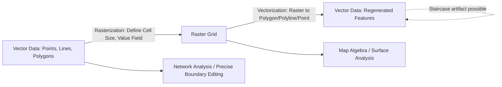

## Vector-Raster Data Conversion

### Overview

Vector-raster data conversion is the process of transforming geographic data between the two primary spatial data models — converting discrete, coordinate-based vector features (points, lines, polygons) into a regular grid of raster cells (**vectorization** in reverse, known as **rasterization**), or converting continuous or classified raster cell grids back into discrete vector features (**vectorization**). This conversion is a routine and essential GIS operation, enabling integration of datasets originally captured in different models and allowing analysts to leverage the specific analytical strengths of each format.

### Why Conversion Is Necessary

**Key Points**

- Vector and raster models have complementary analytical strengths: vector excels at precise boundary representation and network-based analysis, while raster excels at continuous surface modeling, map algebra, and integration with remote sensing imagery.
- Many GIS workflows require combining datasets originally captured in different formats — e.g., overlaying a vector-based zoning boundary with a raster-based land cover classification — necessitating conversion of one or both datasets to a common model.
- Certain spatial analysis tools operate exclusively on one data model (e.g., map algebra and cost-distance functions typically require raster input; network routing requires vector network datasets), driving the need for conversion.

### Rasterization (Vector-to-Raster Conversion)

#### Core Process

**Key Points**

- Rasterization converts vector features into a grid of cells, assigning each cell a value based on the vector feature(s) that occupy or overlap that cell's location.
- The process requires defining:
  - **Cell size (resolution)**: the spatial dimensions of each output raster cell, which determines the granularity of the resulting raster and directly affects file size and representational accuracy.
  - **Value field**: the vector attribute field whose values will populate the output raster cells (e.g., a "Zone_ID" field for a zoning polygon layer).
  - **Cell assignment method**: the rule used when multiple vector features intersect a single cell (e.g., "cell center," "maximum combined area," "maximum combined length").
  - **Extent and snap raster (optional)**: the output raster's spatial extent and cell alignment, often matched to an existing raster dataset for analytical consistency.

#### Rasterization by Geometry Type

| Geometry Type | Rasterization Behavior |
| --- | --- |
| Point | Each cell containing a point (or nearest to a point, depending on method) receives that point's attribute value; cells with no point typically receive NoData |
| Line | Cells that the line geometry passes through are assigned the line's attribute value; line width in raster terms becomes cell-width regardless of the line's true cartographic width |
| Polygon | Cells falling within the polygon boundary are assigned the polygon's attribute value; assignment at boundary cells depends on the chosen cell-center or majority-area rule |

**Example**

Converting a land parcel polygon layer (attribute: `Zoning_Code`) to a 10-meter resolution raster:

1. Define output cell size as 10m x 10m.
2. Set the value field to `Zoning_Code`.
3. Choose "cell center" assignment: a cell receives the zoning code of whichever polygon contains that cell's center point.
4. Set the output extent to match an existing land cover raster for consistent overlay analysis.
5. Cells outside all parcel boundaries (e.g., road rights-of-way) receive NoData unless explicitly filled.

#### Cell Size Selection Trade-offs

$$\text{Resolution vs. Fidelity Trade-off: smaller cell size} \rightarrow \text{higher spatial fidelity, larger file size, longer processing time}$$

- Choosing a cell size much larger than the finest vector feature detail (e.g., narrow linear features like streams or property lines) can cause features to be lost, merged, or misrepresented ("generalized") in the output raster.
- Choosing a cell size much smaller than necessary increases storage requirements and processing time without meaningful accuracy gain, particularly for data originally captured at a coarser scale.

### Vectorization (Raster-to-Vector Conversion)

#### Core Process

**Key Points**

- Vectorization converts raster cell patterns into discrete vector geometries, typically applied to classified/thematic rasters (e.g., land cover) or scanned/digitized raster imagery.
- Two primary vectorization operations exist:
  - **Raster to Polygon**: groups contiguous cells sharing the same value into polygon features, with polygon boundaries following cell edges (producing a "staircase" boundary effect unless smoothed).
  - **Raster to Polyline**: converts linear raster features (e.g., a rasterized road network or a ridge line derived from a DEM) into vector line features, often following a cell-center-to-cell-center path or a skeletonization/thinning algorithm for wide linear raster features.
  - **Raster to Point**: converts individual raster cells (typically cell centers) into point features, useful for sampling or further vector-based analysis of raster values.

#### Boundary Generalization in Vectorization

**Key Points**

- Because raster cells are square, vectorized polygon boundaries by default follow a "staircase" pattern along cell edges rather than a smooth curve.
- Many GIS tools offer a **simplification** or **smoothing** option during raster-to-polygon conversion to reduce this stair-step artifact, at the cost of some positional deviation from the exact original cell boundaries.
- The degree of staircase artifact is directly related to the raster's cell size relative to the true complexity of the underlying feature boundary; coarser rasters produce more pronounced staircase effects.

**Example**

Converting a classified land cover raster (10m resolution) to vector polygons:

1. Run "Raster to Polygon," specifying the value field (e.g., `Land_Cover_Class`).
2. Optionally enable boundary simplification to reduce staircase artifacts along class boundaries.
3. The resulting polygon feature class inherits one polygon (or multipart polygon) per contiguous group of same-valued cells, with an attribute table (often derived from the original raster's VAT).
4. Small, isolated single-cell or few-cell polygons ("speckle") may require post-processing (e.g., elimination or dissolve operations) to produce cartographically clean output.

### Comparison of Conversion Directions

| Aspect | Rasterization (Vector → Raster) | Vectorization (Raster → Vector) |
| --- | --- | --- |
| Precision impact | Precise vector boundaries are generalized to the raster grid; some positional accuracy loss is expected | Raster's inherent grid resolution limits the maximum achievable vector boundary precision |
| Typical use case | Preparing vector data for map algebra, cost-surface, or raster overlay analysis | Extracting discrete features (e.g., land cover parcels, contour lines) from classified rasters for vector-based querying/editing |
| Common artifacts | Loss of thin linear features if cell size is too coarse; boundary "snapping" to cell centers | "Staircase" polygon boundaries; speckle polygons from isolated cells; need for generalization/simplification |
| Reversibility | Generally not perfectly reversible — converting vector to raster and back to vector will not exactly reproduce original geometry | Same — round-trip conversion introduces cumulative generalization |

### Mermaid Diagram: Vector-Raster Conversion Workflow

### SVG Illustration: Rasterization of a Polygon Boundary (svg_diagram)

<svg xmlns="http://www.w3.org/2000/svg" viewBox="0 0 640 340">
<text x="320" y="24" text-anchor="middle" font-size="16" font-weight="bold" fill="#1a1a1a">Rasterization of a Polygon Boundary (svg_diagram)</text>

<text x="160" y="55" text-anchor="middle" font-size="12" font-weight="bold" fill="`#1a1a1a`">Original Vector Polygon</text>

<polygon points="80,80 220,90 240,180 140,240 70,190" fill="`#bee3f8`" fill-opacity="0.5" stroke="`#2b6cb0`" stroke-width="2" />

<text x="480" y="55" text-anchor="middle" font-size="12" font-weight="bold" fill="`#1a1a1a`">Rasterized Output (Staircase Boundary)</text>

<g stroke="`#a0aec0`" stroke-width="0.5">

<line x1="360" y1="70" x2="360" y2="260" />

<line x1="390" y1="70" x2="390" y2="260" />

<line x1="420" y1="70" x2="420" y2="260" />

<line x1="450" y1="70" x2="450" y2="260" />

<line x1="480" y1="70" x2="480" y2="260" />

<line x1="510" y1="70" x2="510" y2="260" />

<line x1="540" y1="70" x2="540" y2="260" />

<line x1="570" y1="70" x2="570" y2="260" />

<line x1="600" y1="70" x2="600" y2="260" />

<line x1="360" y1="70" x2="600" y2="70" />

<line x1="360" y1="100" x2="600" y2="100" />

<line x1="360" y1="130" x2="600" y2="130" />

<line x1="360" y1="160" x2="600" y2="160" />

<line x1="360" y1="190" x2="600" y2="190" />

<line x1="360" y1="220" x2="600" y2="220" />

<line x1="360" y1="250" x2="600" y2="250" />

</g>

<g fill="#2b6cb0" fill-opacity="0.6">
<rect x="420" y="70" width="30" height="30" />
<rect x="450" y="70" width="30" height="30" />
<rect x="390" y="100" width="30" height="30" />
<rect x="420" y="100" width="30" height="30" />
<rect x="450" y="100" width="30" height="30" />
<rect x="480" y="100" width="30" height="30" />
<rect x="390" y="130" width="30" height="30" />
<rect x="420" y="130" width="30" height="30" />
<rect x="450" y="130" width="30" height="30" />
<rect x="480" y="130" width="30" height="30" />
<rect x="420" y="160" width="30" height="30" />
<rect x="450" y="160" width="30" height="30" />
<rect x="480" y="160" width="30" height="30" />
<rect x="450" y="190" width="30" height="30" />
<rect x="480" y="190" width="30" height="30" />
<rect x="450" y="220" width="30" height="30" />
</g>

<text x="320" y="300" text-anchor="middle" font-size="12" fill="`#4a5568`">Smooth vector boundary (left) becomes a stepped cell-based approximation (right) after rasterization.</text>

</svg>

### Applications in Geospatial and Environmental Science

- **Environmental suitability modeling**: vector-based zoning, soil, and protected-area boundaries are rasterized to enable map algebra combination with raster-based environmental layers (slope, land cover, precipitation) in weighted overlay suitability analysis.
- **Land cover change detection**: classified land cover rasters are periodically vectorized into polygon datasets for area-based statistical reporting and comparison across time periods.
- **Hydrological modeling**: vector stream centerlines are often rasterized (burned into a DEM) to enforce correct flow direction along known channels during watershed delineation ("stream burning").
- **Cost-distance and habitat connectivity analysis**: vector-based barriers (roads, fences) or resource points are rasterized as inputs to raster-based cost-surface and least-cost-path analyses for wildlife corridor planning.
- **Cartographic and legacy data integration**: older scanned or digitized paper maps captured as vector data may require rasterization for visual comparison with modern raster basemaps, or vice versa.

### Limitations and Considerations

- Conversion between vector and raster models is generally a lossy, one-way generalization process; repeated round-trip conversions can compound positional and attribute generalization errors. [Inference: the magnitude of cumulative error depends on the chosen cell size, feature complexity, and number of conversion cycles performed.]
- Selecting an inappropriate cell size relative to the finest feature detail in the source vector data can cause narrow linear features (e.g., thin canals, fence lines) to be dropped entirely or become disconnected in rasterized output.
- The specific algorithms used for cell assignment (e.g., "cell center" vs. "maximum area") and for polygon boundary simplification during vectorization can differ across GIS software platforms, producing slightly different results for the same input parameters. [Unverified: consult the specific software's documentation for its exact rasterization/vectorization algorithm behavior.]
- Vectorized output from classified rasters often requires post-processing (e.g., eliminating small speckle polygons, simplifying boundaries) before it is suitable for cartographic presentation or precise analytical use.

**Related Topics**

- Raster Data Models: Cell Size, Resolution, and NoData Handling
- Vector Data Models: Points, Lines, and Polygons
- Map Algebra and Raster Overlay Analysis
- Stream Burning and Hydrological Conditioning of DEMs
- Generalization and Simplification Algorithms in GIS
- Weighted Overlay and Suitability Modeling
- Land Cover Classification and Change Detection
- Cost-Distance and Least-Cost Path Analysis