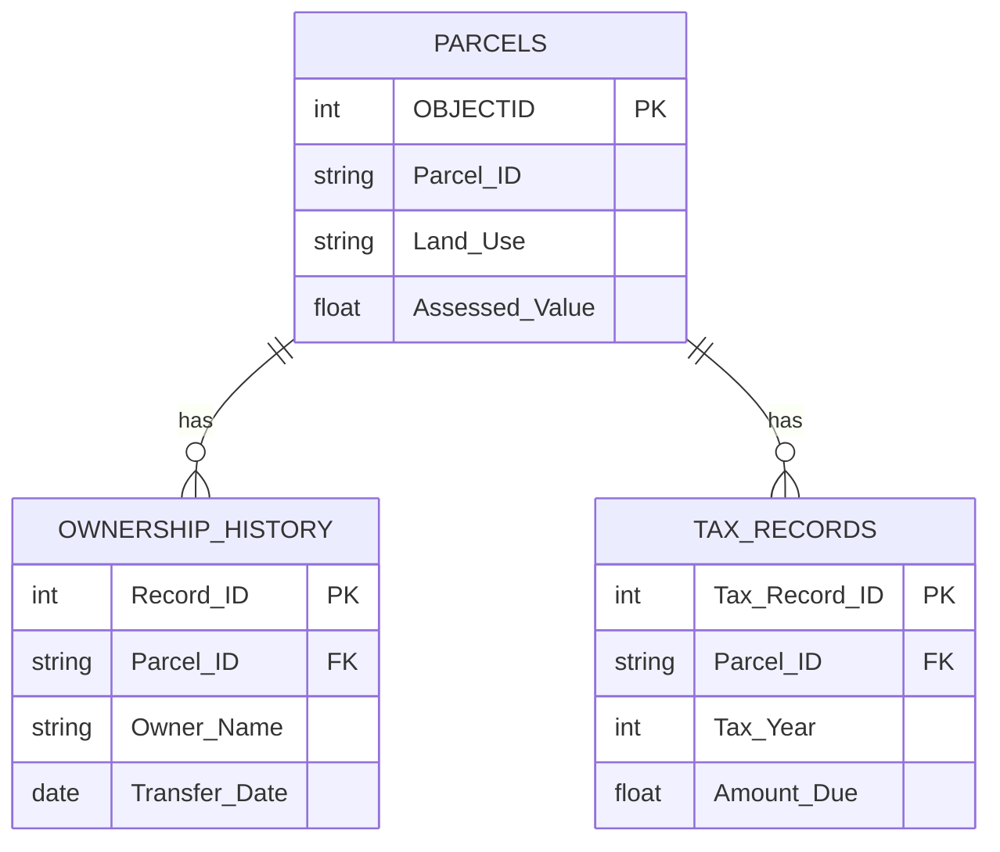

## Relational Database Concepts


### Overview

Relational database concepts form the theoretical and structural foundation underlying most modern spatial database management systems (DBMS) used in GIS, including PostgreSQL/PostGIS, Oracle Spatial, Microsoft SQL Server, and the geodatabase model built atop these engines. Understanding relational theory — tables, keys, normalization, and structured query language (SQL) — is essential for designing efficient, integrity-preserving spatial data schemas and for performing complex attribute and spatial queries.

### The Relational Model

**Key Points**

- The relational model, introduced by E.F. Codd in 1970, organizes data into two-dimensional tables called **relations**, each consisting of **rows (tuples)** representing individual records and **columns (attributes)** representing properties shared across all records.
- Each table typically represents a single real-world entity type (e.g., "Parcels," "Wells," "Roads"), and relationships between entities are represented through shared key values rather than nested or hierarchical structures.
- The relational model's mathematical foundation is set theory and predicate logic, enabling formal query operations (selection, projection, join, union, intersection) that are implemented practically through SQL.

### Core Terminology

| Term | Definition |
| --- | --- |
| Relation (Table) | A structured collection of rows and columns representing one entity type |
| Tuple (Row/Record) | A single instance of the entity, containing one value per column |
| Attribute (Column/Field) | A named property shared by all tuples in the relation |
| Domain | The set of permissible values for a given attribute |
| Cardinality | The number of rows (tuples) in a relation |
| Degree | The number of columns (attributes) in a relation |
| Schema | The structural definition of a database: table names, column names, data types, and constraints |

### Keys and Referential Integrity

#### Types of Keys

| Key Type | Description |
| --- | --- |
| Candidate key | Any attribute or minimal combination of attributes that could uniquely identify each row |
| Primary key | The candidate key selected to uniquely identify each row in a table; cannot contain NULL values |
| Composite key | A primary key composed of two or more attributes together, used when no single attribute is unique |
| Foreign key | An attribute in one table that references the primary key of another table, establishing a relationship between them |
| Surrogate key | A system-generated, meaningless unique identifier (e.g., an auto-incrementing integer or GUID) used as a primary key instead of a natural attribute |

**Key Points**

- Foreign keys enforce **referential integrity**, ensuring that a value referencing another table must correspond to an existing record in that table (e.g., a "Parcel_ID" in a tax records table must exist in the parcels table).
- Referential integrity constraints can define behaviors on deletion or update of referenced rows, such as **cascade** (automatically delete/update dependent rows), **restrict** (prevent deletion if dependent rows exist), or **set null** (set the foreign key to NULL when the referenced row is deleted).
- Spatial feature classes in a geodatabase commonly use a surrogate key (e.g., `OBJECTID`) as the system-managed primary key, separate from any user-defined business key (e.g., `Parcel_Number`).

### Relationships and Cardinality

| Relationship Type | Description | Example |
| --- | --- | --- |
| One-to-One (1:1) | Each row in Table A relates to exactly one row in Table B, and vice versa | A parcel and its single most-recent appraisal record |
| One-to-Many (1:M) | Each row in Table A can relate to multiple rows in Table B, but each row in Table B relates to only one row in Table A | One parcel with multiple historical ownership records |
| Many-to-Many (M:N) | Rows in Table A can relate to multiple rows in Table B, and vice versa; typically implemented via a junction/bridge table | Multiple monitoring stations each recording multiple pollutant types, and each pollutant type measured at multiple stations |

**Example**

A many-to-many relationship between "Monitoring_Stations" and "Pollutants" would require a junction table, e.g., "Station_Pollutant_Readings," containing foreign keys to both tables plus reading-specific attributes (e.g., `Reading_Date`, `Concentration_Value`).

### Normalization

**Key Points**

- Normalization is the process of organizing relational tables to minimize data redundancy and prevent update, insertion, and deletion anomalies, following a sequence of formally defined **normal forms**.
- Each normal form builds on the requirements of the previous one:

| Normal Form | Requirement |
| --- | --- |
| First Normal Form (1NF) | Each column contains atomic (indivisible) values; no repeating groups or arrays within a single field |
| Second Normal Form (2NF) | Must satisfy 1NF; all non-key attributes must depend on the entire primary key (relevant for composite keys), eliminating partial dependency |
| Third Normal Form (3NF) | Must satisfy 2NF; all non-key attributes must depend only on the primary key, not on other non-key attributes, eliminating transitive dependency |

**Example**

An unnormalized table storing parcel data with repeating owner columns (`Owner1_Name`, `Owner2_Name`, `Owner3_Name`) violates 1NF due to repeating groups. Normalizing this would involve creating a separate "Owners" table related to "Parcels" via a foreign key, allowing any number of owners per parcel without altering the table schema.

**Key Points**

- While normalization reduces redundancy and improves data integrity, GIS practitioners often apply **controlled denormalization** for performance reasons — e.g., storing a frequently queried summary attribute directly on a spatial feature class rather than requiring a join every time, trading some redundancy for query speed. [Inference: the appropriate degree of denormalization depends on the specific query patterns, data volume, and performance requirements of a given system.]

### Structured Query Language (SQL) Fundamentals

#### Core SQL Command Categories

| Category | Commands | Purpose |
| --- | --- | --- |
| DDL (Data Definition Language) | `CREATE`, `ALTER`, `DROP` | Define and modify database schema (tables, constraints, indexes) |
| DML (Data Manipulation Language) | `SELECT`, `INSERT`, `UPDATE`, `DELETE` | Query and modify data within tables |
| DCL (Data Control Language) | `GRANT`, `REVOKE` | Manage user permissions and access control |
| TCL (Transaction Control Language) | `COMMIT`, `ROLLBACK`, `SAVEPOINT` | Manage transaction consistency and durability |

#### Common SQL Query Patterns for GIS

**Example**

```sql
-- Basic attribute selection
SELECT parcel_id, owner_name, assessed_value
FROM parcels
WHERE land_use = 'Residential' AND assessed_value > 1000000;

-- Join across related tables
SELECT p.parcel_id, p.owner_name, t.tax_year, t.amount_due
FROM parcels p
JOIN tax_records t ON p.parcel_id = t.parcel_id
WHERE t.tax_year = 2026;

-- Aggregate summary statistics
SELECT land_use, COUNT(*) AS parcel_count, AVG(assessed_value) AS avg_value
FROM parcels
GROUP BY land_use
ORDER BY avg_value DESC;

-- Spatial query extension (e.g., PostGIS)
SELECT w.well_id, w.owner
FROM wells w, protected_zones z
WHERE ST_Within(w.geom, z.geom);
```

### Indexing for Performance

**Key Points**

- A database **index** is an auxiliary data structure (commonly a B-tree) that accelerates lookup, filtering, and join operations on specified columns, at the cost of additional storage and slightly slower write operations.
- Spatial databases additionally require **spatial indexes** (commonly R-tree based structures, such as GiST indexes in PostgreSQL/PostGIS) to efficiently accelerate spatial predicate queries (e.g., `ST_Within`, `ST_Intersects`) that would otherwise require scanning every geometry in a table.
- Indexing foreign key columns used in frequent joins, and columns commonly used in `WHERE` clause filtering, is a standard practice for query performance optimization. [Inference: exact performance gains from indexing depend on table size, query patterns, and the underlying database engine's query planner.]

### Mermaid Diagram: Relational Schema with Keys and Cardinality



### SVG Illustration: Relational Table Structure with Primary/Foreign Keys (svg_diagram)

<svg xmlns="http://www.w3.org/2000/svg" viewBox="0 0 640 320">
<text x="320" y="24" text-anchor="middle" font-size="16" font-weight="bold" fill="#1a1a1a">Relational Table Structure with Primary/Foreign Keys (svg_diagram)</text>

<rect x="40" y="60" width="220" height="140" fill="#ebf8ff" stroke="#2b6cb0" stroke-width="1.5" rx="4" />
<text x="150" y="82" text-anchor="middle" font-size="13" font-weight="bold" fill="#1a1a1a">Parcels</text>
<line x1="40" y1="92" x2="260" y2="92" stroke="#2b6cb0" stroke-width="1" />
<text x="55" y="112" font-size="11" fill="#1a1a1a">PK Parcel_ID</text>
<text x="55" y="132" font-size="11" fill="#4a5568">Owner_Name</text>
<text x="55" y="152" font-size="11" fill="#4a5568">Land_Use</text>
<text x="55" y="172" font-size="11" fill="#4a5568">Assessed_Value</text>

<rect x="380" y="60" width="220" height="140" fill="#f0fff4" stroke="#2f855a" stroke-width="1.5" rx="4" />
<text x="490" y="82" text-anchor="middle" font-size="13" font-weight="bold" fill="#1a1a1a">Tax_Records</text>
<line x1="380" y1="92" x2="600" y2="92" stroke="#2f855a" stroke-width="1" />
<text x="395" y="112" font-size="11" fill="#1a1a1a">PK Tax_Record_ID</text>
<text x="395" y="132" font-size="11" fill="#c53030">FK Parcel_ID</text>
<text x="395" y="152" font-size="11" fill="#4a5568">Tax_Year</text>
<text x="395" y="172" font-size="11" fill="#4a5568">Amount_Due</text>

<line x1="260" y1="115" x2="380" y2="130" stroke="#c53030" stroke-width="1.5" stroke-dasharray="5,3" />
<text x="320" y="105" text-anchor="middle" font-size="10" fill="#c53030">1 : M</text>

<text x="320" y="250" text-anchor="middle" font-size="12" fill="`#4a5568`">Parcel_ID in Tax_Records is a foreign key referencing the Parcels primary key.</text>

<text x="320" y="270" text-anchor="middle" font-size="12" fill="`#4a5568`">One parcel can relate to many tax records (1:M cardinality).</text>

</svg>

### Applications in Geospatial and Environmental Science

- **Enterprise geodatabase design**: relational normalization principles guide the design of feature classes, related object tables, and relationship classes for utility, cadastral, and environmental monitoring databases.
- **Environmental monitoring data management**: normalized schemas separate station metadata, sensor equipment records, and time-series readings into related tables, avoiding redundant storage of station information across every reading.
- **Multi-user spatial data editing**: relational transaction control (commit/rollback) underlies versioned editing workflows in enterprise GIS, ensuring data consistency when multiple analysts edit shared datasets concurrently.
- **Spatial data interoperability**: SQL-based spatial extensions (PostGIS, SQL Server spatial types, Oracle Spatial) allow environmental and geospatial datasets to be queried, joined, and analyzed using standard relational database tools alongside dedicated GIS software.

### Limitations and Considerations

- Over-normalization can lead to excessive joins for common queries, potentially degrading performance in read-heavy GIS analytical workflows; the appropriate normalization level often involves a deliberate trade-off informed by actual query patterns. [Inference: this trade-off depends on the specific system's read/write ratio and query complexity, which will vary by deployment.]
- Spatial indexing behavior, supported index types (e.g., R-tree, quad-tree, GiST), and query optimizer behavior differ across database platforms (PostgreSQL/PostGIS, Oracle Spatial, SQL Server, geodatabase file/enterprise formats). [Unverified: consult the specific database platform's documentation for exact spatial indexing capabilities and syntax.]
- Referential integrity enforcement (cascade, restrict, set null) must be carefully designed for spatial relationship classes, since improper cascade rules can lead to unintended bulk deletion of related spatial features.
- Not all GIS file-based formats (e.g., shapefiles) support relational constructs like foreign keys or enforced referential integrity; these constraints are generally only available in true relational/geodatabase systems.

**Related Topics**

- Geodatabase Design: Feature Classes, Domains, and Subtypes
- Spatial Indexing: R-Trees and Query Optimization
- SQL for Spatial Queries (PostGIS, Spatial SQL Extensions)
- Data Normalization and Denormalization Trade-offs
- Relationship Classes and Cardinality in Spatial Databases
- Transaction Management and Versioned Editing in Enterprise GIS
- Database Schema Design for Environmental Monitoring Systems
- Entity-Relationship (ER) Modeling for Spatial Data