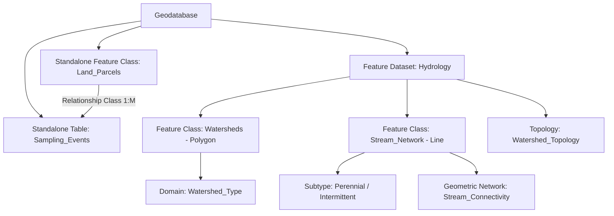

## Geodatabase Architecture and Design

### Overview

A geodatabase is an object-relational data storage architecture that combines the structural rigor of relational database management systems with GIS-specific constructs for storing, managing, and enforcing rules on spatial data. Geodatabase architecture and design encompasses the physical storage formats available, the logical schema components (feature datasets, feature classes, tables, relationship classes), and the design principles required to build a scalable, maintainable, and behaviorally rich spatial data model for organizational GIS use.

### Geodatabase Storage Types

| Type | Description | Typical Use Case |
| --- | --- | --- |
| File Geodatabase | A folder-based storage format (with a `.gdb` extension) storing data in a proprietary binary file structure, supporting large datasets and multi-user read access | Project-based or single-user editing workflows; most common lightweight deployment |
| Personal Geodatabase | A legacy format built on Microsoft Access (`.mdb`), with strict file size limitations | Largely deprecated; historical/legacy small-scale projects |
| Enterprise (Multiuser) Geodatabase | A geodatabase implemented atop a full relational DBMS (e.g., PostgreSQL/PostGIS, Oracle, SQL Server, Db2) via a client-server architecture | Large organizational, multi-user editing environments requiring versioning, replication, and concurrent access control |
| Mobile/Cloud Geodatabase | A lightweight, often SQLite-based geodatabase designed for field data collection and disconnected editing, later synchronized with an enterprise geodatabase | Field survey and offline data collection workflows |

**Key Points**

- The choice of geodatabase storage type depends on factors including expected number of concurrent editors, dataset size, need for versioned/historical editing, and integration with existing organizational database infrastructure. [Inference: the optimal choice depends on organization-specific factors such as IT infrastructure, budget, and team size, which will vary.]
- Enterprise geodatabases typically require a full RDBMS license and dedicated database administration, while file geodatabases require no separate database engine and can be used directly from the file system.

### Logical Schema Components

#### Feature Classes and Feature Datasets

| Component | Description |
| --- | --- |
| Feature class | A collection of geographic features sharing the same geometry type (point, line, polygon, multipoint) and a common attribute schema |
| Feature dataset | A container that groups related feature classes sharing a common spatial reference (coordinate system), often used to organize feature classes that participate in the same topology or geometric network |
| Standalone table | A non-spatial table storing attribute data that can be related or joined to feature classes |
| Raster dataset / Mosaic dataset | Raster data stored within the geodatabase, with mosaic datasets supporting management of large collections of raster tiles as a single logical dataset |

**Key Points**

- Grouping feature classes into a feature dataset is required when features must participate in a shared **topology** or **geometric network**, since these constructs operate across multiple feature classes within the same dataset.
- Feature classes that do not need to participate in cross-feature-class topology or network relationships can be stored as standalone feature classes directly within the geodatabase, without requiring a feature dataset container.

#### Behavioral and Rule-Based Components

| Component | Description |
| --- | --- |
| Domain | A rule constraining valid attribute values, shared and reusable across multiple feature classes (coded value domains or range domains) |
| Subtype | A subdivision of a feature class or table sharing the schema but differing in default values, applicable domains, or connectivity rules |
| Relationship class | A persistent, schema-level definition of an association between two feature classes/tables, with defined cardinality (1:1, 1:M, M:N) and optional messaging/cascading behavior |
| Attribute rule / Validation rule | Programmatic rules (calculation, constraint, or validation logic) executed automatically during editing to enforce data integrity or automate attribute population |
| Topology | A rule-based framework enforcing spatial integrity relationships (adjacency, containment, connectivity) across one or more feature classes within a feature dataset |
| Geometric network / Utility network | A specialized schema construct modeling connectivity and flow for utility or infrastructure systems |

### Geodatabase Design Workflow

**Example**

A typical geodatabase design process for a municipal environmental monitoring system:

1. **Requirements gathering**: identify entities to model (monitoring stations, sampling events, water quality parameters, watersheds) and their relationships.
2. **Conceptual data modeling**: create an entity-relationship diagram identifying feature classes, standalone tables, and their cardinality relationships.
3. **Define spatial reference**: select an appropriate coordinate system for the feature dataset(s), ensuring consistency across all feature classes that will participate in topology or spatial analysis together.
4. **Define feature classes and geometry types**: e.g., "Monitoring_Stations" (point), "Watersheds" (polygon), "Stream_Network" (line).
5. **Define domains**: e.g., a coded value domain for `Station_Type` limited to {Surface Water, Groundwater, Air Quality}.
6. **Define subtypes**: e.g., subtypes of "Monitoring_Stations" for "Active" vs. "Decommissioned," each with different default field values.
7. **Define relationship classes**: e.g., a 1:M relationship between "Monitoring_Stations" and "Sampling_Events."
8. **Define topology rules** (if applicable): e.g., "Watersheds Must Not Overlap."
9. **Implement attribute rules**: e.g., automatically calculate a "Days_Since_Last_Sample" field upon record update.
10. **Test and validate**: perform sample data loading and editing to verify schema behavior, domain enforcement, and relationship integrity before full deployment.

### Versioning and Multiuser Editing

**Key Points**

- Enterprise geodatabases commonly support **versioning**, allowing multiple editors to make simultaneous edits to the same dataset within isolated "versions" of the data, which are later reconciled and posted to a shared default version.
- Version reconciliation identifies and resolves conflicts when two editors have modified the same feature, typically requiring conflict resolution rules (e.g., "first in wins," "last in wins," or manual review) to be defined. [Inference: the exact conflict detection and resolution mechanics differ across platform implementations and configuration choices.]
- Alternative multiuser editing models (such as branch versioning or non-versioned direct editing with database-level locking) are supported by some platforms, with different trade-offs regarding editing latency, conflict handling, and offline/disconnected editing support. [Unverified: consult the specific platform's documentation for supported versioning models and their exact behavior.]

### Design Principles and Best Practices

**Key Points**

- **Normalize appropriately**: apply relational normalization principles to standalone tables and relationship classes to avoid redundant attribute storage, while balancing against query performance needs (see denormalization trade-offs in relational database design).
- **Use domains and subtypes consistently**: centralizing valid value lists in domains (rather than repeating them in each feature class) simplifies schema maintenance and ensures consistency across the geodatabase.
- **Group by spatial reference and topological relationship, not just theme**: feature datasets should be organized based on shared coordinate systems and participation in common topology/networks, not purely by subject matter grouping.
- **Plan for scalability**: anticipate future data volume growth, the number of concurrent editors, and integration needs (e.g., web services, mobile data collection) during initial schema design rather than retrofitting later.
- **Document the schema**: maintain a data dictionary describing each feature class, field, domain, and relationship class to support long-term maintainability, especially in organizations with staff turnover.

### Mermaid Diagram: Geodatabase Schema Hierarchy

### SVG Illustration: Geodatabase Component Hierarchy (svg_diagram)

<svg xmlns="http://www.w3.org/2000/svg" viewBox="0 0 640 360">
<text x="320" y="24" text-anchor="middle" font-size="16" font-weight="bold" fill="#1a1a1a">Geodatabase Component Hierarchy (svg_diagram)</text>

<rect x="260" y="50" width="120" height="45" rx="4" fill="#2b6cb0" />
<text x="320" y="77" text-anchor="middle" font-size="12" font-weight="bold" fill="#ffffff">Geodatabase</text>

<line x1="320" y1="95" x2="200" y2="140" stroke="#4a5568" stroke-width="1.5" />
<rect x="120" y="140" width="160" height="45" rx="4" fill="#2c5282" />
<text x="200" y="167" text-anchor="middle" font-size="11" font-weight="bold" fill="#ffffff">Feature Dataset</text>

<line x1="320" y1="95" x2="440" y2="140" stroke="#4a5568" stroke-width="1.5" />
<rect x="360" y="140" width="160" height="45" rx="4" fill="#2c5282" />
<text x="440" y="167" text-anchor="middle" font-size="11" font-weight="bold" fill="#ffffff">Standalone Feature Class</text>

<line x1="200" y1="185" x2="130" y2="230" stroke="#4a5568" stroke-width="1" />
<rect x="60" y="230" width="140" height="40" rx="4" fill="#c6f6d5" stroke="#2f855a" stroke-width="1.5" />
<text x="130" y="254" text-anchor="middle" font-size="10" fill="#1a1a1a">Feature Class: Watersheds</text>
<line x1="200" y1="185" x2="270" y2="230" stroke="#4a5568" stroke-width="1" />
<rect x="200" y="230" width="140" height="40" rx="4" fill="#c6f6d5" stroke="#2f855a" stroke-width="1.5" />
<text x="270" y="254" text-anchor="middle" font-size="10" fill="#1a1a1a">Feature Class: Streams</text>

<rect x="60" y="290" width="280" height="40" rx="4" fill="#fefcbf" stroke="#975a16" stroke-width="1.5" />
<text x="200" y="314" text-anchor="middle" font-size="10" fill="#1a1a1a">Topology, Domains, Subtypes, Geometric Network</text>
<line x1="130" y1="270" x2="130" y2="290" stroke="#4a5568" stroke-width="1" />
<line x1="270" y1="270" x2="270" y2="290" stroke="#4a5568" stroke-width="1" />

<line x1="440" y1="185" x2="440" y2="230" stroke="#c53030" stroke-width="1.5" stroke-dasharray="5,3" />
<rect x="360" y="230" width="160" height="40" rx="4" fill="#fed7d7" stroke="#c53030" stroke-width="1.5" />
<text x="440" y="254" text-anchor="middle" font-size="10" fill="#1a1a1a">Related Table: Sampling_Events</text>
</svg>

### Applications in Geospatial and Environmental Science

- **Watershed and hydrological management systems**: geodatabases organize stream networks, watersheds, and monitoring stations within a shared feature dataset to support topology validation and geometric network-based flow tracing.
- **Environmental compliance and permitting systems**: relationship classes link permit application tables to spatial facility or site feature classes, supporting regulatory tracking workflows.
- **Multi-agency environmental data sharing**: enterprise geodatabases with versioning support collaborative editing of shared datasets (e.g., protected area boundaries) across multiple government agencies or departments.
- **Field-based environmental data collection**: mobile geodatabases enable offline collection of field survey or sampling data, later synchronized to a central enterprise geodatabase for organization-wide access.
- **Land administration and cadastral systems**: geodatabase domains and subtypes enforce standardized land use classifications and parcel status codes across large jurisdiction-wide parcel fabrics.

### Limitations and Considerations

- The specific feature set, storage limits, and versioning models available differ substantially between file geodatabases, enterprise geodatabases, and vendor-specific implementations; exact capabilities should be confirmed against current platform documentation. [Unverified: consult the specific GIS platform's current documentation for storage limits and supported features by geodatabase type.]
- Poorly planned feature dataset groupings (e.g., grouping unrelated feature classes purely by theme rather than by shared spatial reference or topological need) can lead to unnecessary schema rigidity and maintenance difficulty later.
- Enterprise geodatabase versioning and reconciliation introduce additional administrative complexity (conflict resolution policy, version tree management, periodic compression/maintenance) that should be planned for during initial system design. [Inference: the operational overhead of versioning administration scales with the number of concurrent editors and edit frequency, which will vary by deployment.]
- Migration between geodatabase storage types (e.g., file to enterprise) or between GIS software vendors may require schema translation and is not always a fully automated, lossless process depending on the specific behavioral rules (attribute rules, geometric networks) used in the source schema.

**Related Topics**

- Relational Database Concepts Applied to GIS
- Topology Rules and Spatial Data Integrity
- Object-Based and Network Data Models
- Versioned Editing and Multiuser Geodatabase Workflows
- Domains, Subtypes, and Attribute Rules
- Enterprise GIS System Architecture
- Mobile and Field Data Collection Workflows
- Data Dictionary and Metadata Documentation Practices