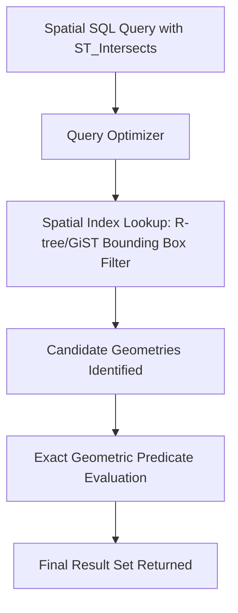

## SQL and Spatial Query Languages


### Overview

SQL (Structured Query Language) and spatial query language extensions provide the standardized means of defining, manipulating, and querying data within relational and spatial databases. While standard SQL handles attribute-based operations on tabular data, **spatial SQL extensions** — most notably implementations conforming to the OGC Simple Feature Access (SFA) specification, such as PostGIS, Oracle Spatial, and SQL Server's spatial types — add geometry data types and spatial functions, enabling queries that reason directly about location, distance, adjacency, and geometric relationships.

### Standard SQL Fundamentals

#### Command Categories

| Category | Commands | Purpose |
| --- | --- | --- |
| DDL (Data Definition Language) | `CREATE`, `ALTER`, `DROP` | Define and modify schema: tables, columns, constraints, indexes |
| DML (Data Manipulation Language) | `SELECT`, `INSERT`, `UPDATE`, `DELETE` | Query and modify table data |
| DCL (Data Control Language) | `GRANT`, `REVOKE` | Manage user access permissions |
| TCL (Transaction Control Language) | `COMMIT`, `ROLLBACK` | Manage transaction consistency |

#### Core SELECT Query Clauses

| Clause | Function |
| --- | --- |
| `SELECT` | Specifies which columns (or computed expressions) to return |
| `FROM` | Specifies the source table(s) |
| `WHERE` | Filters rows based on a condition |
| `JOIN` | Combines rows from two or more tables based on a related key |
| `GROUP BY` | Aggregates rows sharing common values in specified columns |
| `HAVING` | Filters aggregated groups (used after `GROUP BY`, unlike `WHERE` which filters before aggregation) |
| `ORDER BY` | Sorts the result set |

**Example**

```sql
SELECT land_use, COUNT(*) AS parcel_count, AVG(assessed_value) AS avg_value
FROM parcels
WHERE assessed_value IS NOT NULL
GROUP BY land_use
HAVING COUNT(*) > 10
ORDER BY avg_value DESC;
```

### Geometry Data Types in Spatial SQL

**Key Points**

- Spatial database extensions introduce a **geometry** (planar/Cartesian) and often a **geography** (geodetic/spherical, accounting for Earth's curvature) data type as native column types, alongside standard types like integer, text, and date.
- The OGC Simple Feature Access specification defines standard geometry subtypes stored within these columns:

| Geometry Type | Description |
| --- | --- |
| Point | A single x, y (and optionally z) coordinate |
| LineString | An ordered sequence of points forming a connected line |
| Polygon | A closed ring (or set of rings, for polygons with holes) defining an area |
| MultiPoint / MultiLineString / MultiPolygon | Collections of multiple geometries of the same base type stored as a single feature |
| GeometryCollection | A heterogeneous collection of mixed geometry types |

- Geometries are commonly represented in text or binary interchange formats, including **Well-Known Text (WKT)** (e.g., `POINT(120.5 14.6)`) and **Well-Known Binary (WKB)**, used for inserting, exporting, and interoperating geometry data across systems.

**Example**

```sql
-- Creating a spatial table with a geometry column (PostGIS syntax)
CREATE TABLE wells (
    well_id SERIAL PRIMARY KEY,
    owner_name VARCHAR(100),
    geom GEOMETRY(Point, 4326)
);

-- Inserting a point using Well-Known Text
INSERT INTO wells (owner_name, geom)
VALUES ('Reyes, J.', ST_GeomFromText('POINT(120.9842 14.5995)', 4326));
```

### Core Spatial Functions

#### Spatial Predicates (Relationship Testing)

| Function | Description |
| --- | --- |
| `ST_Equals` | Tests whether two geometries are spatially identical |
| `ST_Disjoint` | Tests whether two geometries share no points |
| `ST_Intersects` | Tests whether two geometries share at least one point |
| `ST_Touches` | Tests whether geometries share only boundary points |
| `ST_Crosses` | Tests whether geometries intersect at points of differing dimension |
| `ST_Within` | Tests whether one geometry lies entirely inside another |
| `ST_Contains` | Tests whether one geometry entirely encloses another (inverse of `ST_Within`) |
| `ST_Overlaps` | Tests whether geometries share some, but not all, interior area |

#### Spatial Measurement and Analysis Functions

| Function | Description |
| --- | --- |
| `ST_Distance` | Computes the minimum distance between two geometries |
| `ST_Area` | Computes the area of a polygon geometry |
| `ST_Length` | Computes the length of a line geometry |
| `ST_Buffer` | Generates a polygon representing all points within a specified distance of a geometry |
| `ST_Union` | Merges multiple geometries into a single combined geometry |
| `ST_Intersection` | Returns the geometric overlap between two geometries |
| `ST_Difference` | Returns the portion of one geometry not shared with another |
| `ST_Centroid` | Computes the geometric center point of a geometry |
| `ST_Transform` | Reprojects a geometry from one spatial reference system to another |

**Example**

```sql
-- Select wells within 500 meters of a river centerline
SELECT w.well_id, w.owner_name
FROM wells w
JOIN rivers r ON ST_DWithin(w.geom::geography, r.geom::geography, 500)
WHERE r.river_name = 'Ilog-Hilabangan';

-- Compute buffer zones around protected wetlands
SELECT wetland_id,
       ST_Buffer(geom, 100) AS buffer_100m
FROM wetlands;

-- Spatial join: count parcels intersecting each flood hazard zone
SELECT f.zone_id, f.hazard_level, COUNT(p.parcel_id) AS parcel_count
FROM flood_zones f
JOIN parcels p ON ST_Intersects(f.geom, p.geom)
GROUP BY f.zone_id, f.hazard_level;
```

### Spatial Indexing

**Key Points**

- Because spatial predicate evaluation on raw geometry comparison is computationally expensive at scale, spatial databases rely on **spatial indexes** to accelerate query performance by first narrowing candidate features using a fast bounding-box comparison before evaluating the exact geometric predicate.
- The most common spatial indexing structure is the **R-tree** (or R-tree variants such as GiST — Generalized Search Tree — used in PostgreSQL/PostGIS), which organizes geometries into a hierarchy of nested minimum bounding rectangles.
- Creating a spatial index on a geometry column is standard practice for any spatial table expected to be queried with spatial predicates at meaningful scale.

**Example**

```sql
-- Creating a spatial (GiST) index in PostGIS
CREATE INDEX idx_parcels_geom ON parcels USING GIST (geom);
```

### Coordinate Reference Systems in Spatial SQL

**Key Points**

- Spatial columns are typically associated with a **Spatial Reference Identifier (SRID)**, a numeric code (commonly referencing the EPSG registry) identifying the coordinate reference system in which the geometry's coordinates are expressed.
- Spatial operations between two geometries generally require both to share the same SRID; mismatched SRIDs typically produce an error or require explicit reprojection using a function such as `ST_Transform` before comparison.
- The choice between the **geometry** type (planar, Cartesian calculations — fast but distorted over large areas) and the **geography** type (geodetic, calculations account for Earth's curvature — more accurate over large areas but computationally more expensive) affects the accuracy of distance and area calculations, particularly at larger geographic extents. [Inference: the practical accuracy difference between geometry and geography calculations becomes more significant as the extent of the area analyzed increases, and the exact threshold at which this matters depends on the required precision of the specific application.]

### Comparison of Major Spatial SQL Implementations

| Platform | Spatial Extension | Notable Characteristics |
| --- | --- | --- |
| PostgreSQL | PostGIS | Open-source, widely adopted, extensive OGC-compliant function library, strong raster support via PostGIS Raster |
| Oracle Database | Oracle Spatial and Graph | Enterprise-grade, integrated spatial indexing (Oracle Spatial Index), long-standing enterprise deployment history |
| Microsoft SQL Server | Native spatial data types (`geometry`, `geography`) | Built into SQL Server core engine, integrates with Microsoft's broader enterprise data ecosystem |
| SQLite | SpatiaLite | Lightweight, file-based, commonly used for mobile/offline geodatabases |

[Unverified: exact function names, syntax, and supported spatial index types differ across these platforms and versions; consult the specific platform's current documentation for precise syntax.]

### Mermaid Diagram: Spatial Query Execution Flow



### SVG Illustration: Spatial Index Bounding Box Filtering (svg_diagram)

<svg xmlns="http://www.w3.org/2000/svg" viewBox="0 0 640 320">
<text x="320" y="24" text-anchor="middle" font-size="16" font-weight="bold" fill="#1a1a1a">Spatial Index Bounding Box Filtering (svg_diagram)</text>

<polygon points="220,100 340,90 360,180 260,220 200,170" fill="#bee3f8" fill-opacity="0.5" stroke="#2b6cb0" stroke-width="2" />
<text x="280" y="150" text-anchor="middle" font-size="11" fill="#1a1a1a">Query Area</text>

<rect x="200" y="90" width="160" height="130" fill="none" stroke="#c53030" stroke-width="1.5" stroke-dasharray="6,4" />

<circle cx="250" cy="140" r="6" fill="#2f855a" />
<text x="250" y="130" text-anchor="middle" font-size="9" fill="#2f855a">Candidate 1 (in bbox)</text>
<circle cx="330" cy="160" r="6" fill="#2f855a" />
<text x="345" y="175" text-anchor="middle" font-size="9" fill="#2f855a">Candidate 2 (in bbox)</text>
<circle cx="480" cy="250" r="6" fill="#a0aec0" />
<text x="480" y="270" text-anchor="middle" font-size="9" fill="#4a5568">Excluded (outside bbox)</text>
<circle cx="80" cy="60" r="6" fill="#a0aec0" />
<text x="80" y="45" text-anchor="middle" font-size="9" fill="#4a5568">Excluded (outside bbox)</text>

<text x="320" y="280" text-anchor="middle" font-size="11" fill="`#4a5568`">Spatial index quickly excludes far features via bounding box;</text>

<text x="320" y="298" text-anchor="middle" font-size="11" fill="`#4a5568`">exact geometric test then confirms true intersection among candidates.</text>

</svg>

### Applications in Geospatial and Environmental Science

- **Environmental hazard analysis**: spatial SQL queries identify parcels, populations, or infrastructure intersecting flood zones, wildfire risk areas, or landslide-prone terrain directly within the database layer.
- **Water resource management**: `ST_Buffer` and `ST_DWithin` queries identify wells, discharge points, or land uses within regulated proximity distances of rivers, wetlands, or aquifer recharge zones.
- **Habitat and biodiversity analysis**: spatial joins between species occurrence points and habitat polygons support conservation prioritization directly through database queries, without requiring separate desktop GIS processing.
- **Real-time environmental monitoring dashboards**: spatial SQL underlies web-based GIS applications and dashboards that query live sensor or monitoring station data against administrative or hazard zone boundaries.
- **Large-scale land use change analysis**: spatial SQL enables efficient querying and aggregation of very large parcel or land cover datasets directly within the database, avoiding the need to load entire datasets into desktop GIS memory.

### Limitations and Considerations

- Spatial SQL function names, exact syntax, and available spatial index types vary meaningfully across database platforms (PostGIS, Oracle Spatial, SQL Server, SpatiaLite); code written for one platform is generally not directly portable to another without modification. [Unverified: consult the specific platform's current documentation for exact function syntax and behavior.]
- Mixing geometries with different SRIDs without explicit reprojection typically produces query errors or, in some configurations, silently incorrect results; consistent SRID management across a spatial database schema is essential.
- Complex spatial joins on very large tables without appropriate spatial indexing can result in significant query performance degradation, since the database may fall back to comparing every geometry pair. [Inference: the specific performance impact scales with table size and query complexity, and will vary by database engine and hardware.]
- The choice between geometry (planar) and geography (geodetic) types affects both computational cost and result accuracy, particularly for distance and area calculations spanning large geographic extents; the appropriate choice depends on the specific accuracy requirements and performance constraints of a given application.

**Related Topics**

- Relational Database Concepts Applied to GIS
- Geodatabase Architecture and Design
- Spatial Indexing: R-Trees, Quad-Trees, and GiST
- OGC Simple Feature Access Specification
- Coordinate Reference Systems and Reprojection
- Well-Known Text (WKT) and Well-Known Binary (WKB) Formats
- PostGIS Architecture and Function Library
- Web GIS Services and Spatial Data APIs