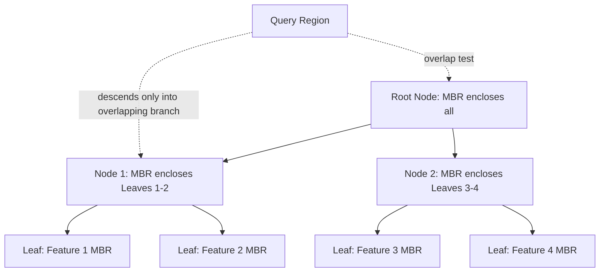

## Spatial Indexing Methods

### Overview

Spatial indexing methods are specialized data structures designed to accelerate the retrieval of geographic features based on their spatial location, dramatically improving the performance of spatial queries (such as range searches, nearest-neighbor searches, and spatial predicate evaluations) that would otherwise require exhaustive comparison against every feature in a dataset. Because standard database indexes (e.g., B-trees) are optimized for one-dimensional, ordered data and are poorly suited to multidimensional spatial data, dedicated spatial index structures such as R-trees, quad-trees, and grid-based indexes are used across GIS software and spatial databases.

### Why Spatial Indexing Is Necessary

**Key Points**

- Without a spatial index, evaluating a spatial predicate (e.g., "which parcels intersect this flood zone") against a large dataset requires comparing the query geometry to every feature's exact geometry — an operation with linear time complexity relative to dataset size, which becomes prohibitively slow for large datasets.
- Spatial indexes address this by organizing features hierarchically or by grid location, allowing the query engine to rapidly eliminate features that clearly cannot satisfy the spatial condition (based on fast bounding-box or grid-cell comparisons) before performing the more expensive exact geometric test only on the remaining candidates.
- This two-phase approach — a fast approximate **filter step** followed by a precise **refine step** — is standard across virtually all spatial indexing implementations.

$$\text{Total Query Cost} \approx \text{Filter Step Cost (index-based)} + \text{Refine Step Cost (exact geometry test on candidates)}$$

### R-Tree Indexing

#### Structure and Concept

**Key Points**

- The R-tree (Rectangle-tree) is the most widely implemented spatial index structure in GIS and spatial databases, organizing geometries into a hierarchy of nested **Minimum Bounding Rectangles (MBRs)**.
- Each leaf node in the R-tree stores the MBR of an individual feature (or a pointer to it); each non-leaf (internal) node stores the MBR that minimally encloses all MBRs of its child nodes, forming a tree structure analogous to a B-tree but for multidimensional bounding boxes.
- Spatial queries traverse the tree top-down, at each level only descending into child nodes whose MBR overlaps the query region, pruning large portions of the dataset without needing to inspect individual feature geometries.
- R-trees support efficient insertion and deletion of features, which makes them well suited to dynamically edited spatial databases, unlike some static spatial index structures.

#### R-Tree Variants

| Variant | Key Characteristic |
| --- | --- |
| R-tree (original, Guttman 1984) | Basic MBR hierarchy with heuristic node-splitting algorithms |
| R+-tree | Avoids overlapping MBRs between sibling nodes by allowing object duplication across nodes, improving query performance at the cost of some storage overhead |
| R*-tree | Improves node-splitting heuristics to reduce MBR overlap and coverage, generally providing better query performance than the original R-tree |
| GiST (Generalized Search Tree) | A generalized framework (used in PostgreSQL/PostGIS) that can implement R-tree-like spatial indexing alongside other index types within the same extensible framework |

[Unverified: exact variant support and default index type differ across specific database platforms and versions; consult platform documentation for the specific R-tree variant implemented.]

### Quad-Tree Indexing

**Key Points**

- A quad-tree recursively subdivides two-dimensional space into four equal quadrants, continuing subdivision within any quadrant that contains more than a specified threshold number of features, until each region contains a manageable number of features or a maximum depth is reached.
- Quad-trees are particularly well suited to indexing point data and raster tile pyramids, and are commonly used in web mapping tile schemes (e.g., organizing map tiles at multiple zoom levels).
- Unlike R-trees, which adapt bounding boxes to the actual distribution of feature geometries, quad-trees subdivide space based on fixed geometric quadrant boundaries regardless of feature distribution, which can result in uneven tree depth in datasets with highly clustered features (a densely populated quadrant requires many subdivision levels, while sparse quadrants remain shallow).

#### Quad-Tree Variants

| Variant | Application |
| --- | --- |
| Point quad-tree | Indexes point features directly |
| Region quad-tree | Subdivides space into a raster-like grid of cells, commonly used for raster/image indexing |
| PR quad-tree (Point-Region) | Subdivides based on the spatial position of points relative to fixed quadrant midpoints |

### Grid-Based Indexing

**Key Points**

- Grid-based (or "fixed grid") spatial indexing overlays the study area with a uniform grid, associating each feature with the grid cell(s) it intersects.
- Grid indexing is conceptually simple and fast for uniformly distributed data, but performance can degrade with highly clustered or unevenly distributed features, since some cells may contain vastly more features than others (leading to uneven query performance across the study area). [Inference: the degree of performance degradation depends on the specific spatial distribution of the dataset being indexed.]
- Grid-based approaches are commonly used as a first-pass spatial filter in combination with other index structures, or in simpler spatial data storage formats where implementing a full tree-based index is impractical.

### Comparison of Spatial Index Structures

| Index Type | Best Suited For | Strengths | Weaknesses |
| --- | --- | --- | --- |
| R-tree / R*-tree | Mixed geometry types (points, lines, polygons), dynamic datasets with frequent edits | Adapts to actual feature distribution; efficient for range and nearest-neighbor queries | More complex implementation; node-splitting overhead during insertion |
| Quad-tree | Point data, raster tiling schemes, web map tile pyramids | Simple recursive structure; well suited to hierarchical zoom-level organization | Can produce uneven depth with clustered data; less adaptive to irregular polygon geometries |
| Grid-based | Uniformly distributed data, simple implementations | Simple to implement and understand; fast for evenly distributed data | Degrades with clustered/uneven data distribution |

### Spatial Indexing in Practice

**Example**

```sql
-- Creating a spatial (GiST/R-tree-based) index in PostGIS
CREATE INDEX idx_wells_geom ON wells USING GIST (geom);

-- The query planner automatically uses the index when evaluating spatial predicates
EXPLAIN ANALYZE
SELECT well_id FROM wells
WHERE ST_Within(geom, (SELECT geom FROM protected_zones WHERE zone_id = 12));
```

**Key Points**

- Creating a spatial index does not guarantee the database query optimizer will use it for every query; query planners evaluate the estimated cost of using the index versus a full table scan, and behavior can vary based on table size, data distribution statistics, and specific query structure. [Inference: whether the optimizer selects the spatial index depends on internal cost estimation heuristics that vary across database engines and versions.]
- Desktop GIS software typically manages spatial indexing internally and automatically for feature classes (e.g., shapefile `.sbn`/`.sbx` index files, geodatabase internal spatial indexes), requiring less manual index management than in a raw spatial database environment. [Unverified: exact internal indexing mechanisms and file structures differ by GIS software vendor and data format.]

### Mermaid Diagram: R-Tree Hierarchical Structure



### SVG Illustration: R-Tree Minimum Bounding Rectangles (svg_diagram)

<svg xmlns="http://www.w3.org/2000/svg" viewBox="0 0 640 340">
<text x="320" y="24" text-anchor="middle" font-size="16" font-weight="bold" fill="#1a1a1a">R-Tree Minimum Bounding Rectangles (svg_diagram)</text>

<rect x="60" y="60" width="500" height="220" fill="none" stroke="#2b6cb0" stroke-width="2" stroke-dasharray="8,4" />
<text x="70" y="55" font-size="11" fill="#2b6cb0">Root MBR</text>

<rect x="80" y="80" width="200" height="120" fill="none" stroke="#2f855a" stroke-width="1.5" stroke-dasharray="5,3" />
<text x="90" y="75" font-size="10" fill="#2f855a">Node 1 MBR</text>

<rect x="340" y="140" width="200" height="120" fill="none" stroke="#c53030" stroke-width="1.5" stroke-dasharray="5,3" />
<text x="350" y="135" font-size="10" fill="#c53030">Node 2 MBR</text>

<rect x="100" y="100" width="60" height="40" fill="#c6f6d5" stroke="#2f855a" stroke-width="1" />
<text x="130" y="125" text-anchor="middle" font-size="9" fill="#1a1a1a">Feature A</text>
<rect x="190" y="140" width="70" height="45" fill="#c6f6d5" stroke="#2f855a" stroke-width="1" />
<text x="225" y="167" text-anchor="middle" font-size="9" fill="#1a1a1a">Feature B</text>

<rect x="360" y="160" width="60" height="40" fill="#fed7d7" stroke="#c53030" stroke-width="1" />
<text x="390" y="185" text-anchor="middle" font-size="9" fill="#1a1a1a">Feature C</text>
<rect x="450" y="200" width="70" height="45" fill="#fed7d7" stroke="#c53030" stroke-width="1" />
<text x="485" y="227" text-anchor="middle" font-size="9" fill="#1a1a1a">Feature D</text>

<text x="320" y="310" text-anchor="middle" font-size="11" fill="`#4a5568`">Nested MBRs allow query pruning: a query outside Node 2's MBR</text>

<text x="320" y="328" text-anchor="middle" font-size="11" fill="`#4a5568`">never requires inspecting Features C or D individually.</text>

</svg>

### Applications in Geospatial and Environmental Science

- **Large-scale environmental hazard querying**: spatial indexes accelerate queries identifying all infrastructure or population points intersecting rapidly updating hazard zones (e.g., wildfire perimeters, flood extents) in near-real-time monitoring systems.
- **Remote sensing and raster tile serving**: quad-tree-based indexing underlies web map tile pyramid schemes (e.g., organizing satellite imagery tiles across zoom levels) for efficient web-based delivery of large raster datasets.
- **Species occurrence and biodiversity databases**: R-tree indexing accelerates nearest-neighbor and range queries across large point-based species occurrence datasets used in conservation planning.
- **Utility and infrastructure network queries**: spatial indexes speed up proximity-based queries (e.g., "find all valves within 200 meters of a reported leak") across large utility asset geodatabases.
- **Cadastral and land parcel systems**: spatial indexing supports responsive interactive map applications where users query parcel information by clicking or drawing a search area over large jurisdiction-wide parcel datasets.

### Limitations and Considerations

- No single spatial index structure is universally optimal; the appropriate choice depends on the geometry types involved, the spatial distribution of the data, and whether the dataset is frequently edited versus largely static. [Inference: the specific performance trade-offs between index types depend on dataset characteristics that vary by application.]
- Spatial index maintenance (rebuilding or updating the index) introduces overhead during heavy editing sessions; some spatial database systems recommend periodic index rebuilding or statistics updates after substantial bulk edits to maintain optimal query performance. [Unverified: consult the specific database platform's documentation for recommended index maintenance procedures.]
- The presence of a spatial index does not guarantee its use by the query optimizer for every query; unusual query patterns, very small tables, or outdated table statistics can lead the optimizer to bypass the index in favor of a full scan.
- Exact spatial index implementation details (node-splitting algorithms, maximum node capacity, specific R-tree variant used) are often internal to the specific software or database engine and may not be fully documented or configurable by the end user. [Unverified: consult vendor documentation for any exposed configuration options related to spatial index tuning.]

**Related Topics**

- SQL and Spatial Query Languages
- Geodatabase Architecture and Design
- Relational Database Concepts
- Web Map Tile Services and Tile Pyramid Schemes
- Nearest-Neighbor and Proximity Analysis
- Query Optimization in Spatial Databases
- Big Data and Distributed Spatial Indexing (e.g., Geohashing, H3)
- Raster Data Models and Pyramid/Overview Structures