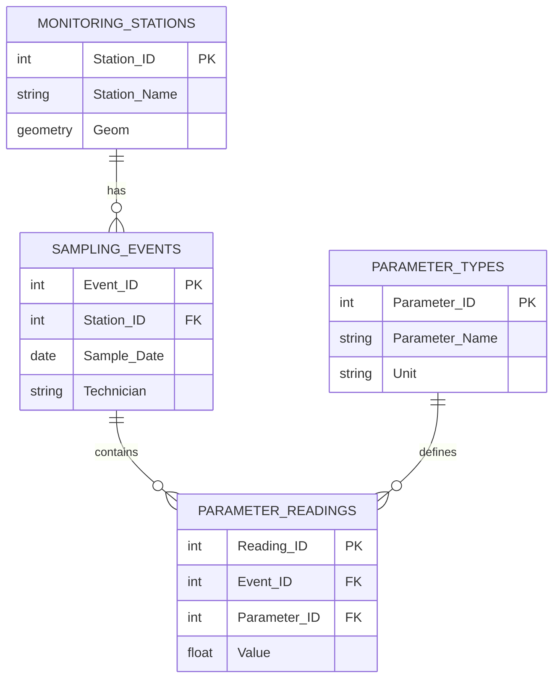

## Data Normalization and Schema Design

### Overview

Data normalization and schema design encompass the principles and processes used to organize relational and spatial database structures so that data is stored efficiently, consistently, and with minimal redundancy, while remaining suited to the specific query and analytical needs of a GIS application. Effective schema design balances the theoretical rigor of relational normalization against practical performance and usability considerations unique to spatial data management.

### Purpose of Normalization

**Key Points**

- Normalization is a systematic process of structuring database tables to eliminate data redundancy and prevent three categories of data anomalies:
  - **Insertion anomaly**: inability to add a new record without also having unrelated, unnecessary data (e.g., unable to add a new sensor type without a specific reading already existing).
  - **Update anomaly**: a piece of data stored redundantly across multiple rows must be updated in every occurrence, risking inconsistency if any instance is missed.
  - **Deletion anomaly**: deleting a record unintentionally removes other, unrelated information that happened to be stored in the same row.
- Normalization proceeds through a series of formally defined **normal forms**, each addressing a specific type of redundancy or dependency issue, with each form assuming the requirements of the previous form are already satisfied.

### The Normal Forms

#### First Normal Form (1NF)

**Requirement**: Each column must contain atomic (indivisible) values, and there must be no repeating groups of columns.

**Example of a 1NF Violation**

| Parcel_ID | Owners |
| --- | --- |
| P-001 | Santos, M.; Reyes, J.; Cruz, A. |

This violates 1NF because the "Owners" field stores multiple values in a single cell. Correcting this requires splitting owners into a separate related table:

| Parcel_ID | Owner_Name |
| --- | --- |
| P-001 | Santos, M. |
| P-001 | Reyes, J. |
| P-001 | Cruz, A. |

#### Second Normal Form (2NF)

**Requirement**: Must satisfy 1NF, and every non-key attribute must depend on the *entire* primary key (relevant specifically when the primary key is composite). Eliminates **partial dependency**.

**Example of a 2NF Violation**

Consider a table with composite primary key (`Parcel_ID`, `Sample_Date`) storing both sample-specific data and parcel-level data:

| Parcel_ID | Sample_Date | Contaminant_Level | Parcel_Owner |
| --- | --- | --- | --- |
| P-001 | 2026-01-15 | 0.04 | Santos, M. |
| P-001 | 2026-03-10 | 0.06 | Santos, M. |

`Parcel_Owner` depends only on `Parcel_ID`, not on the full composite key (`Parcel_ID`, `Sample_Date`) — a partial dependency. Correcting this requires separating parcel-level attributes into their own table.

#### Third Normal Form (3NF)

**Requirement**: Must satisfy 2NF, and no non-key attribute may depend on another non-key attribute (eliminating **transitive dependency**).

**Example of a 3NF Violation**

| Parcel_ID | Zip_Code | Municipality |
| --- | --- | --- |

Here, `Municipality` depends on `Zip_Code`, which in turn depends on `Parcel_ID` — a transitive dependency (`Parcel_ID` → `Zip_Code` → `Municipality`). Correcting this requires a separate `Zip_Code`-to-`Municipality` lookup table.

#### Higher Normal Forms

| Normal Form | Addresses |
| --- | --- |
| Boyce-Codd Normal Form (BCNF) | A stricter version of 3NF addressing certain anomalies involving overlapping candidate keys |
| Fourth Normal Form (4NF) | Eliminates multi-valued dependencies, where one key relates to multiple independent sets of values |
| Fifth Normal Form (5NF) | Addresses redundancy from join dependencies not captured by lower normal forms |

**Key Points**

- Most practical database schema design targets 3NF as a reasonable balance between eliminating redundancy and maintaining manageable query complexity; higher normal forms (4NF, 5NF) are applied selectively in specific edge cases rather than as a routine default. [Inference: the appropriate target normal form depends on the specific data characteristics and use case, and practices vary across organizations.]

### Denormalization for Performance

**Key Points**

- **Denormalization** is the deliberate, controlled introduction of redundancy into a normalized schema to improve query performance, typically by reducing the number of joins required for frequently executed queries.
- Common denormalization techniques include:
  - Storing a computed or summary value directly on a feature class (e.g., a `Total_Assessed_Value` field on a parcel summary table) rather than requiring a join and aggregation every time it is needed.
  - Duplicating a frequently joined lookup value (e.g., storing `Municipality_Name` directly on a parcel record in addition to a foreign key reference) to avoid a join for common display or filtering needs.
- Denormalization trades storage space and update complexity (since redundant values must be kept synchronized) for query performance gains, and should be applied deliberately based on observed query patterns rather than as a default design choice. [Inference: whether the performance gain justifies the added update complexity depends on the specific read/write ratio and query frequency of the system in question.]

### Schema Design Considerations Specific to Spatial Data

#### Geometry Storage and Schema Placement

**Key Points**

- Unlike purely attribute-based normalization, spatial schema design must also consider how geometry columns interact with normalized attribute tables — geometry is typically stored directly on the primary feature class (the "one" side of a one-to-many relationship) rather than duplicated across related tables.
- Feature classes participating in shared topology or geometric/utility networks must be grouped within the same feature dataset (sharing a common spatial reference), which is a spatial-specific schema design constraint not present in purely non-spatial relational design.
- Historical or time-series data related to a spatial feature (e.g., multiple water quality readings for a single monitoring station) should generally be stored in a normalized related table rather than as repeating columns or as duplicated point geometries, preserving a single authoritative geometry per real-world feature.

#### Choosing Between Feature Classes, Tables, and Relationship Classes

| Design Question | Guidance |
| --- | --- |
| Does the entity have its own geometry? | If yes, model as a feature class; if no, model as a standalone table |
| Is the relationship 1:1 or 1:M? | Consider a join or relationship class; a foreign key on the "many" side table is standard |
| Is the relationship M:N? | Requires a junction/bridge table containing foreign keys to both related entities |
| Will the attribute value be queried or symbolized frequently on the map? | May justify limited denormalization (storing the value directly on the feature class) despite redundancy, for rendering/query performance |

**Example**

Designing a schema for an environmental water quality monitoring system:

- `Monitoring_Stations` (point feature class): one row per physical station, containing station-level attributes (name, install date, station type).
- `Sampling_Events` (standalone table, related 1:M to `Monitoring_Stations`): one row per sampling visit, containing event-level attributes (date, technician, weather conditions).
- `Parameter_Readings` (standalone table, related 1:M to `Sampling_Events`): one row per measured parameter per sampling event (e.g., pH, dissolved oxygen, turbidity), avoiding a wide table with one column per possible parameter.
- `Parameter_Types` (lookup table, related 1:M to `Parameter_Readings`): defines valid parameter codes and units, preventing inconsistent parameter naming across readings.

This design satisfies 3NF while remaining practical: no repeating groups, no partial or transitive dependency, and clean separation of station, event, and reading-level data.

### Mermaid Diagram: Normalized Environmental Monitoring Schema

### SVG Illustration: Normalization Process from Unnormalized to 3NF (svg_diagram)

<svg xmlns="http://www.w3.org/2000/svg" viewBox="0 0 640 340">
<text x="320" y="24" text-anchor="middle" font-size="16" font-weight="bold" fill="#1a1a1a">Normalization Process: Unnormalized to 3NF (svg_diagram)</text>

<rect x="30" y="50" width="180" height="90" fill="#fed7d7" stroke="#c53030" stroke-width="1.5" rx="4" />
<text x="120" y="70" text-anchor="middle" font-size="11" font-weight="bold" fill="#1a1a1a">Unnormalized</text>
<text x="40" y="90" font-size="9" fill="#4a5568">Parcel_ID, Owner1, Owner2,</text>
<text x="40" y="105" font-size="9" fill="#4a5568">Owner3, Zip, Municipality</text>
<text x="40" y="125" font-size="9" fill="#c53030">Repeating groups (1NF issue)</text>

<line x1="210" y1="95" x2="250" y2="95" stroke="#4a5568" stroke-width="2" marker-end="url(#arr1)" />
<rect x="260" y="50" width="180" height="90" fill="#feebc8" stroke="#c05621" stroke-width="1.5" rx="4" />
<text x="350" y="70" text-anchor="middle" font-size="11" font-weight="bold" fill="#1a1a1a">1NF</text>
<text x="270" y="90" font-size="9" fill="#4a5568">Parcel_ID, Owner_Name,</text>
<text x="270" y="105" font-size="9" fill="#4a5568">Zip, Municipality</text>
<text x="270" y="125" font-size="9" fill="#c05621">Transitive dependency (3NF issue)</text>

<line x1="440" y1="95" x2="480" y2="95" stroke="#4a5568" stroke-width="2" marker-end="url(#arr1)" />

<rect x="490" y="50" width="120" height="90" fill="#c6f6d5" stroke="#2f855a" stroke-width="1.5" rx="4" />
<text x="550" y="70" text-anchor="middle" font-size="11" font-weight="bold" fill="#1a1a1a">3NF (Table 1)</text>
<text x="498" y="90" font-size="9" fill="#4a5568">Parcel_ID,</text>
<text x="498" y="105" font-size="9" fill="#4a5568">Owner_Name, Zip</text>
<rect x="490" y="160" width="120" height="60" fill="#c6f6d5" stroke="#2f855a" stroke-width="1.5" rx="4" />
<text x="550" y="180" text-anchor="middle" font-size="11" font-weight="bold" fill="#1a1a1a">3NF (Table 2)</text>
<text x="498" y="198" font-size="9" fill="#4a5568">Zip, Municipality</text>
<line x1="550" y1="140" x2="550" y2="160" stroke="#2f855a" stroke-width="1.5" stroke-dasharray="4,3" />

<text x="320" y="270" text-anchor="middle" font-size="11" fill="`#4a5568`">Progressive normalization removes repeating groups, then transitive dependency,</text>

<text x="320" y="288" text-anchor="middle" font-size="11" fill="`#4a5568`">resulting in two related 3NF tables with no redundant Municipality storage per parcel.</text>

</svg>

### Applications in Geospatial and Environmental Science

- **Environmental monitoring database design**: normalized schemas separate station metadata, sampling events, and parameter readings, preventing redundant storage of station attributes across thousands of individual readings.
- **Cadastral and land administration systems**: normalized parcel-owner relationships (handling multiple owners per parcel, and historical ownership changes) avoid the anomalies inherent in flat, repeating-column table designs.
- **Utility asset management**: normalized schemas separate asset inventory (pipes, valves) from inspection/maintenance history tables, supporting clean one-to-many relationships between assets and their maintenance records.
- **Multi-agency data sharing standards**: normalized schema design supports cleaner data exchange and integration when multiple organizations need to combine datasets without inheriting each other's redundancy or inconsistency issues.

### Limitations and Considerations

- Full normalization to 3NF or higher can increase the number of joins required for common queries, which may measurably affect performance in read-heavy analytical or mapping workflows; the appropriate balance between normalization and denormalization depends on actual usage patterns. [Inference: the specific performance trade-off depends on query frequency, table size, and the underlying database engine, and will vary by deployment.]
- Retrofitting normalization onto an existing, already-populated schema (as opposed to designing normalized from the start) can require significant data migration effort and careful handling of existing redundant or inconsistent data.
- Some GIS-specific constructs (e.g., subtypes, domains) provide alternative mechanisms for enforcing data consistency that complement, but do not replace, standard relational normalization principles.
- Denormalization decisions made for performance reasons introduce update complexity that must be carefully managed (e.g., through triggers, attribute rules, or application logic) to prevent the redundant copies of data from becoming inconsistent over time. [Unverified: the specific mechanisms available to manage denormalized data consistency differ by database platform and GIS software.]

**Related Topics**

- Relational Database Concepts
- Geodatabase Architecture and Design
- SQL and Spatial Query Languages
- Entity-Relationship (ER) Modeling for Spatial Data
- Relationship Classes and Cardinality in Spatial Databases
- Domains, Subtypes, and Attribute Rules
- Data Quality and Integrity Constraints in GIS
- Enterprise Geodatabase Versioning and Multiuser Editing