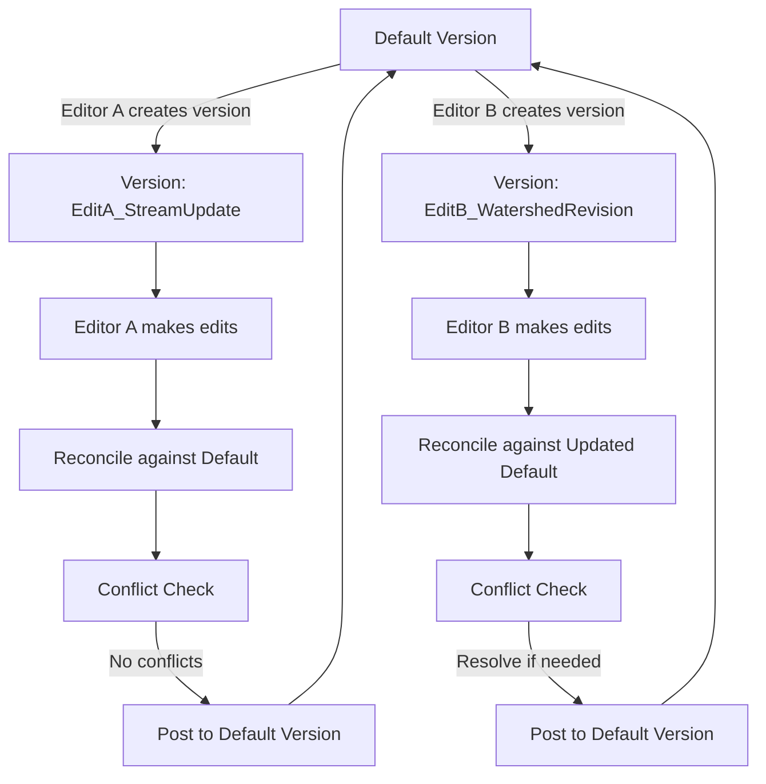

## Multi-User Editing and Version Control

### Overview

Multi-user editing and version control encompass the architectural strategies and workflows that allow multiple GIS analysts to simultaneously create, modify, and manage geographic data within a shared spatial database without corrupting data integrity or losing each other's work. These mechanisms address the fundamental challenge of concurrent access to shared spatial datasets, ranging from traditional versioned editing models to modern distributed and branch-based approaches.

### The Concurrency Challenge in Spatial Editing

**Key Points**

- Unlike simple document editing, GIS editing often involves modifying interdependent spatial features (e.g., a shared parcel boundary edited from two adjacent lots, or a utility network where one edit affects downstream connectivity), making naive concurrent access prone to conflicts and data corruption.
- Without a concurrency control mechanism, two editors modifying the same feature simultaneously risk one editor's changes silently overwriting the other's, a classic **lost update problem**.
- GIS database systems address this challenge through several architectural approaches: **exclusive locking**, **versioned editing**, and **branch/distributed versioning**, each with different trade-offs regarding editing flexibility, conflict handling, and offline capability.

### Exclusive Locking (Pessimistic Concurrency Control)

**Key Points**

- The simplest concurrency control approach locks a feature, dataset, or entire feature class while one user is editing it, preventing any other user from making changes until the lock is released.
- This approach guarantees no lost updates or conflicts but significantly limits concurrent productivity, since only one editor can work on a locked dataset at a time — impractical for organizations with many simultaneous editors across a large shared dataset.
- Locking-based approaches are more commonly seen in simpler, smaller-scale GIS deployments or in specific high-risk editing scenarios (e.g., a critical infrastructure dataset) where strict serialization of edits is preferred over concurrent throughput. [Inference: the specific trade-off between safety and throughput that justifies locking depends on organizational risk tolerance and team size, which will vary.]

### Versioned Editing (Optimistic Concurrency Control)

#### Core Concept

**Key Points**

- Versioned editing allows multiple editors to work simultaneously on isolated **versions** (snapshots) of a shared geodatabase, deferring conflict detection until changes are explicitly merged back ("reconciled" and "posted") to a shared default version.
- Each version behaves as an independent, editable copy of the dataset from the editor's perspective, while the underlying database efficiently stores only the differences (deltas) between versions rather than full data duplication.
- This is described as **optimistic concurrency control** because it assumes conflicts will be relatively rare, allowing edits to proceed freely and resolving any actual conflicts only at the point of reconciliation, rather than preventing concurrent access upfront through locking.

#### Version Lifecycle

| Stage | Description |
| --- | --- |
| Version creation | An editor creates a new version, typically branched from the default (or another parent) version, establishing an isolated editing environment |
| Editing | The editor makes changes (additions, updates, deletions) within their version, invisible to other versions until reconciled |
| Reconciliation | The version is compared against its parent version to identify differences, including any conflicts where the same feature was modified in both versions |
| Conflict resolution | Detected conflicts are resolved according to a defined policy (e.g., manual review, "first in wins," "last in wins") |
| Posting | Reconciled, conflict-resolved changes are merged into the parent version, making them visible to other editors working from that version |
| Version deletion/compression | Once posted and no longer needed, versions can be deleted; periodic **compression** consolidates historical version deltas to maintain database performance |

**Example**

A hydrological GIS team scenario:

1. Editor A creates a version "EditA_StreamUpdate" to correct a stream network segment.
2. Editor B simultaneously creates a version "EditB_WatershedRevision" to update a watershed boundary layer.
3. Both editors work independently without interference, since their versions are isolated.
4. Editor A reconciles and posts changes first; no conflicts exist since Editor B's watershed edits do not touch the same stream features.
5. Editor B reconciles against the now-updated default version; the reconciliation process automatically incorporates Editor A's posted changes into Editor B's working version before Editor B posts their own changes.

#### Conflict Types and Resolution

| Conflict Type | Description |
| --- | --- |
| Update-Update conflict | The same feature was modified differently in both the parent and child version |
| Update-Delete conflict | A feature was modified in one version but deleted in the other |
| Delete-Delete conflict | The same feature was deleted independently in both versions (may or may not be treated as a true conflict depending on configuration) |

[Unverified: exact conflict detection granularity — e.g., row-level versus attribute/column-level conflict detection — and available resolution policies differ across specific database and GIS software implementations; consult platform documentation for precise behavior.]

### Branch Versioning and Distributed Approaches

**Key Points**

- Some modern GIS platforms support **branch versioning**, a lighter-weight alternative to traditional long-transaction versioning, designed to better support web-based, service-oriented, and disconnected/mobile editing scenarios.
- Branch versioning typically allows a much larger number of concurrent named versions with faster reconciliation and posting operations compared to traditional versioning, better suited to large numbers of field-based or web-based editors making small, frequent edits.
- Distributed version control concepts (analogous to software development version control systems) are increasingly applied to spatial data synchronization, particularly for disconnected/offline mobile data collection that must later be synchronized with a central database. [Unverified: exact branch versioning architecture, scalability characteristics, and feature parity with traditional versioning differ across GIS platforms and versions; consult current vendor documentation.]

### Offline and Disconnected Editing

**Key Points**

- Mobile and field data collection workflows often require **disconnected editing**, where a local copy (extract) of relevant data is taken into the field without a live database connection, edited offline, and later synchronized back to the central database.
- Synchronization of disconnected edits requires the same fundamental conflict detection and resolution logic as connected versioned editing, applied at the point of sync rather than continuously.
- Conflict likelihood in disconnected editing scenarios can be higher than in continuously connected versioned editing, since disconnected edits may be based on increasingly outdated snapshots of the central data the longer the device remains offline. [Inference: the specific conflict rate depends on the disconnection duration and the frequency of concurrent edits to the same features, which will vary by deployment scenario.]

### Comparison of Multi-User Editing Approaches

| Approach | Concurrency Model | Best Suited For | Trade-offs |
| --- | --- | --- | --- |
| Exclusive locking | Pessimistic | Small teams, high-risk critical datasets | Simple and safe, but limits concurrent throughput |
| Traditional versioning | Optimistic, long transaction | Enterprise teams with structured, moderate-frequency edits | Robust conflict handling, but administrative overhead (version tree management, compression) |
| Branch versioning | Optimistic, lightweight | Large numbers of concurrent editors, web/service-based editing | Faster reconciliation, but may have different feature parity than traditional versioning |
| Disconnected/offline sync | Optimistic, deferred | Field data collection, mobile survey work | Enables offline work, but higher conflict risk with longer disconnection periods |

### Mermaid Diagram: Versioned Editing Workflow

### SVG Illustration: Version Branching and Reconciliation (svg_diagram)

<svg xmlns="http://www.w3.org/2000/svg" viewBox="0 0 640 320">
<text x="320" y="24" text-anchor="middle" font-size="16" font-weight="bold" fill="#1a1a1a">Version Branching and Reconciliation (svg_diagram)</text>

<line x1="60" y1="80" x2="580" y2="80" stroke="#2b6cb0" stroke-width="3" />
<text x="60" y="65" font-size="11" font-weight="bold" fill="#2b6cb0">Default Version (timeline)</text>

<line x1="150" y1="80" x2="220" y2="150" stroke="#2f855a" stroke-width="2" />
<line x1="220" y1="150" x2="330" y2="150" stroke="#2f855a" stroke-width="2" />
<line x1="330" y1="150" x2="400" y2="80" stroke="#2f855a" stroke-width="2" />
<circle cx="150" cy="80" r="5" fill="#2b6cb0" />
<circle cx="400" cy="80" r="5" fill="#2f855a" />
<text x="270" y="140" text-anchor="middle" font-size="10" fill="#2f855a">Editor A: EditA_StreamUpdate</text>
<text x="400" y="65" text-anchor="middle" font-size="9" fill="#2f855a">Post (no conflict)</text>

<line x1="200" y1="80" x2="270" y2="220" stroke="#c53030" stroke-width="2" />
<line x1="270" y1="220" x2="470" y2="220" stroke="#c53030" stroke-width="2" />
<line x1="470" y1="220" x2="540" y2="80" stroke="#c53030" stroke-width="2" />
<circle cx="200" cy="80" r="5" fill="#2b6cb0" />
<circle cx="540" cy="80" r="5" fill="#c53030" />
<text x="370" y="210" text-anchor="middle" font-size="10" fill="#c53030">Editor B: EditB_WatershedRevision</text>
<text x="540" y="65" text-anchor="middle" font-size="9" fill="#c53030">Reconcile, resolve, post</text>

<text x="320" y="280" text-anchor="middle" font-size="11" fill="`#4a5568`">Each editor works in an isolated version; reconciliation merges</text>

<text x="320" y="298" text-anchor="middle" font-size="11" fill="`#4a5568`">changes back into the shared default version, resolving any conflicts encountered.</text>

</svg>

### Applications in Geospatial and Environmental Science

- **Multi-agency watershed and environmental data collaboration**: versioned editing allows different agencies or departments to independently update shared hydrological or protected area datasets, with reconciliation ensuring consistent final data.
- **Field-based environmental survey collection**: disconnected/offline editing workflows enable field ecologists or water quality technicians to collect data in remote areas without connectivity, synchronizing results upon return.
- **Large utility infrastructure maintenance**: enterprise versioned geodatabases allow field crews and office-based planners to concurrently update pipe, valve, and asset condition data without conflicting edits corrupting the shared network dataset.
- **Cadastral and land parcel maintenance**: versioning supports controlled, auditable editing of parcel boundaries by multiple surveyors or GIS technicians, with reconciliation preventing unintentional double-editing of the same parcel.
- **Emergency response and rapidly updating hazard data**: branch versioning or lightweight concurrent editing models support many simultaneous field responders updating incident-related spatial data (e.g., damage assessment points) during active events.

### Limitations and Considerations

- Version tree management (tracking parent-child version relationships, periodic compression, and version deletion) introduces ongoing database administration overhead that scales with the number of concurrent editors and edit frequency. [Inference: the specific administrative burden depends on organizational editing volume and will vary by deployment.]
- Conflict resolution policies (e.g., "first in wins," "last in wins," manual review) carry real data-quality implications — automated resolution policies can silently discard a user's intended edit if not carefully configured and communicated to editing staff.
- Exact versioning architecture, conflict detection granularity, and branch versioning feature parity differ meaningfully across GIS platforms and versions; organizations should validate specific platform behavior against their concurrency requirements before deployment. [Unverified: consult the specific platform's current documentation for precise versioning capabilities.]
- Disconnected/offline editing workflows introduce additional risk of stale-data conflicts the longer a device remains disconnected from the central database, requiring organizational policies around maximum offline duration or synchronization frequency. [Inference: the appropriate policy depends on the specific editing frequency and risk tolerance of the organization, which will vary.]

**Related Topics**

- Geodatabase Architecture and Design
- Relational Database Concepts
- Enterprise GIS System Architecture
- Mobile and Field Data Collection Workflows
- Data Quality and Integrity Constraints in GIS
- Distributed and Branch Version Control Concepts
- Conflict Resolution Strategies in Collaborative Editing
- Web GIS Services and Real-Time Data Synchronization