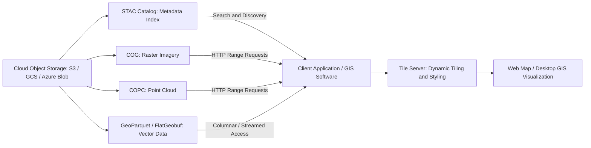

## Cloud-Based Spatial Data Storage

### Overview

Cloud-based spatial data storage refers to the architectural shift from traditional desktop-bound or on-premises enterprise geodatabases toward cloud object storage, cloud-native file formats, and cloud-hosted spatial database services. This shift enables geospatial datasets — often ranging into terabytes or petabytes, especially for satellite imagery and point cloud collections — to be stored cost-effectively, accessed remotely without full downloads, and processed at scale using distributed computing resources. The emerging ecosystem of "cloud-native geospatial" formats and protocols has become central to how modern GIS and remote sensing organizations manage large-scale spatial data.

### Motivations for Cloud-Based Spatial Storage

**Key Points**

- Traditional GIS file formats and on-premises databases often require downloading entire datasets before analysis, which becomes impractical for very large satellite imagery archives, LiDAR point clouds, or global-scale vector datasets.
- Cloud object storage (e.g., Amazon S3, Google Cloud Storage, Azure Blob Storage) provides highly durable, scalable, pay-as-you-go storage accessible over standard HTTP(S), decoupling storage from compute resources.
- Cloud-native geospatial formats are specifically designed to support **partial reads** over HTTP — allowing a client to request only the specific bytes (spatial subset, resolution level, or attribute columns) it needs, rather than downloading an entire file. This leverages the ability of clients issuing HTTP GET range requests to ask for just the parts of a file they need. [Cogeo](https://cogeo.org/)

### Cloud-Optimized Raster Formats

#### Cloud Optimized GeoTIFF (COG)

**Key Points**

- A Cloud Optimized GeoTIFF is a regular GeoTIFF file, aimed at being hosted on an HTTP file server, with an internal organization that enables more efficient workflows on the cloud. [Cogeo](https://cogeo.org/)
- Cloud-Optimized GeoTIFF is designed based on the GeoTIFF raster specification and supports raster pyramiding, tiling and compression, allowing clients to fetch only the specific tile and resolution (overview level) needed for a given view or analysis extent, rather than the full-resolution image. [Safe](https://support.safe.com/hc/en-us/articles/26440396767501-Geospatial-Cloud-Native-Data-Overview-Mapping-the-Future)
- COG has been formalized as an OGC standard, and adoption continues to increase over time, allowing more software and tools to support the format natively. [Cogeo](https://cogeo.org/)
- Numerous major Earth observation data providers distribute imagery directly as COGs; for example, SpaceNet data is available as COG and browsable via a STAC Browser instance, and Mundi offers a wide range of Earth observation data as Cloud Optimized GeoTIFF, including Copernicus Sentinel-1 GRD file collections. [Cogeo](https://cogeo.org/)

#### Cloud-Optimized Point Clouds (COPC)

**Key Points**

- Cloud-Optimized Point Clouds (COPC), like COGs, allow datasets to be streamed from cloud storage without having to download entire files, applying the same partial-access principle to LiDAR and photogrammetric point cloud data. [Spatial Thoughts](https://courses.spatialthoughts.com/qgis-cloud-native-geospatial.html)
- COPC files are compressed LAS files structured internally to support spatial indexing and partial retrieval, analogous to how COG restructures GeoTIFF internals for HTTP range-request access. [Cloudnativegeo](https://guide.cloudnativegeo.org/)

### Cloud-Optimized Vector Formats

#### GeoParquet

**Key Points**

- GeoParquet is a cloud-friendly vector format built on the Parquet standards, benefiting from a mature set of applications, libraries and tools available initially designed for Parquet. The format is column-oriented and supports a wide range of geometries. [Safe](https://support.safe.com/hc/en-us/articles/26440396767501-Geospatial-Cloud-Native-Data-Overview-Mapping-the-Future)[Safe](https://support.safe.com/hc/en-us/articles/26440396767501-Geospatial-Cloud-Native-Data-Overview-Mapping-the-Future)
- Because GeoParquet is not a separate format, any program that can read Parquet is able to load GeoParquet as well, even if it can't make sense of the geometry information — similar to how GeoTIFF layers geospatial information on top of the existing TIFF image standard. GeoParquet defines how to encode geometries in a geometry column and how to include metadata like the geometries' Coordinate Reference System. [Cloudnativegeo](https://guide.cloudnativegeo.org/geoparquet/index.html)[Cloudnativegeo](https://guide.cloudnativegeo.org/geoparquet/index.html)
- A Parquet file consists of a sequence of row groups, each containing multiple column chunks holding sequences of raw column values guaranteed to be contiguous in the file; all row groups in a file share the same schema. This columnar structure is well suited to analytical queries that only need specific attribute columns. [Cloudnativegeo](https://guide.cloudnativegeo.org/geoparquet/index.html)
- GeoParquet published a 1.0 release, after which changes to the specification are expected to be backwards compatible, and reading/writing GeoParquet has been supported in GDAL since version 3.5, usable in programs like GeoPandas and QGIS. [Cloudnativegeo](https://guide.cloudnativegeo.org/geoparquet/index.html)
- GeoParquet's columnar structure allows for efficient querying using modern analytical tools such as DuckDB, and is also commonly ingested into cloud data warehouses for distributed processing. [Medium](https://medium.com/vida-engineering/building-the-vida-data-catalog-with-stac-and-cloud-native-geospatial-formats-e2240b4977d4)

#### FlatGeobuf

**Key Points**

- FlatGeobuf is a vector format built on Google's Flatbuffers library, where a buffer is considered a file and everything within it. FlatGeobuf uses indexing to help reduce the amount of data that would need to be transferred over a potentially slow network, making it well suited to progressive/streaming feature loading. [Safe](https://support.safe.com/hc/en-us/articles/26440396767501-Geospatial-Cloud-Native-Data-Overview-Mapping-the-Future)[Safe](https://support.safe.com/hc/en-us/articles/26440396767501-Geospatial-Cloud-Native-Data-Overview-Mapping-the-Future)
- For larger vector datasets, FlatGeobuf is recommended because it supports efficient streaming of features without requiring the full file to be downloaded, significantly improving performance, while GeoParquet is also a valid option, particularly where columnar access patterns are beneficial. [Esa-apex](https://esa-apex.github.io/apex_documentation/interoperability/datahosting.html)

### Cataloging and Discovery: STAC

**Key Points**

- STAC (SpatioTemporal Asset Catalog) makes geospatial data queryable, especially "semi-structured" geospatial data like a collection of cloud-optimized GeoTIFFs from a satellite. [Cloudnativegeo](https://cloudnativegeo.org/blog/2024/08/introduction-to-stac-geoparquet/)
- STAC metadata consists of JSON documents describing the actual assets, and can be accessed either through a static STAC catalog (a JSON document linking to other JSON documents describing collections and items with links to assets) or through a STAC API, which also enables search. [Cloudnativegeo](https://cloudnativegeo.org/blog/2024/08/introduction-to-stac-geoparquet/)
- STAC GeoParquet is a specification and library for storing and serving STAC metadata as GeoParquet, representing a STAC collection as a GeoParquet dataset where each column is a field from the STAC item (such as id, datetime, or cloud cover) and each row is an individual item. This approach leverages the strengths of the Parquet file format at the cost of some generality, since all records must share the same schema — meaning the more homogenous the items in a collection, the more efficiently they can be stored. [Cloudnativegeo](https://cloudnativegeo.org/blog/2024/08/introduction-to-stac-geoparquet/)[Cloudnativegeo](https://cloudnativegeo.org/blog/2024/08/introduction-to-stac-geoparquet/)
- STAC provides a standardized way to query cloud-hosted datasets, and combined with desktop GIS software, these technologies allow users to visualize and analyze large datasets that were not previously feasible. [Spatial Thoughts](https://courses.spatialthoughts.com/qgis-cloud-native-geospatial.html)

### Serving and Tiling Cloud-Native Data

**Key Points**

- COGs support direct analytical and visualization use through HTTP Range Requests, but dynamic tiling and server-side styling are typically layered on top via dedicated tile-serving software. COGs can be directly used for both data analytics and web-based visualization through HTTP Range Requests, but it is usually important to apply dynamic tiling and server-side styling or transformations, commonly using a dedicated raster tile server component in a geospatial backend. [Medium](https://medium.com/vida-engineering/building-the-vida-data-catalog-with-stac-and-cloud-native-geospatial-formats-e2240b4977d4)
- For very large raster collections split across multiple files, a companion metadata document can describe how the individual files mosaic together for virtual, on-the-fly composition. A MosaicJSON document placed alongside multiple COGs describes their mosaicking, enabling processing and visualization of virtual rasters without physically merging the underlying files. [Medium](https://medium.com/vida-engineering/building-the-vida-data-catalog-with-stac-and-cloud-native-geospatial-formats-e2240b4977d4)
- For large-scale vector tile visualization, archive-based tile formats allow vector tiles to be streamed directly from cloud storage buckets to a client without a dedicated tile server. PMTiles archives enable large-scale visualizations by allowing vector tiles to be streamed directly to the client from cloud storage buckets. [Medium](https://medium.com/vida-engineering/building-the-vida-data-catalog-with-stac-and-cloud-native-geospatial-formats-e2240b4977d4)

### Comparison of Cloud-Native Geospatial Formats

| Format | Data Type | Key Characteristic |
| --- | --- | --- |
| COG (Cloud Optimized GeoTIFF) | Raster (imagery, DEMs) | Tiled, pyramided GeoTIFF supporting HTTP range-request partial reads |
| COPC (Cloud-Optimized Point Cloud) | Point cloud (LiDAR) | Compressed, spatially indexed LAS variant supporting streaming access |
| GeoParquet | Vector | Columnar, Parquet-based format optimized for analytical queries |
| FlatGeobuf | Vector | Indexed, streamable format built on FlatBuffers for progressive feature loading |
| STAC / STAC GeoParquet | Metadata/catalog | JSON-based (or GeoParquet-based) catalog describing and enabling search over cloud-hosted asset collections |
| PMTiles | Vector tiles | Single-file archive enabling serverless tile streaming directly from object storage |

[Unverified: exact version support, performance characteristics, and software compatibility for each format continue to evolve; consult current format specification sites and software release notes for up-to-date details.]

### Cloud-Hosted Spatial Databases

**Key Points**

- Beyond file-based cloud-native formats, managed cloud database services (e.g., cloud-hosted PostgreSQL/PostGIS instances, cloud data warehouses with spatial extensions) provide spatial SQL query capability without requiring an organization to manage its own database server infrastructure.
- Cloud data warehouses increasingly support native or extended spatial types and functions, enabling large-scale spatial analytics directly within a distributed query engine rather than requiring data export to a traditional desktop GIS. [Inference: the specific spatial function coverage and performance characteristics of any given cloud data warehouse's spatial extension will vary by vendor and are subject to change; verify current capabilities against the vendor's documentation.]
- Serverless and on-demand compute models (functions or containers that spin up only when a spatial query or processing job is executed) are increasingly paired with cloud-native storage formats to minimize idle infrastructure costs for spatial data processing workflows.

### Mermaid Diagram: Cloud-Native Geospatial Data Access Architecture

### SVG Illustration: Cloud-Native Partial Access vs. Traditional Full-File Download (svg_diagram)

<svg xmlns="http://www.w3.org/2000/svg" viewBox="0 0 640 320">
<text x="320" y="24" text-anchor="middle" font-size="16" font-weight="bold" fill="#1a1a1a">Cloud-Native Partial Access vs. Traditional Download (svg_diagram)</text>

<text x="150" y="55" text-anchor="middle" font-size="12" font-weight="bold" fill="`#1a1a1a`">Traditional Model</text>

<rect x="60" y="70" width="180" height="60" fill="`#fed7d7`" stroke="`#c53030`" stroke-width="1.5" rx="4" />

<text x="150" y="105" text-anchor="middle" font-size="10" fill="`#1a1a1a`">Full File (e.g., 20 GB GeoTIFF)</text>

<line x1="150" y1="130" x2="150" y2="170" stroke="`#c53030`" stroke-width="2" marker-end="url(#arrdown)" />

<rect x="60" y="180" width="180" height="50" fill="`#fed7d7`" stroke="`#c53030`" stroke-width="1.5" rx="4" />

<text x="150" y="210" text-anchor="middle" font-size="10" fill="`#1a1a1a`">Entire file downloaded locally</text>

<text x="480" y="55" text-anchor="middle" font-size="12" font-weight="bold" fill="`#1a1a1a`">Cloud-Native Model (COG/COPC)</text>

<rect x="390" y="70" width="180" height="60" fill="`#c6f6d5`" stroke="`#2f855a`" stroke-width="1.5" rx="4" />

<text x="480" y="95" text-anchor="middle" font-size="10" fill="`#1a1a1a`">Tiled/Indexed File in Object Storage</text>

<text x="480" y="115" text-anchor="middle" font-size="9" fill="`#4a5568`">(remains in cloud)</text>

<line x1="480" y1="130" x2="480" y2="170" stroke="#2f855a" stroke-width="2" marker-end="url(#arrdown2)" />
<rect x="420" y="180" width="60" height="50" fill="#c6f6d5" stroke="#2f855a" stroke-width="1.5" rx="4" />
<text x="450" y="210" text-anchor="middle" font-size="9" fill="#1a1a1a">Tile</text>
<text x="450" y="245" text-anchor="middle" font-size="9" fill="#4a5568">Only needed</text>
<text x="450" y="258" text-anchor="middle" font-size="9" fill="#4a5568">bytes fetched</text>

<text x="320" y="295" text-anchor="middle" font-size="11" fill="`#4a5568`">HTTP range requests retrieve only the spatial subset or resolution level required, avoiding full downloads.</text>

</svg>

### Applications in Geospatial and Environmental Science

- **Satellite-based environmental monitoring**: large Earth observation archives (Sentinel, Landsat) are increasingly distributed as COGs with STAC catalogs, enabling analysts to query and process only the specific scenes, dates, and spatial extents relevant to a given environmental study without downloading entire mission archives.
- **National-scale LiDAR and elevation data programs**: COPC enables efficient cloud-based access to massive national LiDAR point cloud collections used for terrain modeling, forest canopy analysis, and flood risk mapping.
- **Global vector dataset distribution**: GeoParquet and FlatGeobuf support efficient distribution and analytical querying of large global vector datasets (e.g., administrative boundaries, building footprints, road networks) without requiring specialized GIS software to open.
- **Climate and environmental time-series analysis**: STAC-cataloged cloud-native raster time series support scalable analysis of environmental change (deforestation, urban expansion, glacier retreat) directly against cloud-hosted imagery archives.
- **Collaborative, multi-organization environmental data sharing**: cloud object storage combined with open cloud-native formats and STAC catalogs reduces the technical barrier for multiple environmental agencies or research institutions to share and jointly analyze large spatial datasets.

### Limitations and Considerations

- Cloud-native format adoption and tooling support continue to evolve rapidly; specific feature support, performance characteristics, and best practices should be verified against current format specifications and software release notes rather than assumed static. [Unverified: the cloud-native geospatial ecosystem is an actively developing area, and specific capabilities may have changed since any given reference was published.]
- Reliance on cloud object storage and HTTP range-request access introduces a dependency on network connectivity and the performance characteristics of the specific cloud provider and storage tier used, which can affect analysis responsiveness compared to local file access. [Inference: the practical performance impact depends on network conditions and the specific cloud storage configuration, which will vary by deployment.]
- Cloud storage and data transfer costs, while often more flexible than on-premises infrastructure investment, require careful cost management for very large or frequently accessed datasets; exact pricing models differ by cloud provider and are subject to change. [Unverified: consult current pricing documentation from the specific cloud provider in use.]
- Not all existing GIS software and workflows have equivalent support for cloud-native formats; organizations transitioning from traditional file geodatabases or on-premises databases may need to evaluate software compatibility and staff familiarity with the new formats and query patterns.

**Related Topics**

- Geodatabase Architecture and Design
- SQL and Spatial Query Languages
- Remote Sensing Data Formats and Satellite Imagery Processing
- Web GIS Services and Spatial Data APIs
- Spatial Indexing Methods
- Big Data and Distributed Geospatial Processing
- LiDAR Point Cloud Data Management
- Data Interoperability Standards (OGC, STAC)