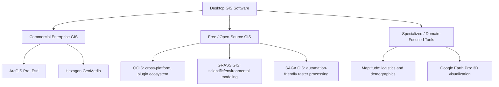

## Desktop GIS Software Overview

### Overview

Desktop GIS software refers to standalone applications installed on a user's computer that provide the core functionality of a geographic information system: data capture, editing, storage, spatial analysis, cartographic visualization, and map production. Desktop GIS remains the primary environment in which most GIS analysts perform detailed data editing, complex geoprocessing, and cartographic design, even as web-based and cloud GIS platforms increasingly handle data distribution, dashboards, and lightweight viewing. The desktop GIS landscape spans commercial enterprise platforms, free and open-source alternatives, and specialized tools targeting particular domains such as remote sensing or defense.

### Categories of Desktop GIS Software

| Category | Description | Examples |
| --- | --- | --- |
| Commercial enterprise GIS | Full-featured, vendor-supported platforms with extensions for advanced analysis, 3D, and enterprise database integration | ArcGIS Pro, Hexagon GeoMedia |
| Free and open-source GIS (FOSS4G) | Community-developed, freely licensed software with no acquisition cost and often extensive plugin ecosystems | QGIS, GRASS GIS, SAGA GIS |
| Specialized/domain-focused tools | Software tailored to specific workflows such as remote sensing, logistics, or 3D globe visualization | Maptitude (business/logistics), Google Earth Pro (3D visualization) |
| Developer-oriented mapping tools | Platforms geared toward building custom map-based applications rather than general-purpose desktop analysis | Mapbox Studio |

### Commercial Desktop GIS: ArcGIS Pro

**Key Points**

- ArcGIS Pro, developed by Esri, is widely regarded as the industry standard for large organizations, excelling in advanced geoprocessing, 3D analysis, and integration with ArcGIS Online, Experience Builder, and enterprise geodatabases.
- ArcGIS Pro offers capabilities that some competing platforms do not fully match, including superior 3D mapping and scene creation with a 3D Analyst extension, more robust network analysis tools for routing and service areas, advanced multi-user editing and versioning in enterprise geodatabase environments, and more polished visual workflow automation through ModelBuilder. [Atlas](https://atlas.co/blog/qgis-vs-arc-gis-complete-comparison-for-2026/)
- ArcGIS Pro operates under a commercial licensing framework, providing an exceptionally polished user interface, deep database synchronization capabilities, and official technical support as part of its enterprise offering. [GIS Vantage Group](https://gisvantage.com/articles/arcgis-pro-vs-qgis/)
- ArcGIS Pro is restricted to Windows desktops, though Esri offers web and mobile companions through ArcGIS Online for cross-platform access to published content. [Qgis-windows](https://qgis-windows.github.io/qgis-vs-arcgis.html)
- Independent evaluations note that ArcGIS Pro tends to have an edge in performance for very large datasets and complex analytical workflows, handling enterprise-scale work more gracefully than some open-source alternatives, though this varies by specific workflow and dataset characteristics. [Inference: relative performance between platforms depends on the specific hardware, dataset size, and operation being performed, and general claims should be validated against the user's own workflow.] [Atlas](https://atlas.co/blog/qgis-vs-arc-gis-complete-comparison-for-2026/)

### Open-Source Desktop GIS: QGIS

**Key Points**

- QGIS (Quantum GIS) is a legitimate, extremely robust rival to ArcGIS Pro, with zero licensing fees and a lightweight cross-platform architecture, making it a common choice for startups, non-governmental organizations, and independent GIS practitioners. [GIS Vantage Group](https://gisvantage.com/articles/arcgis-pro-vs-qgis/)
- QGIS runs natively on Windows, macOS, and Linux, offering cross-platform flexibility that some commercial alternatives restricted to a single operating system do not provide. [Qgis-windows](https://qgis-windows.github.io/qgis-vs-arcgis.html)
- Because QGIS is open-source, it benefits from a passionate global community of developers; when a new file format emerges or a niche analysis model is developed, a QGIS plugin is often created within days, giving it a dynamic and extensible plugin ecosystem. [GIS Vantage Group](https://gisvantage.com/articles/arcgis-pro-vs-qgis/)
- QGIS supports Python scripting through its API, and can open Shapefiles, File Geodatabases in read mode, GeoTIFF rasters, and connect to ArcGIS REST services, though it cannot directly read proprietary map document files from other platforms (it can still open the underlying data layers). [Qgis-windows](https://qgis-windows.github.io/qgis-vs-arcgis.html)
- Reviewed against ArcGIS Pro, QGIS is described as handling all standard GIS workflows, with the main gap being specific vendor-ecosystem integrations and some advanced 3D and network analysis tools. [Qgis-windows](https://qgis-windows.github.io/qgis-vs-arcgis.html)

### Other Notable Desktop GIS Platforms

| Platform | Notable Characteristics |
| --- | --- |
| GRASS GIS | Free and open-source; used for scientific research such as environmental modeling; strong raster and geospatial modeling capabilities |
| SAGA GIS | Free, open-source; suited to repeatable, automation-friendly desktop spatial analysis and raster processing pipelines |
| Hexagon GeoMedia | Commercial; optimized for dynamic data processing such as defense and urban planning applications |
| Maptitude | Commercial; tailored for businesses requiring logistical tools and demographic information at a cost-effective price |
| Google Earth Pro | Free; offers rudimentary GIS functionality along with detailed imagery visualization, though with confined advanced analytical capabilities compared to full GIS platforms |

[Unverified: platform capabilities, pricing, and feature sets change over time with new software releases; consult the current vendor or project documentation for up-to-date specifications.]

### Core Functional Capabilities Common Across Desktop GIS

**Key Points**

- Most modern desktop GIS platforms provide a shared baseline of functionality: data import/export supporting major spatial formats such as Shapefile, GeoJSON, GeoPackage, and PostGIS; map styling and cartography including layer symbology, labels, and print layouts; spatial analysis operations such as buffer, clip, intersect, and union; full support for coordinate systems and projections; and attribute editing including table management and field calculations. [Atlas](https://atlas.co/blog/qgis-vs-arc-gis-complete-comparison-for-2026/)
- Differentiation between platforms tends to occur at the edges of this common baseline — in areas such as advanced 3D scene analysis, network/routing analysis sophistication, enterprise multi-user editing capability, and depth of automation/scripting tooling.

### Choosing a Desktop GIS Platform

**Example**

A practical decision framework based on organizational context:

- **Budget-constrained or educational contexts**: open-source platforms such as QGIS or GRASS GIS eliminate licensing costs entirely, which is particularly valuable for researchers and budget-conscious users or academic environments teaching GIS concepts without software cost barriers. [PrimaVerse](https://www.primaverse.com/post/top-gis-software-2026-best-tools-and-platforms-compared)
- **Large enterprise or government deployment**: commercial platforms like ArcGIS Pro are often favored where enterprise deployment needs ArcGIS Server, Portal, or Online integration, or where vendor support contracts and structured training/certification paths are organizationally required. [Qgis-windows](https://qgis-windows.github.io/qgis-vs-arcgis.html)
- **Mixed operating system environments**: cross-platform tools such as QGIS provide practical advantages when a team uses a mix of Windows, macOS, and Linux systems. [Qgis-windows](https://qgis-windows.github.io/qgis-vs-arcgis.html)
- **Specialized domain needs**: logistics-focused organizations may prefer tools like Maptitude, while defense or dynamic urban planning contexts may favor GeoMedia; the appropriate choice depends on matching the software's specialized strengths to the specific domain workflow.

**Key Points**

- Neither major platform is inherently "easier" for an absolute beginner: both QGIS and ArcGIS Pro have a similar learning curve for core GIS concepts, with QGIS offering excellent documentation and a large community with free tutorials, while ArcGIS provides structured training resources and a certification path. [Qgis-windows](https://qgis-windows.github.io/qgis-vs-arcgis.html)
- Licensing model is a primary differentiator: QGIS is completely free with no licensing costs, seat limits, or subscription requirements, while ArcGIS Pro requires ongoing commercial licensing. [Qgis-windows](https://qgis-windows.github.io/qgis-vs-arcgis.html)

### Mermaid Diagram: Desktop GIS Software Landscape

### SVG Illustration: Desktop GIS Selection Factors (svg_diagram)

<svg xmlns="http://www.w3.org/2000/svg" viewBox="0 0 640 320">
<text x="320" y="24" text-anchor="middle" font-size="16" font-weight="bold" fill="#1a1a1a">Desktop GIS Selection Factors (svg_diagram)</text>
<circle cx="320" cy="170" r="55" fill="#ebf8ff" stroke="#2b6cb0" stroke-width="2" />
<text x="320" y="165" text-anchor="middle" font-size="11" font-weight="bold" fill="#1a1a1a">Platform</text>
<text x="320" y="180" text-anchor="middle" font-size="11" font-weight="bold" fill="#1a1a1a">Choice</text>
<line x1="320" y1="115" x2="320" y2="60" stroke="#4a5568" stroke-width="1.5" />
<rect x="230" y="20" width="180" height="40" rx="4" fill="#c6f6d5" stroke="#2f855a" stroke-width="1.5" />
<text x="320" y="45" text-anchor="middle" font-size="10" fill="#1a1a1a">Budget / Licensing Model</text>
<line x1="275" y1="135" x2="150" y2="90" stroke="#4a5568" stroke-width="1.5" />
<rect x="60" y="60" width="180" height="40" rx="4" fill="#c6f6d5" stroke="#2f855a" stroke-width="1.5" />
<text x="150" y="85" text-anchor="middle" font-size="10" fill="#1a1a1a">Operating System / Team Mix</text>
<line x1="275" y1="205" x2="150" y2="250" stroke="#4a5568" stroke-width="1.5" />
<rect x="60" y="230" width="180" height="40" rx="4" fill="#fed7d7" stroke="#c53030" stroke-width="1.5" />
<text x="150" y="255" text-anchor="middle" font-size="10" fill="#1a1a1a">Enterprise Integration Needs</text>
<line x1="365" y1="205" x2="490" y2="250" stroke="#4a5568" stroke-width="1.5" />
<rect x="400" y="230" width="180" height="40" rx="4" fill="#fed7d7" stroke="#c53030" stroke-width="1.5" />
<text x="490" y="255" text-anchor="middle" font-size="10" fill="#1a1a1a">3D / Network Analysis Depth</text>
<line x1="365" y1="135" x2="490" y2="90" stroke="#4a5568" stroke-width="1.5" />
<rect x="400" y="60" width="180" height="40" rx="4" fill="#feebc8" stroke="#c05621" stroke-width="1.5" />
<text x="490" y="85" text-anchor="middle" font-size="10" fill="#1a1a1a">Domain Specialization</text>
</svg>

### Applications in Geospatial and Environmental Science

- **Environmental research and modeling**: open-source platforms such as GRASS GIS support scientific research including environmental modeling, making them common choices in academic and research institutions with limited software budgets. [PrimaVerse](https://www.primaverse.com/post/top-gis-software-2026-best-tools-and-platforms-compared)
- **Government and multi-agency environmental management**: commercial platforms with strong enterprise database integration support large-scale, multi-department environmental data management, permitting, and reporting workflows.
- **NGO and field-based conservation work**: QGIS's zero licensing cost and cross-platform support make it a practical choice for NGOs and independent practitioners conducting conservation mapping and analysis with constrained budgets. [GIS Vantage Group](https://gisvantage.com/articles/arcgis-pro-vs-qgis/)
- **Automated environmental raster processing pipelines**: tools like SAGA GIS support repeatable, automation-friendly raster processing pipelines, useful for recurring environmental monitoring tasks such as periodic land cover classification. [World Metrics](https://worldmetrics.org/best/gis-software/)
- **Terrain and 3D environmental visualization**: platforms with strong 3D capabilities support visualization of environmental phenomena such as watershed terrain, urban heat island modeling, or coastal inundation scenarios.

### Limitations and Considerations

- Desktop GIS software capabilities, pricing, and platform support change with each release cycle; specific version comparisons should be verified against current vendor or project documentation rather than assumed static over time. [Unverified: the desktop GIS landscape evolves continuously, and specific feature comparisons may not reflect the latest software versions.]
- Performance claims comparing platforms (e.g., handling of very large datasets or dense 3D scenes) can vary significantly based on hardware, dataset characteristics, and specific workflow; user-reported issues such as software freezing during specific operations have been noted for at least one major platform in user reviews. One user review noted that "ArcGIS Pro freezes when I pan a dense 3D scene too fast," though such experiences may not generalize across all hardware configurations or software versions. [Inference: individual user-reported performance issues may reflect specific hardware or configuration factors rather than universal software behavior.] [Software Advice](https://www.softwareadvice.com/artificial-intelligence/arcgis-profile/vs/qgis/)
- Platform choice involves genuine trade-offs rather than a single universally correct answer; the appropriate platform depends on organizational budget, existing infrastructure, required analytical depth, and team technical background, all of which vary by organization.
- Some free/open-source tools may have less robust community support than more established alternatives, or confined advanced analytical capabilities relative to full-featured commercial platforms, which should be weighed against their cost advantages for specific use cases. [PrimaVerse](https://www.primaverse.com/post/top-gis-software-2026-best-tools-and-platforms-compared)

**Related Topics**

- Web GIS Platforms and Cloud-Based Mapping Services
- Geoprocessing and Spatial Analysis Toolboxes
- Python and Scripting for GIS Automation (PyQGIS, ArcPy)
- Cloud-Based Spatial Data Storage
- Enterprise GIS System Architecture
- 3D GIS Visualization and Scene Analysis
- Network Analysis and Routing Tools
- Open-Source GIS Plugin Ecosystems