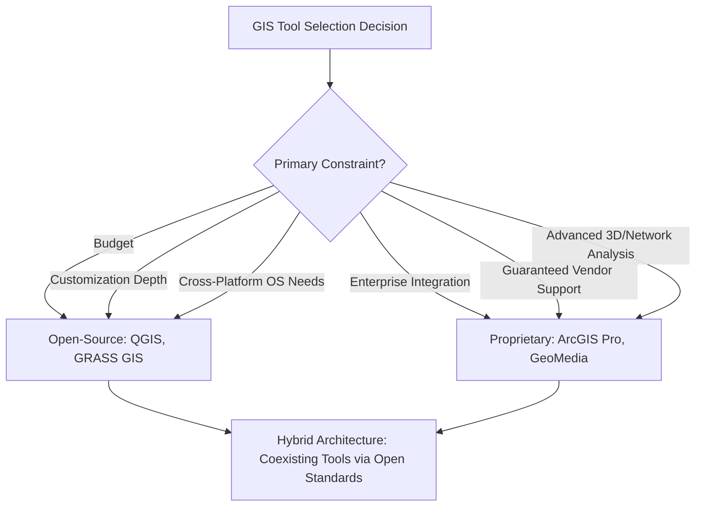

## Open-Source Versus Proprietary GIS Tools

### Overview

The choice between open-source and proprietary GIS tools represents one of the most consequential decisions in establishing a geospatial technology stack, affecting cost structure, customization flexibility, support model, interoperability, and long-term data sovereignty. Open-source GIS software is developed collaboratively, distributed under licenses that permit free use, modification, and redistribution, while proprietary GIS software is developed and controlled by a commercial vendor under paid licensing terms with vendor-provided support.

### Defining Characteristics

| Dimension | Open-Source GIS | Proprietary GIS |
| --- | --- | --- |
| Source code access | Publicly available; users can inspect, modify, and redistribute | Closed; source code is not accessible to end users |
| Licensing cost | Typically free (though some open-source-based commercial support offerings exist) | Requires paid licensing, often subscription or seat-based |
| Development model | Community-driven, distributed contributor base, often governed by a foundation | Controlled by a single vendor's internal development team |
| Support model | Community forums, documentation, optional paid third-party support | Official vendor technical support, typically included with licensing |
| Customization | Users can modify source code directly; plugin architectures are often extensive | Limited to vendor-provided extensibility APIs (e.g., scripting, SDKs); core code is not modifiable |
| Release cadence | Often more frequent, community-driven; new format/feature support can appear quickly | Structured, vendor-controlled release cycles with formal roadmaps |

### Cost Considerations

**Key Points**

- Open-source GIS platforms such as QGIS are free to download, install, and use indefinitely, with no licensing costs, seat limits, or subscription requirements — a significant advantage for budget-constrained organizations, researchers, students, and startups.
- Proprietary platforms operate under commercial licensing frameworks, requiring ongoing subscription or seat-based costs, though this is typically paired with official vendor support, structured training, and integrated enterprise service ecosystems.
- The total cost comparison is not purely about license price: organizations must also weigh staff training time, potential need for paid third-party support contracts for open-source tools, and the value of vendor-provided enterprise integrations that may reduce custom development effort with proprietary platforms. [Inference: the true total cost of ownership depends heavily on organization-specific factors such as existing staff expertise, support needs, and integration requirements, which will vary.]

### Development Model and Community

**Key Points**

- Because open-source GIS software is developed by a passionate global community of contributors, when a new file format emerges or a niche analysis capability is needed, a plugin or feature addition is often created rapidly by community members, giving open-source tools notable agility in responding to emerging needs.
- Proprietary GIS platforms benefit from centralized, well-resourced development teams capable of delivering deeply integrated, polished features (such as advanced 3D analysis or enterprise database synchronization) as part of a coordinated product roadmap, often with more predictable long-term support commitments.
- Open-source projects are frequently governed by nonprofit foundations (e.g., the Open Source Geospatial Foundation, OSGeo, which incubates and supports projects such as QGIS and GRASS GIS), providing organizational continuity independent of any single company's business decisions. [Unverified: specific governance structures and their implications for long-term project continuity should be verified against the current status of each specific open-source project.]

### Interoperability and Data Formats

**Key Points**

- Open-source GIS tools typically read and write virtually all major GIS formats through underlying open libraries (such as GDAL/OGR), minimizing vendor lock-in and easing data exchange across heterogeneous software environments.
- Proprietary platforms generally support open formats as well but may have native, deeply integrated formats (such as a proprietary geodatabase format) that offer richer functionality (versioning, advanced topology, geometric networks) only within that vendor's own ecosystem, which can create a degree of practical lock-in for organizations relying heavily on those advanced features.
- Interoperability works in both directions to varying degrees: open-source tools can often connect to and read proprietary enterprise geodatabases or REST services, but writing back into certain vendor-specific advanced constructs may have limited or read-only support. [Unverified: exact read/write compatibility for specific proprietary formats and services depends on the specific open-source tool version and should be confirmed against current documentation.]

### Customization and Extensibility

**Key Points**

- Open-source GIS provides the deepest possible customization path: because the source code itself is available, an organization with sufficient technical capacity can modify core software behavior directly, not just extend it through an API.
- Proprietary GIS platforms provide extensibility primarily through supported scripting and SDK interfaces, allowing automation and custom tool development without requiring (or permitting) modification of the underlying application code itself.
- Both models typically support a plugin/extension ecosystem, though the openness of the underlying codebase in open-source tools generally enables a broader and more diverse range of community-contributed plugins, sometimes including experimental or niche functionality not available in any proprietary offering.

### Support and Reliability Considerations

**Key Points**

- Proprietary GIS vendors typically provide official, contracted technical support, including defined service-level agreements, structured training programs, and formal certification paths — valuable for organizations requiring guaranteed support response times or compliance documentation.
- Open-source GIS support relies primarily on community forums, extensive community-contributed documentation and tutorials, and optionally paid third-party consulting or support contracts from firms specializing in the specific open-source platform.
- Neither model is inherently more or less reliable in terms of software quality; both open-source and proprietary GIS platforms are used extensively in production environments by governments, NGOs, environmental consultancies, and universities worldwide, and the appropriate choice depends on an organization's specific support and risk-tolerance requirements. [Inference: perceived reliability differences between specific platforms often reflect particular use cases, configurations, or version-specific issues rather than a categorical difference between open-source and proprietary development models generally.]

### Comparative Decision Framework

**Example**

| Organizational Context | Common Consideration |
| --- | --- |
| Budget-constrained researcher or NGO | Open-source (e.g., QGIS, GRASS GIS) eliminates licensing cost barriers entirely |
| Large enterprise needing integrated server/portal ecosystem | Proprietary platforms often provide more seamless enterprise server, portal, and online integration |
| Team requiring rapid support/response guarantees | Proprietary vendor support contracts provide defined service commitments |
| Organization prioritizing data sovereignty and avoiding vendor lock-in | Open formats and open-source tools reduce dependency on a single vendor's proprietary ecosystem |
| Team wanting to customize or extend core software behavior | Open-source access to source code enables deeper modification than vendor-provided APIs alone |
| Mixed-OS team environment (Windows, macOS, Linux) | Cross-platform open-source tools avoid the need for a single, often Windows-only, proprietary platform |

### Hybrid and Coexisting Approaches

**Key Points**

- Many organizations adopt a hybrid approach, using proprietary platforms for enterprise-wide data management, versioning, and web service publishing, while using open-source tools for specific analytical tasks, rapid prototyping, or cost-sensitive field/project work.
- Open standards (such as OGC-compliant formats and services) increasingly enable interoperability between open-source and proprietary components within the same organizational GIS architecture, reducing the practical friction of a mixed-tool environment. [Inference: the degree of practical interoperability achieved in a hybrid deployment depends on the specific tools, versions, and configuration choices involved.]

### Mermaid Diagram: Open-Source vs. Proprietary GIS Decision Factors

### SVG Illustration: Open-Source vs. Proprietary Trade-off Spectrum (svg_diagram)

<svg xmlns="http://www.w3.org/2000/svg" viewBox="0 0 640 300">
<text x="320" y="24" text-anchor="middle" font-size="16" font-weight="bold" fill="#1a1a1a">Open-Source vs. Proprietary Trade-off Spectrum (svg_diagram)</text>

<line x1="60" y1="150" x2="580" y2="150" stroke="#4a5568" stroke-width="3" />

<circle cx="90" cy="150" r="8" fill="#2f855a" />
<text x="90" y="130" text-anchor="middle" font-size="12" font-weight="bold" fill="#2f855a">Open-Source</text>
<text x="90" y="180" text-anchor="middle" font-size="9" fill="#4a5568">Free, customizable,</text>
<text x="90" y="194" text-anchor="middle" font-size="9" fill="#4a5568">community support</text>

<circle cx="550" cy="150" r="8" fill="#2b6cb0" />
<text x="550" y="130" text-anchor="middle" font-size="12" font-weight="bold" fill="#2b6cb0">Proprietary</text>
<text x="550" y="180" text-anchor="middle" font-size="9" fill="#4a5568">Paid, polished,</text>
<text x="550" y="194" text-anchor="middle" font-size="9" fill="#4a5568">vendor support</text>

<circle cx="320" cy="150" r="10" fill="#c05621" />
<text x="320" y="120" text-anchor="middle" font-size="12" font-weight="bold" fill="#c05621">Hybrid</text>
<text x="320" y="180" text-anchor="middle" font-size="9" fill="#4a5568">Open standards enable</text>
<text x="320" y="194" text-anchor="middle" font-size="9" fill="#4a5568">coexistence of both</text>

<text x="320" y="250" text-anchor="middle" font-size="11" fill="`#4a5568`">Most organizations position their GIS architecture along this spectrum</text>

<text x="320" y="268" text-anchor="middle" font-size="11" fill="`#4a5568`">based on budget, support needs, customization depth, and enterprise integration requirements.</text>

</svg>

### Applications in Geospatial and Environmental Science

- **Academic and research institutions**: open-source GIS eliminates licensing cost barriers for teaching GIS concepts and conducting environmental modeling research, particularly valuable in resource-constrained educational settings.
- **NGO and international development environmental projects**: open-source tools support field-based conservation and environmental monitoring work where budget constraints and the need for locally maintainable, unlicensed software are significant factors.
- **Government environmental agencies**: many agencies adopt proprietary enterprise GIS platforms for their integrated database versioning, security, and support guarantees, particularly for regulatory and legally significant spatial data (e.g., cadastral, permitting).
- **Multi-stakeholder environmental data initiatives**: open standards and open-source tools facilitate data sharing and joint analysis across organizations that may not share the same proprietary software licenses, reducing barriers to collaborative environmental monitoring programs.
- **Custom environmental modeling tool development**: open-source access to source code enables researchers to modify or extend core GIS analytical algorithms for specialized environmental modeling needs not available in any off-the-shelf commercial tool.

### Limitations and Considerations

- The specific capabilities, licensing terms, and support offerings of both open-source and proprietary GIS platforms evolve over time; comparisons should be verified against current documentation and release information rather than treated as permanently fixed. [Unverified: the GIS software landscape changes with each release cycle for both categories of tools.]
- Neither open-source nor proprietary status is a reliable proxy for software quality, security, or long-term viability on its own; both categories include mature, well-maintained platforms and less actively maintained or niche offerings.
- Organizations relying on advanced vendor-specific features (e.g., specific enterprise geodatabase versioning behaviors, proprietary network analyst tools) may encounter genuine practical lock-in even if underlying data can theoretically be exported to open formats, since replicating that specific advanced functionality outside the vendor ecosystem may require significant custom development. [Inference: the practical difficulty of migrating away from vendor-specific advanced features depends on how deeply those features are embedded in existing organizational workflows.]
- Community-based support for open-source tools, while often extensive and responsive, does not carry the same formal service-level guarantees as a paid vendor support contract, which may be a material consideration for organizations with strict operational uptime or compliance requirements.

**Related Topics**

- Desktop GIS Software Overview
- Web GIS Platforms and Cloud-Based Mapping Services
- Data Interoperability Standards (OGC, GDAL/OGR)
- Geodatabase Architecture and Design
- Enterprise GIS System Architecture
- Python and Scripting for GIS Automation
- Open-Source GIS Plugin Ecosystems
- Total Cost of Ownership Analysis for GIS Systems