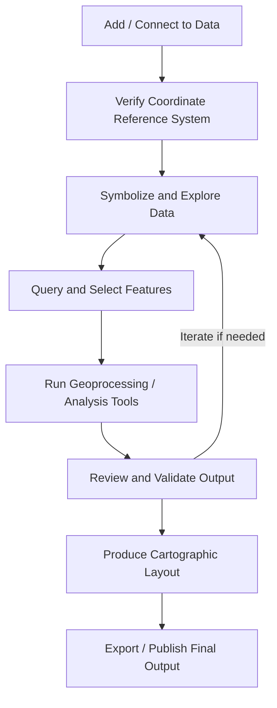

## GIS Interface and Workflow Fundamentals


### Overview

GIS interface and workflow fundamentals cover the standard user interface components, project organization structures, and recurring task sequences common across desktop GIS software, providing the operational foundation upon which all data management, analysis, and cartographic tasks are built. Regardless of the specific platform used, most desktop GIS applications share a common conceptual interface model — a map canvas, a layer/content hierarchy, a table of contents, toolboxes, and an attribute table interface — along with a standard workflow pattern of adding data, symbolizing it, exploring/querying it, and producing analytical or cartographic output.

### Core Interface Components

| Component | Function |
| --- | --- |
| Map canvas / View | The central display area rendering the geographic layers being worked with, supporting pan, zoom, and interactive selection |
| Table of Contents (TOC) / Layers panel | A hierarchical list of loaded data layers, controlling draw order, visibility, and providing access to symbology and properties |
| Toolbar / Ribbon | Grouped icons and menu commands for common operations (navigation, editing, selection, measurement) |
| Toolbox / Processing panel | A searchable catalog of geoprocessing and analysis tools, often organized by category (e.g., analysis, data management, conversion) |
| Attribute table | A spreadsheet-like view of the non-spatial data associated with a layer's features, supporting sorting, filtering, and field calculation |
| Legend | A cartographic key displayed on the map layout, derived from and synchronized with each layer's symbology settings |
| Layout / Print composer | A separate design canvas for arranging map elements (map frame, legend, scale bar, north arrow, title) into a finished, printable or exportable map product |
| Catalog / Browser panel | A file-system-like browser for navigating and connecting to data sources (folders, databases, servers) without leaving the application |

### Project Organization Structure

**Key Points**

- Most desktop GIS platforms organize work around a **project file** (e.g., `.qgz`/`.qgs` in QGIS, `.aprx` in ArcGIS Pro), which stores references to data sources, symbology settings, map layouts, and processing history — but typically does not store the underlying spatial data itself.
- Because project files generally store *references* (paths) to external data rather than embedding the data, moving or renaming source data files/folders can break these links, requiring re-pointing broken data source references within the project.
- Best practice project organization typically separates source data (in a dedicated data folder or geodatabase), project files, and exported outputs (maps, reports, processed datasets) into distinct, consistently structured directories to support reproducibility and easier project handoff between team members. [Inference: the specific organizational convention that works best depends on team size, existing IT infrastructure, and version control practices, which will vary by organization.]

### The Standard GIS Workflow Pattern

#### Add and Connect to Data

**Key Points**

- The typical starting point of a GIS workflow is adding one or more data layers to the map canvas, either from local files (shapefiles, geodatabases, rasters), from a database connection (e.g., PostGIS), or from a web service (e.g., a REST feature service or WMS/WMTS layer).
- Upon adding a layer with an unfamiliar or undefined coordinate reference system, most GIS software will prompt the user to define or verify the spatial reference, since correct coordinate handling is foundational to all subsequent spatial operations.

#### Symbolize and Explore

**Key Points**

- After loading data, an analyst typically applies **symbology** — visual rules mapping attribute values to color, size, or pattern — to make the data interpretable on the map (e.g., a graduated color scheme for a continuous ratio-scale attribute, or unique-value categorical symbols for a nominal attribute).
- Exploration commonly involves interactive tools such as the **identify** tool (click a feature to view its attributes), attribute table sorting/filtering, and basic measurement tools (distance, area) to gain familiarity with the dataset before performing formal analysis.

#### Query and Select

**Example**

A typical query workflow:

1. Open the attribute table or a "Select by Attribute" dialog for a target layer.
2. Construct a query expression, e.g.:

```sql
   "Land_Use" = 'Residential' AND "Assessed_Value" > 1000000
```

3. Execute the selection, highlighting matching features on the map canvas and in the attribute table simultaneously (most GIS software keeps map selection and table selection synchronized).
4. Optionally refine the selection further using "Select by Location" (a spatial selection based on relationship to another layer, e.g., "select parcels that intersect flood zones") combined with the existing attribute-based selection.

#### Analyze and Process

**Key Points**

- Formal spatial analysis is typically performed through a **toolbox** or **processing panel**, where an analyst selects a specific geoprocessing tool (e.g., Buffer, Clip, Spatial Join, Zonal Statistics), specifies input/output parameters, and executes the operation, producing a new output dataset rather than modifying the input in place (a common default convention, though not universal).
- Many platforms support chaining multiple geoprocessing tools into a repeatable, visual or scripted **model** or workflow, allowing an analysis sequence to be saved, reused, and shared rather than manually repeating individual tool executions.

#### Produce Cartographic Output

**Example**

A typical map production sequence:

1. Switch from the interactive data view to a dedicated **layout/composer** view.
2. Insert a map frame referencing the desired map extent and layers from the data view.
3. Add supporting cartographic elements: a legend (auto-populated from layer symbology), scale bar, north arrow, title text, and data source/attribution text.
4. Adjust page size, orientation, and element positioning for the intended output medium (print, PDF export, or presentation slide).
5. Export the finished layout to a static format (PDF, PNG, JPEG) or, in some workflows, publish the underlying map directly as an interactive web map.

### Editing Workflow Fundamentals

**Key Points**

- Editing in most GIS software requires explicitly starting an **edit session** (or "edit mode"), during which new features can be digitized, existing feature geometry modified, and attribute values updated; changes are typically not permanently saved until the edit session is explicitly saved and closed.
- Common digitizing aids include **snapping** (automatically aligning new vertices to existing feature vertices, edges, or endpoints within a specified tolerance) to prevent gaps, overlaps, and topology errors during manual data creation.
- Undo/redo functionality within an active edit session allows incremental correction of digitizing mistakes without requiring the entire edit session to be discarded.

### Common Workflow Anti-Patterns

| Anti-Pattern | Issue | Better Practice |
| --- | --- | --- |
| Editing directly on a "live" production dataset without a backup | Risk of unrecoverable data loss or corruption from editing errors | Work on a copy or versioned branch, especially for significant edits |
| Ignoring coordinate reference system mismatches between layers | Can produce silently misaligned spatial analysis results | Verify and, if needed, reproject all layers to a consistent reference system before analysis |
| Repeating manual multi-step analysis without saving a reusable model/script | Time-consuming and error-prone when the analysis must be repeated (e.g., for updated data) | Build a reusable geoprocessing model or script for any workflow expected to be run more than once |
| Mixing absolute and relative file paths inconsistently within a project | Breaks data source links when the project or data is moved between machines | Adopt a consistent path convention and folder structure across the project |

### Mermaid Diagram: Standard GIS Workflow Sequence



### SVG Illustration: Standard GIS Interface Layout (svg_diagram)

<svg xmlns="http://www.w3.org/2000/svg" viewBox="0 0 640 380">
<text x="320" y="24" text-anchor="middle" font-size="16" font-weight="bold" fill="#1a1a1a">Standard GIS Interface Layout (svg_diagram)</text>

<rect x="30" y="45" width="580" height="310" fill="#f7fafc" stroke="#4a5568" stroke-width="1.5" rx="4" />

<rect x="30" y="45" width="580" height="30" fill="#2b6cb0" />
<text x="320" y="65" text-anchor="middle" font-size="10" fill="#ffffff">Toolbar / Ribbon: Navigation, Editing, Selection Tools</text>

<rect x="30" y="75" width="140" height="230" fill="#ebf8ff" stroke="#2b6cb0" stroke-width="1" />
<text x="100" y="92" text-anchor="middle" font-size="10" font-weight="bold" fill="#1a1a1a">Table of Contents</text>
<rect x="40" y="100" width="15" height="12" fill="#c6f6d5" stroke="#2f855a" />
<text x="65" y="110" font-size="9" fill="#4a5568">Parcels</text>
<rect x="40" y="118" width="15" height="12" fill="#bee3f8" stroke="#2b6cb0" />
<text x="65" y="128" font-size="9" fill="#4a5568">Watersheds</text>
<rect x="40" y="136" width="15" height="12" fill="#fed7d7" stroke="#c53030" />
<text x="65" y="146" font-size="9" fill="#4a5568">Flood Zones</text>

<rect x="170" y="75" width="320" height="230" fill="#ffffff" stroke="#a0aec0" stroke-width="1" />
<text x="330" y="92" text-anchor="middle" font-size="10" font-weight="bold" fill="#1a1a1a">Map Canvas</text>
<polygon points="220,150 280,140 300,190 250,220 210,200" fill="#bee3f8" fill-opacity="0.6" stroke="#2b6cb0" />
<polygon points="300,160 380,150 400,230 320,260" fill="#fed7d7" fill-opacity="0.6" stroke="#c53030" />

<rect x="500" y="75" width="100" height="230" fill="#f0fff4" stroke="#2f855a" stroke-width="1" />
<text x="550" y="92" text-anchor="middle" font-size="10" font-weight="bold" fill="#1a1a1a">Toolbox</text>
<text x="510" y="110" font-size="8" fill="#4a5568">Buffer</text>
<text x="510" y="124" font-size="8" fill="#4a5568">Clip</text>
<text x="510" y="138" font-size="8" fill="#4a5568">Spatial Join</text>
<text x="510" y="152" font-size="8" fill="#4a5568">Zonal Stats</text>

<rect x="30" y="305" width="580" height="50" fill="#fffff0" stroke="#a0aec0" stroke-width="1" />
<text x="320" y="320" text-anchor="middle" font-size="10" font-weight="bold" fill="#1a1a1a">Attribute Table</text>
<text x="320" y="340" text-anchor="middle" font-size="8" fill="#4a5568">Parcel_ID | Owner_Name | Land_Use | Assessed_Value</text>
</svg>

### Applications in Geospatial and Environmental Science

- **Environmental site assessment workflows**: analysts follow the standard add-symbolize-query-analyze-produce sequence when evaluating contamination extent, habitat suitability, or regulatory compliance for a given site.
- **Field data collection and office review cycles**: interface familiarity with editing sessions, snapping, and attribute tables supports efficient integration of field-collected environmental survey data into office-based GIS projects.
- **Recurring environmental reporting**: reusable geoprocessing models built from standard toolbox operations support recurring tasks such as periodic watershed condition assessments or seasonal land cover change reporting.
- **Multi-analyst project handoff**: consistent project organization (separated data, project files, and outputs) supports smoother handoff of ongoing environmental GIS projects between team members or across project phases.
- **Cartographic communication of environmental findings**: the layout/composer workflow underlies the production of maps used in environmental impact reports, public engagement materials, and regulatory submissions.

### Limitations and Considerations

- Specific interface terminology, panel names, and exact keyboard shortcuts differ across GIS software platforms (e.g., "Table of Contents" versus "Layers panel," "ModelBuilder" versus "Graphical Modeler"); the underlying conceptual workflow is broadly consistent, but exact menu locations should be verified against the specific software's current documentation. [Unverified: exact interface terminology and menu structure differ by platform and version.]
- Project files that store only references to external data (rather than embedding it) create a data management responsibility that, if neglected, can lead to broken links and non-reproducible projects; this risk should be mitigated through consistent folder structure and path conventions. [Inference: the severity of this risk depends on how frequently data or project files are moved or shared outside their original file structure.]
- The default behavior of geoprocessing tools (e.g., whether they modify data in place or always create new output) can vary by specific tool and platform, and should be verified before running operations on valuable or irreplaceable source data.
- Editing workflow safeguards (edit sessions, undo/redo, snapping tolerances) reduce but do not eliminate the risk of data entry errors; organizational practices such as maintaining backups or working within a versioned editing environment provide additional protection for significant or high-value datasets.

**Related Topics**

- Desktop GIS Software Overview
- Open-Source Versus Proprietary GIS Tools
- Topology Rules and Digitizing Error Correction
- Geoprocessing and Spatial Analysis Toolboxes
- Cartographic Design and Map Layout Principles
- Coordinate Reference Systems and Reprojection
- Multi-User Editing and Version Control
- Python and Scripting for GIS Automation