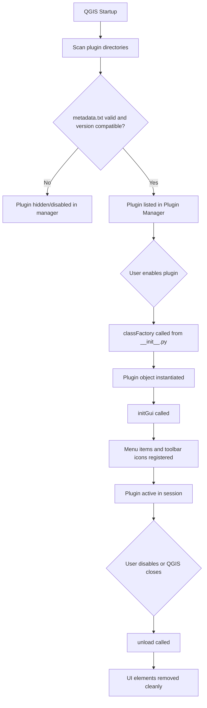

## Extensions and Plugin Ecosystems

### Overview

Extensions and plugins are the primary mechanism by which GIS platforms scale beyond their core feature set. Rather than embedding every possible analytical, cartographic, or data-access capability into a monolithic application, modern GIS software exposes an internal API surface that third-party developers, research groups, and government agencies can build against. This architecture pattern — a stable core plus a modular periphery — allows GIS platforms to serve wildly divergent domains (hydrology, urban planning, precision agriculture, disaster response) from a single codebase, while keeping the core application lean and maintainable.

Three ecosystems dominate the applied geospatial landscape: **QGIS** (Python/C++ plugin architecture), **Esri ArcGIS Pro** (.NET/Python add-in and toolbox architecture), and **web-based/JavaScript GIS libraries** (Leaflet, OpenLayers, Mapbox GL JS plugin patterns). Each has a distinct architectural philosophy shaped by its licensing model, target user base, and underlying language runtime.

### Why Plugin Architectures Exist

**Key Points**

- Core application stability: the base GIS platform is tested, versioned, and released independently of third-party code, isolating crashes and bugs to the extension layer where possible.
- Domain specialization: a hydrologist's toolset (watershed delineation, flow accumulation) and a cadastral surveyor's toolset (parcel topology, COGO tools) rarely overlap; plugins let each community build only what they need.
- Rapid iteration: plugin release cycles are decoupled from core software release cycles, so experimental algorithms can reach users in days rather than waiting for the next major version.
- Community-driven innovation: open ecosystems (QGIS in particular) allow academic research to translate directly into distributable tools without requiring commit access to the core repository.
- Vendor lock-in mitigation: standardized plugin APIs (e.g., processing framework interfaces) let algorithms be somewhat portable across tools that implement compatible interfaces.

### QGIS Plugin Architecture

QGIS is built in C++ with Qt for the UI layer, but its plugin system is deliberately exposed through **PyQGIS**, a Python API that wraps the underlying C++ classes via SIP bindings. This design choice — Python for the extension layer, C++ for the performance-critical core — is the single most consequential architectural decision in the QGIS ecosystem, because it lowers the barrier to entry from "C++ systems programmer" to "Python-literate GIS analyst."

#### Plugin Types

1. **Python plugins** — the overwhelming majority of community plugins. Distributed as a folder containing a mandatory `metadata.txt`, an `__init__.py` with a `classFactory()` entry point, and the plugin logic itself.
2. **C++ plugins** — compiled directly against the QGIS API and Qt; used when performance is critical (e.g., custom raster processing) or when a plugin needs functionality not exposed through PyQGIS bindings. Requires building against the same Qt/GDAL/QGIS version the target install uses, making distribution far more brittle than Python plugins.
3. **Processing scripts/providers** — a lighter-weight extension mechanism specifically for algorithms that plug into the Processing Toolbox (QGIS's geoprocessing framework), rather than full GUI plugins with custom dialogs.

#### Anatomy of a QGIS Python Plugin



```
my_plugin/
├── __init__.py          # classFactory() entry point
├── metadata.txt          # name, version, qgisMinimumVersion, description
├── my_plugin.py           # main plugin class (initGui, unload)
├── my_plugin_dialog.py    # Qt Designer-generated or hand-coded UI
├── resources.qrc          # icon and resource declarations
├── resources_rc.py        # compiled Qt resources
└── i18n/                  # translation files
```

`metadata.txt` is the manifest QGIS reads to populate the Plugin Manager:

```ini
[general]
name=My Plugin
qgisMinimumVersion=3.28
description=Performs custom vector analysis
version=1.0.0
author=Your Name
email=you@example.com
about=Detailed description of what this plugin does
tracker=https://github.com/you/my_plugin/issues
repository=https://github.com/you/my_plugin
tags=vector,analysis
category=Vector
icon=icon.png
experimental=False
```

`__init__.py` is intentionally minimal — it exists only so QGIS can discover the plugin's entry point without importing the full plugin (and its dependencies) at startup scan time:

```python
def classFactory(iface):
    from .my_plugin import MyPlugin
    return MyPlugin(iface)
```

The main class implements the lifecycle contract QGIS expects:

```python
from qgis.PyQt.QtWidgets import QAction
from qgis.PyQt.QtGui import QIcon
import os.path

class MyPlugin:
    def __init__(self, iface):
        self.iface = iface
        self.actions = []
        self.menu = "&My Plugin"

    def initGui(self):
        icon_path = os.path.join(os.path.dirname(__file__), "icon.png")
        action = QAction(QIcon(icon_path), "Run My Plugin", self.iface.mainWindow())
        action.triggered.connect(self.run)
        self.iface.addToolBarIcon(action)
        self.iface.addPluginToMenu(self.menu, action)
        self.actions.append(action)

    def unload(self):
        for action in self.actions:
            self.iface.removePluginMenu(self.menu, action)
            self.iface.removeToolBarIcon(action)

    def run(self):
        layer = self.iface.activeLayer()
        if layer is None:
            return
        # plugin logic operates on the active layer
```

`self.iface` is the `QgisInterface` object — the primary handle a plugin has into the running application: the map canvas, layer tree, active layer, and legend. `initGui()` and `unload()` are the two mandatory lifecycle hooks; `unload()` must cleanly remove every UI element the plugin added, or QGIS accumulates orphaned menu entries and toolbar icons across reload cycles during plugin development.

#### The Processing Framework as an Extension Point

For pure algorithms (as opposed to interactive GUI tools), QGIS exposes a separate, lighter extension surface: the `QgsProcessingAlgorithm` base class. This is the preferred pattern when a plugin's value is a reusable geoprocessing operation, because it automatically gains a standard parameter dialog, batch-processing support, and model-builder/graphical-modeler compatibility for free.

```python
from qgis.core import (QgsProcessingAlgorithm, QgsProcessingParameterFeatureSource,
                        QgsProcessingParameterNumber, QgsProcessingParameterFeatureSink)

class BufferByAttributeAlgorithm(QgsProcessingAlgorithm):
    INPUT = "INPUT"
    DISTANCE_FIELD = "DISTANCE_FIELD"
    OUTPUT = "OUTPUT"

    def initAlgorithm(self, config=None):
        self.addParameter(QgsProcessingParameterFeatureSource(self.INPUT, "Input layer"))
        self.addParameter(QgsProcessingParameterNumber(self.DISTANCE_FIELD, "Buffer distance"))
        self.addParameter(QgsProcessingParameterFeatureSink(self.OUTPUT, "Buffered output"))

    def processAlgorithm(self, parameters, context, feedback):
        source = self.parameterAsSource(parameters, self.INPUT, context)
        # geometry.buffer() invoked per feature, sink.addFeature() per result
        return {self.OUTPUT: self.OUTPUT}

    def name(self):
        return "bufferbyattribute"

    def displayName(self):
        return "Buffer by Attribute"

    def createInstance(self):
        return BufferByAttributeAlgorithm()
```

#### Distribution: QGIS Plugin Repository

The official repository (`plugins.qgis.org`) is itself an open ecosystem: any registered user can upload a plugin, and it becomes discoverable in the in-app Plugin Manager after a lightweight automated and community-moderated review. This is structurally different from Esri's curated ArcGIS Marketplace and is a direct consequence of QGIS's open-source, community-governance model. Plugins declare compatibility via `qgisMinimumVersion`/`qgisMaximumVersion` in `metadata.txt`; there is no binary compatibility guarantee across major QGIS versions because the underlying PyQGIS API surface does shift between major releases (notably the Qt4→Qt5 and PyQt4→PyQt5 transition around QGIS 3.0).

**[Inference]** Because plugin quality review on the official repository is comparatively lightweight relative to a fully curated app-store model, production GIS workflows in regulated or safety-critical contexts often pin specific plugin versions and test upgrades in isolated environments rather than trusting automatic updates.

### Esri ArcGIS Pro Add-In Architecture

ArcGIS Pro's extension model is built on the **ArcGIS Pro SDK for .NET** (C# or VB.NET) and, separately, a Python-based extension surface via **ArcPy** and **Python toolboxes**. Unlike QGIS's single dominant Python pathway, Esri deliberately maintains two distinct extension tiers for two distinct audiences.

#### Tier 1: ArcGIS Pro SDK Add-Ins (.NET)

Used for deep UI customization — custom ribbon tabs, dockable panes, map tool overrides, custom layer types. Built as Visual Studio projects using the ArcGIS Pro SDK NuGet package, compiled to a `.esriAddinX` package (a renamed zip archive) for distribution.

```csharp
using ArcGIS.Desktop.Framework.Contracts;
using ArcGIS.Desktop.Mapping;

internal class BufferButton : Button
{
    protected override async void OnClick()
    {
        var mapView = MapView.Active;
        if (mapView == null) return;

        await QueuedTask.Run(() =>
        {
            var selectedFeatures = mapView.Map.GetSelection();
            // geoprocessing invoked via ArcGIS.Desktop.Core.Geoprocessing.Geoprocessing.ExecuteToolAsync
        });
    }
}
```

The `Config.daml` file (Declarative Application Markup Language, an Esri-specific XML dialect) declares how the add-in integrates into the Pro ribbon — which tab, which group, which icon — separating UI placement declaration from behavioral code:

```xml
<ArcGIS defaultAssembly="MyAddin.dll" defaultAssemblyAlias="MyAddin">
  <AddInInfo id="{unique-guid}" version="1.0" desktopVersion="3.3">
    <Name>My Addin</Name>
  </AddInInfo>
  <modules>
    <insertModule id="MyAddin_Module" className="Module1" autoLoad="false">
      <tabs>
        <tab id="MyAddin_Tab1" caption="Custom Tools">
          <group refID="MyAddin_Group1" />
        </tab>
      </tabs>
      <groups>
        <group id="MyAddin_Group1" caption="Analysis">
          <button refID="MyAddin_BufferButton" size="large" />
        </group>
      </groups>
      <controls>
        <button id="MyAddin_BufferButton" caption="Buffer" className="BufferButton" loadOnClick="true">
          <tooltip heading="Buffer Selected Features">Runs a buffer operation</tooltip>
        </button>
      </controls>
    </insertModule>
  </modules>
</ArcGIS>
```

#### Tier 2: Python Toolboxes and ArcPy

For users who need custom geoprocessing tools without a compiled add-in, ArcGIS Pro supports **Python toolboxes** (`.pyt` files) — pure Python modules that define a `Toolbox` class containing one or more `Tool` classes, each implementing a standard method contract (`getParameterInfo`, `execute`, `updateParameters`).

```python
import arcpy

class Toolbox:
    def __init__(self):
        self.label = "Custom Toolbox"
        self.alias = "customtbx"
        self.tools = [ClipAndReproject]

class ClipAndReproject:
    def __init__(self):
        self.label = "Clip and Reproject"
        self.description = "Clips a feature class and reprojects it"

    def getParameterInfo(self):
        in_fc = arcpy.Parameter(displayName="Input Features", name="in_fc",
                                 datatype="GPFeatureLayer", parameterType="Required", direction="Input")
        return [in_fc]

    def execute(self, parameters, messages):
        in_fc = parameters[0].valueAsText
        arcpy.management.Clip(in_fc, "#", "in_memory/clipped")
```

This gives ArcGIS Pro a bifurcated extension model: **.NET add-ins** for anything touching the UI/ribbon/map-authoring experience, and **Python toolboxes/ArcPy scripts** for anything that is primarily a geoprocessing operation exposed through the standard tool-dialog pattern. Esri's own extensions (Spatial Analyst, 3D Analyst, Network Analyst) are licensed extensions rather than community plugins — a distinct commercial-tier concept from the add-in/toolbox mechanisms available to third-party developers.

#### Distribution: ArcGIS Marketplace and ArcGIS Online

Esri's distribution model is centralized and curated: the **ArcGIS Marketplace** lists commercial and free add-ins/apps subject to Esri's listing review, and enterprise organizations often distribute internal add-ins via network shares or the deployment tooling in ArcGIS Enterprise rather than a public marketplace at all. This reflects Esri's enterprise/government customer base, where IT governance and controlled software distribution are typically mandatory.

### Web GIS Plugin/Ecosystem Patterns

Browser-based mapping libraries do not have "plugins" in the installer sense; instead, extensibility is achieved through JavaScript's module system and each library's exposed extension points (custom controls, layer types, renderers).

#### Leaflet Plugin Pattern

Leaflet's plugin ecosystem (hundreds of community plugins catalogued at leafletjs.com/plugins.html) relies on prototype extension of Leaflet's own classes:

```javascript
L.Control.MyControl = L.Control.extend({
  onAdd: function(map) {
    const container = L.DomUtil.create('div', 'leaflet-bar my-control');
    container.innerHTML = 'Custom Control';
    L.DomEvent.disableClickPropagation(container);
    return container;
  },
  onRemove: function(map) {}
});

L.control.myControl = function(opts) {
  return new L.Control.MyControl(opts);
};

L.control.myControl({ position: 'topright' }).addTo(map);
```

Plugins are distributed as standalone npm packages or script tags — there is no central runtime registry or install manager; discovery happens through the community plugin catalog page and npm search.

#### OpenLayers Extension Pattern

OpenLayers, being more explicitly modular (ES module architecture, tree-shakeable), tends toward extension via composition rather than inheritance — custom `ol/interaction`, `ol/control`, or `ol/source` subclasses:

```javascript
import Control from 'ol/control/Control.js';

class MyControl extends Control {
  constructor(opt_options) {
    const options = opt_options || {};
    const button = document.createElement('button');
    button.innerHTML = 'M';
    const element = document.createElement('div');
    element.className = 'my-control ol-unselectable ol-control';
    element.appendChild(button);
    super({ element: element, target: options.target });
    button.addEventListener('click', this.handleClick.bind(this), false);
  }
  handleClick() { /* custom behavior */ }
}
```

#### Mapbox GL JS / MapLibre GL JS Plugins

Given Mapbox's WebGL rendering pipeline, plugins here more commonly extend the *style specification* (custom layer types via `CustomLayerInterface` for direct WebGL draw calls) or wrap common UI patterns (geocoder controls, draw tools like `mapbox-gl-draw`):

```javascript
map.addControl(new MapboxDraw({
  displayControlsDefault: false,
  controls: { polygon: true, trash: true }
}));
map.on('draw.create', (e) => {
  // e.features contains the drawn GeoJSON geometry
});
```

**[Inference]** Because MapLibre GL JS forked from Mapbox GL JS after Mapbox's license change to a proprietary model, plugin compatibility between the two ecosystems is generally high for community plugins but not guaranteed for plugins that depend on Mapbox-hosted services (geocoding, styles) rather than the rendering engine itself.

### Comparative Architecture Table

| Dimension | QGIS | ArcGIS Pro | Web GIS (Leaflet/OpenLayers) |
| --- | --- | --- | --- |
| Primary extension language | Python (PyQGIS), C++ | C#/.NET (SDK), Python (ArcPy) | JavaScript/TypeScript |
| Distribution model | Open, community repository | Curated Marketplace / internal IT | npm, script tags, community catalogs |
| Install mechanism | In-app Plugin Manager | `.esriAddinX` installer, Marketplace | Package manager / manual script include |
| Governance | Community moderation | Esri review process | None (ecosystem is decentralized) |
| Versioning stability | Loosely coupled to QGIS API changes | Tied to Pro SDK version | Tied to library major versions |
| Typical extension unit | GUI plugin or Processing algorithm | Add-in (ribbon/UI) or Python toolbox | Control, layer type, or interaction class |

### Diagram: Plugin Discovery and Load Sequence (QGIS)



### Diagram: Extension Layer Positioning (svg_diagram)

<svg xmlns="http://www.w3.org/2000/svg" viewBox="0 0 760 400">
<text x="380" y="28" text-anchor="middle" font-size="16" font-weight="bold" fill="#1a1a1a">GIS Platform Extension Layers (svg_diagram)</text>
<rect x="40" y="60" width="680" height="70" fill="#dbe9f7" stroke="#2b6cb0" stroke-width="1.5" rx="6" />
<text x="380" y="90" text-anchor="middle" font-size="14" font-weight="bold" fill="#1a1a1a">Core Application (compiled, versioned, stable)</text>
<text x="380" y="112" text-anchor="middle" font-size="12" fill="#333">QGIS: C++/Qt core | ArcGIS Pro: .NET core | Web GIS: rendering engine (Canvas/WebGL)</text>
<line x1="380" y1="130" x2="380" y2="155" stroke="#555" stroke-width="1.5" marker-end="url(#arrow)" />
<rect x="40" y="160" width="680" height="70" fill="#e6f4ea" stroke="#2f855a" stroke-width="1.5" rx="6" />
<text x="380" y="190" text-anchor="middle" font-size="14" font-weight="bold" fill="#1a1a1a">Public Extension API</text>
<text x="380" y="212" text-anchor="middle" font-size="12" fill="#333">PyQGIS bindings | ArcGIS Pro SDK / ArcPy | Library public classes (L.Control, ol/control, CustomLayerInterface)</text>
<line x1="380" y1="230" x2="380" y2="255" stroke="#555" stroke-width="1.5" marker-end="url(#arrow)" />
<rect x="40" y="260" width="200" height="110" fill="#fdf1e0" stroke="#c05621" stroke-width="1.5" rx="6" />
<text x="140" y="285" text-anchor="middle" font-size="13" font-weight="bold" fill="#1a1a1a">GUI Plugins</text>
<text x="140" y="305" text-anchor="middle" font-size="11" fill="#333">Dialogs, tools,</text>
<text x="140" y="320" text-anchor="middle" font-size="11" fill="#333">custom panels,</text>
<text x="140" y="335" text-anchor="middle" font-size="11" fill="#333">map interactions</text>
<rect x="280" y="260" width="200" height="110" fill="#fdf1e0" stroke="#c05621" stroke-width="1.5" rx="6" />
<text x="380" y="285" text-anchor="middle" font-size="13" font-weight="bold" fill="#1a1a1a">Processing Algorithms</text>
<text x="380" y="305" text-anchor="middle" font-size="11" fill="#333">Toolbox scripts,</text>
<text x="380" y="320" text-anchor="middle" font-size="11" fill="#333">Python toolboxes,</text>
<text x="380" y="335" text-anchor="middle" font-size="11" fill="#333">batch-ready ops</text>
<rect x="520" y="260" width="200" height="110" fill="#fdf1e0" stroke="#c05621" stroke-width="1.5" rx="6" />
<text x="620" y="285" text-anchor="middle" font-size="13" font-weight="bold" fill="#1a1a1a">Custom Renderers</text>
<text x="620" y="305" text-anchor="middle" font-size="11" fill="#333">Custom layer types,</text>
<text x="620" y="320" text-anchor="middle" font-size="11" fill="#333">WebGL draw calls,</text>
<text x="620" y="335" text-anchor="middle" font-size="11" fill="#333">symbology renderers</text>
</svg>

### Practical Example: End-to-End Plugin Build (QGIS)

**Example**

A minimal but complete workflow for scaffolding, testing, and packaging a QGIS plugin:

1. Scaffold with **Plugin Builder** (a QGIS plugin that generates plugin plugins — a bootstrapping meta-tool) or the community `qgis-plugin-ci`/cookiecutter templates.
2. Develop against `QGIS_PLUGINPATH` pointed at your working directory, so QGIS loads the plugin directly from the source tree without repackaging on every change.
3. Use **Plugin Reloader** (a widely used community plugin) to hot-reload your plugin during development instead of restarting QGIS.
4. Write unit tests using `qgis.testing` utilities (`start_app()`, `QgsApplication` headless initialization) so core logic can be validated in CI without a display server (commonly via `xvfb` on Linux runners).
5. Package for distribution: zip the plugin folder (excluding `.git`, `__pycache__`) matching the folder name declared in `metadata.txt`.
6. Upload to `plugins.qgis.org` or, for private/internal distribution, host a custom XML plugin repository and add its URL under Plugin Manager → Settings → Plugin Repositories.

**Output**

A `.zip` artifact installable via QGIS's "Install from ZIP" option, or automatically discoverable once uploaded to a repository the user's QGIS instance is configured to query.

### Security and Governance Considerations

- **Key Points**
  - Plugins in both QGIS and web-GIS ecosystems typically execute with the same privileges as the host application/process — there is generally no sandboxing of plugin code in desktop GIS platforms, unlike browser-extension permission models.
  - Esri's curated Marketplace review process provides a moderation layer that QGIS's community repository does not enforce as strictly, though QGIS's repository does perform automated checks (valid metadata, no obviously malicious patterns) before listing.
  - Organizations with strict IT governance (government agencies, utilities) frequently maintain private plugin repositories or vetted internal add-in catalogs rather than allowing installation from public sources.
  - **[Behavior may vary]** The exact set of automated and manual checks applied to plugin submissions can change between QGIS releases and repository policy updates; developers should consult current `plugins.qgis.org` submission guidelines before relying on a specific review process.

### Related Topics

- PyQGIS scripting fundamentals and the QGIS Python Console
- ArcPy geoprocessing scripting patterns
- Building custom Processing Toolbox algorithms
- ArcGIS Pro SDK deep dive: dockpanes, custom map tools, and the CIM (Cartographic Information Model)
- GeoServer and Mapbox Studio extension/styling ecosystems
- Open Geospatial Consortium (OGC) standards as an interoperability layer across plugin ecosystems
- Continuous integration and automated testing for GIS plugins (`qgis-plugin-ci`, headless Xvfb testing)
- Licensing models in GIS extensibility (GPL implications for QGIS plugins vs. proprietary Esri add-in licensing)