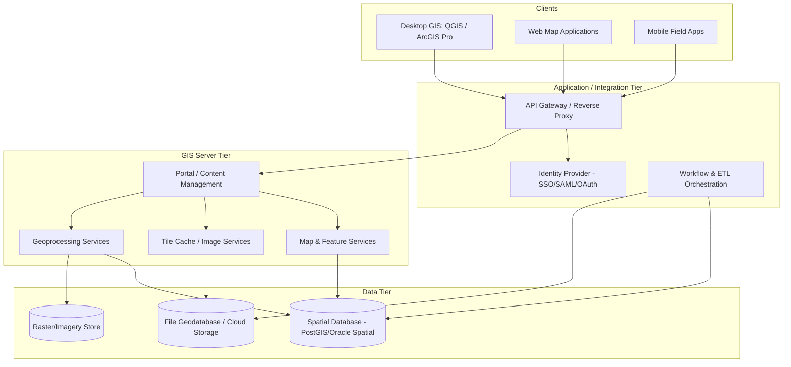

## Enterprise GIS Architecture


### Overview

Enterprise GIS architecture describes how organizations deploy, scale, secure, and integrate geospatial capabilities across multiple departments, thousands of concurrent users, and heterogeneous data sources — as distinct from single-user desktop GIS work. Where a desktop GIS session is a self-contained analytical environment, an enterprise deployment is a distributed system: web servers, application servers, spatial databases, tile caches, identity providers, and often multiple GIS vendor products interoperating through open standards. The central engineering problem is the same one faced by any enterprise IT system — availability, scalability, security, and integration — applied to data that is inherently large, spatially indexed, and often real-time.

### Core Architectural Tiers

Enterprise GIS deployments are conventionally described as an N-tier architecture, extending the classic three-tier web application model with GIS-specific components.

1. **Data tier** — spatial databases (PostGIS on PostgreSQL, Oracle Spatial, SQL Server with spatial types, Esri's enterprise geodatabase), file-based data stores (Cloud Optimized GeoTIFFs, GeoParquet), and increasingly cloud object storage serving as a spatial data lake.
2. **Server/GIS tier** — the layer that performs spatial processing, rendering, and serves standardized geospatial web services (map, feature, tile, and geoprocessing services). Examples: ArcGIS Enterprise (Server, Portal, Data Store), GeoServer, MapServer, deegree.
3. **Application/integration tier** — orchestration layer connecting GIS services to business systems: enterprise service buses, API gateways, workflow engines, and increasingly containerized microservices that wrap GIS operations for consumption by non-GIS applications.
4. **Client/presentation tier** — desktop GIS clients (QGIS, ArcGIS Pro), web mapping applications (built on Leaflet, OpenLayers, ArcGIS Maps SDK for JavaScript), and mobile field applications (ArcGIS Field Maps, QField, custom apps built on native mapping SDKs).

### Diagram: Enterprise GIS Reference Architecture



### Spatial Database Layer

The spatial database is the foundation most enterprise GIS reliability and performance characteristics trace back to.

#### PostGIS on PostgreSQL

The dominant open-source choice; extends PostgreSQL with spatial types (`geometry`, `geography`), spatial indexing (GiST-based R-tree indexes), and hundreds of spatial SQL functions.

```sql
-- Spatial index creation, critical for query performance at enterprise scale
CREATE INDEX idx_parcels_geom ON parcels USING GIST (geom);

-- Spatial join example: parcels intersecting a flood zone
SELECT p.parcel_id, p.owner_name
FROM parcels p
JOIN flood_zones f ON ST_Intersects(p.geom, f.geom)
WHERE f.risk_category = 'high';
```

At enterprise scale, PostGIS deployments commonly add:

- **Read replicas** for horizontally scaling read-heavy map service traffic away from the transactional write database.
- **Connection pooling** (PgBouncer) since spatial queries under load can exhaust connection limits quickly.
- **Partitioning** of very large feature tables (e.g., by geographic tile or date) to keep index sizes and vacuum operations manageable.

#### Esri Enterprise Geodatabase

A geodatabase is not a separate database engine but a schema and set of behaviors (versioning, topology, network datasets, relationship classes) layered on top of a supported RDBMS (PostgreSQL, Oracle, SQL Server, or Esri's own embedded PostgreSQL-based Data Store). Its distinguishing enterprise feature is **versioning**: multiple editors can check out a version of the dataset, make edits in isolation, and reconcile/post changes back to a default version, which is essential for organizations with parallel editing workflows (e.g., multiple field crews updating the same utility network).

### GIS Server Tier

#### ArcGIS Enterprise

Esri's on-premises/private-cloud enterprise product, composed of four cooperating components:

- **ArcGIS Server** — hosts and serves map, feature, geocoding, geoprocessing, and image services.
- **Portal for ArcGIS** — the web-based content management and sharing layer (equivalent in role to ArcGIS Online but self-hosted), providing the org's item catalog, groups, and sharing permissions.
- **ArcGIS Data Store** — manages the relational, tile cache, and spatiotemporal big data stores backing hosted feature layers and hosted scene layers.
- **Web Adaptor** — a thin proxy component (IIS or Java-based) that fronts Server/Portal, typically to integrate with an organization's existing web server and reverse-proxy/SSL termination infrastructure.

**[Behavior may vary]** The exact deployment topology (single-machine, highly available multi-machine site, Kubernetes-based deployment via ArcGIS Enterprise on Kubernetes) affects which of these components run as separate services versus consolidated pods; consult current Esri deployment guides for the topology matching a given ArcGIS Enterprise version.

#### GeoServer

A Java-based open-source server implementing OGC standards (WMS, WFS, WCS, WMTS) natively, commonly paired with PostGIS as the backing store and deployed behind a servlet container (Tomcat, Jetty). Its SLD (Styled Layer Descriptor)/CSS-based styling model and REST configuration API make it a common choice for organizations standardizing on open standards rather than a single vendor's service protocol.

#### MapServer

A lighter-weight CGI/FastCGI-based OGC service engine written in C, frequently chosen for very high-throughput tile-serving workloads where GeoServer's JVM overhead is undesirable, at the cost of a less full-featured admin/configuration experience (MapServer configuration is primarily file-based `.map` mapfiles rather than a web admin console).

### High Availability and Scalability Patterns

**Key Points**

- **Horizontal scaling of map/feature services**: multiple GIS server instances behind a load balancer, sharing a common data store, so map-rendering load is distributed across machines rather than a single point of failure/bottleneck.
- **Tile caching**: pre-rendering map tiles at fixed zoom levels (via ArcGIS Server's cache, GeoWebCache with GeoServer, or standalone tools like TileMill/Tippecanoe for vector tiles) dramatically reduces server-side rendering load for basemap-style layers that don't change frequently.
- **Database replication and read replicas**: separating write-heavy editing workloads from read-heavy map-serving workloads onto different database instances.
- **Content Delivery Networks (CDNs)**: static tile caches are excellent CDN candidates since they are effectively immutable, cacheable assets.
- **Disaster recovery**: enterprise GIS deployments typically require documented RPO/RTO targets, with geodatabase backup strategies (versioned backups, replication to a DR site) planned around edit-heavy datasets specifically, since raw file-based basemap data is often easier to simply re-derive or re-copy.

### Identity, Access Control, and Security

Enterprise GIS must integrate with organizational identity systems rather than maintaining a separate user directory:

- **SAML/OAuth2/OpenID Connect** integration with enterprise identity providers (Active Directory Federation Services, Okta, Azure AD) so GIS platform access follows the same authentication policy as other enterprise applications.
- **Role-based access control (RBAC)** at the layer, service, and even feature level — e.g., field crews see only their assigned service territory, while planners see the full jurisdiction.
- **Web Adaptor / reverse proxy placement**: enterprise GIS servers are typically not exposed directly to the internet; a reverse proxy (or the vendor-supplied Web Adaptor) handles TLS termination and forwards only necessary traffic to internal GIS server nodes.
- **Field-level and row-level security**: increasingly important in domains like law enforcement or utility infrastructure, where certain attributes (e.g., precise home addresses, critical infrastructure locations) require finer-grained access control than "which layer can this user see."

### Diagram: High Availability Deployment Pattern (svg_diagram)

<svg xmlns="http://www.w3.org/2000/svg" viewBox="0 0 760 360">
<text x="380" y="26" text-anchor="middle" font-size="16" font-weight="bold" fill="#1a1a1a">Enterprise GIS High Availability Pattern (svg_diagram)</text>
<rect x="300" y="55" width="160" height="45" fill="#dbe9f7" stroke="#2b6cb0" stroke-width="1.5" rx="6" />
<text x="380" y="82" text-anchor="middle" font-size="13" font-weight="bold" fill="#1a1a1a">Load Balancer</text>
<line x1="330" y1="100" x2="200" y2="140" stroke="#555" stroke-width="1.5" />
<line x1="380" y1="100" x2="380" y2="140" stroke="#555" stroke-width="1.5" />
<line x1="430" y1="100" x2="560" y2="140" stroke="#555" stroke-width="1.5" />
<rect x="120" y="145" width="160" height="55" fill="#e6f4ea" stroke="#2f855a" stroke-width="1.5" rx="6" />
<text x="200" y="168" text-anchor="middle" font-size="12" font-weight="bold" fill="#1a1a1a">GIS Server Node 1</text>
<text x="200" y="185" text-anchor="middle" font-size="11" fill="#333">Map / Feature Services</text>
<rect x="300" y="145" width="160" height="55" fill="#e6f4ea" stroke="#2f855a" stroke-width="1.5" rx="6" />
<text x="380" y="168" text-anchor="middle" font-size="12" font-weight="bold" fill="#1a1a1a">GIS Server Node 2</text>
<text x="380" y="185" text-anchor="middle" font-size="11" fill="#333">Map / Feature Services</text>
<rect x="480" y="145" width="160" height="55" fill="#e6f4ea" stroke="#2f855a" stroke-width="1.5" rx="6" />
<text x="560" y="168" text-anchor="middle" font-size="12" font-weight="bold" fill="#1a1a1a">GIS Server Node 3</text>
<text x="560" y="185" text-anchor="middle" font-size="11" fill="#333">Map / Feature Services</text>
<line x1="200" y1="200" x2="330" y2="255" stroke="#555" stroke-width="1.5" />
<line x1="380" y1="200" x2="380" y2="255" stroke="#555" stroke-width="1.5" />
<line x1="560" y1="200" x2="430" y2="255" stroke="#555" stroke-width="1.5" />
<rect x="270" y="260" width="220" height="55" fill="#fdf1e0" stroke="#c05621" stroke-width="1.5" rx="6" />
<text x="380" y="283" text-anchor="middle" font-size="12" font-weight="bold" fill="#1a1a1a">Primary Spatial Database</text>
<text x="380" y="300" text-anchor="middle" font-size="11" fill="#333">PostGIS / Enterprise Geodatabase</text>
<line x1="380" y1="315" x2="380" y2="335" stroke="#555" stroke-width="1.5" stroke-dasharray="4,3" />
<text x="380" y="350" text-anchor="middle" font-size="11" fill="#555">Streaming replication to read replica(s)</text>
</svg>

### Interoperability and Open Standards

Enterprise GIS rarely runs a single vendor stack end-to-end; interoperability is achieved through OGC (Open Geospatial Consortium) and ISO standards:

| Standard | Purpose |
| --- | --- |
| WMS (Web Map Service) | Serves rendered map images as a service |
| WFS (Web Feature Service) | Serves vector feature geometry and attributes for query/edit |
| WMTS (Web Map Tile Service) | Serves pre-cached map tiles |
| WCS (Web Coverage Service) | Serves raster/coverage data |
| OGC API - Features | REST/JSON-based modern successor to WFS |
| CSW (Catalog Service for the Web) | Metadata discovery/search across distributed data holdings |
| GeoPackage | Open, SQLite-based format for portable vector/raster data exchange |

**[Inference]** Because OGC API - Features is explicitly designed as a simpler, REST/JSON-native alternative to the XML-heavy legacy WFS specification, organizations building new enterprise integrations increasingly favor it over WFS where client and server support both exist, though legacy WFS remains extremely widespread in existing enterprise deployments and is unlikely to disappear from production systems in the near term.

### Integration with Enterprise IT Systems

- **ETL/data pipeline integration**: FME (Feature Manipulation Engine) is widely used specifically because it bridges GIS-native formats with enterprise data systems (SAP, enterprise asset management systems, CAD formats) that have no native spatial awareness.
- **Enterprise Asset Management (EAM) integration**: utilities commonly integrate GIS with systems like IBM Maximo or SAP PM so that asset location (GIS) and asset maintenance history (EAM) stay synchronized — a very common enterprise GIS integration pattern in utility and public works contexts.
- **BI and analytics integration**: exposing spatial data to Power BI, Tableau, or enterprise data warehouses (often flattening geometry to WKT/WKB or extracting centroid coordinates for non-spatial BI tools).
- **Real-time/IoT integration**: ArcGIS Velocity, GeoMesa, or custom streaming pipelines (Kafka + PostGIS) for ingesting sensor feeds, vehicle telemetry, or IoT device positions into a live spatial layer.

### Cloud and Hybrid Deployment Models

**Key Points**

- **Cloud-native SaaS**: ArcGIS Online, fully managed by Esri; minimal infrastructure operations burden, but less control over deployment topology, network isolation, and (for some organizations) data residency.
- **Self-managed cloud (IaaS)**: ArcGIS Enterprise or GeoServer deployed on AWS/Azure/GCP VMs or Kubernetes, giving full control at the cost of operating the infrastructure.
- **Hybrid**: common in government and utility contexts — sensitive layers hosted on-premises or in a private cloud, while public-facing maps and open-data portals run in a public cloud/SaaS environment.
- **Cloud-native geospatial formats**: Cloud Optimized GeoTIFF (COG) and GeoParquet are increasingly displacing traditional file geodatabases and shapefiles specifically because they support efficient partial reads directly from object storage (S3, Azure Blob) without a dedicated GIS server process in front of them.

### Practical Example: Utility Company Enterprise GIS Stack

**Example**

A representative composition seen in electric/water utility enterprise GIS deployments:

1. **Data tier**: Esri enterprise geodatabase on SQL Server, storing the versioned network (poles, transformers, pipes, valves) with utility network topology rules enforced at the schema level.
2. **Server tier**: ArcGIS Server (map/feature services) and ArcGIS Data Store (hosted feature layers for field crew apps), fronted by Portal for ArcGIS for internal content sharing.
3. **Field integration**: ArcGIS Field Maps for crews doing inspections/work orders, syncing offline-collected data back to the versioned geodatabase.
4. **EAM integration**: nightly ETL (FME) synchronizing asset attributes between the geodatabase and the utility's SAP PM instance.
5. **Public-facing tier**: a subset of non-sensitive layers (service territory boundaries, outage maps) republished to ArcGIS Online for a public outage-map web application, kept separate from the internal, security-sensitive network model.

**Output**

A layered deployment where sensitive infrastructure data never leaves the on-premises/private network tier, while public engagement tools run independently against a deliberately limited, separately hosted dataset.

### Related Topics

- Esri utility and pipeline network data models (Utility Network, Pipeline Referencing)
- GIS database versioning, conflict detection, and reconciliation workflows
- OGC API family (Features, Tiles, Maps, Processes) as the modern REST-based service layer
- Kubernetes-based GIS deployments (ArcGIS Enterprise on Kubernetes, containerized GeoServer)
- Spatial ETL patterns with FME and open-source alternatives (GDAL/OGR pipelines)
- Disaster recovery and business continuity planning for spatial data infrastructure
- Cloud-native geospatial formats: Cloud Optimized GeoTIFF, GeoParquet, Zarr for multidimensional data
- Identity federation patterns for multi-organization GIS data sharing (e.g., regional/statewide GIS consortia)