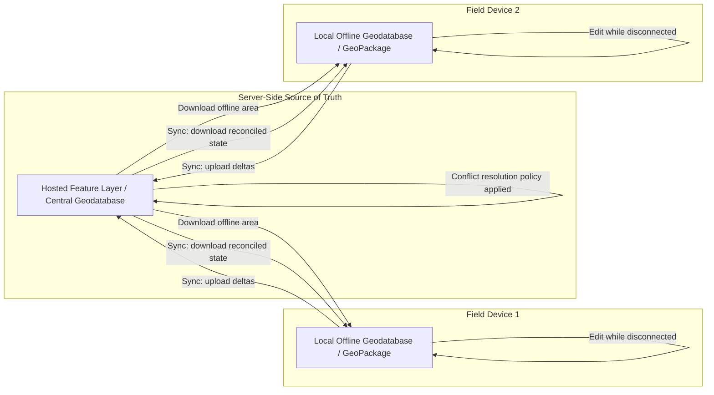

## Mobile GIS Applications


### Overview

Mobile GIS applications extend geospatial data collection, editing, and visualization to field conditions — disconnected networks, GPS-only positioning, touch-first interfaces, and battery/storage constraints that desktop and web GIS architectures do not need to accommodate. The defining engineering problem of mobile GIS is **offline-first design**: a field crew mapping a pipeline break, a forester surveying plots, or an emergency responder documenting damage cannot assume continuous connectivity, so mobile GIS platforms are built around local data storage, deferred synchronization, and conflict resolution rather than a live client-server request/response model.

### Core Requirements Distinguishing Mobile GIS

**Key Points**

- **Offline data access and editing**: the app must function fully — basemap display, feature editing, attribute entry — with zero network connectivity, then reconcile changes once connectivity returns.
- **GNSS/GPS integration**: mobile GIS is frequently the primary interface between raw satellite positioning hardware (internal phone GPS or external high-precision GNSS receivers) and a spatial database.
- **Power and storage efficiency**: continuous GPS polling and large offline basemap caches are the two biggest resource costs; architecture choices (tile pyramid depth, polling interval) directly trade off against battery life and storage footprint.
- **Simplified, task-focused UI**: field data collection interfaces are deliberately narrower than desktop GIS UIs — often a single form-based workflow per app, rather than a general-purpose analytical environment.
- **Sensor fusion**: modern mobile GIS apps increasingly incorporate device compass/IMU data, camera-based AR overlays, and Bluetooth-paired external GNSS receivers for sub-meter accuracy beyond what internal phone GPS chips provide.

### Major Mobile GIS Platforms

#### Esri ArcGIS Field Maps

Esri's consolidated field data collection app (superseding the earlier separate Collector, Explorer, and Tracker apps), built on the ArcGIS Runtime SDK. Field Maps consumes web maps authored in ArcGIS Online/Enterprise, downloads them as **offline map areas** (a packaged basemap + feature layer extract for a defined geographic area), and syncs edited features back to the source hosted feature layers when connectivity resumes.



```
Offline workflow:
1. Author a web map in ArcGIS Online with editable feature layers
2. Enable offline capability on the hosted feature layer (sync-enabled)
3. In Field Maps, download an "offline map area" for the crew's work extent
4. Crew edits features fully offline (add/update/delete geometry & attributes)
5. On reconnection, Field Maps syncs the local geodatabase delta back to the server
6. Server-side conflict resolution policy resolves any concurrent edit conflicts
```

#### QField (QGIS-based)

The mobile counterpart to QGIS, built to consume actual `.qgs`/`.qgz` QGIS project files directly on Android/iOS/Linux mobile devices — meaning the same styling, forms, and layer configuration authored in desktop QGIS transfers to the field app without a separate mobile-specific authoring step. QField uses **QFieldCloud** (or manual file transfer) for synchronization, and its open architecture means the underlying data can be any format QGIS supports (GeoPackage is the most common for offline field packages, since it stores an entire project's vector/raster data in a single portable SQLite file).



```
QField offline package structure (typical):
project.qgz          # QGIS project file (layers, styling, forms)
data.gpkg            # GeoPackage containing all vector layers
basemap.gpkg          # Or MBTiles/raster basemap tiles
```

#### Mergin Maps

An open-source-adjacent commercial platform (from the QGIS/QField ecosystem developers) purpose-built around GeoPackage-based offline sync with a Git-like versioning model for geospatial data — tracking changes to a GeoPackage over time and merging concurrent edits from multiple field devices, conceptually similar to how Git manages concurrent text file changes but applied to spatial feature geometries and attributes.

#### Fulcrum, Survey123, and Form-Centric Tools

- **Survey123 (Esri)** — form-first rather than map-first: field workers primarily fill out structured survey forms (built via XLSForm, an Excel-based form definition standard also used by ODK/KoboToolbox) with an embedded map component for capturing geometry, rather than a general editing environment.
- **Fulcrum** — a vendor-neutral, forms-based mobile data collection platform with strong offline support, commonly used outside the Esri ecosystem for inspection and compliance workflows.
- **ODK (Open Data Kit) / KoboToolbox** — open-source form-based data collection widely used in humanitarian, public health, and development contexts; XLSForm-defined forms render as native mobile data entry screens with optional GPS/geopoint fields.

### Offline Synchronization Architecture

The synchronization model is the single most consequential design decision separating mobile GIS platforms:



Conflict resolution strategies commonly implemented across these platforms:

- **Last-writer-wins** — simplest, but silently discards a losing edit; acceptable for low-collision workflows (e.g., each crew assigned a disjoint work area).
- **First-writer-wins / server-wins** — prioritizes protecting existing server state over incoming field edits.
- **Manual/flagged conflict review** — edits that collide are held for a human reviewer rather than auto-resolved, standard practice in workflows where silent data loss is unacceptable (e.g., legal/cadastral edits).
- **Feature-level locking** — some platforms lock a feature to a single editing session while checked out, preventing concurrent edits from occurring at all rather than resolving them after the fact.

### GNSS Positioning and Accuracy in Mobile GIS

**Key Points**

- Internal smartphone GPS chips typically achieve 3–5 meter horizontal accuracy under open-sky conditions, degrading substantially under tree canopy or near tall buildings — adequate for many field verification tasks but insufficient for cadastral or engineering-grade surveying.
- External Bluetooth-paired GNSS receivers (e.g., Trimble, Eos Arrow, Bad Elf) supporting RTK (Real-Time Kinematic) or SBAS (Satellite-Based Augmentation Systems, e.g., WAAS in North America, EGNOS in Europe) corrections can bring accuracy to sub-meter or even centimeter level, and mobile GIS apps generally expose a Bluetooth GNSS pairing setting specifically to consume this external accuracy stream instead of the device's built-in chip.
- Most mobile GIS platforms record and store a **horizontal accuracy attribute** alongside captured geometry, so downstream analysis can filter or flag low-confidence points rather than treating all captured coordinates as equally reliable.
- **[Behavior may vary]** Achievable positional accuracy is highly dependent on satellite geometry (dilution of precision), atmospheric conditions, and receiver hardware generation at the time of capture; stated accuracy specifications from GNSS receiver vendors describe best-case conditions rather than guaranteed field performance.

### Mobile Development Architecture Patterns

For organizations building custom mobile GIS applications rather than using off-the-shelf field apps:

- **Native SDK approach**: ArcGIS Maps SDK for Native Apps (Kotlin/Swift/.NET MAUI/Qt) or Mapbox Maps SDK for iOS/Android give direct access to platform GPS APIs, offline map packaging, and native UI performance, at the cost of maintaining separate codebases per platform (or a cross-platform layer like .NET MAUI/Qt).
- **Cross-platform/hybrid approach**: React Native or Flutter wrapping a mapping library (Mapbox GL Native bindings, MapLibre Native) — trades some native performance/API completeness for a single shared codebase across iOS and Android.
- **Progressive Web App (PWA) approach**: browser-based mapping (Leaflet/MapLibre GL JS) using the Service Worker API and IndexedDB for offline tile/data caching — avoids app-store distribution entirely, but offline GPS access and background sync capabilities are more constrained than native apps, particularly on iOS.

```javascript
// Simplified PWA offline tile caching pattern using a Service Worker
self.addEventListener('fetch', (event) => {
  if (event.request.url.includes('/tiles/')) {
    event.respondWith(
      caches.match(event.request).then((cached) => {
        return cached || fetch(event.request).then((response) => {
          const clone = response.clone();
          caches.open('tile-cache-v1').then((cache) => cache.put(event.request, clone));
          return response;
        });
      })
    );
  }
});
```

### Diagram: Mobile GIS Field Workflow (svg_diagram)

<svg xmlns="http://www.w3.org/2000/svg" viewBox="0 0 760 340">
<text x="380" y="26" text-anchor="middle" font-size="16" font-weight="bold" fill="#1a1a1a">Mobile GIS Field Data Collection Workflow (svg_diagram)</text>
<rect x="30" y="60" width="150" height="60" fill="#dbe9f7" stroke="#2b6cb0" stroke-width="1.5" rx="6" />
<text x="105" y="85" text-anchor="middle" font-size="12" font-weight="bold" fill="#1a1a1a">Office: Author Map</text>
<text x="105" y="103" text-anchor="middle" font-size="11" fill="#333">Layers, forms, symbology</text>
<line x1="180" y1="90" x2="230" y2="90" stroke="#555" stroke-width="1.5" marker-end="url(#a2)" />
<rect x="235" y="60" width="150" height="60" fill="#e6f4ea" stroke="#2f855a" stroke-width="1.5" rx="6" />
<text x="310" y="85" text-anchor="middle" font-size="12" font-weight="bold" fill="#1a1a1a">Download Offline Area</text>
<text x="310" y="103" text-anchor="middle" font-size="11" fill="#333">Basemap + feature package</text>
<line x1="385" y1="90" x2="435" y2="90" stroke="#555" stroke-width="1.5" marker-end="url(#a2)" />
<rect x="440" y="60" width="150" height="60" fill="#fdf1e0" stroke="#c05621" stroke-width="1.5" rx="6" />
<text x="515" y="85" text-anchor="middle" font-size="12" font-weight="bold" fill="#1a1a1a">Field: Collect / Edit</text>
<text x="515" y="103" text-anchor="middle" font-size="11" fill="#333">GPS capture, attribute entry</text>
<line x1="590" y1="90" x2="640" y2="90" stroke="#555" stroke-width="1.5" marker-end="url(#a2)" />
<rect x="600" y="150" width="150" height="60" fill="#f4e6f7" stroke="#805ad3" stroke-width="1.5" rx="6" />
<text x="675" y="175" text-anchor="middle" font-size="12" font-weight="bold" fill="#1a1a1a">Reconnect &amp; Sync</text>
<text x="675" y="193" text-anchor="middle" font-size="11" fill="#333">Upload edit deltas</text>
<line x1="675" y1="150" x2="675" y2="120" stroke="#555" stroke-width="1.5" />
<line x1="675" y1="120" x2="600" y2="105" stroke="#555" stroke-width="1.5" marker-end="url(#a2)" />
<line x1="600" y1="180" x2="400" y2="240" stroke="#555" stroke-width="1.5" marker-end="url(#a2)" />
<rect x="230" y="245" width="220" height="60" fill="#dbe9f7" stroke="#2b6cb0" stroke-width="1.5" rx="6" />
<text x="340" y="270" text-anchor="middle" font-size="12" font-weight="bold" fill="#1a1a1a">Central GIS: Reconcile</text>
<text x="340" y="288" text-anchor="middle" font-size="11" fill="#333">Apply conflict resolution policy</text>
</svg>

### Comparative Platform Table

| Platform | Underlying Engine | Data Format | Sync Model | Typical Use Case |
| --- | --- | --- | --- | --- |
| ArcGIS Field Maps | ArcGIS Runtime SDK | Mobile geodatabase / hosted feature layer replica | Server-brokered sync via ArcGIS Online/Enterprise | Enterprise field crews, utility inspections |
| QField | Qt/QGIS core | GeoPackage | QFieldCloud or manual file transfer | Open-source/academic field mapping, conservation surveys |
| Mergin Maps | GeoPackage + versioning layer | GeoPackage | Git-like diff/merge sync | Multi-crew concurrent editing with change tracking |
| Survey123 | ArcGIS Runtime SDK + XLSForm | Structured survey responses | Server-brokered sync | Structured inspections, citizen science surveys |
| ODK Collect | Native Android/iOS | XLSForm-defined submissions | Central ODK server sync | Humanitarian, public health, development data collection |

### Practical Example: Environmental Field Survey Deployment

**Example**

A representative offline-first workflow for an ecological field survey using open-source tools:

1. Author the survey project in desktop QGIS: point layer for observation sites, attribute form with species dropdown, photo attachment field, and a canopy-cover basemap raster clipped to the study area.
2. Package the project and data into a GeoPackage using QGIS's "Package Layers" processing tool, bundling vector data and a raster basemap into a single portable file.
3. Transfer the package to field tablets running QField (via QFieldCloud or direct file copy).
4. Field botanists collect observations fully offline across a multi-day survey with no cellular coverage, each device's GNSS chip logging a horizontal accuracy value per point.
5. Upon returning to office connectivity, sync each device's edits back through QFieldCloud; any two crews that happened to log a duplicate observation at slightly different coordinates are flagged for manual review rather than silently merged.
6. Reconciled data is pulled back into desktop QGIS for spatial analysis (e.g., species distribution modeling against canopy cover).

**Output**

A merged, conflict-reviewed GeoPackage in the central QGIS project reflecting all field crews' contributions, with per-point accuracy metadata preserved for downstream data-quality filtering.

### Related Topics

- GNSS/RTK positioning fundamentals and correction services (SBAS, NTRIP, PPP)
- XLSForm and ODK form design for structured field data collection
- Mobile geodatabase replication models and conflict resolution strategies in depth
- GeoPackage internals as a portable offline spatial data container
- Progressive Web Apps and Service Worker architecture for offline-capable web mapping
- Battery and storage optimization strategies for continuous GPS tracking applications
- Citizen science and crowdsourced geospatial data collection platforms
- Field data quality assurance workflows (accuracy thresholds, photo verification, supervisor review)